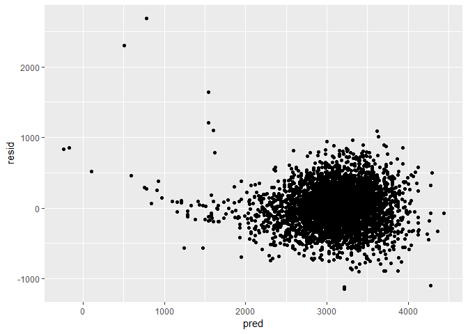

hw6\_Linear Models
================
Kee-Young Shin
November 23, 2018

``` r
library(tidyverse)
```

    ## -- Attaching packages ------------------------------------------------- tidyverse 1.2.1 --

    ## v ggplot2 3.0.0     v purrr   0.2.5
    ## v tibble  1.4.2     v dplyr   0.7.6
    ## v tidyr   0.8.1     v stringr 1.3.1
    ## v readr   1.1.1     v forcats 0.3.0

    ## -- Conflicts ---------------------------------------------------- tidyverse_conflicts() --
    ## x dplyr::filter() masks stats::filter()
    ## x dplyr::lag()    masks stats::lag()

``` r
library(RCurl)
```

    ## Loading required package: bitops

    ## 
    ## Attaching package: 'RCurl'

    ## The following object is masked from 'package:tidyr':
    ## 
    ##     complete

``` r
library(modelr)
```

Problem 1
---------

``` r
# import data
homicide_df = read.csv(text = 
    getURL("https://raw.githubusercontent.com/washingtonpost/data-homicides/master/homicide-data.csv"))
```

``` r
# clean and wrangle data 
homicide_df = homicide_df %>% 
  unite(city_state, city:state, sep = ", ") %>% 
  janitor::clean_names() %>% 
  mutate(binary_solved = ifelse(disposition == "Closed by arrest", 1, 0),
         victim_age = as.numeric(victim_age),
         victim_race = as.factor(ifelse(victim_race == "White", "white", "non-white")),
         victim_race = relevel(victim_race, ref = "white")) %>% 
  filter(!(city_state == "Phoenix, AZ")) %>% 
  filter(!(city_state == "Dallas, TX")) %>% 
  filter(!(city_state == "Kansas City, MO")) %>% 
  filter(!(city_state == "Tulsa, AL"))
```

``` r
# create function for regression
glm_function = function(x) {
  
  output = glm(binary_solved ~ victim_age + victim_sex + victim_race, data = x,
               family = binomial())
  
  broom::tidy(output) %>% 
    mutate(OR = exp(estimate))
}

homicide_df %>% 
  filter(city_state == "Baltimore, MD") %>% 
  glm_function()
```

    ## # A tibble: 4 x 6
    ##   term                 estimate std.error statistic  p.value    OR
    ##   <chr>                   <dbl>     <dbl>     <dbl>    <dbl> <dbl>
    ## 1 (Intercept)           1.05      0.227        4.62 3.78e- 6 2.85 
    ## 2 victim_age           -0.00374   0.00303     -1.23 2.17e- 1 0.996
    ## 3 victim_sexMale       -0.885     0.136       -6.50 8.08e-11 0.413
    ## 4 victim_racenon-white -0.793     0.174       -4.55 5.33e- 6 0.453

``` r
# fit regression for Baltimore, MD
baltimore_regression = homicide_df %>% 
  filter(city_state == "Baltimore, MD") %>% 
  glm(binary_solved ~ victim_age + victim_sex + victim_race, data = ., 
      family = binomial()) 

confint(baltimore_regression)
```

    ## Waiting for profiling to be done...

    ##                             2.5 %       97.5 %
    ## (Intercept)           0.607315568  1.496299124
    ## victim_age           -0.009717968  0.002177355
    ## victim_sexMale       -1.152586204 -0.618524492
    ## victim_racenon-white -1.136727114 -0.452620698

``` r
baltimore_regression %>% 
  broom::tidy() %>% 
  mutate(OR = exp(estimate)) %>% 
  cbind(., confint(baltimore_regression)) %>% 
  select(-(term))
```

    ## Waiting for profiling to be done...

    ##                          estimate   std.error statistic      p.value
    ## (Intercept)           1.047360581 0.226554507  4.622996 3.782370e-06
    ## victim_age           -0.003740252 0.003032787 -1.233272 2.174741e-01
    ## victim_sexMale       -0.884534747 0.136100909 -6.499110 8.079669e-11
    ## victim_racenon-white -0.792921985 0.174218341 -4.551312 5.331248e-06
    ##                             OR        2.5 %       97.5 %
    ## (Intercept)          2.8501185  0.607315568  1.496299124
    ## victim_age           0.9962667 -0.009717968  0.002177355
    ## victim_sexMale       0.4129062 -1.152586204 -0.618524492
    ## victim_racenon-white 0.4525206 -1.136727114 -0.452620698

Problem 2
---------

``` r
# load and clean data 
birthweight_df = read.csv("./birthweight.csv") %>% 
  janitor::clean_names() 
birthweight_df
```

    ##      babysex bhead blength  bwt delwt fincome frace gaweeks malform
    ## 1          2    34      51 3629   177      35     1    39.9       0
    ## 2          1    34      48 3062   156      65     2    25.9       0
    ## 3          2    36      50 3345   148      85     1    39.9       0
    ## 4          1    34      52 3062   157      55     1    40.0       0
    ## 5          2    34      52 3374   156       5     1    41.6       0
    ## 6          1    33      52 3374   129      55     1    40.7       0
    ## 7          2    33      46 2523   126      96     2    40.3       0
    ## 8          2    33      49 2778   140       5     1    37.4       0
    ## 9          1    36      52 3515   146      85     1    40.3       0
    ## 10         1    33      50 3459   169      75     2    40.7       0
    ## 11         2    35      51 3317   130      55     1    43.4       0
    ## 12         1    35      51 3459   146      55     1    39.4       0
    ## 13         2    35      48 3175   158      75     1    39.7       0
    ## 14         1    36      53 3629   147      75     1    41.3       0
    ## 15         1    35      51 3544   129      65     1    39.6       0
    ## 16         2    33      49 2551   120      75     2    38.1       0
    ## 17         1    35      56 3232   147      55     1    42.1       0
    ## 18         2    36      52 3629   154      65     1    40.3       0
    ## 19         2    35      57 3374   147      45     1    39.6       0
    ## 20         2    35      53 3345   127      65     2    39.7       0
    ## 21         1    34      52 3203   134      25     1    41.1       0
    ## 22         2    35      50 3175   140      85     2    40.6       0
    ## 23         1    34      49 3175   148      96     2    39.7       0
    ## 24         2    36      51 2977   135      45     1    41.7       0
    ## 25         2    36      56 3685   170      95     1    40.3       0
    ## 26         1    34      63 3175   143      25     1    41.9       0
    ## 27         1    36      52 3629   152      45     1    39.6       0
    ## 28         2    33      49 2948   129      25     1    41.0       0
    ## 29         1    35      51 3345   145      75     1    41.3       0
    ## 30         2    35      52 3289   135      55     1    40.6       0
    ## 31         2    34      49 3118   161      45     2    38.9       0
    ## 32         2    34      52 3629   112      25     1    38.0       0
    ## 33         1    36      54 3402   161      95     1    40.1       0
    ## 34         2    35      51 3827   130      45     1    41.3       0
    ## 35         1    38      53 3799   167      75     1    39.9       0
    ## 36         2    33      54 3062   134      65     1    40.4       0
    ## 37         1    35      55 3856   171      85     1    41.1       0
    ## 38         2    34      51 3005   149      85     1    39.3       0
    ## 39         1    35      53 3175   130      45     1    40.4       0
    ## 40         2    34      54 3345   130      95     1    42.1       0
    ## 41         2    35      53 3600   141      35     1    42.3       0
    ## 42         2    34      51 3232   155      55     1    41.6       0
    ## 43         1    35      52 3232   121      75     3    42.3       0
    ## 44         2    34      51 3175   142      96     1    42.3       0
    ## 45         2    33      49 3147   140      45     1    40.6       0
    ## 46         2    34      49 3317   142      35     1    40.4       0
    ## 47         2    34      49 2948   135      75     1    42.7       0
    ## 48         2    34      49 3033   128      25     1    41.1       0
    ## 49         1    33      51 3345   140      85     1    38.6       0
    ## 50         1    34      53 3232   150      35     1    39.6       0
    ## 51         2    36      51 3317   136      65     1    42.6       0
    ## 52         1    35      51 3147   165      65     1    40.1       0
    ## 53         1    34      52 3118   130      75     1    41.0       0
    ## 54         1    33      50 3175   168      25     1    40.0       0
    ## 55         2    32      48 2551   170      35     1    39.9       0
    ## 56         2    33      51 3289   155      65     1    41.6       0
    ## 57         2    34      54 3402   154      75     1    40.7       0
    ## 58         2    35      52 3487   121      45     1    39.9       0
    ## 59         2    34      51 3203   132      85     1    43.7       0
    ## 60         1    37      54 3515   143      15     1    41.7       0
    ## 61         1    34      51 2920   129      45     1    39.4       0
    ## 62         2    30      42 2013   150      65     2    37.7       0
    ## 63         1    34      52 3033   172      85     1    41.1       0
    ## 64         1    31      46 2381   139      75     1    34.7       0
    ## 65         2    33      52 3118   155      45     1    37.9       0
    ## 66         2    34      53 3600   148      45     1    40.9       0
    ## 67         2    33      54 3402   150      45     1    41.4       0
    ## 68         1    34      51 3459   123      45     1    40.0       0
    ## 69         1    36      53 3203   140      55     2    39.7       0
    ## 70         1    35      50 3289   155      85     1    39.0       0
    ## 71         1    34      53 3544   128      35     1    40.4       0
    ## 72         2    36      52 4224   178      35     1    41.6       0
    ## 73         1    34      47 3090   147      85     1    42.1       0
    ## 74         1    35      56 3912   150      65     1    40.6       0
    ## 75         1    34      53 3459   150      35     1    41.7       0
    ## 76         1    34      50 3374   132      55     1    41.4       0
    ## 77         2    35      52 2778   165      25     2    30.4       0
    ## 78         1    33      48 2551   157      35     1    37.9       0
    ## 79         2    34      51 3232   123      96     1    38.4       0
    ## 80         1    35      52 3544   137      65     1    42.7       0
    ## 81         2    33      49 2920   135      45     1    38.6       0
    ## 82         2    34      51 3430   172      45     1    40.9       0
    ## 83         2    35      53 3799   189      96     1    44.6       0
    ## 84         1    32      47 2438   137      25     2    39.0       0
    ## 85         1    34      51 2977   149      15     3    40.3       0
    ## 86         2    34      50 3005   137      35     2    35.9       0
    ## 87         2    34      46 2977   145      75     2    47.7       0
    ## 88         1    35      50 3118   137      15     1    40.7       0
    ## 89         2    35      51 3062   115      96     3    41.4       0
    ## 90         1    34      50 3062   140      95     1    41.4       0
    ## 91         2    36      56 3969   160      96     2    42.6       0
    ## 92         1    35      51 3090   190      35     1    39.3       0
    ## 93         2    33      54 3175   173      75     1    35.1       0
    ## 94         2    33      48 2438   138      96     1    42.6       0
    ## 95         2    33      45 2211   129      65     1    40.3       0
    ## 96         1    35      55 3572   182      75     1    40.1       0
    ## 97         1    35      52 3487   138      55     1    40.0       0
    ## 98         1    34      52 3118   124      65     1    38.7       0
    ## 99         2    32      49 2778   140      55     1    38.3       0
    ## 100        2    35      51 3515   160      25     1    40.0       0
    ## 101        1    35      56 3487   142      45     1    40.4       0
    ## 102        2    31      48 2722   121      65     1    39.4       0
    ## 103        2    36      53 3799   135      55     1    40.3       0
    ## 104        2    32      49 3374   121      85     1    37.3       0
    ## 105        1    33      52 2835   140      35     1    40.7       0
    ## 106        2    35      55 3487   170      55     1    43.4       0
    ## 107        2    33      48 3685   135      55     1    39.7       0
    ## 108        1    37      58 4791   144      45     1    40.7       0
    ## 109        1    32      47 2693   149      65     1    35.0       0
    ## 110        1    33      49 2722   143      55     1    39.6       0
    ## 111        2    34      50 3459   145      35     1    41.1       0
    ## 112        2    36      50 3515   138       5     1    40.3       0
    ## 113        1    36      49 2863   138      96     2    41.6       0
    ## 114        1    35      53 3629   141      95     1    42.1       0
    ## 115        1    32      48 2637   120      65     1    35.7       0
    ## 116        1    33      50 3118   145      55     1    39.3       0
    ## 117        2    32      48 2665   145      15     1    38.3       0
    ## 118        1    32      46 2211   143      65     2    36.4       0
    ## 119        2    34      53 3317   143      35     1    40.3       0
    ## 120        2    33      50 2580   137      55     1    39.6       0
    ## 121        2    35      53 3912   145      55     1    40.1       0
    ## 122        1    35      52 3884   131      45     1    39.7       0
    ## 123        1    31      46 2126   118      75     1    36.3       0
    ## 124        2    34      52 3175   130      25     1    39.9       1
    ## 125        2    33      48 2778   175      35     2    30.6       0
    ## 126        1    34      52 3005   125       5     1    36.9       0
    ## 127        2    34      46 2750   127      75     1    37.0       0
    ## 128        2    33      52 2892   126      25     1    42.0       0
    ## 129        1    35      57 3147   125      96     1    41.6       0
    ## 130        2    35      53 3657   146      55     1    40.1       0
    ## 131        1    34      49 3090   152      96     1    38.7       0
    ## 132        1    36      55 4082   177      65     1    40.3       0
    ## 133        2    34      50 3090   145      85     1    38.4       0
    ## 134        2    32      48 2523   140      45     1    40.9       0
    ## 135        2    33      47 2977   137      65     1    41.6       0
    ## 136        1    35      51 3742   150      85     1    40.4       0
    ## 137        2    33      50 3090   130      25     1    42.0       0
    ## 138        2    34      55 3374   136      75     1    38.3       0
    ## 139        1    33      47 2750   149      95     1    36.9       0
    ## 140        1    35      46 3203   126      55     1    39.0       0
    ## 141        2    33      52 3600   152      96     1    40.6       0
    ## 142        1    35      49 3090   146      96     1    40.0       0
    ## 143        1    35      49 4082   156      35     1    38.7       0
    ## 144        1    33      48 2098   130      35     2    35.6       0
    ## 145        2    30      45 2325   118      15     1    36.4       0
    ## 146        2    35      53 3317   135      96     1    39.1       0
    ## 147        1    34      51 3515   149      75     1    40.6       0
    ## 148        2    35      55 3685   143      96     1    40.4       0
    ## 149        1    35      48 3969   154      45     1    48.3       0
    ## 150        1    34      52 2977   143      75     1    38.0       0
    ## 151        1    35      49 3430   133      55     1    40.9       0
    ## 152        2    34      53 3317   142      45     1    37.0       0
    ## 153        1    37      54 3515   176      85     1    40.4       0
    ## 154        1    34      56 3317   134      35     1    39.9       0
    ## 155        1    35      51 3402   195      75     1    42.0       0
    ## 156        1    33      52 3856   141      45     1    41.7       0
    ## 157        1    34      51 3203   118      35     1    40.0       0
    ## 158        2    33      48 2977   128      65     1    46.0       0
    ## 159        1    24      37 1049   143      15     2    27.1       0
    ## 160        2    33      53 3544   121      25     1    39.1       0
    ## 161        1    37      53 3685   156      75     1    41.4       0
    ## 162        2    37      57 3799   142      65     1    41.7       0
    ## 163        2    36      48 2778   133      75     1    35.3       0
    ## 164        2    34      52 3742   159      75     1    43.1       0
    ## 165        1    35      52 3912   144      35     1    41.1       0
    ## 166        2    33      49 3232   132      75     1    38.0       0
    ## 167        2    35      49 3685   130      55     1    39.9       0
    ## 168        2    34      53 3487   120      15     1    40.1       0
    ## 169        1    32      48 2608   141      75     1    37.1       0
    ## 170        2    34      50 2665   132      75     1    40.7       0
    ## 171        2    34      48 3515   141      75     1    40.7       0
    ## 172        1    33      48 2892   145      35     2    39.0       0
    ## 173        1    35      50 3175   140      15     1    39.6       0
    ## 174        2    35      52 3742   142      55     1    40.7       0
    ## 175        2    35      50 3515   132      45     1    42.0       0
    ## 176        2    35      50 3033   148      45     1    40.4       0
    ## 177        2    32      48 2948   151      75     1    40.1       0
    ## 178        2    34      50 3147   131      55     2    41.3       0
    ## 179        2    32      49 3005   145      45     2    39.1       0
    ## 180        1    33      48 3005   130      95     1    39.3       0
    ## 181        2    34      51 3232   116      35     1    39.6       0
    ## 182        1    36      51 3629    96      35     1    42.0       0
    ## 183        1    35      51 3685   138      35     1    41.6       0
    ## 184        1    34      51 3430   166      25     1    39.1       0
    ## 185        2    34      48 2948   139      25     1    38.0       0
    ## 186        1    35      55 4252   130      55     1    41.7       0
    ## 187        1    34      51 3090   144      15     1    38.9       0
    ## 188        2    33      49 3203   115      96     1    40.0       0
    ## 189        2    34      51 3742   124      55     1    40.3       0
    ## 190        1    34      51 3062   131      75     1    42.3       0
    ## 191        2    35      51 3742   135      55     1    41.6       0
    ## 192        2    32      48 2608   138      85     2    43.0       0
    ## 193        1    33      48 2892   139      75     1    38.7       0
    ## 194        2    31      46 2325   157      75     1    37.1       0
    ## 195        2    34      53 3459   147      65     1    41.9       0
    ## 196        2    32      48 2693   157      35     2    37.0       0
    ## 197        2    33      51 3175   115      35     1    39.0       0
    ## 198        1    35      51 3714   169      85     1    41.4       0
    ## 199        1    35      51 3544   142      55     1    39.7       0
    ## 200        2    33      50 3147   143      85     2    40.9       0
    ## 201        2    32      51 3005   120      35     1    40.3       0
    ## 202        1    34      54 3770   136      35     1    39.3       0
    ## 203        2    36      53 3629   145      95     1    40.6       0
    ## 204        2    34      50 3430   145      95     1    40.1       0
    ## 205        1    36      48 3345   140      55     1    41.1       0
    ## 206        2    33      51 3090   174      35     1    39.3       0
    ## 207        1    35      54 3969   137      75     1    41.3       0
    ## 208        1    34      51 3033   122      15     1    40.1       0
    ## 209        2    34      51 3317   162      15     1    40.3       0
    ## 210        2    33      48 3005   124      45     1    38.9       0
    ## 211        1    32      49 2523   132      75     1    38.3       0
    ## 212        1    36      50 3884   117      75     1    41.4       0
    ## 213        2    33      57 3827   145      25     2    38.7       0
    ## 214        2    34      50 3317   161      55     1    41.0       0
    ## 215        2    34      51 3515   139      55     1    42.6       0
    ## 216        1    33      47 2977   158      35     1    40.1       0
    ## 217        2    33      48 2438   125      96     1    38.1       0
    ## 218        2    33      50 3714   144      25     2    40.6       0
    ## 219        2    34      49 2948   127      35     1    35.6       0
    ## 220        2    34      48 3005   119      35     2    41.3       0
    ## 221        1    33      49 3118   139      15     1    39.3       0
    ## 222        1    34      54 3544   154      45     1    40.4       0
    ## 223        1    34      50 3203   175      45     1    40.1       0
    ## 224        1    34      49 2722   137      55     1    40.6       0
    ## 225        2    29      52 2892   127      45     2    40.0       0
    ## 226        1    35      51 3544   147      96     1    40.3       0
    ## 227        1    35      52 3572   201      65     1    41.1       0
    ## 228        1    35      50 3515   146      75     1    40.1       0
    ## 229        1    35      45 3402   139      45     1    39.9       0
    ## 230        2    33      53 3572   157      45     1    40.4       0
    ## 231        1    34      47 2211   149      25     1    34.3       0
    ## 232        1    35      50 3175   156      75     1    39.4       0
    ## 233        2    35      53 3912   156      35     1    42.4       0
    ## 234        2    35      54 3827   169      25     1    42.1       0
    ## 235        2    33      50 2948   146      45     1    39.0       0
    ## 236        1    35      53 3459   112      55     1    39.0       0
    ## 237        2    33      49 2778   133      75     3    39.7       0
    ## 238        1    35      52 3289   144      75     1    40.4       0
    ## 239        1    36      52 3374   157      55     1    42.1       0
    ## 240        2    35      54 3884   162      35     1    40.4       0
    ## 241        1    34      53 3487   137      55     1    39.6       0
    ## 242        1    35      48 2948   127      85     1    39.9       0
    ## 243        1    35      54 3770   129      65     1    42.1       0
    ## 244        1    36      49 3005   151      65     1    40.3       0
    ## 245        1    36      54 3997   132      65     1    42.0       0
    ## 246        2    36      52 3742   187      35     1    41.9       0
    ## 247        1    34      48 2835   104      55     1    42.1       0
    ## 248        1    35      55 3685   155      55     1    39.4       0
    ## 249        1    34      49 2665   137      45     1    39.7       0
    ## 250        1    34      51 2920   161      35     1    41.0       0
    ## 251        2    33      50 3090   133      55     1    40.3       0
    ## 252        1    36      54 4054   168      15     1    40.9       0
    ## 253        2    32      49 2948   134      25     1    39.3       0
    ## 254        1    34      52 3487   130      25     1    40.1       0
    ## 255        2    32      48 2353   140      35     1    38.0       0
    ## 256        1    29      42 1814   140      75     1    33.6       0
    ## 257        2    35      52 3544   143      15     1    40.4       0
    ## 258        1    34      50 3118   136      45     1    38.9       0
    ## 259        1    33      52 3033   169      75     2    39.4       0
    ## 260        1    36      51 3969   156      45     2    39.6       0
    ## 261        2    33      47 2608   117      96     2    33.4       0
    ## 262        1    35      53 3827   146      35     1    42.6       0
    ## 263        2    35      50 3374   131      45     3    42.3       0
    ## 264        1    31      47 2580   142      35     1    36.9       0
    ## 265        2    34      48 3260   138      75     1    38.4       0
    ## 266        2    36      54 4252   131      75     1    42.6       0
    ## 267        1    34      52 3374   139      85     1    43.7       0
    ## 268        1    33      52 2892   157      35     1    39.1       0
    ## 269        2    35      51 3770   156      75     1    42.4       0
    ## 270        1    35      50 3090   158      35     3    41.0       0
    ## 271        2    34      53 3118   156      75     1    39.3       0
    ## 272        1    34      50 3062   143      35     1    38.4       0
    ## 273        1    37      54 3770   215      35     1    46.4       0
    ## 274        1    35      50 3175   149      15     1    42.0       0
    ## 275        2    34      48 3544   158      96     1    44.7       0
    ## 276        2    33      47 3289   201      85     1    41.1       0
    ## 277        1    35      53 3544   123      65     1    40.6       0
    ## 278        1    36      52 3345   162      96     1    42.6       0
    ## 279        1    33      49 3232   168      96     2    38.0       0
    ## 280        1    36      52 3487   128      45     1    38.9       0
    ## 281        2    32      44 2183   133      65     1    35.3       0
    ## 282        2    36      52 3289   155      96     2    41.7       0
    ## 283        1    35      51 3203   127      35     1    44.1       0
    ## 284        1    35      52 3997   128      65     1    42.6       0
    ## 285        2    33      49 3147   128      65     2    42.0       0
    ## 286        1    32      49 2495   121      65     2    39.9       0
    ## 287        1    35      51 3175   145      45     1    41.0       0
    ## 288        2    34      50 3487   159      85     1    41.4       0
    ## 289        2    34      54 3714   138      15     1    35.9       0
    ## 290        1    32      49 2580   136      55     1    39.9       0
    ## 291        1    35      51 3402   120      85     1    40.1       0
    ## 292        1    34      53 3515   124      45     3    41.3       0
    ## 293        1    35      56 4111   184      75     1    41.0       0
    ## 294        1    34      54 3203   144      35     1    40.6       0
    ## 295        1    34      48 3005   144      35     1    38.7       0
    ## 296        1    33      48 3147   127       5     1    45.3       0
    ## 297        2    35      51 3402   128      65     1    40.1       0
    ## 298        1    36      51 3572   140      15     1    38.7       0
    ## 299        2    35      54 3260   163      75     1    39.7       0
    ## 300        2    33      48 3147   132      45     1    38.3       0
    ## 301        2    33      50 3317   129      55     1    43.1       0
    ## 302        2    34      48 3090   148      45     1    39.1       0
    ## 303        2    34      52 3799   137      75     1    40.7       0
    ## 304        1    32      50 2637   135       5     1    46.0       0
    ## 305        2    35      52 3345   123      65     1    39.3       0
    ## 306        2    33      53 3430   168      75     2    39.4       0
    ## 307        1    34      49 3374   120      45     1    41.9       0
    ## 308        2    31      49 2665   158      85     2    36.7       0
    ## 309        1    33      50 3005   140      96     2    39.6       0
    ## 310        1    34      55 3969   149      15     1    41.0       0
    ## 311        1    33      47 2750   137      85     1    39.9       0
    ## 312        2    34      53 3742   127      85     1    38.9       0
    ## 313        2    34      51 3572   131      95     1    41.7       0
    ## 314        1    35      53 3629   161      75     1    42.4       0
    ## 315        1    35      53 3657   135      35     1    39.0       0
    ## 316        2    33      49 2948   123      85     1    38.3       0
    ## 317        2    34      48 2948   143      45     1    39.1       0
    ## 318        2    34      50 3572   122      75     1    41.6       0
    ## 319        2    34      49 2750   147      35     2    39.7       0
    ## 320        1    35      53 4082   145      85     1    41.0       0
    ## 321        2    31      47 2637   128      85     1    36.6       0
    ## 322        2    32      48 2920   163      65     1    40.7       0
    ## 323        2    33      56 3714   163      65     1    41.3       0
    ## 324        1    35      52 3487   138      75     1    48.4       0
    ## 325        2    35      54 3827   153      25     1    41.7       0
    ## 326        1    34      50 3402   165      85     2    39.0       0
    ## 327        1    34      51 3685   150      85     1    37.4       0
    ## 328        1    34      51 3175   148      25     1    43.4       0
    ## 329        1    34      52 3317   145      15     2    43.0       0
    ## 330        1    33      50 2977   206      95     2    37.7       0
    ## 331        1    33      50 2410   137      75     2    40.3       0
    ## 332        2    34      51 3629   130      65     1    39.9       0
    ## 333        2    34      51 3912   145      95     1    39.4       0
    ## 334        2    34      49 2637   115       5     1    39.9       0
    ## 335        1    34      49 3203   128      45     1    40.0       0
    ## 336        1    35      54 3572   155      55     1    40.4       0
    ## 337        1    34      48 2863   148      25     1    42.1       0
    ## 338        1    33      51 3260   144      55     1    39.4       0
    ## 339        1    33      51 3175   168      45     1    39.0       0
    ## 340        1    31      46 2070   148      75     1    33.6       0
    ## 341        1    35      49 3685   140      75     1    38.3       0
    ## 342        1    34      52 3232   134      85     1    40.7       0
    ## 343        2    34      51 3175   125      95     1    39.9       0
    ## 344        2    33      48 2778   129      65     1    41.1       0
    ## 345        2    33      49 3544   153      95     1    37.9       0
    ## 346        2    33      51 3714   144      25     2    42.7       0
    ## 347        2    34      48 2948   135      45     1    39.1       0
    ## 348        2    35      49 3260   146       5     1    40.3       0
    ## 349        2    35      51 3629   142      95     1    43.0       0
    ## 350        1    35      50 3203   169      45     1    40.0       0
    ## 351        2    34      52 3459   143      35     1    40.1       0
    ## 352        2    34      51 3827   183       5     1    41.4       0
    ## 353        1    34      52 3232   148      15     1    40.4       0
    ## 354        1    35      51 3260   135      45     1    40.7       0
    ## 355        2    35      51 3203   179      65     1    39.3       0
    ## 356        2    29      42 1899   131      55     1    31.3       0
    ## 357        1    34      52 3317   107      55     1    40.7       0
    ## 358        2    33      50 3515   126      65     1    41.4       0
    ## 359        2    33      51 3260   142      85     1    38.9       0
    ## 360        1    35      51 3629   131      15     1    37.6       0
    ## 361        2    34      52 3033   149      45     1    37.6       0
    ## 362        2    34      49 3289   146      35     1    33.1       0
    ## 363        2    33      51 3402   142      75     1    38.4       0
    ## 364        1    36      52 3856   140      65     1    40.3       0
    ## 365        1    35      52 4111   184      45     1    49.1       1
    ## 366        1    33      50 3090   176      65     1    40.0       0
    ## 367        2    32      46 2381   121      75     1    34.1       0
    ## 368        2    31      49 2608   146      45     1    38.6       0
    ## 369        2    32      48 2665   129      95     1    38.1       0
    ## 370        1    33      47 2665   100      35     1    39.4       0
    ## 371        1    35      51 3317   153      95     1    40.0       0
    ## 372        2    34      49 3203   152      96     1    39.3       0
    ## 373        2    34      51 3175   140      75     1    39.1       0
    ## 374        1    34      51 2835   136      75     1    41.0       0
    ## 375        1    35      50 3289   167      35     1    39.7       0
    ## 376        2    34      48 3232   136      95     1    41.7       0
    ## 377        2    32      48 2863   139      55     1    41.0       0
    ## 378        1    34      51 3969   140      85     1    41.9       0
    ## 379        1    35      54 3515   134      35     1    39.9       0
    ## 380        1    33      47 2580   146      85     1    39.4       0
    ## 381        2    33      52 3033   154      55     1    41.1       0
    ## 382        2    32      49 3147   129      45     1    37.7       0
    ## 383        2    33      51 2722   132      65     1    41.6       0
    ## 384        1    34      49 2920   118      65     3    39.0       0
    ## 385        1    34      52 3090   132      35     1    40.4       0
    ## 386        1    34      50 3033   154      55     1    40.6       0
    ## 387        2    35      51 3289   134      45     1    41.9       0
    ## 388        2    35      52 3289   156      85     2    40.7       0
    ## 389        1    34      54 3459   160      45     1    45.7       0
    ## 390        2    37      53 3572   163      75     1    42.1       0
    ## 391        2    33      51 3033   122      55     1    41.6       0
    ## 392        2    34      48 2637   180      25     1    45.0       0
    ## 393        2    32      48 2863   118      96     1    38.3       0
    ## 394        2    36      46 2608   120      85     1    41.1       0
    ## 395        1    36      51 3600   135      25     1    40.1       0
    ## 396        2    34      49 3090   134      35     1    40.3       0
    ## 397        2    35      47 3175   177      45     1    42.4       0
    ## 398        2    33      51 3232   143      55     1    39.6       0
    ## 399        2    34      51 3232   140      65     1    43.7       0
    ## 400        2    30      46 2126   116      15     1    39.7       0
    ## 401        1    35      51 3345   136      15     1    37.3       0
    ## 402        1    33      49 3005   146      25     2    40.0       0
    ## 403        2    33      51 3062   140      55     1    41.6       0
    ## 404        2    36      51 3799   169      45     1    40.0       0
    ## 405        2    35      53 3374   155      25     1    42.4       0
    ## 406        1    34      50 2920   149      55     1    40.1       0
    ## 407        2    35      53 3714   146      45     1    41.3       0
    ## 408        2    34      49 3118   152      35     1    41.7       0
    ## 409        1    35      52 3912   169      96     1    39.9       0
    ## 410        1    34      50 3090   146      75     1    39.6       0
    ## 411        2    34      50 2920   125      15     1    40.1       0
    ## 412        1    33      50 2977   152       5     1    35.1       0
    ## 413        2    34      53 3402   151      55     1    40.7       0
    ## 414        1    35      52 3487   143      96     1    41.0       0
    ## 415        1    34      51 3600   141      75     1    40.0       0
    ## 416        1    35      52 3402   120      35     1    40.3       0
    ## 417        2    33      52 3544   177      75     1    40.7       0
    ## 418        1    34      51 2722   135      25     1    37.7       0
    ## 419        1    34      49 2750   151      25     1    41.4       0
    ## 420        1    34      52 3005   141      85     1    39.4       0
    ## 421        1    32      47 2466   162      96     1    36.6       0
    ## 422        1    34      49 3005   158      75     1    36.4       0
    ## 423        1    34      49 3005   133      35     1    40.3       0
    ## 424        1    34      53 3175   140      65     1    41.0       0
    ## 425        2    35      52 3515   134      55     1    40.0       0
    ## 426        2    35      51 3515   141      35     1    45.7       0
    ## 427        2    32      49 2523   135      95     1    37.9       0
    ## 428        2    34      51 3572   120      45     3    41.1       0
    ## 429        2    36      56 4281   185      45     1    42.6       0
    ## 430        1    35      52 3714   129      85     1    39.3       0
    ## 431        1    35      50 3260   142      55     1    40.1       0
    ## 432        2    34      49 3487   201      85     1    41.0       0
    ## 433        2    32      45 2296   150      65     2    35.0       0
    ## 434        1    34      51 3232   144      85     1    40.4       0
    ## 435        2    34      54 3402   133      96     1    40.4       0
    ## 436        1    33      49 3118   152      35     1    36.3       0
    ## 437        2    34      53 4252   154      45     1    41.6       0
    ## 438        2    35      52 3232   135      65     1    41.1       0
    ## 439        1    35      53 3742   142      45     1    41.4       0
    ## 440        2    32      51 3402   144      25     1    40.6       0
    ## 441        1    35      52 3289   143      25     1    40.4       0
    ## 442        1    36      51 3997   146      35     1    38.6       0
    ## 443        1    33      47 2325   126      75     1    39.3       0
    ## 444        1    34      54 3941   129      85     1    36.6       0
    ## 445        2    35      48 3289   153      35     2    40.0       0
    ## 446        2    34      47 2807   150      15     1    35.9       0
    ## 447        1    33      52 3459   189      55     1    42.4       0
    ## 448        1    34      48 3118   143      35     1    38.1       0
    ## 449        2    33      52 3062   122      75     1    39.7       0
    ## 450        2    32      49 2778   178      65     1    38.9       0
    ## 451        1    33      49 3203   170      35     1    41.3       0
    ## 452        1    35      51 2835   141       5     1    40.3       0
    ## 453        1    36      52 3856   143      25     1    36.9       0
    ## 454        2    34      53 3260   121      55     1    40.7       0
    ## 455        1    35      57 3742   175      35     1    39.7       0
    ## 456        1    34      52 3742   143      65     1    40.3       0
    ## 457        1    33      49 2835   129      55     1    38.7       0
    ## 458        2    35      55 3884   125      65     1    40.7       0
    ## 459        2    32      51 3402   204      65     2    38.9       0
    ## 460        2    31      48 2041   116      75     1    40.1       0
    ## 461        2    33      49 3062   135      55     1    39.0       0
    ## 462        1    34      48 3203   145      15     1    38.6       0
    ## 463        1    33      50 3260   161      25     1    39.0       0
    ## 464        1    35      51 3317   151      35     1    36.1       0
    ## 465        2    31      52 2665   121      45     1    39.1       0
    ## 466        1    33      52 3062   137      55     1    40.4       0
    ## 467        1    33      49 3062   138      45     1    39.1       0
    ## 468        2    33      45 2438   149      65     1    42.3       0
    ## 469        1    33      48 2722   130      35     1    40.7       0
    ## 470        1    33      50 3090   114      75     1    38.7       0
    ## 471        1    36      51 3884   137      45     1    41.4       0
    ## 472        1    34      50 3090   159      65     1    41.3       0
    ## 473        1    34      53 3374   145      55     1    38.9       0
    ## 474        1    34      49 2977   156      35     1    39.6       0
    ## 475        1    33      53 3232   166      35     1    35.1       0
    ## 476        1    35      53 4054   118      35     1    41.3       0
    ## 477        2    34      49 3147   146      85     1    40.9       0
    ## 478        2    35      47 3629   164      96     1    41.1       0
    ## 479        1    35      54 3827   147      75     1    41.7       0
    ## 480        1    34      51 3515   149      65     1    39.4       0
    ## 481        1    34      50 3260   140      75     1    40.9       0
    ## 482        1    34      52 3289   159      35     1    38.1       0
    ## 483        1    33      47 2495   141      25     1    36.9       0
    ## 484        1    32      48 2665   122      35     1    38.7       0
    ## 485        2    32      49 2637   145      45     1    39.4       0
    ## 486        1    37      56 3912   114       5     1    40.9       0
    ## 487        2    34      49 3033   164      96     1    41.6       0
    ## 488        1    36      53 4026   177      55     4    40.6       0
    ## 489        1    37      54 3969   145      85     1    42.9       0
    ## 490        2    35      51 3714   167      25     1    39.7       0
    ## 491        2    34      53 3203   136      96     1    40.1       0
    ## 492        2    31      46 2381   112      65     2    36.9       0
    ## 493        1    37      53 3912   164      55     1    40.7       0
    ## 494        1    34      53 3487   160      85     1    41.1       0
    ## 495        1    36      52 3232   143      45     1    41.0       0
    ## 496        1    35      52 3430   135      25     1    40.3       0
    ## 497        2    33      50 2835   145      25     1    40.9       0
    ## 498        1    35      20 3459   152      25     1    38.7       0
    ## 499        2    35      52 2778   153      35     1    41.4       0
    ## 500        2    35      51 3345   133      65     1    40.1       0
    ## 501        2    34      49 3430   162      65     1    40.0       0
    ## 502        2    33      50 3459   138      65     1    38.9       0
    ## 503        2    35      52 3884   156      45     1    41.9       0
    ## 504        1    35      55 3572   150      95     1    40.7       0
    ## 505        1    31      44 2183   112      75     1    36.7       0
    ## 506        2    32      50 2948   124      65     1    40.7       0
    ## 507        1    36      55 3657   124      55     4    40.6       0
    ## 508        2    35      53 3459   135      55     1    42.3       0
    ## 509        2    34      46 3062   178       5     1    39.1       0
    ## 510        2    35      51 3629   134      65     1    40.0       0
    ## 511        2    34      51 2778   180      95     1    40.3       0
    ## 512        1    34      51 3317   136      45     1    36.9       0
    ## 513        1    35      51 3118   135      95     1    39.1       0
    ## 514        1    34      53 3572   160      65     2    40.6       0
    ## 515        2    31      45 2466   147      85     1    37.3       0
    ## 516        1    35      50 3232   136      95     1    41.6       0
    ## 517        1    34      53 3430   149      55     1    41.4       0
    ## 518        2    35      52 3685   137      95     1    42.0       0
    ## 519        1    36      51 3685   126      45     1    40.0       0
    ## 520        2    32      47 2410   118      85     1    37.1       0
    ## 521        1    36      54 4167   129      85     1    39.7       0
    ## 522        1    38      54 4451   155      96     1    43.3       0
    ## 523        1    36      51 3260   120      95     2    39.3       0
    ## 524        2    35      53 3685   142      25     1    41.1       0
    ## 525        1    35      55 3572   141      45     1    41.3       0
    ## 526        1    35      53 3260   168      75     1    41.6       0
    ## 527        2    33      52 3629   156      35     1    41.7       0
    ## 528        2    34      49 2778   149       5     1    40.4       0
    ## 529        2    35      50 2835   133       5     1    42.6       0
    ## 530        2    32      50 2920   132      25     4    36.1       0
    ## 531        1    33      50 3430   164      75     2    38.4       0
    ## 532        1    32      48 2750   102      35     1    38.0       0
    ## 533        2    33      51 3147   122      15     1    38.6       0
    ## 534        2    30      46 2211   137      65     1    39.9       0
    ## 535        1    32      45 2410   119      55     1    37.7       0
    ## 536        1    35      49 3090   123      55     1    37.0       0
    ## 537        2    34      52 3941   134      65     1    36.9       0
    ## 538        2    33      52 3459   123      96     1    36.4       0
    ## 539        2    36      50 3317   173      85     1    38.1       0
    ## 540        2    32      46 2466   172      96     1    36.3       0
    ## 541        2    32      47 2835   146      85     1    37.0       0
    ## 542        1    34      49 3203   155      65     1    36.0       0
    ## 543        1    34      50 3203   146      25     1    35.6       0
    ## 544        2    34      47 3345   124      96     1    37.1       0
    ## 545        2    33      48 3374   141      96     1    36.9       0
    ## 546        2    33      52 3629   136      75     1    36.6       0
    ## 547        1    33      50 3090   148      96     1    37.0       0
    ## 548        2    35      54 3912   135      65     1    38.9       0
    ## 549        2    34      51 3572   167      55     1    41.3       0
    ## 550        1    33      49 3572   127      95     1    38.7       0
    ## 551        1    35      52 3685   153      65     1    40.4       0
    ## 552        2    32      50 2892   165      85     1    39.3       0
    ## 553        2    33      48 3033   133      45     1    39.9       0
    ## 554        2    34      52 3714   192      85     1    42.3       0
    ## 555        1    36      53 3827   139      45     1    39.3       0
    ## 556        1    35      51 3685   145      35     1    42.1       0
    ## 557        1    38      57 4026   186      45     1    41.9       0
    ## 558        1    33      51 3685   123      65     1    34.3       0
    ## 559        1    33      50 2948   143      35     1    40.9       0
    ## 560        2    32      49 3232   154      35     1    36.9       0
    ## 561        1    33      49 2892   130      96     1    39.3       0
    ## 562        1    35      53 3289   143      45     2    34.6       0
    ## 563        1    34      50 3515   150      65     1    40.7       0
    ## 564        1    34      50 3317   126      15     1    39.1       0
    ## 565        2    33      48 2948   130      45     1    39.0       0
    ## 566        2    33      49 2863   140      45     1    40.6       0
    ## 567        1    32      51 3289   147      65     1    42.9       0
    ## 568        2    38      51 4196   122      35     1    41.6       0
    ## 569        1    35      51 3969   196      55     1    41.4       0
    ## 570        2    31      44 2211   147      55     2    41.6       0
    ## 571        1    35      56 3600   142      85     1    40.6       0
    ## 572        2    33      51 2977   141      35     1    41.9       0
    ## 573        2    34      52 3118   148      96     1    39.6       0
    ## 574        1    33      53 3203   142      25     1    40.7       0
    ## 575        1    35      50 3629   155      25     1    39.6       0
    ## 576        2    34      53 3487   144      85     1    42.7       0
    ## 577        1    34      48 3005   185      75     1    40.1       0
    ## 578        1    33      51 3005   114      45     3    37.6       0
    ## 579        2    33      52 3487   193      55     2    40.1       0
    ## 580        1    34      53 3770   154      35     1    46.3       0
    ## 581        2    32      50 2835   133      15     1    40.3       0
    ## 582        2    37      55 4026   150      45     1    42.3       0
    ## 583        1    32      53 3118   135      55     1    41.0       0
    ## 584        2    34      56 3856   150      45     1    42.1       0
    ## 585        1    36      53 3402   165      85     1    41.4       0
    ## 586        1    31      48 2580   135      55     1    38.3       0
    ## 587        1    33      51 2920   119      25     3    39.7       0
    ## 588        2    32      50 2637   128      55     3    37.6       0
    ## 589        1    35      52 3742   202      96     2    42.3       0
    ## 590        2    34      48 3203   130      85     1    42.3       0
    ## 591        2    35      52 4252   169      55     1    41.4       0
    ## 592        1    35      51 3742   144      35     1    38.7       0
    ## 593        1    32      50 2750   129      55     1    38.1       0
    ## 594        1    36      52 3827   186      55     2    41.1       0
    ## 595        2    35      50 3487   142      25     1    44.0       0
    ## 596        1    38      56 4196   129      25     1    41.0       0
    ## 597        1    35      50 3175   162      35     1    41.0       0
    ## 598        1    34      51 3175   146      75     1    41.9       0
    ## 599        2    32      49 2948   225      45     2    39.3       0
    ## 600        2    34      53 3742   145      96     1    41.0       0
    ## 601        2    35      47 2977   140      85     1    39.7       0
    ## 602        1    34      50 3232   141      25     3    40.1       0
    ## 603        2    33      51 3232   155      45     1    41.1       0
    ## 604        1    34      49 3260   141      65     8    35.7       0
    ## 605        1    32      51 3260   134      75     1    39.6       0
    ## 606        1    35      51 3203   143      55     2    39.6       0
    ## 607        1    33      48 3033   134      25     1    37.6       0
    ## 608        1    35      53 4252   144      15     1    42.0       0
    ## 609        1    35      50 3147   172      45     1    33.1       0
    ## 610        2    33      47 2580   128      35     1    38.9       0
    ## 611        1    35      51 3714   140      25     1    39.9       0
    ## 612        1    36      50 2977   113      55     1    39.3       0
    ## 613        1    38      53 3430   191      55     1    39.7       0
    ## 614        1    32      50 3062   139      65     1    40.3       0
    ## 615        2    34      51 3345   123      35     1    37.1       0
    ## 616        2    34      49 2948   137      95     1    40.3       0
    ## 617        2    35      53 3685   150      45     1    42.1       0
    ## 618        1    35      53 3629   183      55     1    42.9       0
    ## 619        1    36      49 3459   165      35     1    40.7       0
    ## 620        1    31      49 2495   132      15     1    41.6       0
    ## 621        1    33      48 3260   162      45     1    39.1       0
    ## 622        1    35      52 3629   152      35     2    40.4       0
    ## 623        1    35      51 3317   129      85     1    37.6       0
    ## 624        2    35      51 3572   148      45     1    41.9       0
    ## 625        2    36      51 3515   137      75     1    40.7       0
    ## 626        2    33      49 2722   134      85     1    39.6       0
    ## 627        1    35      54 3685   154      75     1    40.6       0
    ## 628        2    35      52 3685   160      25     1    40.3       0
    ## 629        2    34      49 2948   143      15     1    37.9       0
    ## 630        1    35      53 3629   136      45     1    41.4       0
    ## 631        1    34      52 3629   164      45     2    38.7       0
    ## 632        2    32      47 3005   127      65     1    39.9       0
    ## 633        2    36      51 3317   120      75     1    40.7       0
    ## 634        1    34      50 3629   129      75     1    41.7       0
    ## 635        1    35      48 3118   133      35     1    39.6       0
    ## 636        2    34      51 3600   152      65     1    39.3       0
    ## 637        1    35      51 3289   173      65     1    37.0       0
    ## 638        1    34      51 3515   144      95     1    43.4       0
    ## 639        1    34      50 3147   128      85     1    39.3       0
    ## 640        2    32      46 2665   123      15     2    38.1       0
    ## 641        1    34      51 3345   121      45     1    40.3       0
    ## 642        2    33      46 2665   122       5     1    39.9       0
    ## 643        1    34      51 3969   129      75     1    47.3       0
    ## 644        2    34      48 3232   140      35     1    39.4       0
    ## 645        1    36      52 3685   174      95     1    41.3       0
    ## 646        2    36      53 3742   168      55     1    39.9       0
    ## 647        1    35      52 3827   159      35     1    41.3       0
    ## 648        1    35      53 3572   174       5     2    35.9       0
    ## 649        2    32      49 2948   165       5     1    41.9       0
    ## 650        1    33      49 3005   128      45     1    38.7       0
    ## 651        1    37      51 3770   135      75     1    39.4       0
    ## 652        1    35      53 3685   129      25     1    41.9       0
    ## 653        1    36      50 3260   126      15     2    39.7       0
    ## 654        2    35      52 3912   157      75     1    41.3       0
    ## 655        1    34      52 3289   130      95     1    42.0       0
    ## 656        2    33      49 3799   114      65     3    38.7       0
    ## 657        1    32      49 2495   119      35     3    37.6       0
    ## 658        1    33      49 3090   124      55     1    39.9       0
    ## 659        1    32      53 3629   145      95     1    39.3       0
    ## 660        1    34      50 3147   126      35     1    43.4       0
    ## 661        1    34      48 2722   146      96     1    38.6       0
    ## 662        1    36      49 3487   162      85     1    40.6       0
    ## 663        2    35      51 3856   169      25     1    39.1       0
    ## 664        1    35      54 3459   123      45     1    34.3       0
    ## 665        1    35      51 3827   143      85     1    40.0       0
    ## 666        2    34      53 3515   150       5     1    36.4       0
    ## 667        2    34      48 3005   134      96     1    38.3       0
    ## 668        1    36      52 3175   140      65     1    40.6       0
    ## 669        1    34      53 3572   168      15     1    40.1       0
    ## 670        2    34      48 3629   130      55     1    40.0       0
    ## 671        2    35      52 3289   190      75     1    44.9       0
    ## 672        1    34      49 2977   115      35     1    40.4       0
    ## 673        2    33      51 3147   136      45     1    38.7       0
    ## 674        2    33      48 2863   152      35     1    41.0       0
    ## 675        1    32      46 2155   111      25     1    37.4       0
    ## 676        2    34      53 4054   154      45     1    40.3       0
    ## 677        1    33      54 3374   150      45     1    39.0       0
    ## 678        2    35      50 3203   128      85     1    40.7       0
    ## 679        2    34      50 3232   191      85     1    40.3       0
    ## 680        1    35      55 3657   172      55     1    40.1       0
    ## 681        2    31      51 2778   146      25     1    38.0       0
    ## 682        1    34      50 3459   145      35     1    42.4       0
    ## 683        2    33      48 2948   118      35     2    38.7       0
    ## 684        1    36      50 3118   140      95     1    40.1       0
    ## 685        2    35      50 3118   162      25     1    41.1       0
    ## 686        2    34      51 3317   133      75     2    39.7       0
    ## 687        2    33      51 3118   128      55     1    40.1       0
    ## 688        2    33      51 3685   123      96     1    39.1       0
    ## 689        1    32      48 2693   168      65     2    37.9       0
    ## 690        2    33      51 3289   132      75     1    42.4       0
    ## 691        1    33      49 2381   172      85     1    37.7       0
    ## 692        1    32      48 2381   143      85     1    37.4       0
    ## 693        2    34      52 3402   164      65     1    41.7       0
    ## 694        1    35      55 3402   153      65     1    39.9       0
    ## 695        1    35      51 3402   164      85     1    40.0       0
    ## 696        1    33      49 3033   117      65     1    38.9       0
    ## 697        1    35      52 3685   142      25     1    42.1       0
    ## 698        2    33      50 2835   149       5     1    33.6       0
    ## 699        2    34      54 3629   150      55     1    41.3       0
    ## 700        1    33      51 3714   195      15     1    39.0       0
    ## 701        1    33      49 2920   155      55     1    40.3       0
    ## 702        2    34      52 3175   151      65     1    39.7       0
    ## 703        1    35      48 2948   135      25     1    41.7       0
    ## 704        2    35      50 3515   146      35     1    40.4       0
    ## 705        1    34      50 2920   117      15     3    39.3       0
    ## 706        2    36      49 2948   142      35     1    40.4       0
    ## 707        1    35      49 3515   181      75     1    36.4       0
    ## 708        1    33      60 2977   137      75     2    39.7       0
    ## 709        1    35      53 3856   158      25     1    39.1       0
    ## 710        1    34      52 3062   124      45     1    40.1       0
    ## 711        2    33      53 3572   143      35     2    41.0       0
    ## 712        1    33      52 2948   138      25     1    38.6       0
    ## 713        2    35      50 3005   177      85     1    37.0       0
    ## 714        2    34      49 3147   139      65     1    40.6       0
    ## 715        2    35      51 3260   143      85     1    39.7       0
    ## 716        1    35      51 3147   133      15     1    41.0       0
    ## 717        2    33      50 2835   127      65     1    38.9       0
    ## 718        2    34      50 3374   136      65     2    49.3       0
    ## 719        1    30      46 1956   120      65     1    36.1       0
    ## 720        1    32      50 3033   131      55     1    39.7       0
    ## 721        2    35      51 3203   156      85     1    39.6       0
    ## 722        2    34      53 3515   137      45     1    40.7       0
    ## 723        2    35      52 3203   116      85     1    40.1       0
    ## 724        2    33      51 3289   133      35     2    39.4       0
    ## 725        1    35      49 3062   138      45     3    41.6       0
    ## 726        1    33      45 2495   175       5     1    34.6       0
    ## 727        2    33      49 3033   150      25     1    39.4       0
    ## 728        1    33      48 2637   142      25     1    37.6       0
    ## 729        1    34      49 3118   119      45     1    37.9       0
    ## 730        1    35      53 3997   145      55     1    40.0       0
    ## 731        2    31      43 2126   141      75     1    28.4       0
    ## 732        1    32      45 1928   137      55     1    40.0       0
    ## 733        1    35      54 3941   205      15     1    42.3       0
    ## 734        2    34      47 3062   152      85     2    41.4       0
    ## 735        2    33      51 3203   158      45     1    39.9       0
    ## 736        2    33      51 3118   123      65     1    38.1       0
    ## 737        1    33      50 2920   170      75     1    41.9       0
    ## 738        1    35      52 3515   158      65     1    42.1       0
    ## 739        1    35      51 3317   179      65     1    39.0       0
    ## 740        2    35      54 4252   145       5     1    41.9       0
    ## 741        1    36      51 3487   120      45     1    37.9       0
    ## 742        1    35      51 3175   160      35     1    39.9       0
    ## 743        2    33      49 3374   142       5     1    40.1       0
    ## 744        2    33      51 3544   144      96     1    39.7       0
    ## 745        1    33      48 3175   139      55     1    39.4       0
    ## 746        2    36      49 3459   155      75     1    43.0       0
    ## 747        1    35      51 3260   168      45     1    39.7       0
    ## 748        1    37      52 4196   157      75     1    41.0       0
    ## 749        1    35      51 3544   140      25     1    40.1       0
    ## 750        1    36      52 3459   122      65     1    38.7       0
    ## 751        1    32      45 2268   140      65     1    35.0       0
    ## 752        2    34      50 3430   130      25     3    40.4       0
    ## 753        2    34      52 2977   134      65     1    37.9       0
    ## 754        1    35      54 3884   163      45     1    40.3       0
    ## 755        1    35      54 3714   186      35     1    43.3       0
    ## 756        2    33      49 3175   149      65     1    41.6       0
    ## 757        1    35      51 3430   160      75     2    43.6       0
    ## 758        1    35      49 3203   163      85     1    41.4       0
    ## 759        1    34      50 3033   153      35     1    37.9       0
    ## 760        2    35      53 3317   140      45     1    40.1       0
    ## 761        1    36      55 3856   142      55     1    41.6       0
    ## 762        2    33      47 3118   150      25     1    40.1       0
    ## 763        1    35      51 3515   167      35     1    40.7       0
    ## 764        2    31      44 2296   122      35     1    39.1       0
    ## 765        1    34      51 3515   164      35     1    41.3       0
    ## 766        1    35      52 3600   145      75     1    40.1       0
    ## 767        2    33      50 3289   140      85     1    38.7       0
    ## 768        1    35      51 3090   148      45     1    44.0       0
    ## 769        2    31      46 2778   150      95     2    37.0       0
    ## 770        1    34      50 3600   158      65     1    39.9       0
    ## 771        1    34      51 3402   163      65     1    40.6       0
    ## 772        1    35      50 3203   144      15     1    38.7       0
    ## 773        1    33      46 2722   211      55     1    43.1       0
    ## 774        1    33      53 3515   124      65     1    39.1       0
    ## 775        1    35      51 3260   119      95     1    43.1       0
    ## 776        2    30      49 2381   125      75     1    37.0       0
    ## 777        1    33      51 3203   134      45     1    38.1       0
    ## 778        1    32      51 3175   148      96     1    41.4       0
    ## 779        1    35      49 2892   132      85     1    42.6       0
    ## 780        1    34      49 2722   142      25     1    41.4       0
    ## 781        1    33      48 2722   132      45     1    40.9       0
    ## 782        1    32      50 2523    99      85     1    40.6       0
    ## 783        2    32      45 2863   157      75     1    38.0       0
    ## 784        1    35      51 3317   146      75     1    39.0       0
    ## 785        1    34      50 3175   139      85     1    40.4       0
    ## 786        1    34      51 3090   142       5     1    41.9       0
    ## 787        1    37      48 4196   157      55     1    40.4       0
    ## 788        2    36      53 3487   136      55     1    40.9       0
    ## 789        2    33      51 3203   143      65     1    40.4       0
    ## 790        1    35      49 3544   137      95     1    39.7       0
    ## 791        1    36      54 3572   165      45     1    42.4       0
    ## 792        2    32      50 2807   122      35     1    41.0       0
    ## 793        2    35      53 3515   154      65     1    42.6       0
    ## 794        2    30      46 2126   136      65     1    35.1       0
    ## 795        1    36      52 3090   164      35     1    37.9       0
    ## 796        1    36      56 3600   119      45     1    42.9       0
    ## 797        1    35      54 3317   134      96     1    37.9       0
    ## 798        2    33      48 2977   147      95     1    41.3       0
    ## 799        1    36      51 4111   169      65     1    40.9       0
    ## 800        2    33      46 2580   173      55     2    35.7       0
    ## 801        1    32      47 2608   134       5     1    36.6       0
    ## 802        1    35      52 3345   198      85     1    38.7       0
    ## 803        1    35      52 2807   137      55     1    41.0       0
    ## 804        2    35      53 3515   135      96     1    39.9       0
    ## 805        2    36      50 3033   149      96     2    42.9       0
    ## 806        1    35      51 2863   143      55     1    39.6       0
    ## 807        1    32      49 2551   133      65     1    35.0       0
    ## 808        1    35      54 3799   139      15     1    40.9       0
    ## 809        2    36      51 3572   125      45     1    40.6       0
    ## 810        2    35      54 3544   110      96     1    42.7       0
    ## 811        1    36      50 3345   145      45     2    39.1       0
    ## 812        1    35      50 3345   135      15     1    41.1       0
    ## 813        1    33      52 3175   165      95     4    41.1       0
    ## 814        2    35      53 3118   112      25     2    39.6       0
    ## 815        1    32      46 2070   134      45     1    32.3       0
    ## 816        1    35      48 3118   160      95     1    38.9       0
    ## 817        2    34      51 3260   153      96     1    41.7       0
    ## 818        1    33      50 3232   125      45     1    40.3       0
    ## 819        2    32      49 3118   139      65     1    40.3       0
    ## 820        1    38      53 4082   126      96     1    42.1       0
    ## 821        1    32      46 2296   144      35     1    39.0       0
    ## 822        1    34      49 3175   138      96     1    37.3       0
    ## 823        2    33      50 2948   158      96     1    41.1       0
    ## 824        2    34      51 3260   152      25     1    39.7       0
    ## 825        2    36      48 3118   134      96     1    34.9       0
    ## 826        1    35      51 3203   142      85     1    37.3       0
    ## 827        1    32      46 2296   113      85     1    36.0       0
    ## 828        1    31      44 1814   120      35     1    30.1       0
    ## 829        1    35      53 3515   160      75     1    41.9       0
    ## 830        2    33      32 2750   151      55     4    37.4       0
    ## 831        2    34      49 3090   141      45     1    39.4       0
    ## 832        2    34      50 2750   163      96     2    38.1       0
    ## 833        2    35      51 3856   134      35     1    41.0       0
    ## 834        1    35      49 3260   146      85     1    40.9       0
    ## 835        1    36      52 3941   214      25     1    42.7       0
    ## 836        2    33      48 2693   148      96     1    39.4       0
    ## 837        2    33      50 3544   177      95     1    41.4       0
    ## 838        2    34      48 2722   151      65     2    40.4       0
    ## 839        2    35      49 3118   133      85     1    40.7       0
    ## 840        1    35      52 3572   143      75     1    39.4       0
    ## 841        2    34      52 3544   153      96     1    40.9       0
    ## 842        2    36      52 3515   139      35     1    42.0       0
    ## 843        2    33      52 3033   144      96     1    41.3       0
    ## 844        2    34      49 3175   159      35     1    33.6       0
    ## 845        2    36      49 3289   134      75     1    41.9       0
    ## 846        2    36      53 3572   160      35     1    41.9       0
    ## 847        1    34      49 2693   128      35     1    38.4       0
    ## 848        2    35      52 3856   134      45     1    35.9       0
    ## 849        1    34      51 3714   148      35     1    39.3       0
    ## 850        2    35      53 3600   155      35     1    40.4       0
    ## 851        2    32      49 2892   155      15     1    41.6       0
    ## 852        1    35      47 3118   138      95     1    39.9       0
    ## 853        1    28      40 1474   164      85     2    35.3       0
    ## 854        2    36      54 4139   125      45     1    39.4       0
    ## 855        2    34      49 3175   129      35     1    41.6       0
    ## 856        2    34      52 3147   191      95     1    40.7       0
    ## 857        2    33      48 2580   112      65     1    37.9       0
    ## 858        1    32      48 2750   115      75     2    44.4       0
    ## 859        2    32      47 2580   139      55     1    39.1       0
    ## 860        1    35      52 3657   175      35     1    43.7       0
    ## 861        1    36      52 3856   140      55     1    41.0       0
    ## 862        1    35      50 3600   133      96     1    40.9       0
    ## 863        2    34      53 3374   144      95     1    41.6       0
    ## 864        2    29      45 1871   118      55     1    33.1       0
    ## 865        1    34      51 3487   238      25     2    39.4       0
    ## 866        1    30      47 1899   141      25     1    39.3       0
    ## 867        2    32      47 2155   144      85     2    35.1       0
    ## 868        1    38      52 4139   156      35     1    39.7       0
    ## 869        2    35      51 3147   120      35     1    40.3       0
    ## 870        1    36      53 4054   139      25     1    42.7       0
    ## 871        1    37      56 3742   166      45     4    40.3       0
    ## 872        1    34      51 3629   133      55     1    41.1       0
    ## 873        1    33      53 3572   155      55     1    42.0       0
    ## 874        1    31      37 2693   169      45     1    36.3       0
    ## 875        2    33      50 3515   170      35     1    40.9       0
    ## 876        2    34      52 3289   156      65     1    37.0       0
    ## 877        2    33      48 2608   113      55     1    36.7       0
    ## 878        1    35      50 3685   145      85     1    41.7       0
    ## 879        1    34      50 3175   129      25     1    39.0       0
    ## 880        1    34      50 2637   168      25     1    41.4       0
    ## 881        1    34      47 2637   114      85     1    38.9       0
    ## 882        2    32      49 3062   127      15     1    34.1       0
    ## 883        2    35      51 3203   129      85     1    40.9       0
    ## 884        2    31      48 2325   131      96     1    38.3       0
    ## 885        2    34      52 2920   161      25     1    35.3       0
    ## 886        2    33      48 3232   130      35     1    38.7       0
    ## 887        1    37      56 4706   169      25     1    41.9       0
    ## 888        2    34      51 3374   185      85     1    41.4       0
    ## 889        1    32      44 2296   140      85     1    36.0       0
    ## 890        1    33      49 2665   125      95     1    35.0       0
    ## 891        1    35      50 3260   136      65     1    40.3       0
    ## 892        2    34      52 3629   146      96     1    40.3       0
    ## 893        2    33      50 2835   117      75     1    39.9       0
    ## 894        1    34      50 3005   138      55     1    40.7       0
    ## 895        1    35      50 3770   153       5     1    43.1       0
    ## 896        2    35      52 3742   152      96     1    40.9       0
    ## 897        2    34      53 3969   147      96     1    41.1       0
    ## 898        2    33      49 2722   149      85     1    41.1       0
    ## 899        1    32      49 2750   122      96     1    38.7       0
    ## 900        2    33      53 3402   146      96     1    40.6       0
    ## 901        2    33      49 3374   152      35     1    41.0       0
    ## 902        2    33      49 3260   142      96     1    39.7       0
    ## 903        2    34      51 3374   132      96     1    40.1       0
    ## 904        1    34      48 2948   161      85     1    39.6       0
    ## 905        2    36      51 4026   170      96     1    42.6       0
    ## 906        1    35      52 3742   168      65     1    40.7       0
    ## 907        2    32      46 3005   159      85     1    38.7       0
    ## 908        1    32      45 2580   102      96     1    43.0       0
    ## 909        1    36      53 3317   152      96     1    40.3       0
    ## 910        1    35      50 3260   145      35     1    40.1       0
    ## 911        2    30      50 3175   127      65     1    41.0       0
    ## 912        1    34      49 3430   144      45     1    39.6       0
    ## 913        2    33      51 3402   138      55     1    41.7       0
    ## 914        2    29      50 2353   162      65     1    37.6       0
    ## 915        1    33      47 3090   170      35     1    41.0       0
    ## 916        1    36      52 4026   157      85     1    41.7       0
    ## 917        2    33      47 3090   136      95     1    38.7       0
    ## 918        2    34      49 2551   162      96     1    39.1       0
    ## 919        2    34      48 3005   173      45     1    39.6       0
    ## 920        2    32      46 2410   133      95     1    34.0       0
    ## 921        2    35      51 3232   136      85     1    42.4       0
    ## 922        1    35      50 3572   166      95     1    40.7       0
    ## 923        1    36      50 3856   146      45     1    38.9       0
    ## 924        2    36      49 3657   160      85     1    41.7       0
    ## 925        2    33      49 3260   163      75     1    40.1       0
    ## 926        1    33      47 3175   141      75     1    40.6       0
    ## 927        2    33      47 3175   142      96     1    40.4       0
    ## 928        1    36      52 3941   147      96     1    38.9       0
    ## 929        1    33      47 2807   132      85     1    39.1       0
    ## 930        2    34      50 3487   124      35     1    43.1       0
    ## 931        2    34      49 2920   125      95     1    38.9       0
    ## 932        1    34      49 3430   152      75     1    39.7       0
    ## 933        1    36      50 3657   150      85     1    41.3       0
    ## 934        2    32      54 3175   129      96     1    41.3       0
    ## 935        1    34      49 2920   115      96     1    41.0       0
    ## 936        1    33      49 2977   139      75     1    40.3       0
    ## 937        2    34      49 2977   149      65     4    34.3       0
    ## 938        2    33      47 3118   142      55     1    39.7       0
    ## 939        1    32      49 2892   131      96     1    36.3       0
    ## 940        1    35      52 3770   133      96     1    41.3       0
    ## 941        1    34      49 2750   150      75     1    39.3       0
    ## 942        1    32      49 2580   126      65     1    40.0       0
    ## 943        2    33      48 3232   155      96     1    43.0       0
    ## 944        1    33      48 3062   130      75     1    39.9       0
    ## 945        1    34      54 3799   146      85     1    41.0       0
    ## 946        2    34      48 3062   136      65     1    40.3       0
    ## 947        2    34      50 3289   157      85     1    40.4       0
    ## 948        1    31      44 2211   125      96     1    33.9       0
    ## 949        2    33      48 2637   150      96     1    39.7       0
    ## 950        2    34      50 3657   127      75     1    40.9       0
    ## 951        2    35      50 3884   174      96     1    40.9       0
    ## 952        1    34      49 3232   151      85     1    37.0       0
    ## 953        1    35      48 3459   135      96     1    40.1       0
    ## 954        2    34      48 2778   151      35     1    38.1       0
    ## 955        1    35      52 3714   143      96     1    41.7       0
    ## 956        1    34      48 3203   147      96     1    37.9       0
    ## 957        2    34      50 2863   127      95     1    42.0       0
    ## 958        2    32      48 3147   143      55     1    38.9       0
    ## 959        1    32      47 3203   126      75     1    37.6       0
    ## 960        2    33      48 2920   155      95     1    41.1       0
    ## 961        2    33      46 2750   159      65     1    40.4       0
    ## 962        2    32      46 2778   123      15     1    38.1       0
    ## 963        2    34      48 3005   140      55     1    39.1       0
    ## 964        1    34      47 2948   163      95     1    40.4       0
    ## 965        2    33      50 3459   160      65     1    39.9       0
    ## 966        2    32      46 2948   144      96     1    38.0       0
    ## 967        2    32      47 2778   136      96     1    38.6       0
    ## 968        1    35      51 3969   117      75     1    40.0       0
    ## 969        1    35      50 3430   150      55     1    39.0       0
    ## 970        1    36      51 3714   159      75     1    40.0       0
    ## 971        2    31      46 2155   127      65     1    36.0       0
    ## 972        1    35      52 4139   155      75     1    40.4       0
    ## 973        1    35      50 3515   146      96     1    41.4       0
    ## 974        2    34      49 3118   170      45     1    37.3       0
    ## 975        1    33      47 2920   149      45     1    39.4       0
    ## 976        2    33      49 3345   188      85     2    42.0       0
    ## 977        2    34      51 3402   128      85     1    39.7       0
    ## 978        2    35      50 4054   133      45     1    42.0       0
    ## 979        2    33      47 2948   129      85     1    39.9       0
    ## 980        1    35      52 4082   135      96     1    42.0       0
    ## 981        2    35      50 4082   162      96     1    40.7       0
    ## 982        1    36      51 3515   113      96     1    44.7       0
    ## 983        1    33      49 3005   150      45     2    40.6       0
    ## 984        2    34      50 3402   133      35     1    41.7       0
    ## 985        2    35      51 4167   166      96     1    42.9       0
    ## 986        1    37      52 3884   183      75     1    41.7       0
    ## 987        1    34      51 2977   125      96     1    39.1       0
    ## 988        1    33      48 2863   182      75     1    39.9       0
    ## 989        2    33      48 3629   147      25     1    44.4       0
    ## 990        2    33      49 3487   138      55     1    40.3       0
    ## 991        2    34      50 3402   145       5     1    40.4       0
    ## 992        2    32      49 2892   110      96     1    39.0       0
    ## 993        1    34      49 2722   144      75     1    43.3       0
    ## 994        1    35      50 3657   148      75     1    39.4       0
    ## 995        1    35      49 3289   144      85     1    39.6       0
    ## 996        2    36      50 4139   136      65     1    42.6       0
    ## 997        1    35      50 3941   160      96     1    39.1       0
    ## 998        2    34      49 3685   141      75     1    40.3       0
    ## 999        1    33      47 2920   132      96     1    39.7       0
    ## 1000       2    37      51 4082   188      45     1    41.6       0
    ## 1001       2    33      50 3515   152      45     1    43.1       0
    ## 1002       2    33      46 2948   122      65     1    39.4       0
    ## 1003       1    35      52 3544   148      96     1    40.9       0
    ## 1004       2    34      50 3402   162      96     1    38.7       0
    ## 1005       1    33      48 3487   179      85     1    39.6       0
    ## 1006       1    36      54 3742   154      95     1    42.3       0
    ## 1007       1    35      49 3345   155      75     1    40.3       0
    ## 1008       1    34      50 3884   128       5     1    39.6       0
    ## 1009       1    35      52 3544   145      96     1    42.7       0
    ## 1010       2    34      49 3402   125      96     1    41.3       0
    ## 1011       1    33      49 3203   176      96     1    41.4       0
    ## 1012       1    33      47 3260   157      25     1    38.7       0
    ## 1013       1    35      51 3260   133      45     1    42.9       0
    ## 1014       2    34      50 3289   158      75     1    40.1       0
    ## 1015       1    36      52 4082   144      45     1    39.6       0
    ## 1016       2    36      50 4224   150      25     1    42.0       0
    ## 1017       2    35      52 3345   128      85     1    41.1       0
    ## 1018       1    33      51 3515   147      55     1    38.6       0
    ## 1019       1    34      49 3515   128      75     1    43.0       0
    ## 1020       1    33      46 2693   121      96     1    39.3       0
    ## 1021       1    33      50 3232   122      96     1    40.1       0
    ## 1022       1    34      50 3600   141      96     1    42.1       0
    ## 1023       2    34      50 3600   171      85     1    41.4       0
    ## 1024       1    30      44 1928   169      75     1    32.4       0
    ## 1025       2    34      50 3147   160      96     1    41.0       0
    ## 1026       1    35      53 4082   180      96     1    41.0       0
    ## 1027       2    34      49 3289   118      55     1    41.7       0
    ## 1028       2    35      50 3515   118      85     8    42.0       0
    ## 1029       2    34      48 3118   115      96     1    41.4       0
    ## 1030       1    33      48 2778   151      96     1    39.0       0
    ## 1031       2    35      51 3856   150      45     1    44.6       0
    ## 1032       2    31      46 2381   136      45     1    39.4       0
    ## 1033       1    36      54 4026   139      75     1    41.3       0
    ## 1034       1    34      49 3175   141      65     1    40.3       0
    ## 1035       2    33      47 2948   147      55     1    40.4       0
    ## 1036       1    36      51 3856   153      35     1    41.3       0
    ## 1037       1    34      51 3317   118      96     1    40.4       0
    ## 1038       1    33      48 2637   144      96     1    39.7       0
    ## 1039       1    34      48 3033   125      75     1    40.3       0
    ## 1040       2    32      46 2495   133      65     1    41.6       0
    ## 1041       2    34      51 3657   172      75     1    41.6       0
    ## 1042       1    34      49 3232   202      75     1    39.3       0
    ## 1043       1    35      54 3742   132      75     1    43.3       0
    ## 1044       1    36      52 3912   152      75     1    40.4       0
    ## 1045       1    35      52 4281   155      65     1    41.7       0
    ## 1046       1    34      52 3884   162      65     1    40.4       0
    ## 1047       1    35      53 3799   209      96     1    39.3       0
    ## 1048       1    33      50 3289   125      75     1    40.1       0
    ## 1049       2    35      50 3260   122      85     1    40.4       0
    ## 1050       1    35      51 3657   134      75     1    40.0       0
    ## 1051       2    33      51 3629   164      55     1    41.0       0
    ## 1052       2    33      51 3345   124      95     1    40.4       0
    ## 1053       1    33      51 3260   129      55     1    38.9       0
    ## 1054       1    35      50 3770   180      65     1    40.4       0
    ## 1055       1    34      50 3515   144      95     1    40.3       0
    ## 1056       2    34      51 3005   137      96     1    42.6       0
    ## 1057       2    33      49 3317   140      96     1    40.0       0
    ## 1058       1    36      53 4139   145      85     1    41.0       0
    ## 1059       2    34      52 3742   139      96     1    41.6       0
    ## 1060       2    34      51 3714   173      96     1    40.0       0
    ## 1061       2    35      48 3430   220      96     1    42.6       0
    ## 1062       2    33      50 3203   139      96     1    40.3       0
    ## 1063       2    34      49 3232   147      65     1    40.7       0
    ## 1064       1    35      52 3799   141      96     1    41.1       0
    ## 1065       1    33      58 3714    95      45     1    40.6       0
    ## 1066       2    32      46 2665   122      95     1    39.3       0
    ## 1067       2    34      50 3515   141      85     1    41.0       0
    ## 1068       1    33      49 3317   132      96     1    39.6       0
    ## 1069       1    35      49 3430   123      96     1    40.0       0
    ## 1070       2    36      51 3884   143      45     1    40.7       0
    ## 1071       1    34      50 3515   133      75     1    39.1       0
    ## 1072       2    33      50 3260   120      45     1    40.9       0
    ## 1073       2    33      48 2438   124      96     1    40.6       0
    ## 1074       1    32      47 2693   106      96     1    41.0       0
    ## 1075       2    35      51 3657   154      95     1    40.1       0
    ## 1076       1    34      51 3799   143      96     1    40.7       0
    ## 1077       2    32      48 3090   179      65     1    37.7       0
    ## 1078       1    33      51 3402   164      65     1    35.3       0
    ## 1079       1    33      51 3629   140      85     1    40.9       0
    ## 1080       1    33      50 2920   134      75     1    40.4       0
    ## 1081       2    33      49 2750   149      96     1    38.3       0
    ## 1082       1    34      50 3515   154      96     1    36.4       0
    ## 1083       2    34      50 3799   130      55     1    40.0       0
    ## 1084       1    31      45 2211   134      75     1    38.9       0
    ## 1085       2    33      48 2948   131      95     1    40.6       0
    ## 1086       2    35      49 3572   148      96     1    40.7       0
    ## 1087       1    35      48 3118   151      96     1    40.0       0
    ## 1088       1    33      51 3544   140      96     1    40.4       0
    ## 1089       1    34      51 3203   165      96     1    38.0       0
    ## 1090       2    33      48 3232   123      96     1    39.3       0
    ## 1091       1    33      50 3062   154      95     1    39.7       0
    ## 1092       1    35      50 4082   140      96     1    41.0       0
    ## 1093       1    35      52 3289   119      85     1    41.1       0
    ## 1094       1    33      50 3317   130      75     1    40.9       0
    ## 1095       1    37      52 3856   193      85     1    37.3       0
    ## 1096       2    33      48 3147   166      96     1    38.9       0
    ## 1097       1    34      51 3629   156      96     1    40.0       0
    ## 1098       2    31      46 2523   154      25     1    35.7       0
    ## 1099       2    32      48 2892   136      75     1    40.3       0
    ## 1100       1    35      49 3232   137      95     1    35.1       0
    ## 1101       2    34      50 3969   135      95     1    42.1       0
    ## 1102       1    33      48 2948   145      75     1    38.9       0
    ## 1103       1    34      51 3515   127      15     1    40.1       0
    ## 1104       2    34      50 3629   141      75     1    40.7       0
    ## 1105       2    34      47 3147   139      55     1    41.6       0
    ## 1106       2    34      50 3345   131      35     1    40.9       0
    ## 1107       2    32      50 3090   155      96     1    41.1       0
    ## 1108       1    34      50 3600   143      85     1    41.3       0
    ## 1109       2    34      49 3459   131      85     1    40.3       0
    ## 1110       2    33      50 3374   179      96     1    39.7       0
    ## 1111       1    34      49 3289   128      96     1    40.0       0
    ## 1112       2    35      50 3232   144      96     1    41.7       0
    ## 1113       2    35      51 3969   145      96     1    39.6       0
    ## 1114       2    33      47 2608   122      95     1    36.6       0
    ## 1115       1    33      48 3118   124       5     1    40.7       0
    ## 1116       2    32      51 3005   130      65     1    40.0       0
    ## 1117       1    35      52 3515   161      45     1    42.1       0
    ## 1118       1    34      51 3572   136      96     1    41.6       0
    ## 1119       2    35      52 3572   152      95     1    40.9       0
    ## 1120       1    33      47 2807   129      55     1    39.9       0
    ## 1121       1    34      52 3884   141      45     1    37.9       0
    ## 1122       2    33      47 2722   150      35     1    41.1       0
    ## 1123       2    34      51 3430   139      96     1    40.1       0
    ## 1124       2    35      51 3997   153      96     1    40.0       0
    ## 1125       1    33      52 3997   163      75     1    41.3       0
    ## 1126       1    33      48 3118   142      35     1    44.6       0
    ## 1127       1    35      51 3600   149      55     1    40.6       0
    ## 1128       1    34      51 3487   183      96     1    32.3       0
    ## 1129       2    35      51 3969   197      96     1    44.1       0
    ## 1130       1    34      51 3600   166      45     1    39.4       0
    ## 1131       2    33      50 3260   128      96     1    41.3       0
    ## 1132       2    34      51 3374   140      25     1    41.1       0
    ## 1133       2    35      50 3742   136      96     1    45.1       0
    ## 1134       1    35      50 3260   166      96     1    39.7       0
    ## 1135       1    33      48 2807   152      65     1    37.7       0
    ## 1136       2    34      51 3685   147      96     1    41.0       0
    ## 1137       1    35      49 3487   150      96     1    39.0       0
    ## 1138       1    34      51 3147   143      96     1    40.4       0
    ## 1139       1    33      48 2750   119      85     1    40.0       0
    ## 1140       2    32      50 3260   159      96     1    40.1       0
    ## 1141       1    32      46 2580   140      65     1    39.0       0
    ## 1142       2    31      50 2835   177      95     1    40.9       0
    ## 1143       1    32      46 2693   134      75     1    37.9       0
    ## 1144       2    33      51 3572   200      96     1    39.1       0
    ## 1145       1    34      51 3515   157      96     1    40.1       0
    ## 1146       1    35      51 3374   152      55     1    40.7       0
    ## 1147       2    34      47 2948   149      96     1    40.6       0
    ## 1148       1    34      52 3969   172      85     1    40.4       0
    ## 1149       2    34      47 2892   151      96     1    38.9       0
    ## 1150       1    34      50 3374   165      85     1    39.1       0
    ## 1151       1    33      51 3232   140      25     1    39.6       0
    ## 1152       1    35      51 3742   146      55     1    41.1       0
    ## 1153       2    35      49 3430   135      95     1    39.4       0
    ## 1154       2    34      50 3714   195      96     1    41.6       0
    ## 1155       2    32      50 2863   139      95     1    40.4       0
    ## 1156       1    32      48 2381   113      96     1    37.3       0
    ## 1157       1    33      50 3459   135      85     1    39.4       0
    ## 1158       2    33      49 3090   130      15     1    37.4       0
    ## 1159       1    35      51 3515   265      85     1    40.6       0
    ## 1160       2    31      46 2580   119      96     1    38.1       0
    ## 1161       1    34      48 3175   155      85     1    38.7       0
    ## 1162       1    36      52 3856   152      85     1    39.0       0
    ## 1163       2    33      48 2835   146      55     1    38.6       0
    ## 1164       1    35      52 3856   154      96     1    42.0       0
    ## 1165       1    33      49 3033   171      96     1    40.1       0
    ## 1166       2    35      53 4054   146      95     1    42.3       0
    ## 1167       1    35      51 3317   117      75     1    41.4       0
    ## 1168       2    33      50 3345   156      96     1    39.7       0
    ## 1169       2    36      53 4196   153      96     1    42.0       0
    ## 1170       1    34      50 3203   143      75     1    43.0       0
    ## 1171       1    34      49 2948   128      95     1    45.1       0
    ## 1172       1    35      52 3799   163      35     1    42.3       0
    ## 1173       1    32      46 2523   141      75     1    39.3       0
    ## 1174       1    35      49 3203   148      96     1    39.6       0
    ## 1175       2    34      52 3487   135      96     1    42.0       0
    ## 1176       2    34      51 3062   141      75     1    42.3       0
    ## 1177       2    33      48 3374   135      96     1    39.3       0
    ## 1178       1    34      48 3005   154      45     1    35.9       0
    ## 1179       1    35      50 3062   118      95     1    38.6       0
    ## 1180       1    34      50 3260   135      95     1    38.9       0
    ## 1181       1    34      49 3175   137      45     1    38.9       0
    ## 1182       2    33      48 3203   181      35     1    42.0       0
    ## 1183       1    36      54 4196   151      96     1    40.9       0
    ## 1184       1    33      51 3515   124      96     1    41.9       0
    ## 1185       2    33      50 3345   187      96     1    40.1       0
    ## 1186       1    36      53 3997   141      96     1    40.4       0
    ## 1187       2    33      47 3033   136      85     1    39.4       0
    ## 1188       1    34      50 3175   134      95     1    41.4       0
    ## 1189       1    36      52 3884   165      55     1    43.4       0
    ## 1190       1    34      47 2920   147      85     1    37.4       0
    ## 1191       2    35      50 3572   133      96     1    43.0       0
    ## 1192       2    33      50 3289   140      96     1    40.9       0
    ## 1193       1    34      50 3402   147      75     1    40.1       0
    ## 1194       1    34      49 2722   148      96     2    39.1       0
    ## 1195       2    35      52 3544   145      55     1    40.4       0
    ## 1196       1    33      50 3402   145      95     1    39.9       0
    ## 1197       1    33      49 3260   115      85     1    39.6       0
    ## 1198       1    35      52 3685   156      96     1    40.0       0
    ## 1199       1    33      47 3289   146      75     1    38.9       0
    ## 1200       2    33      46 2948   168      96     1    39.9       0
    ## 1201       1    35      50 3345   140      96     1    43.6       0
    ## 1202       2    33      50 2778   140      45     1    41.0       0
    ## 1203       1    34      50 3118   132      85     1    40.3       0
    ## 1204       2    35      51 3175   143      75     1    40.1       0
    ## 1205       2    36      51 3430   133      85     1    41.1       0
    ## 1206       2    34      49 3742   190      75     1    40.4       0
    ## 1207       2    33      48 2920   146      75     1    37.6       0
    ## 1208       1    34      49 2977   147      75     1    41.3       0
    ## 1209       1    34      48 2892   137      95     1    40.3       0
    ## 1210       2    35      52 3657   161      96     1    41.7       0
    ## 1211       2    34      49 3147   150      96     1    37.1       0
    ## 1212       1    35      47 2807   145      75     1    41.7       0
    ## 1213       1    35      51 3600   138      96     2    37.3       0
    ## 1214       1    34      47 2807   163      96     1    35.1       0
    ## 1215       2    33      49 2948   142      85     1    41.1       0
    ## 1216       2    36      48 3657   135      65     1    41.6       0
    ## 1217       1    32      49 3005   116      65     1    37.6       0
    ## 1218       1    35      50 3175   136      96     1    40.0       0
    ## 1219       2    35      54 4593   159      75     1    42.7       0
    ## 1220       1    36      53 4196   155      85     1    37.1       0
    ## 1221       2    33      48 2948   131      96     1    39.1       0
    ## 1222       2    35      53 3685   150      96     1    41.9       0
    ## 1223       1    35      50 3289   164      96     1    39.9       0
    ## 1224       1    32      42 2013   165      96     1    37.4       1
    ## 1225       1    35      50 3175   136      45     1    39.1       0
    ## 1226       2    32      48 2977   130      85     1    39.4       0
    ## 1227       2    33      49 3175   127      96     1    41.6       0
    ## 1228       1    34      48 2665   133      35     1    37.9       0
    ## 1229       2    34      50 3345   143      96     1    40.1       0
    ## 1230       2    36      54 3969   160      96     1    45.7       0
    ## 1231       1    32      47 2495   133      96     1    42.9       0
    ## 1232       2    33      48 3005   135      85     1    39.4       0
    ## 1233       1    34      49 3232   158      85     1    41.6       0
    ## 1234       1    34      49 3203   165      45     1    39.4       0
    ## 1235       1    33      51 3714   147      96     1    41.4       0
    ## 1236       2    34      50 3770   163      75     1    40.3       0
    ## 1237       2    32      50 3260   130      96     1    40.4       0
    ## 1238       1    34      49 3033   157      96     1    39.1       0
    ## 1239       2    33      50 2807   133       5     2    37.4       0
    ## 1240       1    36      50 3544   169      96     1    42.3       0
    ## 1241       1    36      52 3799   148      95     1    41.1       0
    ## 1242       2    31      49 3090   121      96     1    39.4       0
    ## 1243       2    32      49 3175   159      65     1    40.4       0
    ## 1244       1    33      50 3033   170      45     1    39.4       0
    ## 1245       1    33      48 3147   139      95     1    40.9       0
    ## 1246       1    34      48 3175   138      65     1    41.3       0
    ## 1247       2    31      45 2438   123      96     1    39.4       0
    ## 1248       2    33      48 3005   155      65     1    40.4       0
    ## 1249       1    33      46 2977   135      85     2    44.1       0
    ## 1250       2    33      52 3345   150      65     1    43.3       0
    ## 1251       2    34      49 2835   135      96     1    40.6       0
    ## 1252       2    33      47 2778   165      95     1    39.9       0
    ## 1253       1    34      50 3515   138      96     1    37.7       0
    ## 1254       1    35      49 3487   161      85     1    42.4       0
    ## 1255       1    33      52 3260   146      96     1    40.6       0
    ## 1256       2    33      51 3317   161      96     1    40.7       0
    ## 1257       2    32      46 3090   125      96     1    39.0       0
    ## 1258       1    34      46 2948   156      85     1    36.9       0
    ## 1259       1    34      48 3033   154      85     1    39.6       0
    ## 1260       2    34      50 3629   133      96     1    39.7       0
    ## 1261       2    33      48 3175   147      96     1    41.4       0
    ## 1262       1    33      46 2920   136      25     1    43.0       0
    ## 1263       1    36      52 3459   170      25     1    42.3       0
    ## 1264       2    33      48 2807   148      25     1    39.7       0
    ## 1265       1    35      50 3742   180      85     1    41.3       0
    ## 1266       1    35      52 3742   180      96     1    44.7       0
    ## 1267       1    34      50 3289   161      96     1    39.1       0
    ## 1268       1    33      46 2807   140      55     2    37.9       0
    ## 1269       1    35      50 3260   115      96     1    41.7       0
    ## 1270       1    35      51 3374   155      85     1    41.4       0
    ## 1271       2    34      51 3544   153      96     1    41.9       0
    ## 1272       2    32      47 2948   128      45     1    39.4       0
    ## 1273       2    34      48 3175   127      96     1    41.7       0
    ## 1274       1    34      46 3005   164      25     2    36.1       0
    ## 1275       2    33      49 3062   178      15     2    41.9       0
    ## 1276       2    33      50 3260   154       5     2    40.1       0
    ## 1277       1    32      46 2381   111      15     2    35.6       0
    ## 1278       1    35      48 3203   147      75     2    40.6       0
    ## 1279       1    33      45 2835   113      25     2    36.4       0
    ## 1280       2    35      50 3203   179      15     2    42.3       0
    ## 1281       1    35      50 3402   207      15     2    41.0       0
    ## 1282       2    33      48 2750   137      25     2    41.3       0
    ## 1283       1    33      49 2948   167      25     2    40.6       0
    ## 1284       2    32      46 2551   131       5     2    37.6       0
    ## 1285       2    35      48 3033   242      25     2    40.1       0
    ## 1286       1    34      49 3175   152      15     2    40.7       0
    ## 1287       1    35      50 3033   158      35     2    40.7       0
    ## 1288       2    33      50 3402   152      45     2    39.6       0
    ## 1289       1    35      51 3147   140      25     2    41.0       0
    ## 1290       2    34      50 2098   137      25     2    36.3       0
    ## 1291       2    34      52 3430   163      25     2    35.6       0
    ## 1292       1    31      42 2098   126      15     2    35.7       0
    ## 1293       2    32      47 3033   112      35     2    41.4       0
    ## 1294       2    32      46 3005   169      35     2    41.3       0
    ## 1295       1    31      47 2807   133      55     2    35.7       0
    ## 1296       2    34      49 3033   148      25     2    34.6       0
    ## 1297       1    33      48 2665   130      35     2    38.7       0
    ## 1298       1    36      51 3487   135      25     2    41.1       0
    ## 1299       2    30      43 1956   130      45     2    32.0       0
    ## 1300       2    38      53 3742   240      35     2    38.3       0
    ## 1301       2    32      49 3118   120      25     2    41.3       0
    ## 1302       2    33      48 2835   122      25     2    41.4       0
    ## 1303       1    34      51 3657   178      15     2    39.4       0
    ## 1304       1    32      46 2523   129      15     2    28.1       0
    ## 1305       1    35      49 3317   140      45     2    31.0       0
    ## 1306       1    32      46 2551   114      15     2    42.4       0
    ## 1307       1    33      48 3005   132       5     2    39.3       0
    ## 1308       2    34      47 2977   110       5     2    37.1       0
    ## 1309       1    35      48 2977   131      35     2    48.7       0
    ## 1310       1    33      51 2920   153      15     2    40.0       0
    ## 1311       2    32      48 2665   128      15     2    37.4       0
    ## 1312       2    32      45 2438   132      25     2    38.0       0
    ## 1313       2    33      52 3062   120      25     2    39.3       0
    ## 1314       1    35      46 2892   108      15     2    39.1       0
    ## 1315       2    35      48 2807   192      35     2    38.9       0
    ## 1316       1    32      46 2665   134      25     2    37.7       0
    ## 1317       1    33      48 2863   136      15     2    35.7       0
    ## 1318       1    35      49 3544   131      25     2    42.4       0
    ## 1319       2    35      52 3799   144      15     2    40.0       0
    ## 1320       1    27      39 1276   137      35     2    28.3       0
    ## 1321       1    32      50 3090   115      35     2    41.7       0
    ## 1322       2    32      47 2637   137      25     2    42.9       0
    ## 1323       1    35      50 3033   134      15     2    38.0       0
    ## 1324       2    33      51 3175   162      15     2    40.1       0
    ## 1325       1    33      44 2211   142      15     2    39.3       0
    ## 1326       2    33      47 2523   133      35     2    44.0       0
    ## 1327       1    35      50 3572   195      25     2    44.7       0
    ## 1328       1    34      48 2750   151      15     2    39.0       0
    ## 1329       1    33      47 2495   111      55     2    36.7       0
    ## 1330       1    32      50 3005   170       5     2    38.4       0
    ## 1331       2    35      47 3033   139      35     2    40.3       0
    ## 1332       1    34      48 3232   215      65     2    36.0       0
    ## 1333       1    32      42 1616   107      15     2    33.7       0
    ## 1334       2    33      47 2835   159      25     2    40.1       0
    ## 1335       1    33      50 2977   121      25     2    38.1       0
    ## 1336       2    35      48 3232   112      15     2    40.3       0
    ## 1337       2    33      49 2835   127      15     2    36.3       0
    ## 1338       1    35      50 3005   133      35     2    37.0       0
    ## 1339       1    32      47 2835   162      25     2    38.4       0
    ## 1340       1    35      48 3515   128      15     2    40.0       0
    ## 1341       1    30      44 2381   156      15     2    40.7       0
    ## 1342       1    31      44 2410   130      35     2    37.7       0
    ## 1343       2    27      41 1503    95      25     2    27.9       0
    ## 1344       2    33      44 2155   136      15     2    35.1       0
    ## 1345       1    35      49 3203   133      25     2    39.1       0
    ## 1346       2    32      46 2523   125      25     2    37.6       0
    ## 1347       1    35      50 3572   132      15     2    38.1       0
    ## 1348       1    36      51 4082   159      25     2    40.3       0
    ## 1349       2    35      50 3374   204      25     2    40.6       0
    ## 1350       1    33      48 2693    99      25     2    39.0       0
    ## 1351       2    33      45 2325   119      25     2    39.4       0
    ## 1352       2    33      50 3175   135      15     2    39.3       0
    ## 1353       2    33      48 2580   155      25     2    39.4       0
    ## 1354       1    31      45 2098   146      15     2    36.0       0
    ## 1355       2    31      47 2381   104      25     2    36.6       0
    ## 1356       1    33      46 2580   127      35     2    39.0       0
    ## 1357       1    32      41 2268   109      55     2    38.1       0
    ## 1358       2    33      49 3005   171      25     2    45.9       0
    ## 1359       2    34      47 3203   154      15     2    40.1       0
    ## 1360       1    34      51 3090   112       5     2    39.6       0
    ## 1361       2    34      51 3487   158      15     2    40.9       0
    ## 1362       1    28      42 1701   116      15     2    35.9       0
    ## 1363       1    33      49 2722   184      35     2    40.7       0
    ## 1364       2    34      47 2920   113      15     2    35.1       0
    ## 1365       1    34      47 2750   130      25     2    33.6       0
    ## 1366       2    33      48 3430   143      25     2    40.3       0
    ## 1367       2    35      50 3289   159      15     2    40.3       0
    ## 1368       2    32      45 2722   120      35     2    39.9       0
    ## 1369       1    35      49 3147   124      25     2    39.6       0
    ## 1370       2    33      48 2863   136      25     2    39.7       0
    ## 1371       2    34      50 3062   126      25     2    43.1       0
    ## 1372       1    32      51 2551   106      25     2    37.9       0
    ## 1373       1    34      48 3033   114      55     2    39.4       0
    ## 1374       1    32      47 2438   111      15     2    34.6       0
    ## 1375       2    33      49 3203   203      35     2    36.0       0
    ## 1376       2    35      50 2948   140      35     2    38.4       0
    ## 1377       2    35      52 3941   168       5     2    39.1       0
    ## 1378       2    33      48 2608   108      15     2    40.1       0
    ## 1379       1    34      50 3402   136      15     2    34.0       0
    ## 1380       1    29      40 1758   131      15     2    32.1       0
    ## 1381       2    32      44 2608   139      15     2    38.4       0
    ## 1382       2    31      47 2353   118      15     2    36.1       0
    ## 1383       2    33      49 2863   122      35     2    37.4       0
    ## 1384       2    34      50 3203   146      25     2    39.9       0
    ## 1385       1    35      48 2863   141      25     2    38.7       0
    ## 1386       2    32      49 3402   122       5     2    37.0       0
    ## 1387       2    34      49 3005   108      25     2    37.3       0
    ## 1388       2    34      49 3118   135      25     2    46.6       0
    ## 1389       1    32      49 2948   150      15     2    39.9       0
    ## 1390       2    33      50 3572   137      25     2    41.9       0
    ## 1391       1    35      49 3345   142      55     2    40.6       0
    ## 1392       1    34      49 2920   135      25     2    39.4       0
    ## 1393       2    34      52 3232   130      65     2    40.1       0
    ## 1394       1    33      46 2523   113      25     2    35.4       0
    ## 1395       2    33      46 2693   132      35     2    38.9       0
    ## 1396       2    34      50 3685   158      35     2    41.4       0
    ## 1397       2    32      46 2580   115      25     2    40.9       0
    ## 1398       1    36      51 3629   123      15     2    37.1       0
    ## 1399       1    34      47 2665   133      15     2    40.4       0
    ## 1400       2    31      46 2155   180      15     2    28.3       0
    ## 1401       2    32      45 2098   130      25     2    34.4       0
    ## 1402       1    34      49 3260   146      15     2    38.9       0
    ## 1403       1    33      48 2863   115      25     2    17.7       0
    ## 1404       1    33      47 2665   155      55     2    35.6       0
    ## 1405       2    36      49 3770   181      25     2    38.6       0
    ## 1406       1    36      50 3487   143      15     2    42.4       0
    ## 1407       2    33      47 2750   133      35     2    35.3       0
    ## 1408       2    35      51 3260   238      15     2    44.0       0
    ## 1409       1    35      48 2835   133      45     2    39.0       0
    ## 1410       1    32      48 2722   131      15     2    39.3       0
    ## 1411       1    33      49 3147   143      45     2    41.6       0
    ## 1412       1    32      47 2778   166      25     2    37.1       0
    ## 1413       2    34      46 2892   129      35     2    33.6       0
    ## 1414       1    34      47 3033   139      15     2    36.7       0
    ## 1415       1    34      48 2665   175      15     2    41.7       0
    ## 1416       1    35      48 2863   133      25     2    38.7       0
    ## 1417       2    34      50 3402   154      15     2    41.1       0
    ## 1418       2    32      49 2920   158      25     2    37.3       0
    ## 1419       1    34      49 3600   155      25     2    40.4       0
    ## 1420       1    35      50 3515   113      35     2    41.6       0
    ## 1421       1    34      50 2948   180       5     2    41.0       0
    ## 1422       2    31      47 2410   132       5     2    40.6       0
    ## 1423       1    32      45 2410   126      15     2    35.1       0
    ## 1424       2    31      44 1928   109      15     2    34.1       0
    ## 1425       1    34      48 2977   160      15     2    40.0       0
    ## 1426       2    32      45 2296   125      35     2    29.9       0
    ## 1427       2    33      48 2835   128      25     2    38.3       0
    ## 1428       1    34      49 2977   136      25     2    41.1       0
    ## 1429       1    32      50 3118   175      15     2    41.0       0
    ## 1430       1    35      52 3799   147      15     2    44.3       0
    ## 1431       2    35      51 3714   149       5     2    36.1       0
    ## 1432       1    33      49 2750   159      15     2    39.1       0
    ## 1433       2    35      47 3289   150      15     2    42.4       0
    ## 1434       1    34      48 3459   131      25     2    42.1       0
    ## 1435       1    34      48 3005   114      25     2    40.0       0
    ## 1436       1    34      49 3374   136      15     2    45.6       0
    ## 1437       2    35      50 3629   150      35     2    42.1       0
    ## 1438       1    33      50 3345   138      35     2    38.1       0
    ## 1439       1    32      48 2778   143       5     2    41.6       0
    ## 1440       1    35      49 3345   155      15     2    40.3       0
    ## 1441       1    35      47 3799   131      25     2    36.3       0
    ## 1442       2    32      47 2637   137      25     2    39.6       0
    ## 1443       2    33      48 2863   137      45     2    43.4       0
    ## 1444       1    28      43 1474   114       5     2    30.6       0
    ## 1445       2    32      50 3118   155      15     2    40.9       0
    ## 1446       2    34      50 3232   161      55     2    41.7       0
    ## 1447       1    31      48 2637   122      25     2    36.6       0
    ## 1448       2    32      49 3175   140      25     2    37.6       0
    ## 1449       1    35      50 3033   165      35     2    39.0       0
    ## 1450       1    32      49 3203   201      25     2    39.4       0
    ## 1451       2    34      51 3289   162      15     2    35.4       0
    ## 1452       2    35      49 3459   160      25     2    41.1       0
    ## 1453       1    32      49 2750   128      35     2    36.9       0
    ## 1454       2    32      47 2551   122      15     2    38.0       0
    ## 1455       1    36      52 3912   175      45     2    42.3       0
    ## 1456       2    34      46 2807   128      25     2    36.3       0
    ## 1457       2    32      46 2722   158      35     2    37.9       0
    ## 1458       2    32      46 2353   134      45     2    38.3       0
    ## 1459       2    32      48 2892   124      25     2    39.0       0
    ## 1460       1    32      47 2381   174      45     2    39.1       0
    ## 1461       2    32      45 2495   102      25     2    41.9       0
    ## 1462       2    35      49 3544   121      65     2    40.9       0
    ## 1463       1    35      50 3289   204      35     2    44.6       0
    ## 1464       1    33      48 2977   117      15     2    42.9       0
    ## 1465       2    33      46 2523   110      35     2    42.3       0
    ## 1466       1    34      46 3062   153      35     2    38.9       0
    ## 1467       1    33      49 3033   119      15     2    50.7       0
    ## 1468       1    34      49 3062   172      15     2    39.0       0
    ## 1469       1    33      46 2750   141      55     2    37.1       0
    ## 1470       2    31      45 2637   131      25     2    40.9       0
    ## 1471       1    32      47 2240   138       5     2    39.3       0
    ## 1472       2    35      48 2778   169      15     2    38.3       0
    ## 1473       2    34      49 3175   197      25     2    43.1       0
    ## 1474       2    33      46 2750   126      45     2    37.3       0
    ## 1475       1    31      48 2835   145      25     2    35.3       0
    ## 1476       2    37      51 3544   140      15     2    42.7       0
    ## 1477       2    22      39 2807   114      25     2    39.6       0
    ## 1478       2    32      48 3090   139      45     2    34.0       0
    ## 1479       1    33      49 3232   168      45     2    37.6       0
    ## 1480       2    32      45 2126   121      55     2    38.0       0
    ## 1481       1    33      49 3260   126      15     2    41.3       0
    ## 1482       2    33      50 3260   183      15     2    37.4       0
    ## 1483       2    34      50 3600   160      25     2    42.3       0
    ## 1484       1    33      46 3147   133      45     2    29.9       0
    ## 1485       1    34      48 3033   162      45     2    38.1       0
    ## 1486       1    35      49 3090   157      25     2    39.4       0
    ## 1487       1    35      49 3430   113      25     2    43.0       0
    ## 1488       1    32      47 2580   123      15     2    42.0       0
    ## 1489       2    34      46 2722   115      35     2    38.1       0
    ## 1490       2    32      47 2665   180      25     2    33.4       0
    ## 1491       2    34      47 2807   116      25     2    36.6       0
    ## 1492       1    35      50 3232   123      15     2    40.0       0
    ## 1493       1    33      46 2637   112      15     2    41.1       0
    ## 1494       2    35      49 3260   177      35     2    39.6       0
    ## 1495       2    33      47 3289   165      25     2    39.7       0
    ## 1496       2    34      50 3430   167      35     2    45.9       0
    ## 1497       2    33      47 2807   137      35     2    36.4       0
    ## 1498       2    35      50 3232   160      45     2    41.0       0
    ## 1499       2    32      50 3062   145      15     2    38.7       0
    ## 1500       1    35      50 2438   128      15     2    37.6       0
    ## 1501       2    33      50 3345   181      15     2    38.3       0
    ## 1502       1    29      41 1701   128      15     2    35.7       0
    ## 1503       2    30      43 1956   120      15     2    34.1       0
    ## 1504       1    31      44 2155   148      15     2    28.9       0
    ## 1505       2    33      32 3175   173       5     2    44.7       0
    ## 1506       2    32      45 2608   134      35     2    37.4       0
    ## 1507       1    35      50 3175   142      35     2    37.4       0
    ## 1508       1    33      49 3232   134      25     2    35.4       0
    ## 1509       2    34      49 2807   140      15     2    35.4       0
    ## 1510       1    36      49 3203   128      15     2    43.1       0
    ## 1511       1    33      50 2381   138      25     2    38.6       0
    ## 1512       1    33      49 3374   156      15     2    40.0       0
    ## 1513       1    32      45 2637   134      25     2    38.1       0
    ## 1514       2    33      46 2608   120      25     2    39.4       0
    ## 1515       1    34      49 3289   127      35     2    41.4       0
    ## 1516       2    33      50 3629   144      15     2    39.7       0
    ## 1517       2    34      50 3374   133      15     2    41.7       0
    ## 1518       1    35      50 3289   120      25     2    35.1       0
    ## 1519       1    32      47 2495   162       5     2    36.6       0
    ## 1520       2    35      49 3175   160      25     2    41.1       0
    ## 1521       1    36      51 4139   173      25     2    34.3       0
    ## 1522       1    35      51 3175   129      45     2    37.1       0
    ## 1523       1    31      46 2240   132      55     2    40.6       0
    ## 1524       2    34      49 3289   143      15     2    38.3       0
    ## 1525       1    32      49 2296   127      35     2    36.6       0
    ## 1526       1    35      53 3487   175      45     2    43.4       0
    ## 1527       1    36      50 3374   142      45     1    42.0       0
    ## 1528       2    33      49 3175   120      55     4    40.6       0
    ## 1529       1    34      52 2920   141       5     2    34.7       0
    ## 1530       2    32      50 2948   143      96     2    36.7       0
    ## 1531       2    33      50 2665   133      45     2    39.7       0
    ## 1532       1    34      48 3345   170      25     1    42.7       0
    ## 1533       1    34      51 3062   173      45     2    39.7       0
    ## 1534       2    32      51 2523   149      15     2    35.0       0
    ## 1535       1    35      54 3260   120      35     1    41.7       0
    ## 1536       1    34      50 3374   141      65     2    39.6       0
    ## 1537       1    33      49 2863   135      25     1    34.6       0
    ## 1538       2    33      49 2977   138      55     2    41.6       0
    ## 1539       2    33      50 3203   140      35     2    41.6       0
    ## 1540       2    35      50 3203   148      15     2    37.4       0
    ## 1541       1    33      49 2523   149      25     2    38.7       0
    ## 1542       1    35      52 2778    97      45     2    28.4       0
    ## 1543       1    30      48 1729   146      35     2    32.7       0
    ## 1544       2    34      51 3430   162      15     1    41.4       0
    ## 1545       2    32      48 2948   133      45     1    37.7       0
    ## 1546       2    31      46 2041   129      45     2    38.3       0
    ## 1547       1    34      50 3232   149      25     2    42.3       0
    ## 1548       1    34      50 3402   138      15     1    40.6       0
    ## 1549       2    35      53 3487   160      45     2    41.1       0
    ## 1550       1    32      48 2551   150      15     2    38.1       0
    ## 1551       2    34      50 2778   198      25     2    41.7       0
    ## 1552       1    35      50 3317   159      15     2    39.9       0
    ## 1553       1    32      48 2325   145      35     2    36.7       0
    ## 1554       2    35      50 3345   134      15     2    37.3       0
    ## 1555       2    31      50 2693   146      75     2    39.6       0
    ## 1556       2    32      50 3118   174      55     2    39.9       0
    ## 1557       2    34      51 4082   167      35     1    35.9       0
    ## 1558       1    33      49 2693   141      45     2    24.1       0
    ## 1559       1    32      49 2523   116      15     2    37.1       0
    ## 1560       2    34      50 3402   166      15     2    42.1       0
    ## 1561       1    32      52 2948   179      65     2    38.7       0
    ## 1562       1    34      47 2778   142      25     2    42.4       0
    ## 1563       1    36      52 3487   130      45     2    38.3       0
    ## 1564       1    33      48 2608   113      55     2    37.6       0
    ## 1565       2    33      49 3005   151      35     2    38.9       0
    ## 1566       1    33      49 2523   111      35     2    39.0       0
    ## 1567       2    35      49 3317   168      45     2    40.9       0
    ## 1568       2    32      49 3147   136      35     1    39.6       0
    ## 1569       1    35      51 3544   157      55     2    38.9       0
    ## 1570       1    32      46 2410   172      55     1    39.3       0
    ## 1571       1    33      49 2863   149      35     2    37.0       0
    ## 1572       1    37      52 3770   180      35     8    43.6       0
    ## 1573       1    34      47 3289   134      75     2    37.6       0
    ## 1574       1    34      51 3912   135      35     2    40.3       0
    ## 1575       2    31      48 2863   139      25     2    34.0       0
    ## 1576       1    34      46 3090   213      45     2    43.6       0
    ## 1577       2    35      51 3515   227      35     2    40.1       0
    ## 1578       2    35      52 3714   154      65     1    40.1       0
    ## 1579       1    31      52 3345   193      35     2    46.3       0
    ## 1580       1    31      46 2155   142      65     2    35.9       0
    ## 1581       2    31      47 2438   107      25     2    34.3       0
    ## 1582       2    33      50 2778   142      25     2    37.7       0
    ## 1583       1    33      49 3090   120      96     1    40.4       0
    ## 1584       1    35      47 3203   155      35     2    37.1       0
    ## 1585       2    34      49 2778   104      25     2    42.3       0
    ## 1586       2    34      49 3345   132      55     1    39.0       0
    ## 1587       2    32      47 2438   145      35     2    43.4       0
    ## 1588       2    32      50 2977   132       5     2    39.3       0
    ## 1589       1    34      47 2948   133      85     2    38.7       0
    ## 1590       2    30      46 2126   167      96     2    43.3       0
    ## 1591       2    34      53 3515   144      25     2    45.0       0
    ## 1592       1    35      50 3544   156      96     2    37.9       0
    ## 1593       1    34      46 3317   141      35     2    42.1       0
    ## 1594       2    34      50 3033   129      35     2    45.3       0
    ## 1595       2    30      47 1843   216      35     2    39.1       0
    ## 1596       1    33      50 3203   149      35     2    35.7       0
    ## 1597       2    33      50 3203   136      25     2    38.6       0
    ## 1598       1    34      49 3203   135      55     1    23.9       0
    ## 1599       2    34      48 3005   118      25     2    40.4       0
    ## 1600       2    33      53 3459   134      55     1    37.9       0
    ## 1601       1    35      50 3203   150      55     2    38.7       0
    ## 1602       2    32      48 2778   137       5     2    35.7       0
    ## 1603       2    33      48 3118   164      75     2    41.4       0
    ## 1604       2    32      46 2013   115      35     2    36.9       0
    ## 1605       2    33      53 3232   184      96     2    49.0       0
    ## 1606       1    34      49 3203   136      45     2    32.3       0
    ## 1607       1    36      52 3374   151      75     2    42.1       0
    ## 1608       1    34      49 2892   169      35     1    43.6       0
    ## 1609       2    33      47 2665   156      55     2    36.0       0
    ## 1610       1    35      51 3005   147      75     1    41.4       0
    ## 1611       1    32      49 2353   140      25     2    34.4       0
    ## 1612       1    33      50 2551   125      45     2    41.6       0
    ## 1613       2    33      50 2920   168      25     2    43.7       0
    ## 1614       2    32      49 2750   129      25     2    36.4       0
    ## 1615       2    34      53 3572   152      15     1    39.9       0
    ## 1616       2    35      54 3742   206      35     2    38.4       0
    ## 1617       2    32      50 2722   112      25     1    40.1       0
    ## 1618       2    33      48 2750   135      15     2    40.0       0
    ## 1619       1    31      45 2353   175      25     1    39.1       0
    ## 1620       1    33      49 2835   174      25     2    40.7       0
    ## 1621       2    34      52 3005   163      35     2    46.3       0
    ## 1622       1    31      44 2353   135      35     2    32.4       0
    ## 1623       1    34      49 3260   145      25     2    41.7       0
    ## 1624       2    34      47 2892   160      45     2    38.0       0
    ## 1625       2    33      50 2892   167      45     2    43.6       0
    ## 1626       1    35      49 3118   140      25     2    38.7       0
    ## 1627       2    34      49 3062   150      55     1    40.6       0
    ## 1628       2    30      47 2240   142      15     2    37.6       0
    ## 1629       2    31      45 2070   133       5     2    36.1       0
    ## 1630       1    34      49 3147   160      25     2    40.3       0
    ## 1631       2    34      48 3090   174      45     1    40.0       0
    ## 1632       1    33      49 2948   104      45     1    39.3       0
    ## 1633       1    32      45 2466   167      35     2    40.7       0
    ## 1634       2    34      51 2637   141      25     1    42.6       0
    ## 1635       1    33      50 3374   173      25     2    39.0       0
    ## 1636       2    34      52 3203   190      35     2    36.3       0
    ## 1637       2    34      49 3118   143      55     2    42.0       0
    ## 1638       1    34      50 3033   148      45     2    40.7       0
    ## 1639       1    35      50 3685   134      45     2    29.9       0
    ## 1640       2    34      48 3118   115      15     2    40.4       0
    ## 1641       1    34      47 3402   141      95     2    42.0       0
    ## 1642       1    36      51 3600   120      35     2    46.7       0
    ## 1643       2    32      47 3005   150      96     2    37.3       0
    ## 1644       1    34      49 3062   177      85     2    49.9       0
    ## 1645       2    32      49 2381   126       5     2    39.0       0
    ## 1646       2    35      50 3402   110      25     2    47.1       0
    ## 1647       1    33      51 2948   150      55     2    41.1       0
    ## 1648       1    31      47 1956   144      25     2    41.6       0
    ## 1649       2    34      52 3317   135      25     1    40.0       0
    ## 1650       1    32      49 2466   130      55     1    31.9       0
    ## 1651       1    29      42 1673   117      25     2    35.0       0
    ## 1652       1    35      51 2863   148      65     2    35.9       0
    ## 1653       2    35      50 3289   144      25     2    35.0       0
    ## 1654       2    34      50 3147   142      55     2    40.6       0
    ## 1655       1    34      48 3147   155      45     2    37.6       0
    ## 1656       1    37      53 3515   150      85     2    40.0       0
    ## 1657       1    35      51 3289   141      45     2    42.7       0
    ## 1658       2    32      47 2665   124      35     1    36.9       0
    ## 1659       1    33      49 2211   126      85     2    39.6       0
    ## 1660       1    33      50 3005   148      25     2    37.9       0
    ## 1661       1    35      50 3487   166      45     2    39.4       0
    ## 1662       2    33      47 2268   150      65     1    38.0       0
    ## 1663       1    33      48 2580   141      45     2    38.9       0
    ## 1664       1    35      52 3572   141      45     1    42.9       0
    ## 1665       2    35      50 3118   125      15     2    39.6       0
    ## 1666       2    34      49 3345   140      55     2    41.0       0
    ## 1667       2    33      52 3260   165      25     1    37.4       0
    ## 1668       2    34      52 3260   156      25     2    45.4       0
    ## 1669       2    33      47 2381   124      35     2    36.4       0
    ## 1670       1    36      54 3799   145      55     2    40.3       0
    ## 1671       1    36      52 3629   165      75     2    40.9       0
    ## 1672       1    35      50 3175   156      25     2    36.3       0
    ## 1673       2    33      49 2807   152       5     2    38.1       0
    ## 1674       1    34      49 3232   125      25     2    35.1       0
    ## 1675       1    35      50 3289   186      45     2    33.6       0
    ## 1676       2    35      52 3827   150      15     1    41.0       0
    ## 1677       1    35      47 2948   149      45     2    38.9       0
    ## 1678       1    33      52 3147   143      35     2    39.6       0
    ## 1679       1    34      50 2807   179      45     2    40.1       0
    ## 1680       1    33      48 2807   140      25     2    37.3       0
    ## 1681       2    26      39 1191   121       5     2    27.7       0
    ## 1682       2    35      54 3515   174      25     2    42.4       0
    ## 1683       2    34      50 2070   172      55     2    38.7       0
    ## 1684       2    33      46 2466   171      45     2    41.4       0
    ## 1685       2    34      50 3289   168      55     1    43.7       0
    ## 1686       2    32      44 2098   136      75     1    35.9       0
    ## 1687       2    33      48 2948   132      15     2    39.7       0
    ## 1688       1    35      50 3317   196      25     2    38.9       0
    ## 1689       1    36      53 3459   144      45     2    40.0       0
    ## 1690       2    36      52 3714   163      15     2    44.1       0
    ## 1691       2    32      46 2495   132      75     2    35.1       0
    ## 1692       2    32      51 2693   136      25     2    40.1       0
    ## 1693       2    34      50 3345   185      35     2    41.4       0
    ## 1694       1    35      52 3402   138      55     1    39.0       0
    ## 1695       1    34      48 3005   132      35     2    37.3       0
    ## 1696       1    35      51 3487   150      45     2    39.4       0
    ## 1697       2    35      54 3827   136       5     2    35.6       0
    ## 1698       1    32      48 3090   113      25     2    39.7       0
    ## 1699       1    35      52 3600   150      25     1    43.7       0
    ## 1700       2    34      49 2892   125      35     1    40.3       0
    ## 1701       1    35      51 3118   149      35     2    39.3       0
    ## 1702       1    33      49 3005   173      75     2    37.7       0
    ## 1703       2    34      49 2863   128      35     2    43.4       0
    ## 1704       1    35      48 2778   125      96     2    39.3       0
    ## 1705       2    35      51 3487   139      15     2    39.6       0
    ## 1706       1    34      48 3033   152      96     1    42.7       0
    ## 1707       2    34      50 3118   187      25     2    39.7       0
    ## 1708       2    35      49 2778   133       5     2    38.1       0
    ## 1709       2    34      49 3090   160      55     2    39.3       0
    ## 1710       1    28      42 1503   135      25     1    34.3       0
    ## 1711       2    35      50 2778   110      15     2    40.1       0
    ## 1712       2    33      50 2977   128      45     2    37.6       0
    ## 1713       2    30      49 2778   142      15     2    37.9       0
    ## 1714       1    34      51 3374   186       5     2    41.0       0
    ## 1715       2    33      51 3090   227      96     1    38.6       0
    ## 1716       2    33      51 3260   182      95     2    37.6       0
    ## 1717       1    34      51 3374   178      45     2    36.7       0
    ## 1718       2    33      52 3232   132       5     2    36.9       0
    ## 1719       1    31      43 2353   140      85     2    37.0       0
    ## 1720       1    35      50 3147   133       5     2    40.9       0
    ## 1721       1    30      42 1758   125      95     2    32.7       0
    ## 1722       1    33      45 2296   125      85     2    42.4       0
    ## 1723       2    33      51 3289   124      35     1    42.6       0
    ## 1724       1    34      49 3118   161      25     2    40.0       0
    ## 1725       2    34      46 2608   125      75     2    39.3       0
    ## 1726       2    32      43 2211   104      15     2    36.1       0
    ## 1727       1    35      54 3799   137      15     2    38.4       0
    ## 1728       1    35      49 3203   152      25     1    37.9       0
    ## 1729       1    33      47 2466   141      25     2    39.4       0
    ## 1730       1    34      49 2892   231      45     2    37.3       0
    ## 1731       1    36      52 3884   146      85     2    39.7       0
    ## 1732       2    34      49 2580   148      25     2    40.9       0
    ## 1733       2    35      46 2722   118      15     2    39.6       0
    ## 1734       1    34      49 2637   142      25     2    39.3       0
    ## 1735       1    33      46 2637   148      45     2    41.6       0
    ## 1736       1    35      50 3289   148      65     1    44.0       0
    ## 1737       2    33      47 2551   124      45     1    41.4       0
    ## 1738       2    33      50 3033   146      55     2    42.3       0
    ## 1739       1    31      46 2240   139      45     2    35.4       0
    ## 1740       2    32      48 2778   141      15     2    35.3       0
    ## 1741       2    33      40 2410   153      15     2    38.1       0
    ## 1742       2    36      50 3912   173      35     2    41.0       0
    ## 1743       1    35      50 3459   112      15     1    35.0       0
    ## 1744       1    31      48 2835   166      15     2    39.4       0
    ## 1745       1    35      47 3147   121      15     2    35.3       0
    ## 1746       2    34      49 2892   139      55     2    39.6       0
    ## 1747       1    31      47 2070   108      45     2    38.0       0
    ## 1748       2    27      39  680   146      96     2    27.9       0
    ## 1749       2    38      52 4337   175      45     1    42.9       0
    ## 1750       2    32      50 2608   116      25     2    37.9       0
    ## 1751       2    34      49 2722   137      55     2    37.4       0
    ## 1752       1    34      49 2637   143      85     1    40.6       0
    ## 1753       2    30      44 2013   118      55     2    34.0       0
    ## 1754       2    30      42 1701   118      96     2    32.7       0
    ## 1755       2    32      47 2013   147      25     2    41.6       0
    ## 1756       1    31      47 2296   124      55     2    42.9       0
    ## 1757       1    34      50 3657   180      25     1    39.0       0
    ## 1758       2    34      51 3203   142      35     1    39.7       0
    ## 1759       2    34      50 3062   110      35     2    34.9       0
    ## 1760       1    33      50 2920   135      15     2    37.9       0
    ## 1761       2    33      47 2750   135       5     2    38.6       0
    ## 1762       1    35      52 3799   135      85     2    37.6       0
    ## 1763       2    32      49 2920   147      55     2    39.3       0
    ## 1764       1    31      45 1786   144      55     2    38.3       0
    ## 1765       1    34      49 2807   140      25     2    38.1       0
    ## 1766       2    33      51 3260   131      45     1    45.3       0
    ## 1767       1    34      48 2722   142      35     2    40.4       0
    ## 1768       2    34      51 3600   150      25     2    47.3       0
    ## 1769       1    34      51 3062   148      15     1    35.3       0
    ## 1770       2    33      48 2722   123       5     2    40.7       0
    ## 1771       2    33      47 2750   155      95     2    40.6       0
    ## 1772       1    34      49 3572   137      65     2    44.4       0
    ## 1773       2    32      49 2920   182       5     2    42.4       0
    ## 1774       1    32      48 2183   221      65     2    33.6       0
    ## 1775       1    26      43 1219   138      35     2    28.6       0
    ## 1776       1    34      49 3203   149      15     1    41.0       0
    ## 1777       1    34      49 3345   131      45     2    41.6       0
    ## 1778       2    34      50 3033   123      45     2    35.9       0
    ## 1779       1    35      53 3544   128      45     2    39.6       0
    ## 1780       2    33      50 2637   118      45     2    41.3       0
    ## 1781       1    33      48 2920   135      95     2    43.7       0
    ## 1782       1    35      50 2948   146      65     2    41.7       0
    ## 1783       1    35      52 3402   163      25     2    40.0       0
    ## 1784       1    33      49 2863   105      45     1    39.6       0
    ## 1785       2    31      49 2523   145      45     2    40.7       0
    ## 1786       1    34      50 3459   124      25     2    35.9       0
    ## 1787       1    35      49 3884   156      75     2    36.3       0
    ## 1788       2    32      49 2551   133      55     2    39.4       0
    ## 1789       2    35      47 3459   126      25     1    39.4       0
    ## 1790       1    34      49 2807   248      35     2    39.1       0
    ## 1791       1    33      49 2863   105      25     2    38.1       0
    ## 1792       1    35      51 3572   161      35     2    39.0       0
    ## 1793       1    35      50 3260   127      25     2    38.9       0
    ## 1794       1    34      50 2835   124      45     1    39.7       0
    ## 1795       2    32      47 2296   118      25     2    37.0       0
    ## 1796       2    34      51 3260   128      55     2    39.4       0
    ## 1797       1    33      51 2863   155      65     2    38.0       0
    ## 1798       1    33      49 3005   172      55     2    38.0       0
    ## 1799       1    35      52 4224   155      55     1    40.4       0
    ## 1800       2    33      49 3345   229      35     2    42.3       0
    ## 1801       2    31      43 2126   110      96     2    37.9       0
    ## 1802       2    32      46 2466   138      35     2    38.1       0
    ## 1803       2    33      48 2580   147      45     1    34.7       0
    ## 1804       1    34      50 3260   173      25     2    42.1       0
    ## 1805       2    34      50 3487   126       5     2    41.9       0
    ## 1806       2    34      48 2807   194      75     1    43.9       0
    ## 1807       2    34      50 3062   163      35     1    36.0       0
    ## 1808       1    35      51 3544   132      35     2    35.9       0
    ## 1809       1    32      45 2637   135      55     2    37.7       0
    ## 1810       2    35      51 3600   188      45     1    39.7       0
    ## 1811       1    30      46 2070   137      35     2    28.0       0
    ## 1812       2    35      47 2977   152      75     2    35.4       0
    ## 1813       2    30      44 1644   137      25     2    32.4       0
    ## 1814       1    34      52 3629   149       5     2    42.7       0
    ## 1815       1    36      50 3317   144      55     2    42.0       0
    ## 1816       1    33      48 2637   163      45     2    38.6       0
    ## 1817       1    34      49 3260   130      75     1    39.9       0
    ## 1818       1    33      47 2608   131      15     2    39.1       0
    ## 1819       1    31      45 1559   171       5     2    30.3       0
    ## 1820       1    34      50 3459   156      15     2    38.3       0
    ## 1821       2    35      50 3203   171      96     2    41.4       0
    ## 1822       1    29      43 1786   116      55     2    35.6       0
    ## 1823       1    33      48 2523   194      35     2    34.9       0
    ## 1824       1    33      49 2750   104      45     1    38.1       0
    ## 1825       1    35      50 3118   120      55     2    40.6       0
    ## 1826       2    32      46 2580   131      15     2    37.1       0
    ## 1827       1    33      51 3005   120      35     1    39.4       0
    ## 1828       2    35      50 3090   174      15     1    42.0       0
    ## 1829       1    35      49 3062   157      65     1    40.6       0
    ## 1830       2    28      41 1361   160      15     2    35.6       0
    ## 1831       2    32      49 3062   148      25     2    40.4       0
    ## 1832       2    35      51 3345   188      25     1    42.4       0
    ## 1833       2    35      50 3232   121      25     1    41.9       0
    ## 1834       2    36      52 3742   171      35     1    39.1       0
    ## 1835       2    35      50 3374   160      85     2    38.9       0
    ## 1836       2    34      48 2892    97      15     2    36.4       0
    ## 1837       1    33      49 3260   129      25     2    39.7       0
    ## 1838       1    34      51 3203   176       5     2    39.9       0
    ## 1839       1    36      53 3799   221      45     2    39.9       0
    ## 1840       2    35      49 3147   153      75     2    31.9       0
    ## 1841       1    35      49 3203   146      95     1    38.7       0
    ## 1842       1    34      50 3090   150      65     2    40.1       0
    ## 1843       1    35      49 2863   163      45     1    34.1       0
    ## 1844       2    33      49 2863   142      25     2    38.6       0
    ## 1845       1    35      49 3232   161      25     2    39.1       0
    ## 1846       1    31      49 2750   130      45     2    44.7       0
    ## 1847       1    35      51 3657   152      15     1    40.9       0
    ## 1848       2    35      52 3685   156       5     2    40.7       0
    ## 1849       2    33      47 2863   212      96     2    39.4       0
    ## 1850       2    34      51 3289   188      25     1    38.6       0
    ## 1851       1    32      45 2495   112      55     2    43.9       0
    ## 1852       2    33      47 2750   145      45     2    41.6       0
    ## 1853       1    35      49 3374   137      75     1    40.6       0
    ## 1854       1    33      47 2892   129       5     2    39.0       0
    ## 1855       2    33      46 2722   142       5     1    41.9       0
    ## 1856       1    34      52 3289   167       5     2    45.7       0
    ## 1857       2    33      48 2665   125      65     2    38.9       0
    ## 1858       2    33      48 2863   135      25     2    36.0       0
    ## 1859       1    26      38 1106   134      15     2    28.0       0
    ## 1860       2    34      47 2835   132      25     2    38.1       0
    ## 1861       2    33      49 2948   164      65     2    40.9       0
    ## 1862       1    33      48 2722   123      15     2    38.9       0
    ## 1863       2    31      44 2155   109      25     2    34.0       0
    ## 1864       1    35      48 2892   140      75     2    40.9       0
    ## 1865       2    32      48 2438   124      25     2    41.4       0
    ## 1866       2    31      44 2296   176      45     2    37.0       0
    ## 1867       2    32      46 2551   115      15     2    41.6       0
    ## 1868       1    33      50 2835   165      25     2    39.0       0
    ## 1869       1    33      47 2778   131      25     2    43.0       0
    ## 1870       1    34      49 3515   141      45     2    41.4       0
    ## 1871       2    35      53 3742   166      25     1    40.3       0
    ## 1872       2    35      48 3459   158       5     2    41.7       0
    ## 1873       1    33      45 2608   114      15     2    37.0       0
    ## 1874       1    32      47 2580   136      35     2    37.3       0
    ## 1875       1    33      50 2807   156      25     2    40.1       0
    ## 1876       1    33      49 2920   122      15     2    40.1       0
    ## 1877       1    37      52 3799   122      55     2    40.3       0
    ## 1878       1    34      49 3969   190      45     2    40.7       0
    ## 1879       1    33      48 2948   131      25     2    39.4       0
    ## 1880       2    32      47 2183   114       5     2    37.3       0
    ## 1881       2    35      49 3374   146      75     2    40.3       0
    ## 1882       1    33      52 3600   144      25     1    33.1       0
    ## 1883       2    34      47 3203   146       5     2    41.7       0
    ## 1884       2    34      46 3033   146      25     2    28.6       0
    ## 1885       2    35      48 3289   172      15     2    40.6       0
    ## 1886       1    36      50 4082   186      45     2    37.0       0
    ## 1887       2    32      45 2722   145       5     2    37.4       0
    ## 1888       1    35      50 3090   134      85     1    40.9       0
    ## 1889       1    32      45 2325   119      25     2    35.9       0
    ## 1890       2    35      47 2920   159      65     2    35.1       0
    ## 1891       2    34      52 4082   164      55     2    39.9       0
    ## 1892       1    32      47 2608   145       5     2    39.3       0
    ## 1893       2    33      50 3175   130       5     2    37.9       0
    ## 1894       2    33      48 3203   148      15     2    41.9       0
    ## 1895       1    34      49 3317   198      15     2    39.7       0
    ## 1896       1    34      51 3714   130      25     1    40.1       0
    ## 1897       2    33      51 3232   147      55     1    42.4       0
    ## 1898       2    33      48 3118   162      25     2    35.6       0
    ## 1899       1    32      48 3062   150      55     1    34.1       0
    ## 1900       2    33      48 3033   147       5     2    39.7       0
    ## 1901       1    34      48 3430   138      35     2    40.4       0
    ## 1902       2    33      50 3147   127       5     2    39.4       0
    ## 1903       1    34      49 2750   183      15     2    40.1       0
    ## 1904       1    35      50 3374   150      35     2    38.6       0
    ## 1905       1    34      49 3317   174       5     2    39.3       0
    ## 1906       1    34      48 3090   131      25     1    39.0       0
    ## 1907       2    35      47 3090   128      15     2    35.9       0
    ## 1908       2    35      51 3770   166      15     2    42.4       0
    ## 1909       2    32      47 2920   143      15     2    38.6       0
    ## 1910       1    34      50 3544   138      25     2    40.1       0
    ## 1911       1    34      48 3203   160       5     2    40.7       0
    ## 1912       1    33      47 2977   124      25     1    36.3       0
    ## 1913       2    32      46 2807   150      15     2    38.7       0
    ## 1914       1    36      53 3459   154      35     2    45.7       0
    ## 1915       1    36      54 3714   150      35     1    39.7       0
    ## 1916       1    35      50 3317   168      55     2    44.7       0
    ## 1917       1    33      47 2778   152      35     2    37.3       0
    ## 1918       2    30      42 2070   118       5     2    41.0       0
    ## 1919       1    32      47 2438   131      35     2    42.9       0
    ## 1920       2    33      47 2948   122      25     2    38.0       0
    ## 1921       2    32      49 2892   132       5     2    36.1       0
    ## 1922       2    34      49 3118   156      35     2    35.7       0
    ## 1923       2    32      51 3175   155       5     8    39.0       0
    ## 1924       2    33      50 3232   163      45     2    45.7       0
    ## 1925       2    34      50 3260   158      35     1    43.7       0
    ## 1926       2    34      52 3317   170      25     1    39.9       0
    ## 1927       2    33      46 2807   130      15     2    42.9       0
    ## 1928       1    36      54 3317   129      25     1    40.6       0
    ## 1929       1    34      50 3317   145      35     2    40.3       0
    ## 1930       1    37      50 3685   154      35     2    41.0       0
    ## 1931       2    32      45 2580   144      45     2    35.7       0
    ## 1932       1    31      45 2211   134      15     2    35.1       0
    ## 1933       2    30      45 2268   152      15     2    37.0       0
    ## 1934       1    34      47 2665   152      15     2    39.6       0
    ## 1935       1    36      48 3600   156      25     2    40.9       0
    ## 1936       1    34      47 2608   132      15     2    38.9       0
    ## 1937       2    32      47 2750   110      45     2    40.7       0
    ## 1938       1    30      47 1814   189       5     2    36.7       0
    ## 1939       2    35      50 3232   205      15     2    40.0       0
    ## 1940       1    36      51 3260   129       5     2    39.4       0
    ## 1941       2    32      47 2495   139      15     2    43.4       0
    ## 1942       2    34      49 3657   216      35     2    40.7       0
    ## 1943       1    34      47 2750   116      65     2    36.6       0
    ## 1944       1    33      48 3147   141      95     2    38.7       0
    ## 1945       2    33      47 2523   138      25     2    40.9       0
    ## 1946       1    29      44 1786   143      25     2    37.3       0
    ## 1947       2    34      49 3062   128       5     1    41.1       0
    ## 1948       1    31      42 2126   126      55     1    38.0       0
    ## 1949       1    34      50 3203   115      25     1    38.0       0
    ## 1950       2    33      50 3402   125      35     2    40.3       0
    ## 1951       1    36      51 3459   157       5     2    39.4       0
    ## 1952       2    33      48 2778   126      96     2    39.4       0
    ## 1953       2    31      44 2466   154      45     2    39.9       0
    ## 1954       1    34      49 3232   165      55     2    39.7       0
    ## 1955       2    35      49 3544   174      25     1    41.4       0
    ## 1956       1    34      49 3544   156      45     1    44.0       0
    ## 1957       1    35      50 4026   168      25     1    44.3       0
    ## 1958       2    33      48 3459   127      25     2    39.7       0
    ## 1959       2    37      52 3430   139       5     1    39.7       0
    ## 1960       1    33      50 3232   133      65     1    42.9       0
    ## 1961       2    35      49 3827   125      35     1    32.1       0
    ## 1962       2    35      53 3997   138      25     1    42.3       0
    ## 1963       2    33      48 2977   181      25     2    35.9       0
    ## 1964       2    33      48 3374   144      15     2    40.9       0
    ## 1965       1    35      51 3572   124      35     1    39.4       0
    ## 1966       2    33      49 2948   135      15     2    36.1       0
    ## 1967       1    31      47 2778   116       5     2    38.1       0
    ## 1968       1    32      47 2750   140      15     2    42.0       0
    ## 1969       2    32      48 2722   118      25     2    37.9       0
    ## 1970       2    35      47 3374   148      35     2    36.6       0
    ## 1971       1    34      46 2693   120      15     2    44.4       0
    ## 1972       1    32      49 3203   119      35     2    38.7       0
    ## 1973       2    32      48 3260   130      55     1    40.7       0
    ## 1974       2    27      44 1644   110      15     2    32.3       0
    ## 1975       2    33      51 3260   146      45     2    43.6       0
    ## 1976       2    33      48 2722   119      55     2    41.1       0
    ## 1977       2    32      48 2892   137      15     2    40.9       0
    ## 1978       2    34      46 2863   148      25     2    39.1       0
    ## 1979       2    33      49 3005   175      75     1    37.7       0
    ## 1980       1    32      42 2183   106      35     2    34.1       0
    ## 1981       2    33      42 2551   107      55     2    40.0       0
    ## 1982       2    33      48 2778   125      15     2    39.9       0
    ## 1983       2    33      49 3005   128      25     2    42.6       0
    ## 1984       2    32      52 3487   148       5     2    41.7       0
    ## 1985       1    33      47 2863   167      45     2    38.4       0
    ## 1986       2    31      45 2551   157      15     2    36.7       0
    ## 1987       1    33      49 3260   148      45     1    41.3       0
    ## 1988       2    33      48 3033   117       5     2    38.3       0
    ## 1989       2    36      51 3487   136      35     2    42.9       0
    ## 1990       2    35      48 3232   147      15     2    30.4       0
    ## 1991       1    33      49 3118   151      96     2    46.0       0
    ## 1992       1    35      51 3685   151       5     2    39.4       0
    ## 1993       2    31      43 2523   122       5     2    20.1       0
    ## 1994       2    30      49 2920   180      25     1    41.3       0
    ## 1995       1    31      43 2013   148      35     2    32.0       0
    ## 1996       1    34      47 3289   164      35     1    41.1       0
    ## 1997       1    33      48 2807   129       5     2    35.4       0
    ## 1998       1    34      49 3062   123      15     2    38.7       0
    ## 1999       2    33      49 3430   148      45     1    38.1       0
    ## 2000       1    34      49 3175   144      25     2    39.3       0
    ## 2001       2    34      50 3402   180      35     2    39.4       0
    ## 2002       2    33      49 2920   134      45     1    41.6       0
    ## 2003       2    33      46 2722   120      15     2    41.4       0
    ## 2004       2    33      48 3090   127      96     1    41.3       0
    ## 2005       1    36      51 3685   161      55     1    45.0       0
    ## 2006       1    32      44 2892   117      96     2    38.3       0
    ## 2007       2    34      52 3118   130      15     2    40.6       0
    ## 2008       2    35      51 3600   166      25     2    40.3       0
    ## 2009       2    31      45 2325   152      45     2    34.9       0
    ## 2010       2    33      48 2778   138      35     2    37.4       0
    ## 2011       1    34      47 2722   144      45     1    35.9       0
    ## 2012       1    32      49 3147   174      55     2    37.6       0
    ## 2013       2    31      46 2325   155      45     2    39.4       0
    ## 2014       1    35      55 3345   170      25     2    38.7       0
    ## 2015       1    33      50 3345   122      15     1    38.3       0
    ## 2016       1    33      48 2637   125      45     2    35.1       0
    ## 2017       2    30      41 1928   150      55     2    36.4       0
    ## 2018       2    34      49 3402   124      25     1    36.3       0
    ## 2019       2    31      45 2438   121      25     2    30.4       0
    ## 2020       1    36      47 3374   142      25     2    37.3       0
    ## 2021       1    32      51 3118   117      45     2    36.9       0
    ## 2022       1    35      50 3232   158      15     2    33.0       0
    ## 2023       2    33      46 2637   115      25     1    37.0       0
    ## 2024       1    32      42 2211   117      55     2    33.0       0
    ## 2025       1    32      49 3005   154      55     2    37.9       0
    ## 2026       2    33      48 3062   145      15     2    40.3       0
    ## 2027       1    31      44 1956   124      25     2    30.4       0
    ## 2028       2    34      46 2835   130       5     2    37.0       0
    ## 2029       2    33      46 3118   155      96     1    39.1       0
    ## 2030       2    34      50 2778   150      55     2    40.3       0
    ## 2031       1    35      47 3175   121      55     2    40.7       0
    ## 2032       2    33      49 3118   134       5     2    38.9       0
    ## 2033       1    29      40 1446   138      25     2    35.0       0
    ## 2034       1    35      47 3118   104      15     2    41.0       0
    ## 2035       2    30      43 2240   114      25     1    35.9       0
    ## 2036       1    34      48 2920   143      65     2    39.0       0
    ## 2037       1    30      44 2155   144      25     1    35.4       0
    ## 2038       2    32      45 2041   115      15     2    34.4       0
    ## 2039       1    34      51 4054   173      35     1    38.6       0
    ## 2040       2    33      50 3317   121       5     2    47.0       0
    ## 2041       1    33      45 2466   133      25     2    40.4       0
    ## 2042       2    31      46 2495   143      35     2    30.1       0
    ## 2043       2    33      47 3005   141      25     2    41.1       0
    ## 2044       2    35      51 3657   166      15     2    37.6       0
    ## 2045       1    32      49 2296   125      45     1    34.4       0
    ## 2046       2    34      50 2863   143      95     1    41.7       0
    ## 2047       1    34      49 2977   126      25     1    37.4       0
    ## 2048       2    35      52 3459   155      25     1    40.4       0
    ## 2049       1    35      55 3685   155      35     1    40.0       0
    ## 2050       2    33      50 2892   128      75     1    40.6       0
    ## 2051       2    33      51 2835   140      75     1    40.4       0
    ## 2052       1    35      48 3090   125      45     1    38.4       0
    ## 2053       2    34      53 3685   120      55     1    46.4       0
    ## 2054       1    34      48 2807   128      65     3    39.3       0
    ## 2055       1    35      51 3317   141      15     1    40.6       0
    ## 2056       1    35      50 2863   151      75     1    41.7       0
    ## 2057       1    35      51 3487   122      35     1    40.0       0
    ## 2058       1    34      52 3459   157      65     1    41.9       0
    ## 2059       1    35      47 2750   131      55     1    40.1       0
    ## 2060       2    35      48 3629   193      75     1    42.7       0
    ## 2061       2    34      50 3260   121      95     1    39.3       0
    ## 2062       1    34      50 2835   142      35     1    40.9       0
    ## 2063       2    34      50 3289   148      55     1    42.7       0
    ## 2064       2    34      50 3118   141      35     1    39.6       0
    ## 2065       2    34      52 3572   120      45     3    40.4       0
    ## 2066       1    35      49 3203   144      45     1    40.1       0
    ## 2067       1    35      50 3402   152      45     1    41.4       0
    ## 2068       2    34      51 3203   139      35     2    40.4       0
    ## 2069       2    34      52 3402   138      65     1    41.0       0
    ## 2070       2    33      51 2807   170       5     1    38.9       0
    ## 2071       2    36      55 4791   172      35     1    41.4       0
    ## 2072       2    32      52 3062   137      35     1    41.3       0
    ## 2073       2    34      51 3629   115      45     1    40.6       0
    ## 2074       2    31      50 2580   121      25     1    39.1       0
    ## 2075       1    32      50 2580   144      15     1    39.1       0
    ## 2076       1    32      48 2665   134      65     1    40.9       0
    ## 2077       2    31      49 2325   132      15     1    36.6       0
    ## 2078       1    34      48 2835   148       5     1    38.0       0
    ## 2079       1    36      53 3912   163      35     1    41.7       0
    ## 2080       1    33      47 2353   125      25     1    35.6       0
    ## 2081       2    34      48 2863   156      25     1    35.1       0
    ## 2082       1    32      48 2608   135      55     1    38.7       0
    ## 2083       2    33      52 3232   147      35     1    41.7       0
    ## 2084       2    36      52 3600   157      45     1    42.7       0
    ## 2085       2    33      50 3062   146      35     1    35.3       0
    ## 2086       1    34      51 3374    98      25     3    38.7       0
    ## 2087       2    33      51 3657   150      65     1    39.6       0
    ## 2088       1    33      52 3033   148      96     1    40.6       0
    ## 2089       1    35      51 3118   150      65     1    42.0       0
    ## 2090       1    35      51 3912   134      55     1    40.6       0
    ## 2091       1    35      52 3118   139      25     1    40.4       0
    ## 2092       2    32      52 3175   163      15     1    41.3       0
    ## 2093       1    35      51 3827   142       5     1    39.7       0
    ## 2094       1    36      53 3629   145      96     1    39.4       0
    ## 2095       1    34      52 3544   152      45     1    39.4       0
    ## 2096       1    35      50 3430   143      96     1    39.6       0
    ## 2097       2    32      48 2353   125      25     1    38.3       0
    ## 2098       1    33      50 3345   125      35     1    39.0       0
    ## 2099       2    35      53 3799   122      35     1    41.7       0
    ## 2100       2    33      51 3544   139      65     1    40.7       0
    ## 2101       2    34      52 3856   151      35     1    40.4       0
    ## 2102       1    33      50 2807   121      25     3    38.6       0
    ## 2103       2    34      52 3289   142      25     1    39.3       0
    ## 2104       1    34      50 3203   162      75     1    43.9       0
    ## 2105       1    37      56 3997   181      35     1    38.6       0
    ## 2106       1    35      54 3629   144      85     1    41.4       0
    ## 2107       2    35      52 3657   166      45     1    38.7       0
    ## 2108       1    35      48 3062   152      55     1    40.3       0
    ## 2109       2    35      50 3147   157      45     1    41.3       0
    ## 2110       2    33      47 2807   136      25     1    39.4       0
    ## 2111       1    33      47 2268   139      45     1    36.7       0
    ## 2112       1    33      50 3402   168      35     1    39.9       0
    ## 2113       1    35      51 3147   164      45     1    37.0       0
    ## 2114       1    34      48 3090   139      35     1    37.3       0
    ## 2115       1    36      55 4139   176      25     1    40.6       0
    ## 2116       2    36      52 3742   153      25     1    41.3       0
    ## 2117       1    37      55 4508   210      45     1    40.6       0
    ## 2118       1    35      52 3657   148      96     1    42.6       0
    ## 2119       2    34      50 3203   131      55     1    40.7       0
    ## 2120       1    33      53 3515   157      45     1    40.0       0
    ## 2121       1    32      48 2892   132      65     1    36.0       0
    ## 2122       2    35      51 3714   163      95     1    38.7       0
    ## 2123       2    34      50 3459   140      35     1    42.4       0
    ## 2124       1    36      52 3742   145      75     1    41.3       0
    ## 2125       1    36      52 3062   125      75     1    38.6       0
    ## 2126       1    34      49 3289   158      35     1    39.6       0
    ## 2127       2    34      54 3912   163      65     1    40.7       0
    ## 2128       1    33      52 3345   177      35     1    40.0       0
    ## 2129       1    33      51 3289   132      65     1    44.7       0
    ## 2130       1    33      45 2013   140      35     1    29.3       0
    ## 2131       1    35      52 3657   142      96     1    41.3       0
    ## 2132       2    34      50 3487   157      45     1    40.0       0
    ## 2133       1    35      53 3459   145      35     1    39.4       0
    ## 2134       1    35      50 3289   206      55     1    40.7       0
    ## 2135       2    34      51 3147   135      25     1    40.9       0
    ## 2136       1    33      52 3232   153      35     1    40.6       0
    ## 2137       1    35      52 3969   159      96     1    42.7       0
    ## 2138       1    34      51 3260   140      15     1    38.7       0
    ## 2139       1    34      49 3005   125      75     1    40.1       0
    ## 2140       1    36      51 3402   157      95     1    41.4       0
    ## 2141       2    35      51 3714   156      25     1    39.3       0
    ## 2142       1    34      52 3232   130      96     1    40.9       0
    ## 2143       2    33      51 3374   174      65     1    41.7       0
    ## 2144       2    34      52 3289   153      65     1    38.6       0
    ## 2145       1    34      51 3402   155      65     1    39.3       0
    ## 2146       2    35      52 3629   150      85     1    40.7       0
    ## 2147       2    36      51 3912   152      75     1    40.7       0
    ## 2148       1    34      53 3203   131      45     1    41.0       0
    ## 2149       2    34      49 3260   150      96     1    40.9       0
    ## 2150       1    36      55 3175   134      55     1    41.6       0
    ## 2151       2    33      50 2977   155      96     1    35.9       0
    ## 2152       1    36      52 3430   130      75     1    41.0       0
    ## 2153       1    33      51 3175   142      55     1    41.1       0
    ## 2154       2    33      49 2948   139      55     3    42.1       0
    ## 2155       1    35      54 3799   148       5     1    41.4       0
    ## 2156       1    35      50 3062   138      55     1    41.1       0
    ## 2157       1    33      47 2551   126      45     1    36.9       0
    ## 2158       1    34      52 3941   143      75     1    38.3       0
    ## 2159       1    36      54 3912   147      15     1    39.9       0
    ## 2160       1    33      49 3062   138      25     1    37.4       0
    ## 2161       1    37      53 3969   141      85     1    41.9       0
    ## 2162       2    35      51 3317   172      96     1    39.0       0
    ## 2163       1    31      46 2410   158       5     8    37.3       0
    ## 2164       1    35      50 3005   181      35     1    40.7       0
    ## 2165       1    34      49 2750   146      35     1    38.4       0
    ## 2166       2    36      51 3402   176      25     1    40.4       0
    ## 2167       1    32      52 3515   133      25     1    39.7       0
    ## 2168       2    34      51 3289   164      35     1    43.1       0
    ## 2169       1    35      51 3430   140      35     1    40.6       0
    ## 2170       2    33      48 2892   136      45     1    40.7       0
    ## 2171       2    32      50 2637   136      85     1    39.6       0
    ## 2172       2    34      47 3005   187      15     1    40.6       0
    ## 2173       2    33      47 2863   138      65     1    37.0       0
    ## 2174       1    36      54 4224   161      45     1    40.1       0
    ## 2175       2    34      52 3487   151      35     1    41.0       0
    ## 2176       2    34      50 3062   134      15     1    38.7       0
    ## 2177       2    34      49 3260   154      35     3    39.1       0
    ## 2178       1    33      54 3572   170      25     1    38.9       0
    ## 2179       1    35      52 3544   144      15     1    50.9       0
    ## 2180       1    36      53 3572   134      55     1    37.4       0
    ## 2181       1    36      52 3657   140      25     1    41.1       0
    ## 2182       2    32      50 3033   128      55     1    40.7       0
    ## 2183       2    35      51 3515   148      35     1    42.7       0
    ## 2184       1    31      51 3203   121      35     1    40.0       1
    ## 2185       1    36      53 4309   148      65     1    38.7       0
    ## 2186       2    32      48 2835   121      25     1    40.7       0
    ## 2187       1    34      52 3515   132      45     1    40.3       0
    ## 2188       1    34      50 3062   137      45     1    40.9       0
    ## 2189       2    34      51 3118   125      75     1    37.3       0
    ## 2190       2    32      48 2438   211      96     1    40.0       0
    ## 2191       2    35      50 3629   152      45     1    40.6       0
    ## 2192       2    33      53 4281   142      25     1    41.6       0
    ## 2193       2    32      47 2155   147      25     1    38.9       0
    ## 2194       1    35      49 3232   126      65     1    40.6       0
    ## 2195       1    35      49 3374   146      45     1    39.9       0
    ## 2196       2    34      47 2495   147      96     1    39.0       0
    ## 2197       1    35      54 3884   134      55     1    44.0       0
    ## 2198       1    35      50 3289   186      55     1    41.3       0
    ## 2199       2    35      51 3515   186      65     1    40.1       0
    ## 2200       2    34      49 3118   136      65     1    41.3       0
    ## 2201       1    35      51 3629   164      45     1    41.4       0
    ## 2202       2    34      49 2977   156      55     1    38.9       0
    ## 2203       2    34      48 3033   160      55     1    38.1       0
    ## 2204       2    35      48 3232   140      25     1    40.7       0
    ## 2205       1    35      52 2807   134      96     1    39.4       0
    ## 2206       1    34      48 3033   127      55     1    38.3       0
    ## 2207       1    36      52 3402   138      55     1    38.3       0
    ## 2208       2    34      46 2580   127      55     1    38.9       0
    ## 2209       2    35      53 3969   164      45     1    42.0       0
    ## 2210       1    35      52 3969   134      25     1    40.4       0
    ## 2211       1    36      51 3459   138      25     3    42.4       0
    ## 2212       1    34      50 3260   126      35     1    40.1       0
    ## 2213       1    32      50 3232   133      25     1    41.4       0
    ## 2214       1    34      50 3402   156      55     1    38.4       0
    ## 2215       2    35      53 3969   160      45     1    42.3       0
    ## 2216       2    35      49 3374   149      75     1    40.7       0
    ## 2217       2    35      50 3345   205      65     1    41.3       0
    ## 2218       1    33      50 2807   128      35     1    41.1       0
    ## 2219       1    32      47 2155   120      25     1    39.9       0
    ## 2220       2    31      47 2466   100      35     1    36.3       0
    ## 2221       1    35      51 3459   176      45     1    40.1       0
    ## 2222       1    34      50 3317   143      55     1    40.7       0
    ## 2223       1    35      50 3600   144      95     1    39.6       0
    ## 2224       2    33      46 2580   135      45     1    38.6       0
    ## 2225       1    34      51 3657   143      55     1    40.1       0
    ## 2226       1    32      49 2750   151      35     1    35.9       0
    ## 2227       1    33      44 2296   125      55     2    36.6       0
    ## 2228       2    33      51 2835   139      25     1    28.4       0
    ## 2229       2    34      48 2778   133      15     1    39.7       0
    ## 2230       2    36      51 3402   159      25     1    41.6       0
    ## 2231       2    35      48 2948   171      45     1    41.9       0
    ## 2232       2    34      48 2807   135      15     1    39.7       0
    ## 2233       1    34      51 3544   155      55     1    42.0       0
    ## 2234       2    34      49 2920   111      25     1    40.0       0
    ## 2235       1    34      46 2722   139      35     1    38.0       0
    ## 2236       2    36      52 3685   149      35     1    42.6       0
    ## 2237       1    34      50 2977   124      35     1    40.0       0
    ## 2238       2    32      49 2693   130      45     1    40.4       0
    ## 2239       2    33      48 2948   133      95     1    40.3       0
    ## 2240       2    34      53 3969   177      35     1    40.3       0
    ## 2241       1    31      48 2551   114      25     3    36.6       0
    ## 2242       1    33      51 3544   136      95     1    41.9       0
    ## 2243       1    32      51 3232   160      45     1    39.4       0
    ## 2244       1    35      49 3090   144      65     1    41.3       0
    ## 2245       1    35      53 3856   195      85     1    37.4       0
    ## 2246       1    35      55 4026   201      25     1    41.3       0
    ## 2247       1    35      50 3118   108      55     3    43.3       0
    ## 2248       2    33      48 2580   124      15     1    40.9       0
    ## 2249       1    36      53 4082   167      15     1    36.4       0
    ## 2250       2    32      50 3572   143      55     1    41.1       0
    ## 2251       1    35      50 3402   156      25     1    40.6       0
    ## 2252       2    33      47 2466   137      35     1    40.6       0
    ## 2253       2    36      49 3289   145      55     1    41.1       0
    ## 2254       1    35      51 3147   165      25     1    39.3       0
    ## 2255       1    32      47 2637   149      25     1    40.6       0
    ## 2256       1    33      48 2977   131      55     1    41.1       0
    ## 2257       1    36      52 3799   192      96     1    42.6       0
    ## 2258       1    35      53 3799   150      65     1    40.1       0
    ## 2259       1    34      51 3033   147      35     1    43.1       0
    ## 2260       1    34      53 3657   137      55     1    40.0       0
    ## 2261       1    35      53 4082   169      95     1    40.3       0
    ## 2262       1    36      51 3572   144      35     1    41.0       0
    ## 2263       2    36      50 3827   167      45     1    40.6       0
    ## 2264       1    35      49 3232   147      35     1    40.9       0
    ## 2265       2    35      49 3402   127      25     1    41.7       0
    ## 2266       1    37      54 4309   174      85     1    40.0       0
    ## 2267       1    35      50 3742   130      96     1    40.1       0
    ## 2268       2    35      52 3799   159      55     1    39.4       0
    ## 2269       1    35      52 3090   135      55     1    41.6       0
    ## 2270       1    34      51 3657   150      15     1    39.1       0
    ## 2271       2    37      48 3260   129      35     1    40.7       0
    ## 2272       2    34      51 3544   134      25     1    37.6       0
    ## 2273       2    33      51 3203   134      45     1    37.3       0
    ## 2274       1    36      58 3827   154      45     1    41.0       0
    ## 2275       1    35      51 3572   138      45     1    39.9       0
    ## 2276       1    33      49 2948   135      65     1    37.0       0
    ## 2277       1    34      47 2750   117      95     1    40.9       0
    ## 2278       1    35      54 3969   156      45     1    44.0       0
    ## 2279       1    36      49 3147   123      95     3    41.3       0
    ## 2280       2    34      51 3459   144      25     1    40.0       0
    ## 2281       1    35      51 3714   145      45     1    38.7       0
    ## 2282       1    36      52 4054   153      75     1    40.1       0
    ## 2283       2    34      53 3912   156      25     1    40.3       0
    ## 2284       1    36      52 3856   136      75     1    36.7       0
    ## 2285       2    34      50 3487   147      45     1    40.0       0
    ## 2286       1    36      51 3969   154      85     1    42.6       0
    ## 2287       2    36      51 4224   146      45     1    42.7       0
    ## 2288       2    35      51 3657   125      96     1    41.1       0
    ## 2289       2    36      50 3345   135      75     1    41.7       0
    ## 2290       2    34      47 2892   162      15     1    41.4       1
    ## 2291       2    32      46 2296   114       5     1    39.0       0
    ## 2292       1    37      54 4054   133      96     1    41.0       0
    ## 2293       2    34      50 3629   137      35     1    44.4       0
    ## 2294       1    36      52 3912   148      75     1    42.0       0
    ## 2295       1    35      51 3827   148      96     1    42.4       0
    ## 2296       1    35      46 3232   134      55     1    43.1       0
    ## 2297       1    33      50 3487   142      55     3    41.0       0
    ## 2298       2    34      48 3005   140      35     1    39.9       0
    ## 2299       2    35      53 3402   173      55     1    43.0       0
    ## 2300       1    35      51 3459   240      65     1    39.3       0
    ## 2301       1    39      51 3912   156      35     1    40.4       0
    ## 2302       1    34      50 3260   144      35     1    40.9       0
    ## 2303       1    34      47 2693   152       5     1    40.1       0
    ## 2304       2    34      53 3714   145      25     1    39.6       0
    ## 2305       1    34      50 3374   137      25     1    40.3       0
    ## 2306       2    34      46 2778   151      96     1    47.9       0
    ## 2307       2    33      50 3714   187      45     1    40.9       0
    ## 2308       1    34      48 2948   140      75     1    41.0       0
    ## 2309       1    34      51 3572   142      75     1    38.7       0
    ## 2310       2    35      53 3685   141      45     1    41.4       0
    ## 2311       2    34      48 3005   138      35     1    39.7       0
    ## 2312       2    34      50 3232   146      25     1    39.3       0
    ## 2313       2    33      48 3345   151      35     1    41.3       0
    ## 2314       1    33      48 2778   147      65     1    40.3       0
    ## 2315       2    36      52 3600   153      96     1    40.0       0
    ## 2316       2    34      53 3799   155      85     1    35.6       0
    ## 2317       1    31      47 2551   163      25     1    38.3       0
    ## 2318       1    35      50 3430   142      65     1    39.7       0
    ## 2319       1    35      53 3685   147      65     1    40.3       0
    ## 2320       1    31      45 2381   117       5     1    39.4       0
    ## 2321       1    35      48 3118   140      35     1    38.4       0
    ## 2322       1    33      51 3260   144      25     1    43.6       0
    ## 2323       1    33      48 3175   159      35     1    38.0       0
    ## 2324       2    33      49 3600   123      35     3    40.4       0
    ## 2325       2    36      50 3714   139      35     1    41.6       0
    ## 2326       1    34      50 3317   166      45     3    37.0       0
    ## 2327       1    35      49 3033   114      45     3    41.0       0
    ## 2328       1    32      50 3260   121      35     1    42.1       0
    ## 2329       2    33      51 3742   143      25     1    43.4       0
    ## 2330       1    34      49 3487   153      45     1    45.1       0
    ## 2331       2    35      50 3005   135      35     1    40.6       0
    ## 2332       1    32      50 2977   130      35     1    40.4       0
    ## 2333       2    34      52 3856   173      95     1    41.6       0
    ## 2334       1    36      51 3544   137      85     1    39.1       0
    ## 2335       2    35      50 3600   141      75     1    39.9       0
    ## 2336       2    35      51 3714   173      85     1    43.7       0
    ## 2337       1    32      49 2807   174      75     2    38.9       0
    ## 2338       1    32      51 3317   137      96     1    40.1       0
    ## 2339       1    34      49 3062   160      75     1    43.4       0
    ## 2340       1    35      50 3600   132      45     1    39.6       0
    ## 2341       1    35      53 4366   139      55     1    39.9       1
    ## 2342       1    34      52 3430   161      25     1    41.1       0
    ## 2343       1    37      53 4564   163      45     1    39.3       0
    ## 2344       2    34      51 3345   158      25     1    39.4       0
    ## 2345       2    36      51 3742   165      35     1    40.3       0
    ## 2346       2    33      49 3062   137      35     1    39.6       0
    ## 2347       1    31      44 2296   151      35     1    42.1       0
    ## 2348       2    35      51 3544   125      35     1    39.3       0
    ## 2349       1    32      51 3402   143      25     3    40.6       0
    ## 2350       2    35      52 4224   151      45     1    39.3       0
    ## 2351       2    32      48 2892   140      85     1    38.7       0
    ## 2352       1    35      55 3430   173      15     1    41.3       0
    ## 2353       2    34      49 2977   141      25     1    39.3       0
    ## 2354       1    33      49 3005   133      35     1    38.7       0
    ## 2355       1    35      52 3685   138      95     1    40.3       1
    ## 2356       1    34      48 3147   154      95     1    38.0       0
    ## 2357       1    35      53 3799   155      35     1    39.6       0
    ## 2358       2    33      49 3742   138      95     1    41.1       0
    ## 2359       1    36      53 3941   158      45     1    41.7       0
    ## 2360       1    36      52 4649   260      35     1    41.4       0
    ## 2361       1    35      49 3402   142      35     1    39.3       0
    ## 2362       1    33      48 3090   156      35     1    40.3       0
    ## 2363       1    35      51 3487   141      65     1    38.9       0
    ## 2364       1    35      58 4337   191      35     1    40.4       0
    ## 2365       1    34      49 3062   139      55     1    40.6       0
    ## 2366       1    34      49 3317   122      25     3    37.9       0
    ## 2367       1    36      52 3685   131      65     1    41.3       0
    ## 2368       2    35      49 3090   134      45     1    42.1       0
    ## 2369       1    34      52 3402   136      25     1    41.7       0
    ## 2370       2    34      51 3487   172      55     1    41.7       0
    ## 2371       1    31      46 2410   127      55     1    33.6       0
    ## 2372       2    36      53 4026   177      15     1    41.4       0
    ## 2373       2    33      54 3572   147      15     1    40.6       0
    ## 2374       2    30      45 2296   147      25     1    38.4       0
    ## 2375       1    34      51 3799   134      65     1    40.6       0
    ## 2376       2    35      50 3374   142      85     1    39.4       0
    ## 2377       2    34      52 3118   164      15     1    39.3       0
    ## 2378       1    34      51 3232   120      65     3    39.4       0
    ## 2379       2    33      49 3629   176      75     1    41.7       0
    ## 2380       2    35      52 3856   170      45     1    41.3       0
    ## 2381       1    35      50 2977   142      96     1    39.7       0
    ## 2382       2    33      48 2807   110      55     3    39.0       0
    ## 2383       2    31      45 2466   133      65     1    32.7       0
    ## 2384       2    32      51 2807   130      65     1    42.4       0
    ## 2385       2    34      49 3175   179      65     1    41.9       0
    ## 2386       1    32      49 2948   134      45     3    37.7       0
    ## 2387       2    34      50 3062   142      45     1    41.6       0
    ## 2388       1    34      52 3714   140      45     1    40.9       0
    ## 2389       2    34      51 3289   138      35     1    41.3       0
    ## 2390       1    35      52 3572   144      55     1    38.0       0
    ## 2391       1    34      51 3260   152      55     1    39.7       0
    ## 2392       1    35      52 3742   161      35     1    39.7       0
    ## 2393       1    33      51 3515   137      35     1    39.3       0
    ## 2394       1    34      50 3374   130      35     3    40.4       0
    ## 2395       1    34      49 3203   147      95     1    38.7       0
    ## 2396       1    35      51 3629   131      45     1    40.4       0
    ## 2397       2    35      50 3203   134      75     1    39.6       0
    ## 2398       1    34      49 2863   139      75     1    35.0       0
    ## 2399       1    35      51 3629   126      45     1    41.6       0
    ## 2400       1    35      51 3799   142      65     1    38.6       0
    ## 2401       2    33      48 2778   106      65     3    39.3       0
    ## 2402       1    35      48 3090   120      25     1    20.3       0
    ## 2403       1    33      49 2693   168      45     1    39.3       0
    ## 2404       2    34      48 3260   147      35     2    42.0       0
    ## 2405       1    35      48 2835   152      85     1    39.9       0
    ## 2406       1    35      50 3487   172      45     1    43.0       0
    ## 2407       2    35      49 3685   138      65     1    40.1       0
    ## 2408       2    33      49 3430   112      55     1    40.3       0
    ## 2409       1    34      53 3969   154      35     1    40.0       0
    ## 2410       2    34      49 3175   138      75     1    45.3       0
    ## 2411       2    35      50 3147   132      96     1    41.6       0
    ## 2412       1    37      51 3629   130      75     1    39.9       0
    ## 2413       2    32      49 2892   127      25     4    38.3       0
    ## 2414       2    33      49 3090   177      25     2    46.7       0
    ## 2415       1    33      51 2892   143      35     4    33.4       0
    ## 2416       1    32      50 3033   130      25     4    42.1       0
    ## 2417       1    34      49 3175   145      15     2    41.1       0
    ## 2418       2    33      48 2863   122      15     1    37.7       0
    ## 2419       2    34      50 2778   142      55     1    40.1       0
    ## 2420       2    34      50 3374   112      65     4    39.3       0
    ## 2421       1    34      47 2523   131      35     4    38.4       0
    ## 2422       1    36      51 3685   145      25     4    41.1       0
    ## 2423       2    33      50 2807   130      85     4    38.7       0
    ## 2424       2    32      50 2948   128      25     4    39.1       0
    ## 2425       1    36      49 3147   150      25     4    49.3       0
    ## 2426       2    35      53 3232   168      55     4    35.1       0
    ## 2427       2    31      48 2807   106      25     4    39.3       0
    ## 2428       1    36      51 3090   146      55     2    40.6       0
    ## 2429       1    36      50 3033   160      75     4    39.0       0
    ## 2430       1    35      49 2977   130      25     1    41.1       0
    ## 2431       2    34      50 3118   138      55     2    38.7       0
    ## 2432       2    35      51 3799   125      25     4    42.1       0
    ## 2433       1    35      51 3629   172      15     2    42.7       0
    ## 2434       1    34      47 2551   162      55     2    38.6       0
    ## 2435       1    35      51 3374   137      35     4    44.6       0
    ## 2436       1    35      48 3118   140      55     4    46.7       0
    ## 2437       1    34      50 3033   158      25     1    42.1       0
    ## 2438       2    34      50 3005   126      55     2    37.0       0
    ## 2439       1    34      50 2835   164      65     2    41.1       0
    ## 2440       2    35      50 3459   161      55     4    39.0       0
    ## 2441       2    33      51 3402   159      35     4    41.4       0
    ## 2442       2    33      51 3714   135      45     2    37.6       0
    ## 2443       2    33      48 3062   122      35     4    34.9       0
    ## 2444       1    36      54 3685   161      25     4    39.9       0
    ## 2445       1    36      52 3912   148      35     4    38.3       0
    ## 2446       2    35      53 3289   168      35     4    40.1       0
    ## 2447       1    35      49 3090   174      55     4    39.7       0
    ## 2448       2    32      48 2722   158      45     4    39.4       0
    ## 2449       1    33      49 2580   118      25     1    35.0       0
    ## 2450       1    33      51 2920    96      25     4    35.9       0
    ## 2451       2    35      51 3005   146      35     1    39.4       0
    ## 2452       1    34      51 3147   139      25     2    39.1       0
    ## 2453       1    36      52 4026   138      35     2    38.4       0
    ## 2454       1    34      50 2948   129      25     2    44.4       0
    ## 2455       1    27      43 1417   156      25     2    30.3       0
    ## 2456       1    35      53 4252   170      55     4    38.9       0
    ## 2457       2    35      49 3317   128      25     2    38.0       0
    ## 2458       2    35      50 3459   104      25     4    38.7       0
    ## 2459       1    35      50 3260   135      25     2    41.4       0
    ## 2460       1    34      50 2977   156      55     2    42.4       0
    ## 2461       2    29      45 1758   129      25     2    37.1       0
    ## 2462       1    36      51 3799   139      35     4    40.6       0
    ## 2463       1    38      51 3997   130      55     4    41.6       0
    ## 2464       2    34      54 3203   154      25     2    41.6       0
    ## 2465       1    41      48 3515   124      25     1    39.7       0
    ## 2466       1    35      55 3997   170      55     2    41.7       0
    ## 2467       2    34      50 2863   172      45     2    40.4       0
    ## 2468       1    34      49 3033   123      35     4    39.6       0
    ## 2469       1    36      51 3374   142      55     1    40.0       0
    ## 2470       1    35      54 3203   161      35     3    34.9       0
    ## 2471       2    31      40 1786    99       5     4    32.0       0
    ## 2472       2    34      51 2835   126      35     4    35.0       0
    ## 2473       1    33      49 3317   153      25     2    39.1       0
    ## 2474       2    36      51 3175   190      25     4    38.3       0
    ## 2475       2    31      49 2835   157      25     4    39.1       0
    ## 2476       2    34      50 3118   158      15     2    41.0       0
    ## 2477       2    33      50 2693   106      15     1    40.7       0
    ## 2478       2    32      49 2892   156      25     4    40.1       0
    ## 2479       2    35      53 3374   146      35     4    43.3       0
    ## 2480       1    35      50 2863   141      45     4    41.4       0
    ## 2481       1    36      52 2892   123      95     4    36.3       0
    ## 2482       1    36      53 3657   160      45     2    35.6       0
    ## 2483       2    33      48 2835   157      35     1    39.6       0
    ## 2484       2    35      49 3289   134      15     2    37.9       0
    ## 2485       2    33      50 2807   109      25     1    38.3       0
    ## 2486       2    34      50 3175   173      15     2    43.9       0
    ## 2487       2    34      48 2637   116      45     4    40.7       0
    ## 2488       1    35      50 3232   146      15     1    40.7       0
    ## 2489       2    33      48 2948   154      35     2    33.9       0
    ## 2490       1    32      47 2722   131      25     4    35.0       0
    ## 2491       2    34      48 2920   125      25     4    37.3       0
    ## 2492       1    33      48 3062   131      15     2    31.1       0
    ## 2493       1    35      52 2977   140      55     2    37.3       0
    ## 2494       1    34      50 3118   142      25     4    39.6       0
    ## 2495       2    35      49 3005   149      35     2    42.6       0
    ## 2496       2    35      50 2523   147      25     2    41.3       0
    ## 2497       1    33      50 2863   120      35     4    38.9       0
    ## 2498       2    35      52 3062   130      45     4    43.6       0
    ## 2499       1    34      50 3260   138      45     4    41.0       0
    ## 2500       1    35      48 2523   130      35     4    40.4       0
    ## 2501       1    35      50 3572   113      35     4    39.7       0
    ## 2502       1    27      40 1191   119      25     2    29.7       0
    ## 2503       1    33      47 3033   171       5     4    38.4       0
    ## 2504       1    32      49 2778   170      55     2    37.3       0
    ## 2505       1    35      52 3062   153      65     4    40.6       0
    ## 2506       2    34      50 3515   172      45     1    37.6       0
    ## 2507       1    35      50 3402   127      25     4    40.7       0
    ## 2508       2    33      51 3203   158      35     4    38.9       0
    ## 2509       1    34      52 3232   152      35     4    39.4       0
    ## 2510       2    34      50 2722   160      35     2    39.4       0
    ## 2511       2    34      50 3345   138      75     4    39.6       0
    ## 2512       2    33      47 2580   132      25     2    35.3       0
    ## 2513       1    36      52 3487   174      55     1    40.0       0
    ## 2514       1    34      52 3260   154      35     4    41.0       0
    ## 2515       2    34      52 3317   161      35     4    36.6       0
    ## 2516       1    35      50 2778   130      55     2    37.9       0
    ## 2517       2    34      50 2807   214      55     2    40.1       0
    ## 2518       2    34      53 3714   158      55     4    38.4       0
    ## 2519       2    32      49 3033   157      65     2    38.9       0
    ## 2520       2    34      50 3005   142      75     4    38.6       0
    ## 2521       2    33      46 2495   125      25     4    33.4       0
    ## 2522       2    34      49 2863   129      85     2    39.0       0
    ## 2523       1    32      48 2778   145      35     4    40.4       0
    ## 2524       2    35      49 3033   133      25     2    41.0       0
    ## 2525       2    34      50 3544   151      65     4    41.4       0
    ## 2526       1    33      47 2637   130      35     4    39.7       0
    ## 2527       2    34      51 3459   192      35     4    37.1       0
    ## 2528       1    33      49 2466   130      35     4    42.9       0
    ## 2529       1    37      54 4054   237      35     4    39.9       0
    ## 2530       1    34      51 3600   140      35     4    36.1       0
    ## 2531       2    30      49 2580   115      65     4    42.6       0
    ## 2532       1    34      51 3629   155      35     1    39.9       0
    ## 2533       2    34      49 3118   146      35     2    45.6       0
    ## 2534       1    35      53 3345   127      35     4    25.0       0
    ## 2535       1    30      48 2523   152      65     2    37.4       0
    ## 2536       2    31      42 2155   129      45     1    34.4       0
    ## 2537       2    34      48 3175   108      35     4    42.6       0
    ## 2538       1    35      51 3260   140      25     4    35.3       0
    ## 2539       2    36      51 3317   109      25     4    40.7       0
    ## 2540       1    35      52 3657   158      35     4    38.3       0
    ## 2541       2    33      53 3289   129      25     2    41.0       0
    ## 2542       2    32      47 2637   128      35     4    41.0       0
    ## 2543       2    32      47 2495   107       5     2    40.4       0
    ## 2544       1    36      53 3402   149      55     4    40.7       0
    ## 2545       2    32      50 3062   161      35     2    40.0       0
    ## 2546       1    34      50 3033   114      15     4    41.1       0
    ## 2547       2    34      50 3345   129      25     4    38.3       0
    ## 2548       2    36      52 3856   117      25     2    43.4       0
    ## 2549       1    33      48 2722   138      25     2    40.7       0
    ## 2550       2    32      47 2892   138      25     2    35.3       0
    ## 2551       2    35      49 2977   187      75     2    38.3       0
    ## 2552       2    30      50 2863   234      35     2    38.4       0
    ## 2553       1    31      48 2892   163      35     2    34.1       0
    ## 2554       2    32      49 2495   133      45     4    35.6       0
    ## 2555       2    33      51 3175   182      96     2    40.6       0
    ## 2556       2    33      49 2807   158      25     2    39.7       0
    ## 2557       2    34      52 3487   178      55     4    46.4       0
    ## 2558       1    33      49 2466   128      35     2    39.4       0
    ## 2559       2    33      48 2608   128      35     4    38.0       0
    ## 2560       2    28      40  907   126      25     2    32.3       0
    ## 2561       1    34      49 2948   155      55     2    39.9       0
    ## 2562       2    35      52 3374   155      35     4    40.4       0
    ## 2563       2    33      51 3147   143      45     2    41.7       0
    ## 2564       1    36      51 3997   172      25     2    31.3       0
    ## 2565       2    35      54 3090   142      35     4    35.6       0
    ## 2566       1    34      48 3232   158      25     4    40.6       0
    ## 2567       1    34      49 2863   125      35     4    39.9       0
    ## 2568       2    37      51 3317   155      25     4    44.4       0
    ## 2569       1    35      50 3345   168      25     1    37.1       0
    ## 2570       1    31      43 1871   116      25     1    38.0       0
    ## 2571       1    33      49 2892   127      25     2    39.0       0
    ## 2572       1    36      54 3600   149      35     1    45.4       0
    ## 2573       1    34      48 2551   156      35     1    35.9       0
    ## 2574       2    34      52 3742   176      25     4    42.9       0
    ## 2575       2    34      49 3062   143      15     4    40.1       0
    ## 2576       1    35      52 3969   158      65     4    40.4       0
    ## 2577       1    34      47 2325   123      25     4    35.3       0
    ## 2578       1    34      50 3402   131      45     1    41.3       0
    ## 2579       2    34      51 2807   120      45     2    40.1       0
    ## 2580       2    35      52 3515   146      45     1    41.7       0
    ## 2581       2    31      49 2325   126      35     2    40.4       0
    ## 2582       1    35      51 4054   123      25     4    44.1       0
    ## 2583       1    33      51 3175   158      35     2    40.1       0
    ## 2584       2    32      50 2665   138      25     2    26.6       0
    ## 2585       1    34      49 3147   134      15     4    38.6       0
    ## 2586       2    33      50 2750   139      35     4    40.6       0
    ## 2587       2    34      48 2665   112      35     4    40.0       0
    ## 2588       2    35      53 3827   186      35     1    41.7       0
    ## 2589       1    33      49 2948   149      35     2    39.1       0
    ## 2590       1    35      51 3175   143      55     4    37.6       0
    ## 2591       1    34      50 3203   124       5     2    33.9       0
    ## 2592       2    34      50 3317   147      35     1    39.7       0
    ## 2593       1    34      52 3884   155      45     2    43.9       0
    ## 2594       1    32      49 3572   134      35     4    41.4       0
    ## 2595       2    34      51 3459   142      45     4    42.3       0
    ## 2596       1    34      47 2438   147      25     4    38.1       0
    ## 2597       1    34      53 3629   154      75     1    39.3       0
    ## 2598       2    35      49 2948   156      55     2    39.9       0
    ## 2599       2    34      53 4139   151      65     2    41.3       0
    ## 2600       1    36      51 3147   122      55     4    44.1       0
    ## 2601       1    35      50 2948   160      35     2    41.4       0
    ## 2602       2    33      53 3515   147      25     4    34.3       0
    ## 2603       2    34      51 3430   140      45     1    41.0       0
    ## 2604       1    33      47 2722   172       5     2    38.3       0
    ## 2605       2    34      50 3033   150      25     2    40.1       0
    ## 2606       1    32      46 3147   143      15     2    40.6       0
    ## 2607       1    32      49 2608   125      25     4    36.9       0
    ## 2608       2    32      50 2892   145      35     4    41.6       0
    ## 2609       1    34      49 3090   174      25     2    43.9       0
    ## 2610       2    34      48 2977   115      25     4    34.1       0
    ## 2611       2    33      52 3232   117      45     1    42.6       0
    ## 2612       1    34      50 2863   151      35     2    41.0       0
    ## 2613       2    34      50 3147   139      35     4    41.4       0
    ## 2614       2    33      50 3289   144      35     4    35.9       0
    ## 2615       2    33      50 3147   106      45     2    40.4       0
    ## 2616       2    34      51 3430   180      35     2    41.0       0
    ## 2617       1    34      48 2948   127      45     4    39.6       0
    ## 2618       2    35      46 3629   143      15     1    40.9       0
    ## 2619       2    35      55 3402   142      35     4    39.6       0
    ## 2620       2    32      50 2551   111      25     4    35.9       0
    ## 2621       2    35      55 3827   140      35     8    41.1       0
    ## 2622       2    33      48 2920   114      35     4    39.9       0
    ## 2623       1    34      52 3770   165      25     4    42.1       0
    ## 2624       2    34      50 3459   236      55     2    39.3       0
    ## 2625       2    34      50 3515   132      45     4    41.1       0
    ## 2626       2    34      50 3572   143      55     4    41.0       0
    ## 2627       1    33      48 2438   127      35     4    39.1       0
    ## 2628       2    31      45 1871   123      35     4    20.4       0
    ## 2629       1    34      50 3289   146      15     2    40.9       0
    ## 2630       2    33      47 2580   124      25     4    35.0       0
    ## 2631       1    33      50 3062   116      35     4    39.1       0
    ## 2632       1    35      47 3005   156      35     4    40.1       0
    ## 2633       2    33      46 2948   149      35     4    39.0       0
    ## 2634       2    35      50 3402   168      35     2    39.4       0
    ## 2635       2    33      48 2977   205      55     2    39.1       0
    ## 2636       1    37      53 3685   110      35     1    38.9       0
    ## 2637       1    34      50 3090   120      35     1    44.4       0
    ## 2638       2    34      50 3289   218      25     2    34.3       0
    ## 2639       2    34      51 3289   152      45     2    38.1       0
    ## 2640       1    34      52 3799   148      15     2    41.6       0
    ## 2641       1    34      51 3203   118      55     4    39.9       0
    ## 2642       2    32      49 3175   136      55     4    40.9       0
    ## 2643       2    36      51 3657   167      25     4    45.4       0
    ## 2644       2    33      49 3062   143      45     4    41.1       0
    ## 2645       2    34      48 3232   173       5     2    39.3       0
    ## 2646       1    32      47 2551   160      45     2    35.7       0
    ## 2647       2    31      47 2410   139      35     4    41.0       0
    ## 2648       2    33      46 2551   132      25     1    33.0       0
    ## 2649       1    33      49 2863   130      75     2    39.1       0
    ## 2650       1    35      51 3118   163      55     4    39.0       0
    ## 2651       2    32      47 2608   115      25     4    32.0       0
    ## 2652       2    33      50 3005   134      25     4    38.1       0
    ## 2653       1    35      49 3459   168      35     4    43.3       0
    ## 2654       2    33      49 2551   107      25     4    28.4       0
    ## 2655       2    35      50 3402   177      25     4    37.9       0
    ## 2656       2    34      50 3572   167      55     4    33.1       0
    ## 2657       2    33      49 2637   130      25     1    38.4       0
    ## 2658       1    37      52 3175   174      35     2    40.0       0
    ## 2659       2    36      49 3487   172      35     2    40.7       0
    ## 2660       1    36      50 3289   119      65     1    39.9       0
    ## 2661       2    31      47 2183   150      45     2    30.0       0
    ## 2662       1    33      48 2835   150      45     2    37.0       0
    ## 2663       2    34      51 3317   134      35     4    38.0       0
    ## 2664       2    30      43 1814   132      35     2    33.1       0
    ## 2665       1    31      47 2466   113      15     2    33.9       0
    ## 2666       2    34      51 3459   129      45     1    37.1       0
    ## 2667       2    34      50 3289   245      25     4    42.6       0
    ## 2668       2    21      32  595   113      15     2    27.0       0
    ## 2669       2    35      52 3317   120      55     4    43.7       0
    ## 2670       1    34      49 3203   152      25     2    38.1       0
    ## 2671       2    33      52 3175   135      25     4    41.9       0
    ## 2672       2    33      49 3062   122      35     2    40.3       0
    ## 2673       1    33      48 2410   114      35     4    36.7       0
    ## 2674       1    36      54 3742   133      35     1    41.9       0
    ## 2675       2    33      50 3289   117      35     2    39.1       0
    ## 2676       1    34      52 3345   143      45     4    41.6       0
    ## 2677       2    31      48 2608   110      35     2    39.7       0
    ## 2678       1    35      53 3685   189      35     4    25.9       0
    ## 2679       1    35      50 3062   151      35     4    49.9       0
    ## 2680       2    33      51 3090   141      35     4    35.3       0
    ## 2681       1    33      51 3232   139      35     4    34.6       0
    ## 2682       2    33      46 2495   110      45     4    38.4       0
    ## 2683       2    34      52 3374   149      35     2    39.4       0
    ## 2684       2    33      49 3232   133      45     4    39.7       0
    ## 2685       2    32      49 2863   147      35     2    18.7       0
    ## 2686       1    34      51 2835   133      35     4    41.0       0
    ## 2687       1    34      50 3317   146      35     4    42.4       0
    ## 2688       1    33      51 3062   159      45     4    38.7       0
    ## 2689       2    31      50 2948   134      15     2    39.1       0
    ## 2690       1    31      44 1956   147      35     4    31.7       0
    ## 2691       1    23      33  624   110      35     4    20.1       0
    ## 2692       2    33      48 2977   158      45     2    39.1       0
    ## 2693       2    34      52 3118   131      15     2    37.1       0
    ## 2694       1    35      51 3289   167      55     2    42.0       0
    ## 2695       2    36      51 3685   139      25     4    40.4       0
    ## 2696       2    34      47 2835   169      35     2    41.6       0
    ## 2697       2    34      51 3629   154      25     2    39.3       0
    ## 2698       1    33      50 2665    96      25     4    43.4       0
    ## 2699       1    35      48 2722   174      35     1    26.9       0
    ## 2700       1    37      54 3402   120      35     4    37.9       0
    ## 2701       2    28      43 1588   135      15     2    30.6       0
    ## 2702       1    35      50 3402   158      35     2    41.3       0
    ## 2703       2    35      52 3685   188      15     2    31.9       0
    ## 2704       2    34      52 3005   130      15     4    41.6       0
    ## 2705       1    35      51 3402   176      25     2    40.0       0
    ## 2706       2    31      45 2892   117      35     4    39.4       0
    ## 2707       1    34      50 3175   136      35     4    39.4       0
    ## 2708       1    32      46 2098   137      25     4    36.7       0
    ## 2709       2    34      49 3770   122      25     4    42.4       0
    ## 2710       2    34      50 3402   142      25     4    43.3       0
    ## 2711       1    35      48 3175   147      45     4    41.4       0
    ## 2712       2    35      51 3062   130      35     4    36.9       0
    ## 2713       1    35      52 3317   140      15     2    39.3       0
    ## 2714       2    35      49 3289   146      25     4    38.0       0
    ## 2715       1    34      52 2863   138      35     4    39.9       0
    ## 2716       2    30      44 2013   137      35     4    34.1       0
    ## 2717       1    35      51 3487   183      55     2    38.1       0
    ## 2718       1    33      48 2523   150      65     2    34.6       0
    ## 2719       2    33      50 2807   135      35     1    41.9       0
    ## 2720       2    33      49 3175   158      85     2    40.9       0
    ## 2721       1    34      50 2863   160      55     4    29.1       0
    ## 2722       1    35      50 2948   136      35     2    39.9       0
    ## 2723       1    35      53 3770   118      35     4    41.3       0
    ## 2724       2    35      49 3685   184      25     2    39.1       0
    ## 2725       2    34      49 3090   111      25     4    41.7       0
    ## 2726       1    37      51 4082   134      25     1    40.7       0
    ## 2727       2    35      50 3203   144      55     2    41.1       0
    ## 2728       2    30      44 1814   103      35     4    35.7       0
    ## 2729       2    33      46 2495   146      15     2    37.1       0
    ## 2730       2    33      51 3430   177      25     4    40.9       0
    ## 2731       1    34      49 3118   138      15     2    38.7       0
    ## 2732       2    34      51 3033   183      35     4    39.4       0
    ## 2733       2    34      50 2920   150      15     1    40.1       0
    ## 2734       1    34      49 3232   135       5     1    39.7       0
    ## 2735       1    35      51 3487   119      35     4    43.0       0
    ## 2736       2    32      48 2977   118      35     2    42.6       0
    ## 2737       2    35      50 3175   127      25     4    39.4       0
    ## 2738       1    35      52 3374   150      55     4    39.9       0
    ## 2739       2    35      49 2722   116      35     4    34.0       0
    ## 2740       2    35      50 2948   134      25     4    39.7       0
    ## 2741       1    34      53 3941   135      25     4    42.0       0
    ## 2742       1    31      46 2296   100      35     4    32.7       0
    ## 2743       1    34      49 3062   136      35     2    38.9       0
    ## 2744       2    33      50 3033   111      35     4    44.1       0
    ## 2745       2    34      49 2977   132      25     4    39.6       0
    ## 2746       2    33      47 2523   146      25     4    39.9       0
    ## 2747       1    34      47 2693   131      45     4    39.3       0
    ## 2748       2    34      51 3260   129      45     2    38.7       0
    ## 2749       2    32      49 2495    95      35     1    32.7       0
    ## 2750       2    33      49 3175   129      35     1    40.4       0
    ## 2751       2    36      49 2495   141      45     4    36.9       0
    ## 2752       2    35      51 3714   173      25     1    39.9       0
    ## 2753       2    35      51 3203   165      25     4    37.3       0
    ## 2754       2    35      49 3062   125      45     4    35.3       0
    ## 2755       1    34      47 2977   183      25     2    38.9       0
    ## 2756       2    33      51 3175   141      45     4    38.1       0
    ## 2757       1    31      45 2155   129      45     2    31.9       0
    ## 2758       1    37      53 4082   147      35     1    41.1       0
    ## 2759       2    34      49 3147   164      25     4    36.6       0
    ## 2760       1    35      53 3487   143      65     2    40.0       0
    ## 2761       2    30      46 2325   178      45     2    35.0       0
    ## 2762       1    34      51 3175   157      35     1    40.3       0
    ## 2763       2    33      48 2863   144      15     3    38.9       0
    ## 2764       2    33      51 2807   148      35     2    39.6       0
    ## 2765       1    32      44 2041   141      25     4    39.0       0
    ## 2766       1    34      49 2778   133      35     2    37.0       0
    ## 2767       2    30      44 2438   109      35     4    37.3       0
    ## 2768       1    33      48 2920   147      35     4    37.0       0
    ## 2769       1    32      52 3118   189      35     2    41.0       0
    ## 2770       2    34      50 3459   134      25     4    41.4       0
    ## 2771       2    31      49 3175   230      35     2    38.7       0
    ## 2772       2    32      47 2863   118      35     4    40.4       0
    ## 2773       1    34      50 3175   145      35     4    39.1       0
    ## 2774       2    33      52 3232   139      25     4    40.0       0
    ## 2775       1    34      54 3799   125      25     2    39.0       0
    ## 2776       2    35      51 2920   144      55     2    40.3       0
    ## 2777       2    32      50 2665   141      35     4    43.0       0
    ## 2778       2    35      50 3374   159      35     4    43.6       0
    ## 2779       1    33      49 2778   154      45     2    39.3       0
    ## 2780       1    35      51 3402   188      25     2    39.6       0
    ## 2781       2    32      50 2977   137      65     4    44.3       0
    ## 2782       1    34      51 3487   146      25     2    38.4       0
    ## 2783       2    35      47 3005   184      55     4    36.0       0
    ## 2784       1    34      52 3629   129      25     4    35.1       0
    ## 2785       2    31      46 2381   127      25     4    41.3       0
    ## 2786       1    33      49 3402   142      55     1    40.1       0
    ## 2787       2    34      49 2892   155      35     4    41.1       0
    ## 2788       2    35      48 2863   162      55     4    39.3       0
    ## 2789       2    34      50 3090   143      35     4    45.3       0
    ## 2790       2    33      48 3175   151      25     1    38.3       0
    ## 2791       2    33      50 3005   158      35     4    40.6       0
    ## 2792       1    34      52 3289   152      55     4    39.3       0
    ## 2793       2    34      51 3374   162      35     2    38.3       0
    ## 2794       2    34      47 3203   118      35     4    39.3       0
    ## 2795       1    36      50 3374   122      45     1    41.0       0
    ## 2796       2    33      50 2977   128      55     4    39.7       0
    ## 2797       2    27      42 1332   120      35     4    31.6       0
    ## 2798       2    35      49 3033   115      25     4    40.7       0
    ## 2799       1    37      53 3969   199      35     2    44.0       0
    ## 2800       2    34      51 3515   169      35     4    40.6       0
    ## 2801       2    36      50 3374   114       5     4    40.1       0
    ## 2802       1    37      49 3572   162      35     4    37.3       0
    ## 2803       1    37      51 3374   133      25     2    39.0       0
    ## 2804       2    33      48 3232   150      55     2    39.4       0
    ## 2805       2    35      51 3515   115      25     4    40.0       0
    ## 2806       2    33      47 2665   137      55     2    39.7       0
    ## 2807       1    33      47 2580   118      35     4    37.9       0
    ## 2808       1    35      48 2750   156      65     4    36.6       0
    ## 2809       2    32      47 2637   128      25     2    33.9       0
    ## 2810       2    34      48 3175   134      35     2    40.3       0
    ## 2811       1    32      47 2920   143      15     1    38.9       0
    ## 2812       1    35      50 3374   126      35     4    40.4       0
    ## 2813       1    36      50 3090   139      35     4    37.3       0
    ## 2814       1    35      52 3260   140      35     4    40.3       0
    ## 2815       2    34      50 3175   119      55     4    39.6       0
    ## 2816       1    32      49 2608   133      35     2    39.3       0
    ## 2817       2    35      51 3629   146      25     2    41.6       0
    ## 2818       1    33      50 2807   119      35     2    41.1       0
    ## 2819       2    35      50 3147   132      55     2    40.6       0
    ## 2820       2    35      49 3118   138      45     2    41.3       0
    ## 2821       1    34      50 3289   165      25     2    39.0       0
    ## 2822       2    33      49 2892   161      35     2    39.0       0
    ## 2823       2    34      49 3175   110      15     4    40.9       0
    ## 2824       2    31      46 2183   107      35     4    39.3       0
    ## 2825       1    38      58 4366   182      45     2    41.9       0
    ## 2826       1    35      54 3856   198      25     2    45.3       0
    ## 2827       2    32      49 2863   135      15     2    39.9       0
    ## 2828       1    34      53 3912   195      45     1    41.1       0
    ## 2829       1    34      49 2863   159      15     1    45.0       0
    ## 2830       1    32      48 3033   123      25     2    39.6       0
    ## 2831       1    34      50 3544   149      35     1    39.0       0
    ## 2832       2    33      47 2778   139      35     1    39.3       0
    ## 2833       1    35      52 3374   180      25     1    40.9       0
    ## 2834       1    33      54 3203   129      25     2    39.7       0
    ## 2835       2    35      50 3487   154      45     1    45.0       0
    ## 2836       2    35      52 4026   215      35     3    39.6       0
    ## 2837       2    34      50 2778   111      25     1    42.1       0
    ## 2838       2    32      52 2835   139      25     1    36.6       0
    ## 2839       1    36      54 3657   177      15     8    35.4       0
    ## 2840       1    35      53 3289   165       5     1    42.1       0
    ## 2841       1    35      52 3714   186      95     1    43.9       0
    ## 2842       1    36      52 3317   168      15     1    41.4       0
    ## 2843       1    36      53 3062   145      15     1    41.7       0
    ## 2844       2    32      48 2892   141      15     1    40.7       0
    ## 2845       1    34      51 3317   152      35     1    40.1       0
    ## 2846       2    33      51 2892   127      35     1    36.3       0
    ## 2847       1    35      52 3742   146      25     1    42.1       0
    ## 2848       2    34      51 3459   139      35     1    40.7       0
    ## 2849       2    34      51 2863   152      55     1    39.1       0
    ## 2850       2    31      47 2183   126      65     1    40.1       0
    ## 2851       1    35      52 3884   137      45     1    41.6       0
    ## 2852       2    32      47 2551   107      25     2    37.6       0
    ## 2853       2    32      48 2778   154       5     1    37.7       0
    ## 2854       1    33      50 3033   128       5     1    40.6       0
    ## 2855       2    33      51 2693   124       5     1    40.7       0
    ## 2856       1    32      44 2126   136      45     2    33.9       0
    ## 2857       1    34      51 3629   145      25     1    40.1       0
    ## 2858       2    33      48 2750   172       5     2    36.4       0
    ## 2859       1    33      49 2551   165      25     1    39.4       0
    ## 2860       2    34      50 3005   180       5     1    40.7       0
    ## 2861       1    33      50 3345   139      25     1    40.7       0
    ## 2862       2    34      50 3487   168       5     1    38.1       0
    ## 2863       2    32      49 2807   165      35     2    43.1       0
    ## 2864       2    33      49 3374   130      15     1    39.6       0
    ## 2865       2    35      52 3600   156      25     1    40.9       0
    ## 2866       2    35      51 3459   173      25     2    41.0       0
    ## 2867       1    36      53 2830   160      55     1    46.7       0
    ## 2868       2    32      49 2580   114      45     2    44.0       0
    ## 2869       1    35      52 3884   152      25     1    42.9       0
    ## 2870       1    34      51 2948   189      75     2    40.4       0
    ## 2871       2    34      49 2722   117      25     2    32.4       0
    ## 2872       2    33      46 2381   106       5     2    38.1       0
    ## 2873       1    37      53 3884   178      65     1    41.1       0
    ## 2874       2    31      48 3062   143      35     2    41.9       0
    ## 2875       2    34      51 3317   143      35     1    41.4       0
    ## 2876       1    34      54 3402   171      25     1    38.4       0
    ## 2877       2    33      52 3033   131      15     2    39.1       0
    ## 2878       1    34      53 4139   153      55     1    42.0       0
    ## 2879       1    35      50 2863   149      45     1    38.3       0
    ## 2880       2    34      50 2722   142      35     1    42.3       0
    ## 2881       2    34      52 3090   142      45     2    39.3       0
    ## 2882       2    33      48 2551   149      35     8    41.4       0
    ## 2883       1    33      49 3005   146      45     2    37.7       0
    ## 2884       1    36      53 3402   137      45     1    42.1       0
    ## 2885       1    32      51 3118   152      45     2    40.0       0
    ## 2886       1    33      47 2325   144      25     1    35.3       0
    ## 2887       1    37      54 4309   182      45     1    42.1       0
    ## 2888       2    34      49 3459   232      15     2    39.6       0
    ## 2889       2    35      51 4337   175      45     1    40.9       0
    ## 2890       2    32      52 2750   146      96     1    33.7       0
    ## 2891       1    36      54 3941   165      15     1    47.0       0
    ## 2892       1    36      53 3430   164      45     1    37.7       0
    ## 2893       1    35      52 3969   160      35     1    45.3       0
    ## 2894       2    25      37 1049   153      15     1    27.4       0
    ## 2895       2    32      48 2693    86      25     1    39.1       0
    ## 2896       1    33      50 2778   124      25     1    38.0       0
    ## 2897       2    32      48 2693   150      45     2    40.6       0
    ## 2898       2    33      54 3402   142      25     1    41.0       0
    ## 2899       1    33      47 2920   180      25     2    43.3       0
    ## 2900       2    35      51 4196   149      25     1    41.7       0
    ## 2901       1    31      47 2863   140      45     2    38.7       0
    ## 2902       2    32      49 3033   142      25     1    44.7       0
    ## 2903       1    34      50 3572   159      35     1    40.0       0
    ## 2904       1    33      50 3317   136      15     1    40.9       0
    ## 2905       1    32      47 2240   120      65     2    37.4       0
    ## 2906       2    34      54 3685   232      15     1    43.3       0
    ## 2907       2    31      45 2410   174       5     1    35.7       0
    ## 2908       2    38      55 3856   131      25     1    41.9       0
    ## 2909       2    34      49 3033   140      35     1    41.7       0
    ## 2910       2    36      50 3430   139      45     1    33.0       0
    ## 2911       1    35      50 3062   191      35     2    37.1       0
    ## 2912       1    36      53 4593   187      25     1    38.6       0
    ## 2913       2    34      50 3345   152      65     1    37.6       0
    ## 2914       1    32      48 2665   199       5     1    39.7       0
    ## 2915       2    34      51 3459   122      65     2    41.3       0
    ## 2916       2    28      42 1644   101       5     1    33.9       0
    ## 2917       1    33      49 2835   145      25     1    42.4       0
    ## 2918       1    32      48 2608   133      45     2    37.7       0
    ## 2919       2    34      47 2722   123      15     2    20.3       0
    ## 2920       1    37      53 3629   177      55     1    40.7       0
    ## 2921       2    35      50 3430   167      15     2    40.3       0
    ## 2922       2    34      50 3402   153      25     2    39.9       0
    ## 2923       2    33      48 3289   157      25     1    40.6       0
    ## 2924       2    32      49 2778   122      45     1    40.1       0
    ## 2925       1    34      53 3941   131      15     1    41.9       0
    ## 2926       2    33      50 3487   125      55     1    41.3       0
    ## 2927       2    35      50 3374   150       5     1    37.4       0
    ## 2928       2    33      52 3657   171      95     1    41.7       0
    ## 2929       2    36      51 3572   135      75     2    41.3       0
    ## 2930       1    34      49 3544   158      96     2    39.7       0
    ## 2931       1    34      50 3260   149      15     2    39.1       0
    ## 2932       1    34      52 3062   161      25     1    40.9       0
    ## 2933       2    35      49 3374   124      15     1    39.4       0
    ## 2934       1    33      48 2551   156      15     2    38.6       0
    ## 2935       1    34      51 3827   144      45     1    43.7       0
    ## 2936       1    34      48 3941   157      95     1    39.1       0
    ## 2937       1    35      52 3600   131      25     1    40.6       0
    ## 2938       2    35      51 3203   190      15     1    42.9       0
    ## 2939       2    33      50 3147   147      35     2    42.9       0
    ## 2940       1    32      46 2325   161      15     1    36.1       1
    ## 2941       2    34      49 3260   142       5     1    39.4       0
    ## 2942       1    34      50 3459   185      55     1    41.7       0
    ## 2943       1    32      49 3203   166      15     1    38.3       0
    ## 2944       1    36      52 3203   245      25     1    39.7       0
    ## 2945       2    31      48 2665   165      25     1    32.9       0
    ## 2946       2    34      49 3544   125      25     2    43.6       0
    ## 2947       1    34      52 3402   185      45     1    40.1       0
    ## 2948       2    32      49 2807   126      25     1    41.6       0
    ## 2949       2    33      49 3090   144      55     1    39.3       0
    ## 2950       2    30      47 2948   154      35     2    40.1       0
    ## 2951       1    34      52 3459   161       5     2    38.7       0
    ## 2952       1    33      48 2863   144      35     2    41.0       0
    ## 2953       2    34      50 3289   148      35     1    41.3       0
    ## 2954       1    34      50 3600   136      15     1    47.4       0
    ## 2955       2    34      49 2722   153      25     1    32.3       0
    ## 2956       2    33      49 3600   156      45     2    43.1       0
    ## 2957       1    37      50 3544   174      25     1    39.1       0
    ## 2958       1    33      48 2778   154      35     1    41.6       0
    ## 2959       1    33      51 2863   145      45     1    36.3       0
    ## 2960       1    30      45 2325   131      75     2    35.4       0
    ## 2961       2    33      51 3090   133      35     1    38.3       0
    ## 2962       2    32      52 3147   131      45     1    41.0       0
    ## 2963       1    34      50 3232   153      25     1    39.0       0
    ## 2964       2    35      51 3430   225      55     1    41.9       0
    ## 2965       2    34      49 3033   113      25     2    39.9       0
    ## 2966       2    31      45 2353   148      15     1    43.9       0
    ## 2967       2    33      48 2778   170      25     2    39.4       1
    ## 2968       2    34      49 2892   126      96     1    33.4       0
    ## 2969       2    33      50 2863   134       5     1    34.7       0
    ## 2970       2    35      53 4706   243      15     2    40.4       0
    ## 2971       1    37      51 3969   165      25     1    41.1       0
    ## 2972       1    33      51 3232   154      65     1    39.3       0
    ## 2973       2    33      50 3232   141      15     1    40.0       0
    ## 2974       1    34      50 3090   180      35     1    40.0       0
    ## 2975       2    33      48 3203   165      45     2    36.6       0
    ## 2976       1    33      47 2410   132      25     1    39.6       0
    ## 2977       1    33      51 3317   127      35     1    45.6       0
    ## 2978       2    33      48 2551   134      25     1    38.9       0
    ## 2979       2    35      50 3118   134      35     2    42.3       0
    ## 2980       1    33      48 3005   108      96     1    43.1       0
    ## 2981       1    36      55 4394   334      45     1    35.7       0
    ## 2982       2    33      50 3062   141      55     1    41.0       0
    ## 2983       2    35      50 2807   190      25     2    42.0       0
    ## 2984       2    33      48 3062   136      35     1    43.9       0
    ## 2985       1    34      53 4026   185      45     1    39.4       0
    ## 2986       1    36      52 3714   171      55     1    46.1       0
    ## 2987       1    34      52 3232   142      15     1    42.3       0
    ## 2988       1    33      52 3005   128      15     1    40.7       0
    ## 2989       1    35      52 3969   162      55     1    39.4       0
    ## 2990       2    34      50 3005   173      15     1    43.6       0
    ## 2991       1    36      53 4337   147       5     1    38.6       0
    ## 2992       2    33      49 2495   163       0     1    36.7       0
    ## 2993       2    32      47 2523   167      35     2    38.0       0
    ## 2994       2    32      45 2296   145      15     8    39.1       0
    ## 2995       1    33      50 3175   135      25     1    33.9       0
    ## 2996       2    35      53 3402   153      35     2    39.6       0
    ## 2997       1    35      52 3997   211      45     1    38.7       0
    ## 2998       1    34      50 3260   132      45     1    38.1       0
    ## 2999       1    34      47 3062   149       5     1    37.6       0
    ## 3000       2    34      49 2977   150      45     1    41.1       0
    ## 3001       1    35      52 3289   140      15     1    42.3       0
    ## 3002       2    35      51 3118   152       5     1    43.1       0
    ## 3003       1    33      51 3544   152       5     2    26.4       0
    ## 3004       1    33      50 2948   131      55     1    39.0       0
    ## 3005       2    33      51 3912   152      25     1    41.6       0
    ## 3006       2    32      51 2863   234      35     1    45.4       0
    ## 3007       1    34      49 2948   120       5     1    39.9       0
    ## 3008       2    32      46 2523   155      95     1    40.1       0
    ## 3009       1    34      51 3260   122      65     1    36.4       0
    ## 3010       1    34      51 3033   192      45     1    38.0       0
    ## 3011       1    33      49 2863   163      25     1    37.4       0
    ## 3012       1    33      49 3118   146      45     1    38.1       0
    ## 3013       2    34      48 3175   139       5     2    37.1       0
    ## 3014       2    34      46 2523   162      35     1    36.7       0
    ## 3015       2    33      49 3572   173       5     2    41.6       0
    ## 3016       1    33      51 3260   127      96     1    38.0       0
    ## 3017       1    36      53 4252   163      55     1    40.4       0
    ## 3018       1    34      50 3459   141      25     1    39.6       0
    ## 3019       2    35      45 2722   127      25     1    41.7       1
    ## 3020       2    34      50 3005   145      25     2    40.0       0
    ## 3021       1    35      48 2863   110      75     8    40.0       0
    ## 3022       1    38      54 4593   186      25     1    42.1       0
    ## 3023       2    32      47 2750   126      25     1    43.1       0
    ## 3024       1    33      46 2693   113      25     1    40.9       0
    ## 3025       1    33      50 3203   137      45     2    37.3       0
    ## 3026       2    36      53 3997   170      55     1    39.4       0
    ## 3027       2    35      53 4026   162      55     1    35.1       0
    ## 3028       1    34      51 3345   153      45     1    39.9       0
    ## 3029       1    36      53 3402   130      25     1    41.0       0
    ## 3030       1    35      49 3487   153      45     1    41.1       0
    ## 3031       2    33      50 3544   125      15     1    41.4       0
    ## 3032       2    33      48 2977   192      35     1    37.1       0
    ## 3033       2    35      51 2948   138      25     1    42.1       0
    ## 3034       1    34      48 3487   163      25     2    38.3       0
    ## 3035       1    32      50 2863   192      25     2    39.3       0
    ## 3036       2    34      53 3005   161      25     2    40.1       0
    ## 3037       1    31      50 2807   137      55     2    40.7       0
    ## 3038       2    33      50 2835   133      25     2    39.9       0
    ## 3039       1    34      49 2835   141      25     2    41.7       0
    ## 3040       2    34      50 2977   144       5     2    40.9       0
    ## 3041       1    33      49 2637   122      45     2    40.9       0
    ## 3042       1    33      47 2608   129      35     2    40.1       0
    ## 3043       2    32      49 3090   122      25     2    40.7       0
    ## 3044       1    32      50 2778   150      25     2    40.4       0
    ## 3045       2    34      51 3118   152      35     2    40.0       0
    ## 3046       1    33      53 3714   171      55     2    40.3       0
    ## 3047       1    34      55 3742   193      35     2    42.1       0
    ## 3048       2    31      46 2693   144      55     2    43.0       0
    ## 3049       2    33      48 3147   168      15     2    40.1       0
    ## 3050       1    33      47 3487   155      55     2    25.7       0
    ## 3051       2    35      50 3147   141      35     1    39.7       0
    ## 3052       2    33      50 3090   146       5     2    30.3       0
    ## 3053       2    33      49 3005   148      55     2    39.1       0
    ## 3054       2    31      50 2551   145      45     2    39.0       0
    ## 3055       1    31      49 3175   135      15     2    39.6       0
    ## 3056       1    32      51 2977   177      65     2    38.4       0
    ## 3057       1    36      54 3515   169       5     2    41.4       0
    ## 3058       2    35      52 3515   160      25     2    40.3       0
    ## 3059       2    33      49 2637   170      25     2    40.4       0
    ## 3060       2    33      52 3203   140      15     2    39.9       0
    ## 3061       2    33      51 3459   172      15     2    41.6       0
    ## 3062       1    32      47 2381   138       5     2    39.4       0
    ## 3063       1    31      44 1928   114       5     2    35.6       0
    ## 3064       1    32      48 2807   115      15     2    40.9       0
    ## 3065       2    32      50 2863   139      25     2    40.3       0
    ## 3066       1    32      51 2948   138      35     2    39.6       0
    ## 3067       2    34      51 2977   141      45     2    38.1       0
    ## 3068       1    34      50 2977   140      15     2    44.7       0
    ## 3069       2    35      51 3175   140      25     2    40.0       0
    ## 3070       2    32      49 2722   134      45     2    36.0       0
    ## 3071       1    33      53 3345   164      25     2    34.6       0
    ## 3072       2    33      53 3430   192      25     2    32.9       0
    ## 3073       2    32      50 3033   158      25     2    40.7       0
    ## 3074       1    33      50 3260   155      25     2    35.9       0
    ## 3075       2    30      46 2325   138      25     2    26.0       0
    ## 3076       1    32      49 3232   144      25     2    33.9       0
    ## 3077       2    33      51 2977   117      15     2    40.6       0
    ## 3078       1    30      48 2353   158      25     2    33.4       0
    ## 3079       1    35      51 3090   136      15     4    39.6       0
    ## 3080       1    36      54 3714   140      25     1    43.7       0
    ## 3081       1    35      53 3459   161      55     2    41.6       0
    ## 3082       2    34      47 2778   153       5     2    40.3       0
    ## 3083       1    32      47 2296   142      65     2    37.0       0
    ## 3084       1    33      54 3317   148      45     2    42.1       0
    ## 3085       1    33      50 3289   135      55     2    33.6       0
    ## 3086       1    33      51 3005   149      25     1    40.0       0
    ## 3087       2    33      51 2722   108      25     2    40.4       0
    ## 3088       1    32      49 2637   127      25     2    40.7       0
    ## 3089       1    34      49 2438   143      35     2    41.4       0
    ## 3090       2    26      37 1304   137      25     2    31.9       0
    ## 3091       1    36      53 3232   139      25     2    42.0       0
    ## 3092       2    33      48 2722   136      25     2    25.4       0
    ## 3093       2    32      50 2920   147       5     2    32.9       0
    ## 3094       2    33      53 3147   181      15     2    42.7       0
    ## 3095       2    32      52 2750   110      15     2    39.7       0
    ## 3096       2    34      52 2977   158      75     2    40.9       0
    ## 3097       2    28      38 1247   166      55     2    32.7       0
    ## 3098       2    33      49 2948   148      15     2    39.7       0
    ## 3099       1    33      50 2268   128      25     2    40.7       0
    ## 3100       2    32      50 3005   153       5     2    35.0       0
    ## 3101       2    33      48 2665   132      15     2    38.6       0
    ## 3102       1    34      55 3260   169      25     2    41.4       0
    ## 3103       1    35      56 3997   208      25     2    40.6       0
    ## 3104       2    33      51 2693   138      15     2    40.6       0
    ## 3105       2    34      49 3175   165      25     2    39.6       0
    ## 3106       2    32      50 2778   158      15     2    43.0       0
    ## 3107       2    34      51 3600   201      45     2    30.3       0
    ## 3108       1    33      50 2948   126      35     2    39.1       0
    ## 3109       2    36      54 4054   149      15     2    36.9       0
    ## 3110       1    34      50 2977   123      25     2    35.4       0
    ## 3111       1    36      56 3941   172      35     2    42.4       0
    ## 3112       2    34      52 2920   126      25     2    40.9       0
    ## 3113       1    34      49 3005   179      45     2    19.6       0
    ## 3114       2    33      48 2750   166      35     2    40.6       0
    ## 3115       1    32      48 2665    92      35     2    39.4       0
    ## 3116       2    34      52 3515   148       5     2    39.1       0
    ## 3117       2    35      53 3459   168      15     2    40.0       0
    ## 3118       1    33      50 2495   172      55     2    36.9       0
    ## 3119       1    33      46 2722   168      15     2    36.7       0
    ## 3120       1    31      50 2807   109      25     4    38.4       0
    ## 3121       1    33      54 3515   190       5     2    36.0       0
    ## 3122       2    35      49 3402   206      45     2    40.9       0
    ## 3123       1    35      51 3742   158      25     2    39.7       0
    ## 3124       1    35      51 2977   159      15     2    36.4       0
    ## 3125       1    35      54 3657   152      35     2    41.3       0
    ## 3126       1    35      49 3062   214      25     2    35.7       0
    ## 3127       2    22      31  680   110       5     2    25.7       0
    ## 3128       1    33      49 2665   139      45     2    43.7       0
    ## 3129       2    32      48 2268   149      25     2    36.1       0
    ## 3130       1    34      51 3033   120      35     2    35.3       0
    ## 3131       2    35      53 3515   171      25     2    38.9       0
    ## 3132       1    35      53 3629   121      25     2    39.9       0
    ## 3133       2    34      48 3062   162      25     2    40.9       0
    ## 3134       2    33      48 2920   147      35     2    41.3       0
    ## 3135       2    32      49 2778   163      35     2    27.6       0
    ## 3136       2    33      51 3203   140      35     2    39.9       0
    ## 3137       2    34      50 3147   114       5     2    39.0       0
    ## 3138       2    34      51 2920   129      25     4    44.6       0
    ## 3139       2    34      53 3260   158      35     2    36.9       0
    ## 3140       1    35      52 3033   126      35     2    39.7       0
    ## 3141       1    35      54 3430   154      15     2    35.7       0
    ## 3142       2    33      48 2863   156      35     2    39.6       0
    ## 3143       1    33      50 3118   135      25     2    41.4       0
    ## 3144       1    29      48 2070   120      35     2    32.7       0
    ## 3145       1    35      50 3289   126      45     1    33.7       0
    ## 3146       2    32      51 2977   133      15     2    40.4       0
    ## 3147       2    32      52 2807   137      15     2    40.4       0
    ## 3148       2    33      49 2608   127      25     2    34.3       0
    ## 3149       2    29      46 1729   142      45     2    32.3       0
    ## 3150       2    32      49 2353   137       5     2    31.1       0
    ## 3151       2    33      51 2778   161      15     2    38.7       0
    ## 3152       2    30      44 1928   137      25     2    36.3       0
    ## 3153       2    32      49 2722   114      35     2    37.7       0
    ## 3154       1    35      50 2948   160      75     2    41.6       0
    ## 3155       1    33      49 2750   123      25     4    39.4       0
    ## 3156       1    36      54 3515   153      15     2    44.0       0
    ## 3157       1    36      50 3232   152      25     2    34.3       0
    ## 3158       1    33      50 2551   133      15     2    34.6       0
    ## 3159       2    27      38 1106   116      45     2    34.0       0
    ## 3160       2    33      47 2325   114      45     2    35.3       0
    ## 3161       1    33      52 3600   189       5     2    36.9       0
    ## 3162       2    33      48 2920   156      15     2    38.9       0
    ## 3163       2    32      47 2778   135      55     2    40.1       0
    ## 3164       2    33      53 3402   134      35     2    39.3       0
    ## 3165       1    34      53 3969   173      25     2    38.9       0
    ## 3166       2    34      52 3544   148      35     2    40.1       0
    ## 3167       1    33      51 3317   137      15     2    41.7       0
    ## 3168       2    34      52 3147   137      15     2    40.9       0
    ## 3169       1    34      54 3544   162      65     2    38.4       0
    ## 3170       1    33      49 2722   114      25     4    39.4       0
    ## 3171       2    30      44 2041   129      35     1    40.7       0
    ## 3172       2    32      48 2778   123      25     2    37.0       0
    ## 3173       2    32      52 3317   147      25     2    39.4       0
    ## 3174       1    34      51 3090   151      25     2    40.3       0
    ## 3175       1    32      48 2693   137      55     2    29.0       0
    ## 3176       2    33      46 2551   130      15     2    43.4       0
    ## 3177       1    32      46 2693   129      55     2    40.7       0
    ## 3178       1    33      47 2410   176      15     2    40.0       0
    ## 3179       2    32      47 2750   179      15     2    35.0       0
    ## 3180       2    32      50 3147   143      25     2    43.3       0
    ## 3181       1    35      53 3345   152      25     4    41.7       0
    ## 3182       2    34      49 3005   161      35     2    41.3       0
    ## 3183       1    33      47 2665   180      35     2    39.4       0
    ## 3184       2    34      51 3374   157      15     2    41.4       0
    ## 3185       2    35      52 3487   165      45     2    41.6       0
    ## 3186       1    34      53 3430   162      25     2    36.9       0
    ## 3187       1    34      48 3033   144      45     2    32.3       0
    ## 3188       2    29      43 1729   137      55     2    31.4       0
    ## 3189       1    31      46 2381   128      25     2    35.3       0
    ## 3190       2    33      50 2948   141      15     2    38.7       0
    ## 3191       2    32      49 2863   150      55     2    36.9       0
    ## 3192       1    34      48 3203   171      45     2    32.1       0
    ## 3193       1    31      51 3033   160      15     2    38.6       0
    ## 3194       2    33      48 2750   173      25     2    37.7       0
    ## 3195       2    33      52 3487   133       5     2    39.9       0
    ## 3196       2    33      52 3005   156      25     2    41.6       0
    ## 3197       1    29      40 1474   104       5     2    35.7       0
    ## 3198       2    33      52 3062   185      45     2    40.0       0
    ## 3199       2    35      51 3203   158       5     2    33.7       0
    ## 3200       2    32      47 2296   130      95     2    36.6       0
    ## 3201       2    34      50 3232   155      25     1    40.0       0
    ## 3202       1    34      56 3544   194      35     2    40.7       0
    ## 3203       1    37      54 4224   137      15     2    39.0       0
    ## 3204       1    32      50 2892   130      25     2    39.1       0
    ## 3205       2    34      48 3033   112      25     2    41.0       0
    ## 3206       1    34      53 3118   132      45     2    40.1       0
    ## 3207       2    34      52 3402   158      45     2    40.1       0
    ## 3208       2    33      49 3203   128      35     2    40.3       0
    ## 3209       2    34      51 3118   155      96     2    31.0       0
    ## 3210       1    33      52 2835   163      25     2    25.0       0
    ## 3211       1    35      51 3345   135      45     4    39.0       0
    ## 3212       1    32      50 2835   155      45     2    34.3       0
    ## 3213       1    34      49 3402   191      15     2    40.4       0
    ## 3214       1    35      52 3345   144      15     2    43.9       0
    ## 3215       1    33      49 2778   135      15     2    43.7       0
    ## 3216       1    33      51 3203   159      15     2    39.9       0
    ## 3217       2    33      48 2750   150      45     2    33.4       0
    ## 3218       1    36      55 4111   151      45     1    35.7       0
    ## 3219       1    33      48 3062   119      25     2    40.9       0
    ## 3220       2    31      46 2296   127      75     2    36.3       0
    ## 3221       1    35      52 3600   170      25     2    41.9       0
    ## 3222       1    34      50 3062   226      35     2    40.0       0
    ## 3223       2    32      49 2835   141      25     4    39.6       0
    ## 3224       2    33      49 2863   126      35     2    39.7       0
    ## 3225       1    34      50 3203   139      25     2    44.9       0
    ## 3226       1    33      52 3629   157      75     2    37.9       0
    ## 3227       2    32      48 2863   125      45     2    38.7       0
    ## 3228       2    34      52 3459   178      15     2    41.1       0
    ## 3229       1    33      52 3402   144      35     2    40.7       0
    ## 3230       2    32      46 2268   128      25     2    37.4       0
    ## 3231       1    33      48 3090   140      25     2    41.4       0
    ## 3232       1    32      51 2948   143      25     2    39.1       0
    ## 3233       1    34      53 3544   146       5     2    36.7       0
    ## 3234       2    33      50 2807   144      25     2    38.4       0
    ## 3235       1    34      51 3175   143      35     2    39.9       0
    ## 3236       1    33      52 3203   133      35     2    41.6       0
    ## 3237       1    33      47 2835   131      35     2    42.4       0
    ## 3238       1    27      39 1304   138      35     2    34.6       0
    ## 3239       2    34      51 3260   161      95     2    38.4       0
    ## 3240       2    33      49 2778   134      15     2    42.1       0
    ## 3241       1    32      49 2778   168      25     2    37.3       0
    ## 3242       2    32      52 3005   136      85     1    39.6       0
    ## 3243       2    32      51 2920   155       5     2    36.6       0
    ## 3244       2    31      50 2892   178      25     2    43.3       0
    ## 3245       2    35      53 3884   180      35     2    30.7       0
    ## 3246       1    33      52 3487   141      35     2    40.7       0
    ## 3247       1    34      49 3289   129      45     2    39.9       0
    ## 3248       1    33      50 2665   128      25     2    45.9       0
    ## 3249       1    35      53 3459   168      45     2    40.6       0
    ## 3250       2    31      47 2410   126      25     2    38.9       0
    ## 3251       1    35      51 3090   132      15     2    40.4       0
    ## 3252       1    34      54 3402   155      25     1    38.9       0
    ## 3253       2    33      48 2863   124      35     2    38.6       0
    ## 3254       1    35      54 3941   179       5     2    36.6       0
    ## 3255       1    31      48 2495   137      15     2    38.0       0
    ## 3256       1    30      44 1729   121      15     2    32.4       0
    ## 3257       1    35      52 3317   164      25     2    40.4       0
    ## 3258       2    34      54 3629   217       5     2    41.6       0
    ## 3259       2    33      47 2948   189      45     2    39.3       0
    ## 3260       2    33      57 2863   150       5     2    39.4       0
    ## 3261       1    30      43 1871   166      45     2    32.1       0
    ## 3262       2    32      49 2750   143      35     2    39.6       0
    ## 3263       2    33      51 2693   142      15     2    40.4       0
    ## 3264       1    34      54 3544   198      15     2    34.6       0
    ## 3265       1    37      53 4337   147      15     2    42.1       0
    ## 3266       1    33      50 3147   150      15     2    39.9       0
    ## 3267       2    32      50 2863   128      35     2    40.7       0
    ## 3268       1    33      50 2920   187      15     2    40.4       0
    ## 3269       2    33      51 3033   113       5     1    36.6       0
    ## 3270       2    36      48 3289   142       5     2    36.4       0
    ## 3271       1    31      49 2920   142      25     2    37.3       0
    ## 3272       1    34      51 3005   135      85     2    39.6       0
    ## 3273       1    32      51 2693   149      35     2    38.4       0
    ## 3274       1    34      50 3345   151      35     2    39.9       0
    ## 3275       2    33      51 3062   155      15     2    38.4       0
    ## 3276       2    32      51 2863   121      35     2    28.1       0
    ## 3277       2    33      46 2041   139      35     1    36.1       0
    ## 3278       1    32      53 3685   172      15     2    38.4       0
    ## 3279       2    34      48 2948   262      65     2    41.4       0
    ## 3280       2    33      49 3062   126      25     2    39.4       0
    ## 3281       2    34      52 3289   135      25     2    38.4       0
    ## 3282       2    33      51 3062   155      35     1    40.0       0
    ## 3283       2    33      50 3118   170      15     2    40.1       0
    ## 3284       2    32      50 2580   148      35     2    34.7       0
    ## 3285       1    33      48 2495   113      25     2    38.7       0
    ## 3286       1    32      53 2665   129      25     2    34.6       0
    ## 3287       2    34      49 3033   113      15     4    39.3       0
    ## 3288       2    33      48 2580   138      25     4    41.6       0
    ## 3289       2    31      52 2807   153      65     2    39.9       0
    ## 3290       2    33      50 3062   142      45     2    38.4       0
    ## 3291       1    34      54 3147   130      35     1    39.1       0
    ## 3292       2    34      51 3203   142      25     2    34.6       0
    ## 3293       2    33      52 2948   157      15     2    40.1       0
    ## 3294       1    34      53 3203   171      15     4    40.7       0
    ## 3295       2    32      47 2608   122      45     2    40.0       0
    ## 3296       2    33      49 3203   141      15     2    38.6       0
    ## 3297       2    27      44 1474   145      25     2    35.3       0
    ## 3298       1    35      53 3175   167       5     2    37.3       0
    ## 3299       1    31      49 2353   153      15     2    37.6       0
    ## 3300       2    34      51 3175   134      65     2    40.7       0
    ## 3301       1    33      50 3005   152      25     2    30.6       0
    ## 3302       1    34      51 3118   150      35     2    37.9       0
    ## 3303       1    35      53 3657   165      25     2    45.4       0
    ## 3304       1    33      49 2948   123      35     2    42.3       0
    ## 3305       1    34      51 2920   146      25     2    36.3       0
    ## 3306       1    33      50 3118   120      15     2    42.6       0
    ## 3307       2    34      51 3374   146      15     2    36.3       0
    ## 3308       2    34      49 3118   149      25     2    39.1       0
    ## 3309       2    34      53 3260   178      15     2    39.9       0
    ## 3310       2    32      48 2778   109      25     2    37.0       0
    ## 3311       2    36      50 3487   151      15     2    41.3       0
    ## 3312       2    34      50 2977   131      15     2    46.0       0
    ## 3313       2    34      51 2807   123      25     2    40.9       0
    ## 3314       1    32      46 2438   127      35     2    40.4       0
    ## 3315       2    33      55 3118   170      25     2    40.6       0
    ## 3316       1    34      51 2892   124      55     2    40.7       0
    ## 3317       2    32      50 2807   143      15     2    39.3       0
    ## 3318       2    33      54 3090   134      45     4    43.1       0
    ## 3319       1    34      48 2892   192      15     2    45.4       0
    ## 3320       2    34      50 3402   121      45     2    43.1       0
    ## 3321       2    33      50 2722   127      25     2    42.7       0
    ## 3322       1    35      51 3005   157      55     2    41.1       0
    ## 3323       2    33      50 3033   139      35     2    39.9       0
    ## 3324       2    35      53 3770   161      35     1    41.3       0
    ## 3325       1    29      44 1644   125      35     2    31.6       0
    ## 3326       1    33      53 3459   142      45     2    40.4       0
    ## 3327       2    33      45 2466   132      15     2    38.7       0
    ## 3328       1    34      52 3090   142      96     2    34.9       0
    ## 3329       2    34      50 3090   199      25     2    37.1       0
    ## 3330       1    34      51 3232   125      25     2    42.1       0
    ## 3331       2    36      51 3997   235      55     2    40.3       0
    ## 3332       1    35      51 3260   182      35     2    36.6       0
    ## 3333       1    32      50 2977   166      25     2    31.9       0
    ## 3334       1    35      52 3374   134      25     4    40.0       0
    ## 3335       1    33      51 2835   152      15     2    44.4       0
    ## 3336       1    35      51 2920   160      65     2    38.3       0
    ## 3337       1    34      51 3005   155       5     2    42.4       0
    ## 3338       1    36      49 3827   181      25     2    46.1       1
    ## 3339       2    35      52 2977   133      35     2    44.7       0
    ## 3340       1    32      52 3005   131      65     2    40.0       0
    ## 3341       1    32      48 2551   177      45     2    40.3       0
    ## 3342       1    33      52 3147   131      25     2    29.0       0
    ## 3343       2    34      53 3572   152      25     2    38.3       0
    ## 3344       2    29      42 1786   134      45     2    28.3       0
    ## 3345       1    32      52 2722   159      35     2    36.9       0
    ## 3346       2    33      51 3430   153      25     2    27.0       0
    ## 3347       1    32      49 2750   122      45     4    37.4       0
    ## 3348       1    33      46 2523   142       5     2    35.4       0
    ## 3349       1    34      51 3317   227      25     2    47.9       0
    ## 3350       1    31      48 2155   140      25     2    40.9       0
    ## 3351       2    32      49 2693   139      45     2    40.9       0
    ## 3352       2    29      43 1843   164      25     2    35.7       0
    ## 3353       2    32      50 2608   119       5     2    40.9       0
    ## 3354       2    32      49 2892   146      35     2    36.9       0
    ## 3355       1    34      50 2466   123      15     2    33.3       0
    ## 3356       2    33      49 3062   132      65     2    40.1       0
    ## 3357       2    31      43 1843   142      35     2    38.3       0
    ## 3358       2    33      51 3175   150      35     2    38.9       0
    ## 3359       2    34      52 3487   198      55     2    45.4       0
    ## 3360       1    35      48 3062   123      25     2    39.6       0
    ## 3361       2    32      50 2608   124      35     2    35.4       0
    ## 3362       1    34      54 3572   160      15     2    39.6       0
    ## 3363       1    32      50 3033   172      35     2    39.6       0
    ## 3364       1    34      49 3487   131      15     1    41.1       0
    ## 3365       1    32      49 3232   153      95     2    37.9       0
    ## 3366       1    34      50 2807   136      25     2    39.4       0
    ## 3367       2    32      47 2948   141      15     2    42.6       0
    ## 3368       2    32      52 2948   151      15     2    40.6       0
    ## 3369       1    34      52 3289   117      25     2    40.0       0
    ## 3370       1    34      50 3090   151      45     2    37.6       0
    ## 3371       1    32      51 2750   130      35     2    37.9       0
    ## 3372       2    33      50 3062   125      35     2    38.6       0
    ## 3373       1    35      50 3033   146      25     2    38.7       0
    ## 3374       2    33      51 3289   177      15     2    33.4       0
    ## 3375       1    34      54 3430   158       5     2    38.7       0
    ## 3376       1    36      53 3997   195      15     2    46.4       0
    ## 3377       1    32      53 3232   123      65     2    42.0       0
    ## 3378       2    31      48 2410   110      15     2    38.0       0
    ## 3379       2    33      53 3147   132      25     1    44.7       0
    ## 3380       1    33      50 2523   138      45     2    41.3       0
    ## 3381       1    32      50 2608   131      25     2    44.4       0
    ## 3382       1    35      51 3544   128       5     2    46.4       0
    ## 3383       2    30      45 2353   136      75     2    41.1       0
    ## 3384       2    35      52 3118   256      25     2    42.6       0
    ## 3385       2    30      49 2495   147      35     2    36.1       0
    ## 3386       1    34      53 3317   142      25     2    38.1       0
    ## 3387       2    33      50 3629   149      25     2    39.7       0
    ## 3388       2    35      53 3714   190      35     2    38.7       0
    ## 3389       1    32      48 2296   124      15     2    34.0       0
    ## 3390       1    31      47 2013   105      15     2    28.3       0
    ## 3391       2    33      50 2778   160      25     2    41.4       0
    ## 3392       2    35      51 3289   214      25     2    39.4       0
    ## 3393       2    36      51 3969   158      25     2    45.6       0
    ## 3394       1    36      57 4508   145      55     2    41.3       0
    ## 3395       1    35      55 4224   154      25     1    40.9       0
    ## 3396       1    33      51 3090   146      35     2    39.6       0
    ## 3397       1    32      51 3005   153      15     2    37.7       0
    ## 3398       1    32      51 2835   128      15     4    41.1       0
    ## 3399       1    33      46 2410   116      25     2    36.3       0
    ## 3400       1    28      42 1417   132      25     2    29.3       0
    ## 3401       1    31      49 3090   130      75     2    37.3       0
    ## 3402       2    31      49 2750   122      35     2    41.4       0
    ## 3403       2    35      53 3459   187      25     1    46.6       0
    ## 3404       1    35      47 2608   139      35     2    40.1       0
    ## 3405       2    33      46 2353   139      55     2    43.7       0
    ## 3406       1    35      54 3969   139       5     2    39.1       0
    ## 3407       1    35      52 3827   153      35     2    31.4       0
    ## 3408       1    35      53 3827   178      15     2    40.3       0
    ## 3409       1    30      46 2211   115      25     2    36.7       0
    ## 3410       1    34      49 3515   137      25     2    37.6       0
    ## 3411       2    33      52 2778   139      15     2    40.1       0
    ## 3412       1    34      53 3657   218      35     2    34.1       0
    ## 3413       2    33      50 2920   137      25     2    37.0       0
    ## 3414       1    32      52 3062   120      15     2    24.0       0
    ## 3415       2    33      51 3118   137      25     2    40.7       0
    ## 3416       2    33      49 2892   114      15     2    37.1       0
    ## 3417       2    34      52 3544   198       5     2    40.4       0
    ## 3418       1    33      48 2977   149       5     2    38.6       0
    ## 3419       1    35      53 3600   192      45     2    45.1       0
    ## 3420       2    32      49 2892   155      35     2    38.9       0
    ## 3421       1    33      49 2722   144      45     2    36.3       0
    ## 3422       1    33      51 2835   160      75     2    38.6       0
    ## 3423       2    35      51 3260   169      35     1    40.3       0
    ## 3424       2    35      51 3260   125      25     4    36.1       0
    ## 3425       2    34      46 3090   137      45     2    40.4       0
    ## 3426       1    30      46 2438   124       5     2    37.4       0
    ## 3427       2    32      48 2183   149      25     2    38.4       0
    ## 3428       1    36      53 3459   142      15     2    45.9       0
    ## 3429       2    34      51 3289   128       5     2    51.3       0
    ## 3430       2    33      51 3005   163      35     2    39.4       0
    ## 3431       1    33      51 2977   142      25     2    38.6       0
    ## 3432       2    34      51 3770   209      25     2    46.6       0
    ## 3433       2    34      50 3317   130       5     2    39.9       0
    ## 3434       2    33      48 2863   151      35     2    40.7       0
    ## 3435       2    34      51 3317   139      25     1    39.9       0
    ## 3436       2    34      51 3005   138      25     2    43.3       0
    ## 3437       1    34      46 2410   186      55     2    37.1       0
    ## 3438       2    28      41 1389   108      25     2    37.6       0
    ## 3439       1    32      48 2183   211      15     2    36.9       0
    ## 3440       1    33      50 3147   125      25     2    40.0       0
    ## 3441       2    34      49 3033   166      25     2    42.4       0
    ## 3442       1    33      49 2920   164      25     1    43.4       0
    ## 3443       1    35      54 3430   167      25     1    38.1       0
    ## 3444       2    35      51 3289   174       5     2    38.1       0
    ## 3445       2    33      50 2948   136      85     2    39.9       0
    ## 3446       2    32      46 2438   126      55     2    42.9       0
    ## 3447       2    33      52 2807   166      25     2    38.9       0
    ## 3448       1    33      49 2778   138      25     2    38.3       0
    ## 3449       2    33      50 2637   174      55     2    37.4       0
    ## 3450       2    33      48 2693   130      35     2    32.0       0
    ## 3451       2    31      51 2750   137      25     2    40.6       0
    ## 3452       1    33      51 3260   154      15     2    39.0       0
    ## 3453       2    33      50 2863   118      45     2    43.4       0
    ## 3454       1    33      46 2580   154      45     2    35.4       0
    ## 3455       1    32      51 2693   171      15     2    39.1       0
    ## 3456       2    32      51 3062   121       5     2    41.9       0
    ## 3457       1    34      50 2920   128      45     2    40.9       0
    ## 3458       1    30      45 2041   106      45     2    34.1       0
    ## 3459       1    35      52 3232   202      35     2    39.3       0
    ## 3460       2    33      50 2863   175      96     2    36.9       0
    ## 3461       1    34      51 3147   193      55     2    36.3       0
    ## 3462       1    31      48 2722   124      25     2    41.7       0
    ## 3463       2    35      50 3289   135      35     2    33.1       0
    ## 3464       1    32      46 2353   185      25     2    41.6       0
    ## 3465       1    34      50 2778   155      35     2    37.6       0
    ## 3466       2    33      46 2637   161      55     2    38.0       0
    ## 3467       1    32      48 2580   132      15     2    41.3       0
    ## 3468       2    34      47 2807   133      55     4    36.7       0
    ## 3469       2    31      44 2013   138      25     2    39.3       0
    ## 3470       2    35      54 3459   166      45     2    42.7       0
    ## 3471       2    30      49 2665   143      35     2    41.1       0
    ## 3472       2    32      50 3033   220      25     2    41.7       0
    ## 3473       2    32      48 2523   153      35     2    43.7       0
    ## 3474       1    34      52 3033   181      35     2    40.1       0
    ## 3475       2    35      53 3685   156      35     2    41.0       0
    ## 3476       2    34      52 3374   151      45     2    37.9       0
    ## 3477       1    32      46 2438   175      25     2    42.1       0
    ## 3478       1    35      51 3600   164      45     2    38.7       0
    ## 3479       1    36      50 3147   118      25     2    41.0       0
    ## 3480       2    34      48 2863   134      25     2    19.0       0
    ## 3481       2    33      52 3203   150      15     2    41.6       0
    ## 3482       1    34      49 2807   177      35     2    39.4       0
    ## 3483       2    33      49 2892   155      96     2    36.1       0
    ## 3484       2    33      50 3402   122      96     2    40.1       0
    ## 3485       2    32      48 2637   132      15     2    43.7       0
    ## 3486       2    33      47 2693   120      25     2    38.6       0
    ## 3487       2    33      48 3033   155      35     2    36.1       0
    ## 3488       1    35      52 3289   147      25     2    40.0       0
    ## 3489       1    33      52 3005   146      55     2    39.9       0
    ## 3490       1    35      51 3430   191      35     2    38.7       0
    ## 3491       1    36      53 3430   186      25     2    41.7       0
    ## 3492       1    36      54 4082   159      65     2    40.4       0
    ## 3493       2    31      47 1984   137      45     2    36.0       0
    ## 3494       1    34      49 3232   151      25     2    41.1       0
    ## 3495       2    33      47 2296   149      25     1    35.3       0
    ## 3496       2    32      50 2580   129      25     2    38.1       0
    ## 3497       1    32      49 2863   113      25     2    41.6       0
    ## 3498       1    33      52 3430   156      35     2    41.3       0
    ## 3499       1    32      47 2466   143      25     2    39.3       0
    ## 3500       1    32      47 2608   131       5     2    38.7       0
    ## 3501       1    33      48 2637   131      15     2    32.0       0
    ## 3502       1    34      49 2495   121      35     2    38.4       0
    ## 3503       1    33      46 2325   136      65     2    40.0       0
    ## 3504       2    35      52 3997   188      35     2    45.0       0
    ## 3505       1    31      46 2126   132      25     2    35.9       0
    ## 3506       1    33      52 2551   165      65     2    49.9       0
    ## 3507       2    32      47 2551   120      15     2    40.7       0
    ## 3508       1    32      50 2750   146      45     2    42.6       0
    ## 3509       1    32      45 2041   142       5     2    37.6       0
    ## 3510       1    31      43 1644   162      96     2    35.3       0
    ## 3511       2    33      51 2892   154      15     2    42.9       0
    ## 3512       1    34      50 3203   211      35     1    39.0       0
    ## 3513       2    32      47 2155   124      35     2    36.9       0
    ## 3514       1    35      51 3459   226      35     2    40.1       0
    ## 3515       1    34      50 2977   149      45     2    39.4       0
    ## 3516       1    34      52 2977   166      25     2    38.3       0
    ## 3517       2    33      50 2495   124      25     2    26.1       0
    ## 3518       1    34      51 3260   123      15     4    39.9       0
    ## 3519       2    33      46 2665   119      55     4    40.0       0
    ## 3520       2    34      50 3090   106      15     4    39.9       0
    ## 3521       1    35      53 3827   145      35     2    39.0       0
    ## 3522       2    33      50 2977   120      25     2    38.7       0
    ## 3523       1    35      53 3090   158      25     2    22.1       1
    ## 3524       1    34      52 3147   169      25     2    36.9       0
    ## 3525       1    36      50 3203   145      15     2    41.6       0
    ## 3526       1    32      47 2693   173      75     2    39.4       0
    ## 3527       2    32      48 2863   154      35     2    40.4       0
    ## 3528       2    34      51 3090   141      25     2    39.3       0
    ## 3529       1    34      54 3856   181      35     2    39.1       0
    ## 3530       2    33      50 2892   157      45     2    37.6       0
    ## 3531       2    33      51 3033   172      25     2    40.6       0
    ## 3532       1    34      48 3062   124       5     2    39.9       0
    ## 3533       2    32      47 2693   145      25     2    42.4       0
    ## 3534       1    34      50 3317   150      25     2    38.9       0
    ## 3535       2    36      52 3487   161      96     2    39.7       0
    ## 3536       2    33      49 2580   131      35     2    39.3       0
    ## 3537       2    32      48 2523   166      25     2    38.3       0
    ## 3538       2    33      48 3033   154      96     1    42.0       0
    ## 3539       1    33      49 2466   160      95     2    42.6       0
    ## 3540       2    34      52 2977   184      15     1    39.7       0
    ## 3541       2    32      45 2098   150      25     2    36.4       0
    ## 3542       2    35      52 3629   165      35     2    44.0       0
    ## 3543       1    31      45 2013   166      35     1    32.9       0
    ## 3544       2    33      49 2778   129      35     2    35.3       0
    ## 3545       1    30      47 2608   128      15     2    38.1       0
    ## 3546       1    32      52 2863   157      95     2    41.4       0
    ## 3547       2    32      50 2523   132      35     2    38.9       0
    ## 3548       1    32      46 2863   110      25     2    34.9       0
    ## 3549       1    33      51 3203   175      15     2    47.0       0
    ## 3550       2    35      55 3544   157      15     2    41.6       0
    ## 3551       1    34      49 2693   178      25     1    41.1       0
    ## 3552       2    34      50 3203   157      55     2    37.7       0
    ## 3553       1    34      51 3317   109      25     2    44.4       0
    ## 3554       2    33      49 3033   172      15     2    38.1       0
    ## 3555       2    31      49 2637   127      55     2    38.9       0
    ## 3556       1    34      49 2948   165      35     2    40.7       0
    ## 3557       1    36      50 2977   186      35     2    40.4       0
    ## 3558       1    35      51 2892   144      55     2    37.3       0
    ## 3559       2    31      48 2637   152      35     2    38.3       0
    ## 3560       2    32      48 2807   176      25     2    35.9       0
    ## 3561       1    35      51 3374   133      95     2    42.0       0
    ## 3562       1    34      51 2977   169      15     2    38.1       0
    ## 3563       2    34      51 3090   164      25     2    41.1       0
    ## 3564       1    30      44 1701   144      35     2    28.7       0
    ## 3565       1    35      49 3033   130       5     2    38.9       0
    ## 3566       2    35      51 3430   125      25     2    40.9       0
    ## 3567       1    36      52 3600   153      45     1    40.3       0
    ## 3568       1    34      50 3402   142      35     2    40.6       0
    ## 3569       2    35      54 3600   159      35     2    40.4       0
    ## 3570       1    35      51 3487   152      35     2    38.3       0
    ## 3571       2    36      51 3600   170      25     2    39.4       0
    ## 3572       1    33      50 3062   169       5     2    44.7       0
    ## 3573       2    34      51 2835   136      25     2    40.0       0
    ## 3574       2    34      47 2523   163      15     2    36.6       0
    ## 3575       1    34      51 3203   132      55     2    37.1       0
    ## 3576       1    33      51 3090   134      25     2    38.7       0
    ## 3577       2    34      51 3175   144      35     2    39.9       0
    ## 3578       2    33      51 3317   202      35     2    40.7       0
    ## 3579       2    34      49 3062   126      25     2    43.0       0
    ## 3580       1    36      54 4139   146      75     2    36.1       0
    ## 3581       1    35      51 3289   126      55     2    40.1       0
    ## 3582       1    33      51 3118   149      25     2    40.0       0
    ## 3583       2    33      49 2693   137      45     2    43.4       0
    ## 3584       2    32      48 2778   169      55     2    43.7       0
    ## 3585       1    32      51 2778   112      25     2    41.9       0
    ## 3586       2    34      50 3175   159      25     2    41.1       0
    ## 3587       1    32      48 3005   144      35     2    30.4       0
    ## 3588       2    33      50 3289   144      25     2    40.4       0
    ## 3589       2    34      48 2778   219      75     2    36.4       0
    ## 3590       1    34      49 2495   125      35     2    40.0       0
    ## 3591       1    34      48 2977   124      55     2    41.6       0
    ## 3592       1    34      51 3175   120      55     2    37.6       0
    ## 3593       2    36      52 3827   141      25     2    39.3       0
    ## 3594       1    33      48 2693   136      35     4    40.4       0
    ## 3595       1    33      48 2948   118      25     2    40.1       0
    ## 3596       1    33      50 2722   142      25     2    44.3       0
    ## 3597       1    33      48 2750   150      25     2    39.1       0
    ## 3598       1    35      51 2807   129      25     2    34.4       0
    ## 3599       1    35      52 3345   147      45     2    45.9       0
    ## 3600       1    33      49 2268   140      35     2    37.3       0
    ## 3601       1    34      47 2495   125      35     2    40.9       0
    ## 3602       1    28      41 1531   118      45     2    32.4       0
    ## 3603       2    30      42 1247   124      45     2    29.6       0
    ## 3604       2    32      48 2268   108      35     4    41.3       0
    ## 3605       1    36      52 3827   152      45     2    41.4       0
    ## 3606       1    34      50 3062   131      25     2    40.4       0
    ## 3607       2    34      51 2750   133      25     2    37.6       0
    ## 3608       1    34      49 2722   129      25     4    37.9       0
    ## 3609       1    33      48 2892   154       5     2    39.9       0
    ## 3610       1    33      48 2637   146      55     2    40.1       0
    ## 3611       2    32      48 2637   153      25     2    36.4       0
    ## 3612       1    35      50 2551   132      25     2    38.9       0
    ## 3613       1    36      52 3544   131      15     2    43.6       0
    ## 3614       1    36      52 3402   126      15     2    39.1       0
    ## 3615       2    32      53 3317   200      65     2    37.7       0
    ## 3616       2    35      51 3600   153      35     2    35.6       0
    ## 3617       2    32      47 2353   153      25     2    34.4       0
    ## 3618       2    34      50 2863   149      15     2    40.0       0
    ## 3619       1    34      51 3402   146      25     2    43.3       0
    ## 3620       1    34      52 3345   149       5     2    42.3       0
    ## 3621       1    32      46 2438   120      45     2    37.1       0
    ## 3622       1    31      46 2098   166      55     2    33.7       0
    ## 3623       1    34      49 3317   134      25     2    35.3       0
    ## 3624       2    33      47 2580   113      55     2    41.0       0
    ## 3625       2    31      48 2637   123      25     2    40.4       0
    ## 3626       1    27      40 1162   149      15     2    29.0       0
    ## 3627       2    32      51 3515   167      45     2    36.6       0
    ## 3628       2    33      49 2948   171      15     2    41.1       0
    ## 3629       1    35      53 3289   130      35     2    45.4       0
    ## 3630       1    31      48 2693   136      25     2    37.9       0
    ## 3631       1    33      49 2977   132      45     2    39.1       0
    ## 3632       2    26      36  907   165      45     2    26.7       0
    ## 3633       2    32      48 2438   127      45     2    39.4       0
    ## 3634       2    34      52 3515   152      75     2    40.6       0
    ## 3635       1    36      50 3430   152      35     2    43.0       0
    ## 3636       2    32      50 2722   106      35     2    40.1       0
    ## 3637       1    33      49 2665   154       5     2    40.4       0
    ## 3638       2    33      46 2126   133      45     2    35.3       0
    ## 3639       2    32      49 3062   151      55     2    38.9       0
    ## 3640       1    34      51 3487   135      35     2    39.3       0
    ## 3641       2    37      53 3770   158      25     4    36.9       0
    ## 3642       1    33      47 2665   125      55     2    39.3       0
    ## 3643       1    35      52 3033   146      75     2    37.4       0
    ## 3644       1    34      53 3572   169      55     2    43.6       0
    ## 3645       2    34      51 3317   169      55     2    30.1       0
    ## 3646       1    35      56 4252   138      25     2    42.0       0
    ## 3647       2    34      51 3005   148      35     2    46.7       0
    ## 3648       1    35      52 3203   131      15     2    40.0       0
    ## 3649       2    33      48 2920   166      45     2    39.3       0
    ## 3650       2    34      49 3062   133      25     2    36.9       0
    ## 3651       2    34      51 3005   161      25     2    40.1       0
    ## 3652       1    34      48 2580   147      25     2    38.7       0
    ## 3653       1    36      51 3884   134      55     2    35.7       0
    ## 3654       2    30      42 2325   128      45     2    38.1       0
    ## 3655       1    34      51 2523   136      25     2    41.1       0
    ## 3656       2    34      52 3147   149      75     2    41.6       0
    ## 3657       2    36      53 3884   149      65     1    39.4       0
    ## 3658       1    33      50 3033   156      55     2    38.3       0
    ## 3659       1    35      51 3062   162      25     2    39.0       0
    ## 3660       1    33      49 2750   132      25     2    37.6       0
    ## 3661       2    34      48 2693   149      25     2    38.4       0
    ## 3662       2    33      52 2835   149      55     2    25.7       0
    ## 3663       2    35      53 3572   205      35     2    41.7       0
    ## 3664       1    33      51 2977   188      25     2    38.7       0
    ## 3665       1    35      53 3912   155      55     2    39.6       0
    ## 3666       2    34      50 3033   150      55     2    42.0       0
    ## 3667       2    34      52 3600   153      25     2    40.1       0
    ## 3668       1    33      49 2722   131      45     4    39.9       0
    ## 3669       2    34      50 3289   164      25     2    41.9       0
    ## 3670       1    32      48 2750   137      55     2    38.9       0
    ## 3671       2    34      51 3374   213       5     2    38.0       0
    ## 3672       2    35      51 3090   117      35     2    39.0       0
    ## 3673       2    33      48 2807   152      35     2    40.0       0
    ## 3674       1    33      55 3175   114      25     1    40.7       0
    ## 3675       2    34      53 3572   140       5     1    39.3       0
    ## 3676       1    35      48 3629   198      55     1    38.7       0
    ## 3677       2    35      51 3515   133      25     1    39.9       0
    ## 3678       2    31      48 2665   133      45     1    33.9       0
    ## 3679       2    31      48 3402   124      25     1    44.4       0
    ## 3680       2    34      51 3600   149      45     1    39.1       0
    ## 3681       2    34      51 3997   177      35     1    39.0       0
    ## 3682       2    31      44 2070   113      55     1    38.4       0
    ## 3683       1    34      51 3629   143      35     1    39.0       0
    ## 3684       2    35      49 3544   140      55     1    40.0       0
    ## 3685       2    30      47 2466   128      25     1    34.6       0
    ## 3686       1    32      46 2155   113      35     1    34.9       0
    ## 3687       1    30      49 2268   140      35     1    34.9       0
    ## 3688       1    33      49 3033   121      85     2    40.6       0
    ## 3689       1    37      56 4366   173      35     1    39.9       0
    ## 3690       2    32      48 2722   196      15     1    39.1       0
    ## 3691       1    35      53 3118   133      25     1    39.7       0
    ## 3692       2    35      52 4309   128      15     1    39.0       0
    ## 3693       1    33      50 2750   153      35     1    37.4       0
    ## 3694       2    33      54 3402   136      45     1    40.4       0
    ## 3695       2    34      52 3515   129      15     1    39.7       0
    ## 3696       2    32      49 3175   186      15     2    40.3       0
    ## 3697       2    34      50 3487   142       5     1    37.7       0
    ## 3698       1    32      49 2637   142      15     1    39.4       0
    ## 3699       1    32      49 3062   128      15     1    40.1       0
    ## 3700       2    32      48 2211   134      55     2    33.9       0
    ## 3701       2    35      50 3090   134      65     1    38.7       0
    ## 3702       1    33      47 3090   140      45     1    42.4       0
    ## 3703       1    35      52 3884   148      55     1    39.6       0
    ## 3704       2    33      46 2466   138      15     2    37.3       0
    ## 3705       2    34      51 3600   170      65     1    41.3       0
    ## 3706       2    34      49 3374   149      15     1    41.3       0
    ## 3707       1    35      55 3714   149      35     1    41.3       0
    ## 3708       1    35      53 3827   143      35     1    28.4       0
    ## 3709       1    34      51 3544   145      75     1    26.1       0
    ## 3710       1    33      52 3374   128      15     1    37.6       0
    ## 3711       2    32      49 2835   134      96     1    40.0       0
    ## 3712       2    35      48 3175   117      25     2    37.6       0
    ## 3713       1    35      53 3402   122      35     2    39.7       0
    ## 3714       2    33      50 2920   140      15     1    40.6       0
    ## 3715       2    34      52 3118   138      85     2    38.1       0
    ## 3716       2    33      49 3147   164      75     1    43.3       0
    ## 3717       2    34      50 3487   132      65     1    39.4       0
    ## 3718       1    34      52 3629   176      75     1    41.1       0
    ## 3719       1    32      47 2438   132      35     1    37.3       0
    ## 3720       1    29      39 1503   164      45     1    25.9       0
    ## 3721       1    35      49 3374   164      25     1    40.0       0
    ## 3722       1    33      50 3005   154      45     2    37.0       0
    ## 3723       1    33      49 3515   147      25     1    45.9       0
    ## 3724       2    32      49 3005   140      85     1    37.9       0
    ## 3725       1    35      50 2892   130      25     1    42.0       0
    ## 3726       1    34      51 3459   110      35     1    40.3       0
    ## 3727       2    34      50 3118   112      65     1    39.9       0
    ## 3728       2    33      50 3402   131      55     1    42.1       0
    ## 3729       2    35      51 3317   184      55     1    41.6       0
    ## 3730       2    34      51 3572   121      15     2    41.7       0
    ## 3731       2    32      50 3232   166      55     2    37.7       0
    ## 3732       1    34      54 3544   137      75     1    40.0       0
    ## 3733       2    34      49 2948   148      55     1    38.7       0
    ## 3734       1    35      51 3799   160      35     8    41.7       0
    ## 3735       1    34      47 3345   154      95     1    41.9       0
    ## 3736       1    34      53 3600   141      15     1    44.6       0
    ## 3737       2    32      49 2750   155      35     1    41.0       0
    ## 3738       1    38      56 4082   144      96     1    44.0       0
    ## 3739       1    34      51 4082   137      35     1    42.4       0
    ## 3740       1    32      50 2608   150      25     1    36.3       1
    ## 3741       2    33      49 3090   169      15     2    41.1       0
    ## 3742       1    35      53 3402   166      25     1    44.0       0
    ## 3743       1    35      52 3884   158      75     2    39.9       0
    ## 3744       2    34      52 3572   156      15     1    41.6       0
    ## 3745       2    34      52 3090   140      95     1    39.6       0
    ## 3746       2    32      46 2466   130      45     1    38.6       0
    ## 3747       2    33      50 2892   127      85     1    37.4       0
    ## 3748       2    32      49 2381   118      65     1    39.9       0
    ## 3749       2    33      53 3289   121      95     1    38.9       0
    ## 3750       1    34      51 3260   178      65     2    41.4       0
    ## 3751       2    25      37 1049   136      55     1    28.9       0
    ## 3752       1    35      52 3459   124      25     1    41.7       0
    ## 3753       1    33      48 2722   138      35     1    38.1       0
    ## 3754       2    33      46 2892   156      25     1    38.1       0
    ## 3755       2    35      49 3062   143       5     1    40.0       0
    ## 3756       1    34      50 3033   120      75     2    38.6       0
    ## 3757       1    36      53 3657   185      45     1    42.3       0
    ## 3758       2    32      50 2920   146      75     2    39.9       0
    ## 3759       2    32      47 2608   140      35     1    40.4       0
    ## 3760       2    33      50 3544   144      55     1    44.1       0
    ## 3761       1    33      48 2126   164      35     1    38.4       0
    ## 3762       2    34      50 3345   143      35     1    38.9       0
    ## 3763       2    33      51 2892   150      65     1    39.0       0
    ## 3764       1    34      54 3345   133      25     4    38.9       0
    ## 3765       2    34      48 3260   156      96     1    37.9       0
    ## 3766       2    32      49 2920   122      45     1    41.1       0
    ## 3767       1    34      51 3487   130      95     1    41.4       0
    ## 3768       2    31      49 3090   139      25     1    39.4       0
    ## 3769       1    33      50 2722   181      65     1    37.0       0
    ## 3770       2    32      48 3203   156       5     1    40.4       0
    ## 3771       2    34      49 3175   203      35     2    40.7       0
    ## 3772       1    35      51 3033   133      55     2    40.9       0
    ## 3773       1    35      51 3289   136      35     1    41.7       0
    ## 3774       2    34      51 2438   138      45     1    40.4       0
    ## 3775       2    35      53 3827   161      96     1    42.1       0
    ## 3776       1    34      51 3430   145      15     2    40.0       0
    ## 3777       2    32      50 2778   136      25     2    41.0       0
    ## 3778       2    32      49 2608   158      45     1    37.9       0
    ## 3779       2    32      46 2240   144      35     1    40.1       0
    ## 3780       2    32      48 2778   100      35     1    37.0       0
    ## 3781       1    35      50 3827   198      25     1    41.4       0
    ## 3782       2    34      48 2637   187      55     1    47.3       0
    ## 3783       2    30      47 2211   142      35     1    37.6       0
    ## 3784       2    32      51 2580   152      25     1    38.4       0
    ## 3785       1    34      49 2977   157      45     1    36.7       0
    ## 3786       2    32      46 2495   123      35     1    30.7       0
    ## 3787       1    33      50 2892   107      85     1    39.9       0
    ## 3788       1    34      50 3033   150      45     2    39.3       0
    ## 3789       2    29      48 2070   101      55     1    36.9       0
    ## 3790       1    35      49 3487   149      55     2    43.4       0
    ## 3791       1    35      52 3544   138      15     1    41.3       0
    ## 3792       2    34      51 3317   188      55     1    42.0       0
    ## 3793       1    33      51 2920   135      25     1    41.7       0
    ## 3794       2    33      50 2977   140      45     1    40.0       0
    ## 3795       1    35      52 3317   167      35     1    41.0       0
    ## 3796       1    35      51 4082   158      25     1    40.1       0
    ## 3797       2    34      51 3430   134       5     2    39.1       0
    ## 3798       1    33      46 2410   176      35     1    39.4       0
    ## 3799       1    34      49 3345   132       5     1    42.6       0
    ## 3800       1    31      45 1616   105      65     1    37.1       0
    ## 3801       2    33      50 2892   136      25     1    40.1       0
    ## 3802       1    35      51 3260   132      35     1    47.7       0
    ## 3803       2    34      52 3742   142      35     1    41.6       0
    ## 3804       1    34      51 3487   136      45     1    38.3       0
    ## 3805       2    32      49 2523   104      25     1    41.9       0
    ## 3806       2    33      51 3600   142      15     1    40.6       0
    ## 3807       2    34      51 3459   190      25     1    40.4       0
    ## 3808       1    35      51 3459   125      45     1    41.6       0
    ## 3809       2    33      49 2977   165      96     1    40.0       0
    ## 3810       1    35      51 4026   130      45     1    41.9       0
    ## 3811       1    34      51 3118   125      45     1    40.0       0
    ## 3812       2    32      49 2183   131      55     2    41.4       0
    ## 3813       2    33      50 3062   166      25     1    45.6       0
    ## 3814       2    35      52 3912   130      25     1    39.6       0
    ## 3815       1    35      53 3317   145      75     1    40.3       0
    ## 3816       2    34      50 3147   141      75     2    40.7       0
    ## 3817       1    33      51 3260   179      35     1    38.9       0
    ## 3818       1    36      52 3062   168      35     1    40.9       0
    ## 3819       1    34      47 3260   126      65     1    41.7       0
    ## 3820       1    35      51 3742   146      25     1    39.9       0
    ## 3821       1    35      50 3374   131      55     1    38.7       0
    ## 3822       2    33      48 3090   167      85     1    42.9       0
    ## 3823       1    32      55 3090   147      35     1    40.4       0
    ## 3824       2    32      50 3005   150      25     1    40.1       0
    ## 3825       2    32      48 2807   113      25     1    40.4       0
    ## 3826       1    34      49 3799   163      75     1    42.3       0
    ## 3827       2    34      50 3402   140      96     1    40.1       0
    ## 3828       2    34      53 3487   156      35     1    42.0       0
    ## 3829       1    35      52 3600   123      45     1    41.4       0
    ## 3830       2    33      52 2977    95      25     1    40.4       0
    ## 3831       1    35      50 3345   249      25     1    42.9       0
    ## 3832       1    35      55 3714   141      25     1    34.7       0
    ## 3833       1    35      50 3600   150      75     1    37.6       0
    ## 3834       2    35      52 3941   187      25     1    41.0       0
    ## 3835       2    34      45 2523   124      35     1    40.4       0
    ## 3836       2    32      48 2835   127      25     1    38.9       0
    ## 3837       2    33      50 3062   147      55     2    43.6       0
    ## 3838       1    34      50 3175   148      25     2    39.0       0
    ## 3839       1    36      51 3175   135      25     1    38.1       0
    ## 3840       2    34      52 3402   150      96     1    39.0       0
    ## 3841       2    31      46 2438   165      45     1    40.6       0
    ## 3842       1    33      53 3260   126      45     1    40.9       0
    ## 3843       1    35      53 3600   197      35     1    40.0       0
    ## 3844       2    37      54 4423   171      45     1    44.0       0
    ## 3845       2    34      49 3175   142      75     1    42.7       0
    ## 3846       2    34      47 2580   109      25     1    35.4       0
    ## 3847       2    34      47 2750   126      96     2    40.6       0
    ## 3848       1    31      42 1616   109      55     2    38.4       0
    ## 3849       2    35      51 3487   157      25     1    42.9       0
    ## 3850       2    34      54 3487   134      45     1    39.7       0
    ## 3851       1    33      50 3147   141      25     1    38.1       0
    ## 3852       2    31      48 2325   135      75     1    36.4       0
    ## 3853       1    33      52 3402   173      45     1    40.0       0
    ## 3854       2    34      52 3657   128      65     1    41.7       0
    ## 3855       1    35      52 3572   133      25     1    35.6       0
    ## 3856       2    30      49 2693   120      25     1    41.1       0
    ## 3857       1    31      43 1814   189      65     2    37.7       0
    ## 3858       1    33      53 3118   112      55     1    39.3       0
    ## 3859       2    33      48 2977   157      35     1    40.9       0
    ## 3860       1    32      48 2863   126      35     1    28.9       0
    ## 3861       1    35      51 3374   170      45     2    43.0       0
    ## 3862       1    32      50 2750   121      95     2    36.1       0
    ## 3863       2    34      51 3033   138      25     8    41.0       0
    ## 3864       2    34      52 3515   122       5     3    39.3       0
    ## 3865       2    34      54 4054   149      15     1    41.6       0
    ## 3866       1    34      54 3345   111      15     1    39.9       0
    ## 3867       2    32      49 2438   173      55     2    44.7       0
    ## 3868       2    30      47 1956   155      35     1    37.0       0
    ## 3869       1    35      48 2778   127      45     2    42.0       0
    ## 3870       2    36      54 3997   128      25     1    42.7       0
    ## 3871       1    33      50 3289   123      45     1    40.3       0
    ## 3872       2    33      48 2807   175      35     1    43.0       0
    ## 3873       1    33      49 2580   130      45     1    37.7       0
    ## 3874       2    33      48 3033   139      25     1    42.6       0
    ## 3875       1    33      49 2920   164      35     1    41.6       0
    ## 3876       2    34      54 3629   254      96     1    40.3       0
    ## 3877       1    33      49 3005   118       5     1    40.1       0
    ## 3878       2    31      51 2750   158      45     1    40.6       0
    ## 3879       2    33      49 3430   156      45     2    40.0       0
    ## 3880       1    34      49 2835   172      35     1    43.7       0
    ## 3881       2    36      52 3912   240      65     1    39.4       0
    ## 3882       2    36      54 3884   173      65     1    42.3       0
    ## 3883       2    34      51 3544   133      45     1    39.9       0
    ## 3884       2    32      52 2977   127      85     1    36.3       0
    ## 3885       2    36      54 3289   136      25     1    39.7       0
    ## 3886       1    38      56 4593   176      65     1    43.4       0
    ## 3887       1    34      49 2353   148      25     4    40.4       0
    ## 3888       1    32      49 2693   116      35     1    40.0       0
    ## 3889       2    34      54 4026   167      15     1    40.4       0
    ## 3890       2    32      47 2693   127      55     1    39.3       0
    ## 3891       1    35      53 3430   164      15     1    40.3       0
    ## 3892       2    35      49 2948   110      35     1    42.4       0
    ## 3893       1    31      45 2438   170      65     1    35.9       0
    ## 3894       1    34      54 4111   175      35     1    40.3       0
    ## 3895       2    33      48 2835   180      65     1    33.6       0
    ## 3896       2    31      47 2466   108      55     1    37.3       0
    ## 3897       2    34      51 3714   126       5     1    41.3       0
    ## 3898       2    33      51 2948   130      45     1    41.9       0
    ## 3899       1    32      44 1616   122      25     1    36.3       0
    ## 3900       1    33      51 3062   148       5     2    43.6       0
    ## 3901       2    34      56 3374   189      25     1    39.1       0
    ## 3902       1    30      46 1899   106      25     2    31.3       0
    ## 3903       1    33      49 2693   166      35     1    45.0       0
    ## 3904       2    34      51 3147   134      96     1    40.9       0
    ## 3905       1    34      53 3515   152      65     1    41.0       0
    ## 3906       1    34      47 2722   142      25     1    40.7       0
    ## 3907       2    33      53 3090   171      75     1    40.6       0
    ## 3908       2    33      52 3685   166      35     1    43.4       0
    ## 3909       1    32      48 2580   121      25     1    36.3       0
    ## 3910       1    32      52 2892   116      45     1    42.1       0
    ## 3911       2    35      50 3175   133      15     2    40.1       0
    ## 3912       2    34      49 2920   152      15     1    42.7       0
    ## 3913       2    35      51 3203   122      15     3    41.4       0
    ## 3914       2    33      50 3005   143      35     1    39.7       0
    ## 3915       2    30      48 2240   131      25     2    33.0       0
    ## 3916       1    31      46 2098   173      35     1    38.1       0
    ## 3917       1    35      52 3657   133      25     1    40.1       0
    ## 3918       2    34      49 3033   177      75     1    39.4       0
    ## 3919       2    36      52 3657   143      65     1    40.9       0
    ## 3920       1    33      49 3175   139      55     1    37.1       0
    ## 3921       1    34      50 3118   125      75     1    38.9       0
    ## 3922       1    34      54 3714   170      45     2    40.3       0
    ## 3923       2    32      48 3175   112      15     8    43.6       0
    ## 3924       1    35      51 3374   173      35     1    40.7       0
    ## 3925       2    35      54 3685   198      65     1    42.0       0
    ## 3926       1    35      49 3147   160      15     8    39.3       0
    ## 3927       1    33      52 3544   167      65     1    40.9       0
    ## 3928       2    32      47 2778   151      45     2    41.9       0
    ## 3929       1    33      51 2920   162       5     1    41.1       0
    ## 3930       1    32      46 2835   145      85     1    37.6       0
    ## 3931       2    33      49 2750   123      35     1    39.7       0
    ## 3932       2    33      51 2948   175      55     2    38.9       0
    ## 3933       1    36      53 3770   155      25     2    38.6       0
    ## 3934       2    34      51 3260   148      35     2    41.6       0
    ## 3935       1    33      51 2948   208      85     1    40.1       0
    ## 3936       1    34      50 3203   206      35     1    41.0       0
    ## 3937       1    35      49 2892   124      45     1    39.3       0
    ## 3938       1    35      51 3317   142      85     1    44.0       0
    ## 3939       1    34      49 3118   200      25     1    39.4       0
    ## 3940       1    35      52 3884   134      45     1    43.4       0
    ## 3941       2    34      52 3685   131      65     1    41.4       0
    ## 3942       1    35      53 3345   155      35     1    40.7       0
    ## 3943       1    33      53 3600   152      65     1    40.7       0
    ## 3944       2    36      51 3629   148      45     1    42.0       0
    ## 3945       2    33      50 2977   119      65     1    39.0       0
    ## 3946       1    35      50 3629   151      35     1    40.0       0
    ## 3947       2    34      54 3317   149      25     1    40.3       0
    ## 3948       2    34      50 3033   142      25     1    41.4       0
    ## 3949       1    36      53 3459   168      35     1    38.0       0
    ## 3950       2    32      52 3374   144      65     1    39.3       0
    ## 3951       1    34      52 3600   144      45     1    39.6       0
    ## 3952       2    35      56 3941   161      95     1    38.1       0
    ## 3953       2    34      47 3033   118      96     3    41.4       0
    ## 3954       2    34      54 3600   134      45     1    43.3       0
    ## 3955       2    33      51 3317   118      96     1    39.7       0
    ## 3956       1    34      52 3374   146      35     1    40.1       0
    ## 3957       2    34      53 3912   154      55     1    40.4       0
    ## 3958       2    34      49 2977   153      45     1    37.1       0
    ## 3959       2    35      55 4423   164      65     1    41.0       0
    ## 3960       1    36      54 4252   121      95     1    42.3       0
    ## 3961       2    32      50 3317   154      85     1    40.9       0
    ## 3962       1    35      55 3232   142      95     2    35.0       0
    ## 3963       1    33      51 2920   145      45     1    37.3       0
    ## 3964       1    32      49 2296   135      96     1    39.6       0
    ## 3965       1    37      54 3941   172      85     1    40.7       0
    ## 3966       1    34      53 3685   165      25     1    41.4       0
    ## 3967       1    34      49 3062   147      85     1    39.4       0
    ## 3968       1    35      52 3685   172      65     1    38.9       0
    ## 3969       2    34      49 3232   149      25     1    40.0       0
    ## 3970       1    33      50 3147   118      55     1    39.3       0
    ## 3971       1    33      49 3430   147      95     1    39.9       0
    ## 3972       2    33      51 3345   162      25     1    40.3       0
    ## 3973       1    34      53 3515   142      95     1    40.6       0
    ## 3974       2    33      33 2410   153      65     1    36.1       0
    ## 3975       2    36      52 3459   145      15     1    38.4       0
    ## 3976       1    35      53 3827   155      95     1    42.0       0
    ## 3977       2    33      49 2665   145      95     1    39.4       0
    ## 3978       2    36      51 3544   144      35     1    40.9       0
    ## 3979       1    36      53 3770   164      85     1    40.9       0
    ## 3980       2    34      49 2948   152      45     1    40.0       0
    ## 3981       2    35      54 4111   158      96     1    41.1       0
    ## 3982       2    35      52 3941   171      55     1    41.4       0
    ## 3983       2    34      49 3090   126      65     1    45.0       0
    ## 3984       2    34      51 3175   149      95     1    40.6       0
    ## 3985       2    35      51 3742   162      65     1    44.4       0
    ## 3986       1    35      51 3062   160       5     1    40.7       0
    ## 3987       1    33      51 3090   174      55     1    42.1       0
    ## 3988       1    35      50 3118   131      15     1    37.1       0
    ## 3989       1    32      54 3289   138      65     1    38.4       0
    ## 3990       2    35      51 3770   149      55     1    43.1       0
    ## 3991       2    34      49 2892   126      95     1    41.0       0
    ## 3992       2    34      49 3033   145      85     1    42.6       0
    ## 3993       2    33      48 2892   161      65     1    43.9       0
    ## 3994       2    35      54 3827   142      65     1    41.9       0
    ## 3995       1    33      51 3175   131      95     1    39.0       1
    ## 3996       1    34      52 3147   148      45     3    40.6       0
    ## 3997       1    33      49 2778   163      75     1    40.1       0
    ## 3998       2    36      55 3629   139      75     1    42.4       0
    ## 3999       1    37      53 3544   146      85     1    41.3       0
    ## 4000       2    31      50 3090   124      65     1    40.6       0
    ## 4001       2    34      52 3742   165      65     1    42.4       0
    ## 4002       1    33      49 2977   128      65     1    40.9       0
    ## 4003       1    33      50 3317   137      25     1    40.3       0
    ## 4004       2    34      51 3374   175      75     1    41.0       0
    ## 4005       2    35      53 3912   172      85     1    42.6       0
    ## 4006       1    33      53 3374   132      75     1    33.0       0
    ## 4007       2    31      45 1814   132      75     1    35.6       0
    ## 4008       2    36      55 4564   143      96     1    43.1       0
    ## 4009       2    36      51 3402   134      65     1    41.0       0
    ## 4010       1    35      57 3572   162      45     2    40.9       0
    ## 4011       1    34      51 2835   114      15     2    41.6       0
    ## 4012       1    35      55 3714   132      65     2    27.9       0
    ## 4013       1    32      49 2637   139      15     2    38.7       0
    ## 4014       1    34      49 2807   126      85     2    34.9       0
    ## 4015       1    32      49 2665   140      25     2    38.0       0
    ## 4016       2    31      48 2948   144      45     2    38.7       0
    ## 4017       2    34      50 3147   157      25     2    38.7       0
    ## 4018       1    35      49 2863   147      25     2    39.6       0
    ## 4019       1    35      53 2920   131      25     2    38.4       0
    ## 4020       2    33      48 3118   125      15     2    41.7       0
    ## 4021       2    35      45 2863   144      35     2    39.6       0
    ## 4022       1    34      51 3345   133      15     2    41.6       0
    ## 4023       2    33      51 3317   155      15     2    40.1       0
    ## 4024       2    36      54 3600   142      35     2    44.7       0
    ## 4025       1    36      52 3827   131      25     2    41.3       0
    ## 4026       2    34      51 3005   136      35     2    40.9       0
    ## 4027       2    34      49 2608   114      45     2    44.3       0
    ## 4028       1    32      48 2807   144      15     2    32.1       0
    ## 4029       2    32      46 2296   130      15     2    31.4       0
    ## 4030       2    34      53 2693   117      25     2    40.0       0
    ## 4031       2    35      50 3090   140      25     2    39.3       0
    ## 4032       2    33      51 3033   134      35     2    39.6       0
    ## 4033       1    35      51 2608   132      55     2    40.7       0
    ## 4034       1    33      51 2637   119      25     2    38.9       0
    ## 4035       1    34      54 3175   145      35     2    38.4       0
    ## 4036       2    34      54 3572   121      15     2    42.6       0
    ## 4037       1    35      46 3118   126      55     2    41.3       0
    ## 4038       1    33      49 2551   118      15     2    39.7       0
    ## 4039       1    25      39 1162   117       5     2    28.4       0
    ## 4040       1    34      49 2551   121      25     2    38.6       0
    ## 4041       1    32      49 2693   193      55     2    40.7       0
    ## 4042       1    36      46 3600   132      25     2    37.6       0
    ## 4043       1    33      52 2835   154      15     2    39.6       0
    ## 4044       1    33      47 2693   137      15     2    35.7       0
    ## 4045       2    35      46 3203   130      25     2    39.3       0
    ## 4046       2    32      51 3600   165      15     2    38.6       0
    ## 4047       1    36      51 3685   176      45     2    38.1       0
    ## 4048       1    36      53 3289   133      25     2    41.1       0
    ## 4049       1    34      57 4508   173      25     2    38.9       0
    ## 4050       1    34      49 3062   114       5     2    37.3       0
    ## 4051       1    31      46 2126   133      25     2    33.4       0
    ## 4052       1    37      55 3714   158      25     2    40.9       0
    ## 4053       1    33      52 2778   134      35     2    38.4       0
    ## 4054       1    33      47 3033   160       5     2    38.4       0
    ## 4055       2    34      48 2551   131      25     2    39.4       0
    ## 4056       1    33      48 2353   130      25     2    36.0       0
    ## 4057       2    34      51 2722   126      15     2    32.4       0
    ## 4058       2    34      51 3033   135      35     2    34.3       0
    ## 4059       1    36      52 3600   154       5     2    38.9       0
    ## 4060       2    33      52 2807   143      25     2    43.4       0
    ## 4061       1    32      48 2693   153      15     2    37.9       0
    ## 4062       2    33      52 2835   137      45     2    28.3       0
    ## 4063       1    31      52 3175   158      15     2    39.4       0
    ## 4064       2    35      50 2523   113       5     2    41.6       0
    ## 4065       1    36      46 3147   142      25     2    37.1       0
    ## 4066       2    32      48 2438   163      25     2    37.9       0
    ## 4067       2    32      46 2438   145      15     2    38.6       0
    ## 4068       1    35      52 3232   150      15     2    38.6       0
    ## 4069       2    32      48 2466   145      25     2    38.6       0
    ## 4070       2    33      50 3033   161       5     2    41.6       0
    ## 4071       2    33      48 2722   119      55     2    39.4       0
    ## 4072       2    33      50 3005   140      15     2    40.1       0
    ## 4073       1    33      48 2438   147      55     2    38.3       0
    ## 4074       1    33      46 2608   132      75     2    38.1       0
    ## 4075       1    30      46 2183   147      45     2    30.0       0
    ## 4076       2    33      50 2608   127      15     2    41.7       0
    ## 4077       1    33      51 2863   149       5     2    38.7       0
    ## 4078       2    32      46 2523   148      25     2    44.4       0
    ## 4079       2    31      46 2211   147      15     2    38.3       0
    ## 4080       2    34      52 2778   152      25     2    38.4       0
    ## 4081       1    36      51 3402   147      45     2    49.4       0
    ## 4082       1    34      50 2920   157       5     2    41.3       0
    ## 4083       1    32      50 2807   119      15     2    37.9       0
    ## 4084       1    36      52 3572   161      15     2    41.0       0
    ## 4085       1    35      52 3487   125      15     2    40.0       0
    ## 4086       2    33      50 3118   175      25     2    38.1       0
    ## 4087       2    36      55 3799   140       5     2    39.3       0
    ## 4088       2    33      50 2892   122      25     2    39.7       0
    ## 4089       1    34      51 3118   159      45     2    35.6       0
    ## 4090       1    34      49 2948   143      35     2    40.3       0
    ## 4091       2    31      45 1984   107      15     2    46.9       0
    ## 4092       2    31      47 2296   111      15     2    36.0       0
    ## 4093       1    34      51 2835   141      25     2    40.0       0
    ## 4094       2    33      51 3033   143      25     2    39.0       0
    ## 4095       1    37      51 2807   122      25     2    41.3       0
    ## 4096       1    36      56 3912   144      25     2    39.7       0
    ## 4097       1    35      51 3260   109      35     2    41.6       0
    ## 4098       1    34      52 2863   125      15     2    36.1       0
    ## 4099       1    36      54 3260   122      45     2    35.1       0
    ## 4100       2    32      48 2296   136      35     2    46.0       0
    ## 4101       1    36      54 3317   133      45     2    42.9       0
    ## 4102       1    34      51 3657   171      15     2    40.3       0
    ## 4103       1    33      53 3147   149      85     2    40.6       0
    ## 4104       1    33      51 3090   164      15     2    39.7       0
    ## 4105       2    34      49 2750   131      15     2    44.0       0
    ## 4106       1    34      50 3005   133      15     2    39.9       0
    ## 4107       1    35      55 3459   170      25     2    40.4       0
    ## 4108       1    33      50 3090   127      25     2    37.6       0
    ## 4109       1    35      50 2835   142      35     2    41.4       0
    ## 4110       2    33      52 2778   119      15     2    39.6       0
    ## 4111       2    32      49 2410   151      15     2    40.6       0
    ## 4112       1    32      48 2325   129       5     2    43.3       0
    ## 4113       2    30      47 2325   135      35     2    30.3       0
    ## 4114       2    36      53 3714   159      15     2    41.3       0
    ## 4115       2    34      49 2466   146      35     2    41.7       0
    ## 4116       2    32      51 3147   229      35     2    42.0       0
    ## 4117       1    35      51 3090   160      25     2    40.0       0
    ## 4118       2    33      50 2580   102      15     2    41.3       0
    ## 4119       1    34      51 2892   125      15     2    37.6       0
    ## 4120       2    34      51 2665   131      15     2    39.0       0
    ## 4121       2    35      53 3600   180      25     2    41.6       0
    ## 4122       1    32      50 2381   160      25     2    39.0       0
    ## 4123       2    34      50 2920   125      15     2    41.4       0
    ## 4124       2    35      58 4139   240      35     2    45.1       0
    ## 4125       1    31      46 2183   102      15     2    39.1       0
    ## 4126       2    34      54 3402   152      25     2    38.9       0
    ## 4127       1    33      49 3005   130      15     2    39.0       0
    ## 4128       2    33      50 2722   131      25     2    39.3       0
    ## 4129       1    35      54 3033   158      75     2    36.7       0
    ## 4130       1    33      53 3203   158      15     2    46.1       0
    ## 4131       2    35      56 3430   191      25     2    42.6       0
    ## 4132       2    35      53 3374   123      15     2    40.4       0
    ## 4133       1    37      53 3827   143      35     2    41.0       0
    ## 4134       1    34      49 2948   160      45     2    37.3       0
    ## 4135       1    34      51 2693   131      15     2    39.6       0
    ## 4136       2    35      51 3203   142      15     2    40.0       0
    ## 4137       1    35      51 3203   125      25     2    40.4       0
    ## 4138       2    32      53 3232   171      25     2    41.0       0
    ## 4139       1    36      54 3260   150      55     2    42.3       0
    ## 4140       2    33      50 2693   138      35     2    28.1       0
    ## 4141       2    33      51 2722   143      15     2    42.9       0
    ## 4142       2    33      47 2098   123      35     2    39.7       0
    ## 4143       2    31      48 2551   135      25     2    34.9       0
    ## 4144       2    31      47 2070   136      15     2    37.3       0
    ## 4145       2    34      51 3430   155      15     2    39.0       0
    ## 4146       1    34      51 3430   134      25     2    40.1       0
    ## 4147       1    35      56 4054   162      25     2    44.9       0
    ## 4148       1    37      56 3799   171      25     2    41.1       0
    ## 4149       2    33      49 2551   159       5     2    42.6       0
    ## 4150       2    33      51 2637   123      15     2    36.9       0
    ## 4151       2    34      53 3345   134      25     2    39.9       0
    ## 4152       2    33      52 2863   156      45     2    38.9       0
    ## 4153       1    32      47 2268   102      15     1    33.7       0
    ## 4154       2    33      50 3600   176      65     2    40.3       0
    ## 4155       1    33      50 2608   158      45     2    40.1       0
    ## 4156       2    34      47 2551   147      55     2    40.7       0
    ## 4157       1    34      55 3515   145      25     2    38.7       0
    ## 4158       2    32      49 2722   150      25     2    35.4       0
    ## 4159       1    33      49 3005   122       5     2    39.3       0
    ## 4160       2    32      51 2580   148      35     2    41.9       0
    ## 4161       1    33      50 2495   128      15     2    37.7       0
    ## 4162       2    35      55 3487   139      65     2    41.0       0
    ## 4163       1    36      51 3317   186      65     2    40.9       0
    ## 4164       1    35      56 3714   143      45     2    40.4       0
    ## 4165       1    33      50 3600   144      35     2    38.7       0
    ## 4166       1    32      46 2183   120      25     2    35.0       0
    ## 4167       1    35      49 3090   137      25     2    37.7       0
    ## 4168       1    33      47 2580   117       5     2    38.3       0
    ## 4169       2    33      52 3402   172      25     2    41.4       0
    ## 4170       2    33      49 2608   125      25     2    39.7       0
    ## 4171       1    35      51 3118   148      15     2    31.0       0
    ## 4172       1    31      49 2296   165      25     2    40.0       0
    ## 4173       2    34      53 3629   136      45     2    39.9       0
    ## 4174       2    33      49 2948   150      15     2    36.1       0
    ## 4175       1    34      47 2608    96      25     2    30.6       0
    ## 4176       1    37      51 3402   182      25     2    43.6       0
    ## 4177       1    36      51 3402   146      15     2    39.9       0
    ## 4178       1    33      50 2948   134      25     2    40.1       0
    ## 4179       1    32      48 2523   129      15     2    34.7       0
    ## 4180       2    33      48 2693   147       5     2    39.9       0
    ## 4181       2    31      45 2523   144       5     2    36.7       0
    ## 4182       2    32      47 2353   132      25     2    36.1       0
    ## 4183       1    34      53 3345   173      25     2    46.7       0
    ## 4184       1    34      49 3062   148      35     2    39.3       0
    ## 4185       2    34      50 2892   142      55     2    39.1       0
    ## 4186       1    30      44 1899   142      35     2    34.6       0
    ## 4187       1    29      44 1503   127       5     2    34.7       0
    ## 4188       2    27      38 1247   123      35     2    34.9       0
    ## 4189       1    37      52 3459   121      25     2    38.6       0
    ## 4190       2    36      51 3260   133      15     2    40.1       0
    ## 4191       1    34      49 2722   183      25     2    38.3       0
    ## 4192       1    36      53 3515   159      15     2    39.9       0
    ## 4193       2    34      51 3203   145      45     2    38.7       0
    ## 4194       2    33      50 2807   217      15     2    40.7       0
    ## 4195       1    32      52 2807   145      25     2    34.6       0
    ## 4196       2    33      50 2722   124       5     2    40.3       0
    ## 4197       1    33      50 3090   148       5     2    40.7       0
    ## 4198       1    35      53 3374   126      15     2    40.1       0
    ## 4199       2    32      48 2353   163      25     2    29.9       0
    ## 4200       1    34      54 3742   152      35     2    38.4       0
    ## 4201       1    32      49 2381   129      25     2    37.9       0
    ## 4202       2    34      52 3175   135      25     2    34.3       0
    ## 4203       1    32      50 2693   145      25     2    37.3       0
    ## 4204       1    34      50 2722   148      45     2    40.3       0
    ## 4205       1    34      49 3090   131      35     2    36.4       0
    ## 4206       1    33      53 3544   115      75     2    39.9       0
    ## 4207       1    34      50 3118   119      55     2    39.1       0
    ## 4208       1    33      49 2608   126      15     2    38.1       0
    ## 4209       1    36      53 3005   140      96     2    38.6       0
    ## 4210       1    34      51 2892   147      45     2    38.9       0
    ## 4211       1    35      52 3203   161       5     2    40.0       0
    ## 4212       2    33      46 2466   138      25     2    34.6       0
    ## 4213       1    33      54 3062   144      35     2    44.4       0
    ## 4214       1    33      51 2977   124      65     2    40.3       0
    ## 4215       1    34      55 3770   161      45     2    40.6       0
    ## 4216       1    35      52 3203   140      25     2    39.4       0
    ## 4217       2    33      50 3175   139      25     2    41.6       0
    ## 4218       2    33      47 2580   125      25     2    38.3       0
    ## 4219       2    33      47 2977   125      25     2    41.3       0
    ## 4220       2    27      40 1361   138      15     2    29.9       0
    ## 4221       1    35      49 2948   155      15     2    41.0       0
    ## 4222       2    32      51 2892   141      45     2    39.4       0
    ## 4223       1    35      50 2835   150      85     2    40.6       0
    ## 4224       1    34      51 3005   136      25     2    34.6       0
    ## 4225       1    34      49 2948   131      45     2    36.6       0
    ## 4226       2    32      51 3090   140      35     2    41.4       0
    ## 4227       1    34      48 2863   123      35     2    37.1       0
    ## 4228       2    34      48 2892   126      15     1    46.1       0
    ## 4229       1    35      50 2892   152      15     2    41.0       0
    ## 4230       2    34      49 3147   137      15     2    39.4       0
    ## 4231       1    32      49 2750   129      15     2    36.4       0
    ## 4232       2    34      50 3289   137      35     2    38.9       0
    ## 4233       1    33      49 2835   129      35     2    39.4       0
    ## 4234       2    34      48 2863   130      55     2    40.9       0
    ## 4235       2    29      46 2041   145      15     1    31.9       0
    ## 4236       2    35      50 3232   126      45     2    38.9       0
    ## 4237       2    34      50 3374   168      35     2    40.1       0
    ## 4238       1    33      53 3203   171      45     2    40.0       0
    ## 4239       2    35      50 2977   131      25     2    38.3       0
    ## 4240       2    34      49 3118   126      25     2    38.7       0
    ## 4241       1    34      49 2892   133      15     2    36.3       0
    ## 4242       1    37      52 3856   122      25     2    40.4       0
    ## 4243       1    34      50 2608   158      15     2    40.1       0
    ## 4244       2    34      50 3402   157      15     2    37.7       0
    ## 4245       2    35      52 3203   150      35     2    49.0       0
    ## 4246       1    36      53 3657   154      45     2    40.6       0
    ## 4247       1    33      49 2750   123      25     2    39.0       0
    ## 4248       1    35      52 3005   220       5     2    42.1       0
    ## 4249       2    33      48 2693   143      25     2    32.1       0
    ## 4250       1    35      51 3572   157      25     2    39.1       0
    ## 4251       1    33      51 2948   158      25     2    37.4       0
    ## 4252       2    34      49 3147   138      25     2    40.6       0
    ## 4253       1    37      50 3345   182      25     2    38.3       0
    ## 4254       1    33      49 2353   144      25     2    40.0       0
    ## 4255       1    29      44 1786   129      45     2    32.6       0
    ## 4256       2    33      50 2807   142      35     2    40.0       0
    ## 4257       2    33      49 2948   142      15     2    39.4       0
    ## 4258       1    34      51 2977   152      35     2    37.1       0
    ## 4259       2    31      49 2722   140      55     2    39.3       0
    ## 4260       2    33      49 2778   130      25     2    38.7       0
    ## 4261       1    34      50 2807   162      35     2    38.1       0
    ## 4262       2    33      48 2551   138      25     2    37.0       0
    ## 4263       1    33      50 2523   140      15     2    31.1       0
    ## 4264       1    35      53 3657   195      25     2    31.3       0
    ## 4265       1    33      49 2580   150      65     2    33.9       0
    ## 4266       2    33      49 2722   127      35     2    37.6       0
    ## 4267       2    35      51 2892   161       5     2    42.3       0
    ## 4268       2    34      50 3005   136      15     2    38.0       0
    ## 4269       1    36      52 3430   131      25     2    39.6       0
    ## 4270       2    34      49 2920   135      15     2    38.6       1
    ## 4271       1    33      51 3033   143      45     2    34.7       0
    ## 4272       1    33      50 2948   154      45     2    37.1       0
    ## 4273       1    32      52 2920   140      95     2    38.9       0
    ## 4274       2    34      49 3033   131      15     2    39.1       0
    ## 4275       2    33      47 2580   136      55     2    34.3       0
    ## 4276       2    33      50 3005   139      25     2    40.9       0
    ## 4277       1    32      49 2665   141      35     2    38.6       0
    ## 4278       1    32      48 2551   149      55     2    40.9       0
    ## 4279       2    34      49 2665   148      15     2    30.1       0
    ## 4280       2    32      47 2580   126      35     2    32.0       0
    ## 4281       1    32      48 2495   139      96     2    39.9       0
    ## 4282       2    31      45 2098   125      45     2    35.1       0
    ## 4283       2    35      51 3005   146      45     1    41.0       0
    ## 4284       1    32      49 2863   114      15     2    39.1       0
    ## 4285       1    34      51 3118   138      25     2    37.7       0
    ## 4286       2    31      46 2495   126      35     2    32.0       0
    ## 4287       1    35      49 2948   139      45     2    38.3       0
    ## 4288       2    35      48 2863   125      25     2    39.3       0
    ## 4289       1    34      49 2551   118      15     2    37.6       0
    ## 4290       1    36      51 3459   148      15     2    40.9       0
    ## 4291       2    33      50 2637   155      45     2    37.1       0
    ## 4292       1    34      51 3232   169      35     2    35.1       0
    ## 4293       1    35      50 3118   166      35     2    41.0       0
    ## 4294       2    30      50 2920   190      35     2    39.3       0
    ## 4295       2    32      47 2608   138      25     2    32.6       0
    ## 4296       1    35      50 2948   145      35     2    40.1       0
    ## 4297       1    34      50 3118   174      35     2    39.1       0
    ## 4298       1    35      50 3402   167      45     2    42.0       0
    ## 4299       2    33      50 2665   140      35     2    39.7       0
    ## 4300       2    33      49 2892   193      25     2    40.7       0
    ## 4301       2    34      50 3487   163      15     2    38.1       0
    ## 4302       1    35      53 3345   161      15     2    39.9       0
    ## 4303       2    32      50 2863   145      55     2    37.6       0
    ## 4304       2    33      51 3260   113      15     2    38.7       0
    ## 4305       2    36      51 3487   137      35     2    39.1       0
    ## 4306       2    34      50 3062   135      15     2    35.0       0
    ## 4307       1    34      48 2722   144      25     2    36.9       0
    ## 4308       2    30      44 2268   114      25     2    32.0       0
    ## 4309       1    33      50 2495   128      25     2    39.7       0
    ## 4310       2    35      51 3203   183      15     2    39.4       0
    ## 4311       2    32      47 2551   118      25     2    39.9       0
    ## 4312       2    32      49 2580   119      45     2    45.7       0
    ## 4313       2    36      50 3402   141      25     2    43.1       0
    ## 4314       1    31      48 3118   130      15     2    33.7       0
    ## 4315       1    37      52 3005   155      15     2    40.7       0
    ## 4316       1    31      49 2693   176      25     2    39.4       0
    ## 4317       2    34      50 2807   136      35     2    38.9       0
    ## 4318       2    35      52 3487   136      55     1    41.6       0
    ## 4319       2    37      52 3345   135      25     2    44.6       0
    ## 4320       2    34      49 2438   200      25     2    40.9       0
    ## 4321       2    30      45 2268   126      45     2    38.4       0
    ## 4322       2    34      51 2863   159      35     2    38.0       0
    ## 4323       1    36      52 3714   150      25     2    41.4       0
    ## 4324       1    37      53 3969   162      45     2    40.7       0
    ## 4325       1    33      49 3203   120      55     2    40.6       0
    ## 4326       2    35      51 3402   169      15     2    44.4       0
    ## 4327       2    33      50 3090   144      15     2    36.7       0
    ## 4328       2    33      49 3005   154      35     2    36.0       0
    ## 4329       2    31      45 2183   286      45     2    41.0       0
    ## 4330       1    38      51 3969   137      25     2    40.6       0
    ## 4331       2    32      48 2495   122      15     2    38.4       0
    ## 4332       2    30      41 2155   110      15     2    35.7       0
    ## 4333       1    36      50 3062   142      45     2    39.7       0
    ## 4334       1    31      48 2948   183      15     2    39.6       0
    ## 4335       2    35      48 3147   146      25     2    39.6       0
    ## 4336       2    34      47 3062   126       5     2    40.1       0
    ## 4337       2    35      52 3657   142      55     2    40.0       0
    ## 4338       1    34      50 3147   129      25     2    39.0       0
    ## 4339       1    34      51 3430   158      25     2    39.4       0
    ## 4340       1    35      52 3090   128      15     2    38.1       0
    ## 4341       2    32      46 2268   120       5     2    39.0       0
    ## 4342       2    34      52 3232   149      25     2    40.6       0
    ##      menarche mheight momage mrace parity pnumlbw pnumsga    ppbmi ppwt
    ## 1          13      63     36     1      3       0       0 26.27184  148
    ## 2          14      65     25     2      0       0       0 21.34485  128
    ## 3          12      64     29     1      0       0       0 23.56517  137
    ## 4          14      64     18     1      0       0       0 21.84508  127
    ## 5          13      66     20     1      0       0       0 21.02642  130
    ## 6          12      66     23     1      0       0       0 18.60030  115
    ## 7          14      72     29     2      0       0       0 14.27034  105
    ## 8          12      62     19     1      0       0       0 21.81089  119
    ## 9          11      61     13     1      0       0       0 19.88106  105
    ## 10         12      64     19     2      0       0       0 24.94123  145
    ## 11         13      67     23     1      0       0       0 17.26446  110
    ## 12         12      62     16     1      0       0       0 21.07775  115
    ## 13         13      64     28     1      0       0       0 23.22115  135
    ## 14         11      68     23     1      0       0       0 19.19829  126
    ## 15         12      62     21     1      0       0       0 19.24491  105
    ## 16         11      64     19     2      0       0       0 17.20085  100
    ## 17         13      62     27     1      0       0       0 21.44432  117
    ## 18         11      64     21     1      0       0       0 23.73717  138
    ## 19         12      69     24     1      0       0       0 19.23779  130
    ## 20         14      68     18     2      0       0       0 17.82699  117
    ## 21         14      61     23     1      0       0       0 22.72121  120
    ## 22         14      64     19     2      0       0       0 22.01709  128
    ## 23         10      64     18     2      0       0       0 18.92094  110
    ## 24         13      62     17     1      0       0       0 20.16133  110
    ## 25         12      69     24     1      0       0       0 22.19744  150
    ## 26         13      68     20     1      0       0       0 18.58882  122
    ## 27         11      63     21     1      0       0       0 23.07662  130
    ## 28         13      77     21     1      0       0       0 13.07137  110
    ## 29         12      63     19     1      0       0       0 21.30149  120
    ## 30         13      66     29     1      0       0       0 19.24726  119
    ## 31         10      65     19     2      0       0       0 22.51215  135
    ## 32         10      62     17     1      0       0       0 16.49563   90
    ## 33         11      66     24     1      0       0       0 22.64384  140
    ## 34         12      61     22     1      0       0       0 19.88106  105
    ## 35         12      64     21     1      0       0       0 21.50106  125
    ## 36         12      65     28     1      0       0       0 19.84404  119
    ## 37         13      65     26     1      0       0       0 23.34593  140
    ## 38         14      67     20     1      0       0       0 21.97295  140
    ## 39         13      64     18     1      0       0       0 19.78098  115
    ## 40         10      63     20     1      0       0       0 20.41393  115
    ## 41         14      64     18     1      0       0       0 19.60897  114
    ## 42         15      61     19     1      0       0       0 31.80969  168
    ## 43         13      64     26     3      0       0       0 17.71688  103
    ## 44         17      65     25     1      0       0       0 20.01080  120
    ## 45         12      64     18     1      0       0       0 20.29700  118
    ## 46         12      64     20     1      0       0       0 22.53312  131
    ## 47         12      62     17     1      0       0       0 22.91060  125
    ## 48         12      69     18     1      0       0       0 14.05838   95
    ## 49         13      64     25     1      0       0       0 19.78098  115
    ## 50         12      66     20     1      0       0       0 21.02642  130
    ## 51         14      63     20     1      0       0       0 19.70388  111
    ## 52         13      67     19     1      0       0       0 21.18820  135
    ## 53         12      62     30     1      0       0       0 20.16133  110
    ## 54         13      61     22     1      0       0       0 28.40151  150
    ## 55          8      63     21     1      0       0       0 23.07662  130
    ## 56         15      66     21     1      0       0       0 21.83513  135
    ## 57         14      67     25     1      0       0       0 20.40345  130
    ## 58         11      62     23     1      0       0       0 18.87834  103
    ## 59         13      64     22     1      0       0       0 18.74893  109
    ## 60         12      63     18     1      0       0       0 21.47901  121
    ## 61         11      64     25     1      0       0       0 18.92094  110
    ## 62         13      69     27     2      0       0       0 21.16156  143
    ## 63         16      67     26     1      0       0       0 22.75770  145
    ## 64         12      62     21     1      0       0       0 21.99418  120
    ## 65         11      65     16     1      0       0       0 22.17863  133
    ## 66         13      67     27     1      0       0       0 18.99090  121
    ## 67         14      65     24     1      0       0       0 21.67837  130
    ## 68         12      59     22     1      0       0       0 19.63259   97
    ## 69         14      64     17     2      0       0       0 21.15705  123
    ## 70         11      61     24     1      0       0       0 24.61464  130
    ## 71         13      66     21     1      0       0       0 17.79159  110
    ## 72         13      65     21     1      0       0       0 22.51215  135
    ## 73         12      65     20     1      0       0       0 23.51269  141
    ## 74         12      64     23     1      0       0       0 22.36111  130
    ## 75         13      65     21     1      0       0       0 20.34431  122
    ## 76         12      63     25     1      0       0       0 21.65652  122
    ## 77         13      67     18     2      0       0       0 21.81600  139
    ## 78         13      66     19     1      0       0       0 20.37946  126
    ## 79         11      62     33     1      0       0       0 19.79476  108
    ## 80         13      62     19     1      0       0       0 20.16133  110
    ## 81         10      62     20     1      0       0       0 21.07775  115
    ## 82         12      67     22     1      0       0       0 21.97295  140
    ## 83         14      65     22     1      0       0       0 23.34593  140
    ## 84         13      63     26     2      0       0       0 23.07662  130
    ## 85         13      65     21     3      0       0       0 21.67837  130
    ## 86         15      62     19     2      0       0       0 21.07775  115
    ## 87         11      61     21     2      0       0       0 23.66793  125
    ## 88         12      61     27     1      0       0       0 24.61464  130
    ## 89         13      64     23     3      0       0       0 16.85683   98
    ## 90         13      64     23     1      0       0       0 23.90918  139
    ## 91         12      67     20     2      0       0       0 18.52006  118
    ## 92         18      65     42     1      0       0       0 30.84998  185
    ## 93         12      61     21     1      0       0       0 27.83348  147
    ## 94         13      67     16     1      0       0       0 18.04921  115
    ## 95         13      66     20     1      0       0       0 16.65940  103
    ## 96         13      67     23     1      0       0       0 25.11194  160
    ## 97         13      68     28     1      0       0       0 18.89356  124
    ## 98         13      62     25     1      0       0       0 18.32848  100
    ## 99         12      65     20     1      0       0       0 19.67728  118
    ## 100        13      69     24     1      0       0       0 21.45753  145
    ## 101        12      63     29     1      0       0       0 22.89911  129
    ## 102        13      57     21     1      0       0       0 21.25134   98
    ## 103        12      64     19     1      0       0       0 16.85683   98
    ## 104        13      63     20     1      0       0       0 17.21871   97
    ## 105        12      64     23     1      0       0       0 21.32906  124
    ## 106         9      63     17     1      0       0       0 27.33692  154
    ## 107        12      66     21     1      0       0       0 19.40900  120
    ## 108        12      63     20     1      0       0       0 19.17134  108
    ## 109        12      64     23     1      0       0       0 22.70512  132
    ## 110        10      64     20     1      0       0       0 20.12500  117
    ## 111        13      66     24     1      0       0       0 21.34991  132
    ## 112        16      62     24     1      0       0       0 21.99418  120
    ## 113        13      65     20     2      0       0       0 20.01080  120
    ## 114        10      65     19     1      0       0       0 20.84458  125
    ## 115        15      63     19     1      0       0       0 19.52637  110
    ## 116        13      61     19     1      0       0       0 25.56136  135
    ## 117        15      67     23     1      0       0       0 19.61870  125
    ## 118        14      67     33     2      0       0       0 21.81600  139
    ## 119        11      63     21     1      0       0       0 22.72159  128
    ## 120        13      65     27     1      0       0       0 23.34593  140
    ## 121        11      67     24     1      0       0       0 19.93260  127
    ## 122        11      66     24     1      0       0       0 18.60030  115
    ## 123        11      61     19     1      0       0       0 21.77449  115
    ## 124        10      61     20     1      0       0       0 21.77449  115
    ## 125        12      61     20     2      0       0       0 27.45480  145
    ## 126        12      60     22     1      0       0       0 20.54928  105
    ## 127        13      59     20     1      0       0       0 23.68055  117
    ## 128        13      61     19     1      0       0       0 20.82778  110
    ## 129        14      61     22     1      0       0       0 19.88106  105
    ## 130        13      66     25     1      0       0       0 20.21771  125
    ## 131        13      65     32     1      0       0       0 23.34593  140
    ## 132        11      66     22     1      0       0       0 24.26126  150
    ## 133        12      65     24     1      0       0       0 20.01080  120
    ## 134        13      60     26     1      0       0       0 22.50636  115
    ## 135        13      59     39     1      0       0       0 22.26376  110
    ## 136        12      67     22     1      0       0       0 21.03125  134
    ## 137        12      60     20     1      0       0       0 22.50636  115
    ## 138        12      65     27     1      0       0       0 19.51053  117
    ## 139        15      64     28     1      0       0       0 23.22115  135
    ## 140        12      66     22     1      0       0       0 20.21771  125
    ## 141        12      65     24     1      0       0       0 21.17809  127
    ## 142        14      69     21     1      0       0       0 18.94182  128
    ## 143        12      67     24     1      0       0       0 26.68144  170
    ## 144        12      62     39     2      0       0       0 18.69505  102
    ## 145        13      63     17     1      0       0       0 16.86368   95
    ## 146        12      64     23     1      0       0       0 19.26495  112
    ## 147        12      67     19     1      0       0       0 20.08955  128
    ## 148        12      67     22     1      0       0       0 19.14785  122
    ## 149        14      63     35     1      0       0       0 21.47901  121
    ## 150        14      66     29     1      0       0       0 21.99687  136
    ## 151        14      66     22     1      0       0       0 18.11507  112
    ## 152        11      65     18     1      0       0       0 20.84458  125
    ## 153        13      67     22     1      0       0       0 26.68144  170
    ## 154        13      64     20     1      0       0       0 21.67307  126
    ## 155         9      65     24     1      0       0       0 25.84728  155
    ## 156        13      63     21     1      0       0       0 19.52637  110
    ## 157         9      63     19     1      0       0       0 17.39622   98
    ## 158        13      61     23     1      0       0       0 18.74500   99
    ## 159        13      64     18     2      0       0       0 22.36111  130
    ## 160        12      61     22     1      0       0       0 18.93434  100
    ## 161        13      58     23     1      0       0       0 28.27403  135
    ## 162        13      62     23     1      0       0       0 23.82703  130
    ## 163        12      63     26     1      0       0       0 20.23642  114
    ## 164        13      70     25     1      0       0       0 20.84883  145
    ## 165        14      63     22     1      0       0       0 22.01154  124
    ## 166        13      66     23     1      0       0       0 20.21771  125
    ## 167        12      61     27     1      0       0       0 21.20646  112
    ## 168        11      59     19     1      0       0       0 19.22779   95
    ## 169        10      64     23     1      0       0       0 19.26495  112
    ## 170        13      66     21     1      0       0       0 20.70294  128
    ## 171        12      64     20     1      0       0       0 20.29700  118
    ## 172        14      61     21     2      0       0       0 22.15318  117
    ## 173        10      65     24     1      0       0       0 20.67783  124
    ## 174        14      68     20     1      0       0       0 17.97935  118
    ## 175        12      64     25     1      0       0       0 19.60897  114
    ## 176        12      62     22     1      0       0       0 24.74345  135
    ## 177        12      61     21     1      0       0       0 23.09990  122
    ## 178        12      64     24     2      0       0       0 19.43696  113
    ## 179        12      65     25     2      0       0       0 20.17756  121
    ## 180        15      63     22     1      0       0       0 18.63881  105
    ## 181        14      62     20     1      0       0       0 20.16133  110
    ## 182        13      56     19     1      0       0       0 17.74847   79
    ## 183        11      59     19     1      0       0       0 21.65657  107
    ## 184        13      66     18     1      0       0       0 20.37946  126
    ## 185        11      63     20     1      0       0       0 19.17134  108
    ## 186        13      59     20     1      0       0       0 21.65657  107
    ## 187        13      61     18     1      0       0       0 20.82778  110
    ## 188        13      62     21     1      0       0       0 18.69505  102
    ## 189        12      63     21     1      0       0       0 20.05890  113
    ## 190        13      62     27     1      0       0       0 22.17746  121
    ## 191        13      63     26     1      0       0       0 20.05890  113
    ## 192        11      61     25     2      0       0       0 21.77449  115
    ## 193        13      62     22     1      0       0       0 21.07775  115
    ## 194        14      62     21     1      0       0       0 26.02645  142
    ## 195        12      64     19     1      0       0       0 20.29700  118
    ## 196        13      64     20     2      0       0       0 22.36111  130
    ## 197        12      60     16     1      0       0       0 19.96216  102
    ## 198        12      67     25     1      0       0       0 21.97295  140
    ## 199        16      60     26     1      0       0       0 23.09348  118
    ## 200        13      65     24     2      0       0       0 21.17809  127
    ## 201        13      66     23     1      0       0       0 18.60030  115
    ## 202        13      65     25     1      0       0       0 20.34431  122
    ## 203        15      66     26     1      0       0       0 19.40900  120
    ## 204        10      61     26     1      0       0       0 20.25975  107
    ## 205        15      65     23     1      0       0       0 21.67837  130
    ## 206        14      63     29     1      0       0       0 25.73930  145
    ## 207        10      65     21     1      0       0       0 19.34377  116
    ## 208        14      65     21     1      0       0       0 17.50945  105
    ## 209        11      62     17     1      0       0       0 24.19360  132
    ## 210        12      62     22     1      0       0       0 17.96191   98
    ## 211        16      62     23     1      0       0       0 22.17746  121
    ## 212        15      62     23     1      0       0       0 19.06162  104
    ## 213        12      65     21     2      0       0       0 20.01080  120
    ## 214        12      66     19     1      0       0       0 22.64384  140
    ## 215        14      62     25     1      0       0       0 20.16133  110
    ## 216        12      60     23     1      0       0       0 25.44197  130
    ## 217        12      60     21     1      0       0       0 19.17933   98
    ## 218        11      61     19     2      0       0       0 26.12939  138
    ## 219        12      62     17     1      0       0       0 19.24491  105
    ## 220        12      60     19     2      0       0       0 19.37504   99
    ## 221        13      63     20     1      0       0       0 21.30149  120
    ## 222        12      66     23     1      0       0       0 21.83513  135
    ## 223        13      66     20     1      0       0       0 23.93777  148
    ## 224        12      65     18     1      0       0       0 18.34323  110
    ## 225        12      62     22     2      0       0       0 19.06162  104
    ## 226        11      63     18     1      0       0       0 20.94647  118
    ## 227        10      63     22     1      0       0       0 40.29532  227
    ## 228        12      64     20     1      0       0       0 22.87713  133
    ## 229        13      65     18     1      0       0       0 19.17702  115
    ## 230        13      68     31     1      0       0       0 20.41723  134
    ## 231        11      64     40     1      0       0       0 25.97329  151
    ## 232        13      66     28     1      0       0       0 22.64384  140
    ## 233        12      64     22     1      0       0       0 24.94123  145
    ## 234        12      64     20     1      0       0       0 23.39316  136
    ## 235        15      63     21     1      0       0       0 22.01154  124
    ## 236        11      60     26     1      0       0       0 19.57075  100
    ## 237        12      66     23     1      0       0       0 18.27681  113
    ## 238        12      67     27     1      0       0       0 22.44380  143
    ## 239        13      60     22     1      0       0       0 30.33466  155
    ## 240        15      69     22     1      0       0       0 22.19744  150
    ## 241        13      65     24     1      0       0       0 19.51053  117
    ## 242        12      64     19     1      0       0       0 19.78098  115
    ## 243        12      62     22     1      0       0       0 18.87834  103
    ## 244        12      61     21     1      0       0       0 23.47858  124
    ## 245        13      60     29     1      0       0       0 19.17933   98
    ## 246        12      67     25     1      0       0       0 24.17024  154
    ## 247        14      62     19     1      0       0       0 15.57921   85
    ## 248        11      64     21     1      0       0       0 22.01709  128
    ## 249        13      66     28     1      0       0       0 20.21771  125
    ## 250        11      66     23     1      0       0       0 20.21771  125
    ## 251        12      61     20     1      0       0       0 20.44909  108
    ## 252        12      64     20     1      0       0       0 23.22115  135
    ## 253        10      61     17     1      0       0       0 22.34252  118
    ## 254        16      66     22     1      0       0       0 18.92378  117
    ## 255        13      65     20     1      0       0       0 20.84458  125
    ## 256        13      64     20     1      0       0       0 22.36111  130
    ## 257        14      65     19     1      0       0       0 22.51215  135
    ## 258        14      65     24     1      0       0       0 20.34431  122
    ## 259        11      65     21     2      0       0       0 26.01404  156
    ## 260        11      65     19     2      0       0       0 24.17971  145
    ## 261        13      63     19     2      0       0       0 19.52637  110
    ## 262        11      62     23     1      0       0       0 21.99418  120
    ## 263        13      65     26     3      0       0       0 16.67566  100
    ## 264        14      64     19     1      0       0       0 18.57692  108
    ## 265        13      68     30     1      0       0       0 19.80776  130
    ## 266        13      63     21     1      0       0       0 19.70388  111
    ## 267        12      66     23     1      0       0       0 19.08552  118
    ## 268        12      65     42     1      0       0       0 23.01242  138
    ## 269        12      65     19     1      0       0       0 21.67837  130
    ## 270        12      65     19     1      0       0       0 22.51215  135
    ## 271        13      70     27     1      0       0       0 19.84234  138
    ## 272        13      64     18     1      0       0       0 19.95299  116
    ## 273        16      66     20     1      0       0       0 27.49609  170
    ## 274        16      62     25     1      0       0       0 23.82703  130
    ## 275        16      64     21     1      0       0       0 22.36111  130
    ## 276        12      68     20     1      0       0       0 28.64507  188
    ## 277        14      65     25     1      0       0       0 17.50945  105
    ## 278        12      66     19     1      0       0       0 21.02642  130
    ## 279        15      64     17     2      0       0       0 23.04914  134
    ## 280        15      62     21     1      0       0       0 18.69505  102
    ## 281        10      61     18     1      0       0       0 22.15318  117
    ## 282        13      65     24     2      0       0       0 21.67837  130
    ## 283        16      62     23     1      0       0       0 21.99418  120
    ## 284        12      63     21     1      0       0       0 17.75124  100
    ## 285        11      62     20     2      0       0       0 19.79476  108
    ## 286        12      61     19     2      0       0       0 19.88106  105
    ## 287        13      66     22     1      0       0       0 20.54120  127
    ## 288        13      63     22     1      0       0       0 22.89911  129
    ## 289        10      61     23     1      0       0       0 22.34252  118
    ## 290        14      61     23     1      0       0       0 22.15318  117
    ## 291        15      60     26     1      0       0       0 21.52782  110
    ## 292        14      63     25     3      0       0       0 17.92876  101
    ## 293         8      62     21     1      0       0       0 28.40915  155
    ## 294        14      66     29     1      0       0       0 22.48210  139
    ## 295        11      67     21     1      0       0       0 20.40345  130
    ## 296        11      60     19     1      0       0       0 22.50636  115
    ## 297        14      68     24     1      0       0       0 16.76041  110
    ## 298        15      62     37     1      0       0       0 21.99418  120
    ## 299        15      65     24     1      0       0       0 25.01350  150
    ## 300        11      65     25     1      0       0       0 18.34323  110
    ## 301        14      63     26     1      0       0       0 19.52637  110
    ## 302        12      65     20     1      0       0       0 24.17971  145
    ## 303        12      65     26     1      0       0       0 20.51107  123
    ## 304        13      61     20     1      0       0       0 20.44909  108
    ## 305        11      61     22     1      0       0       0 17.60894   93
    ## 306        16      65     23     2      0       0       0 25.01350  150
    ## 307        12      63     21     1      0       0       0 17.39622   98
    ## 308        15      65     31     2      0       0       0 25.01350  150
    ## 309        12      52     24     2      0       0       0 32.04855  123
    ## 310         9      65     17     1      0       0       0 20.01080  120
    ## 311        11      62     22     1      0       0       0 21.26104  116
    ## 312        16      64     38     1      0       0       0 19.26495  112
    ## 313        13      60     22     1      0       0       0 20.54928  105
    ## 314        13      66     30     1      0       0       0 21.02642  130
    ## 315        14      64     21     1      0       0       0 17.88889  104
    ## 316        12      65     23     1      0       0       0 17.34269  104
    ## 317        12      64     21     1      0       0       0 20.64102  120
    ## 318        12      61     21     1      0       0       0 19.31303  102
    ## 319        14      66     21     2      0       0       0 21.99687  136
    ## 320        12      67     24     1      0       0       0 21.97295  140
    ## 321        15      62     22     1      0       0       0 21.07775  115
    ## 322        14      62     21     1      0       0       0 26.57630  145
    ## 323        13      69     24     1      0       0       0 20.71761  140
    ## 324        12      64     20     1      0       0       0 19.43696  113
    ## 325        13      65     23     1      0       0       0 21.84512  131
    ## 326         9      65     17     2      0       0       0 25.01350  150
    ## 327        14      64     20     1      0       0       0 21.32906  124
    ## 328        15      62     20     1      0       0       0 22.91060  125
    ## 329        12      62     16     2      0       0       0 21.99418  120
    ## 330        14      65     31     2      0       0       0 37.52025  225
    ## 331        19      65     39     2      0       0       0 20.51107  123
    ## 332        14      64     27     1      0       0       0 19.78098  115
    ## 333        10      68     21     1      0       0       0 19.50303  128
    ## 334        11      64     19     1      0       0       0 21.50106  125
    ## 335        12      65     25     1      0       0       0 18.34323  110
    ## 336        16      67     22     1      0       0       0 21.18820  135
    ## 337        11      63     17     1      0       0       0 21.47901  121
    ## 338        12      64     18     1      0       0       0 19.78098  115
    ## 339        11      66     22     1      0       0       0 23.93777  148
    ## 340        13      69     24     1      0       0       0 19.97770  135
    ## 341        13      67     26     1      0       0       0 20.71735  132
    ## 342        17      62     25     1      0       0       0 20.71119  113
    ## 343        12      64     25     1      0       0       0 20.29700  118
    ## 344        12      62     20     1      0       0       0 21.62761  118
    ## 345        12      68     25     1      0       0       0 21.63617  142
    ## 346        14      68     29     2      0       0       0 22.09327  145
    ## 347        13      62     22     1      0       0       0 23.82703  130
    ## 348        12      64     20     1      0       0       0 21.32906  124
    ## 349        12      66     24     1      0       0       0 20.21771  125
    ## 350        13      66     22     1      0       0       0 25.87867  160
    ## 351        13      65     20     1      0       0       0 18.84350  113
    ## 352        11      69     17     1      0       0       0 22.93736  155
    ## 353        13      59     23     1      0       0       0 26.31172  130
    ## 354        13      64     22     1      0       0       0 20.98504  122
    ## 355        12      65     26     1      0       0       0 27.51485  165
    ## 356        13      65     19     1      0       0       0 20.17756  121
    ## 357        12      60     21     1      0       0       0 16.43943   84
    ## 358        15      61     23     1      0       0       0 23.85727  126
    ## 359        11      64     24     1      0       0       0 20.64102  120
    ## 360        12      66     28     1      0       0       0 18.11507  112
    ## 361        12      66     25     1      0       0       0 21.83513  135
    ## 362        12      62     16     1      0       0       0 22.17746  121
    ## 363        13      64     20     1      0       0       0 21.67307  126
    ## 364        13      66     21     1      0       0       0 20.70294  128
    ## 365        13      67     35     1      0       0       0 23.38549  149
    ## 366        12      65     18     1      0       0       0 24.17971  145
    ## 367        14      64     25     1      0       0       0 16.51282   96
    ## 368        13      62     18     1      0       0       0 20.71119  113
    ## 369        12      62     19     1      0       0       0 19.24491  105
    ## 370        13      58     41     1      0       0       0 18.84935   90
    ## 371        17      64     21     1      0       0       0 20.64102  120
    ## 372        11      66     19     1      0       0       0 21.02642  130
    ## 373        12      65     22     1      0       0       0 20.01080  120
    ## 374        14      67     22     2      0       0       0 19.93260  127
    ## 375        10      62     20     1      0       0       0 26.57630  145
    ## 376        11      55     22     1      0       0       0 27.48315  118
    ## 377        13      65     21     1      0       0       0 19.67728  118
    ## 378        12      66     23     1      0       0       0 19.08552  118
    ## 379        13      65     22     1      0       0       0 20.51107  123
    ## 380        16      65     20     1      0       0       0 22.51215  135
    ## 381        11      63     20     1      0       0       0 22.18905  125
    ## 382        12      64     26     1      0       0       0 18.92094  110
    ## 383        14      65     19     1      0       0       0 18.17648  109
    ## 384        13      62     27     3      0       0       0 17.22877   94
    ## 385        12      63     22     1      0       0       0 19.52637  110
    ## 386        12      61     22     1      0       0       0 26.69742  141
    ## 387        13      64     25     1      0       0       0 19.26495  112
    ## 388        16      65     20     2      0       0       0 23.34593  140
    ## 389        15      67     22     1      0       0       0 22.75770  145
    ## 390        13      67     23     1      0       0       0 22.28685  142
    ## 391        10      62     19     1      0       0       0 20.16133  110
    ## 392        13      66     19     1      0       0       0 30.73092  190
    ## 393        13      60     24     1      0       0       0 20.35358  104
    ## 394        13      61     25     4      0       0       0 20.82778  110
    ## 395        11      62     19     1      0       0       0 20.16133  110
    ## 396        13      65     29     1      0       0       0 20.01080  120
    ## 397        12      67     22     1      0       0       0 23.54244  150
    ## 398        11      64     21     1      0       0       0 19.95299  116
    ## 399        12      62     18     1      0       0       0 23.82703  130
    ## 400        12      58     23     1      0       0       0 21.99091  105
    ## 401        14      63     18     1      0       0       0 20.94647  118
    ## 402        14      64     23     1      0       0       0 23.04914  134
    ## 403        13      61     22     1      0       0       0 22.34252  118
    ## 404        16      71     24     1      0       0       0 21.10426  151
    ## 405        12      67     21     1      0       0       0 21.18820  135
    ## 406        12      60     18     1      0       0       0 24.65914  126
    ## 407        13      66     22     1      0       0       0 19.40900  120
    ## 408        11      66     21     1      0       0       0 20.21771  125
    ## 409        13      66     20     1      0       0       0 20.21771  125
    ## 410        13      64     22     1      0       0       0 21.84508  127
    ## 411        14      61     23     1      0       0       0 20.07040  106
    ## 412        12      67     25     1      0       0       0 21.97295  140
    ## 413        13      67     25     1      0       0       0 21.65905  138
    ## 414        12      62     20     1      0       0       0 22.91060  125
    ## 415        12      62     18     1      0       0       0 20.52790  112
    ## 416        14      63     29     1      0       0       0 18.63881  105
    ## 417        13      64     18     1      0       0       0 24.94123  145
    ## 418        10      63     22     1      0       0       0 22.18905  125
    ## 419        10      60     19     1      0       0       0 24.85485  127
    ## 420        13      64     23     1      0       0       0 20.64102  120
    ## 421        11      64     21     1      0       0       0 23.22115  135
    ## 422        14      69     27     1      0       0       0 20.42165  138
    ## 423        11      63     21     1      0       0       0 21.30149  120
    ## 424        16      69     23     1      0       0       0 17.75796  120
    ## 425        12      63     18     1      0       0       0 20.41393  115
    ## 426        13      67     20     1      0       0       0 17.26446  110
    ## 427        12      62     24     1      0       0       0 21.99418  120
    ## 428        14      63     26     3      0       0       0 18.10627  102
    ## 429        12      67     26     1      0       0       0 25.58279  163
    ## 430        11      64     23     1      0       0       0 20.12500  117
    ## 431        12      63     25     1      0       0       0 20.94647  118
    ## 432        14      63     36     1      0       0       0 31.77473  179
    ## 433        13      62     21     2      0       0       0 22.91060  125
    ## 434        12      64     19     1      0       0       0 21.15705  123
    ## 435        11      62     26     1      0       0       0 19.61148  107
    ## 436        14      66     21     1      0       0       0 20.21771  125
    ## 437        13      67     21     1      0       0       0 20.71735  132
    ## 438        12      62     30     1      0       0       0 21.44432  117
    ## 439        13      64     19     1      0       0       0 18.23290  106
    ## 440        12      62     18     1      0       0       0 21.26104  116
    ## 441        11      60     19     1      0       0       0 22.11494  113
    ## 442        13      63     18     1      0       0       0 22.18905  125
    ## 443        12      59     22     1      0       0       0 19.22779   95
    ## 444        12      62     20     1      0       0       0 22.36075  122
    ## 445        15      65     23     2      0       0       0 21.51161  129
    ## 446        11      64     26     1      0       0       0 25.80128  150
    ## 447        11      63     20     1      0       0       0 28.40199  160
    ## 448        14      64     24     1      0       0       0 23.04914  134
    ## 449        12      63     21     1      0       0       0 20.41393  115
    ## 450        13      66     27     1      0       0       0 26.68738  165
    ## 451        13      68     24     1      0       0       0 24.37878  160
    ## 452        17      62     23     1      0       0       0 18.32848  100
    ## 453        13      70     24     1      0       0       0 20.12991  140
    ## 454        13      63     22     1      0       0       0 19.52637  110
    ## 455        11      65     25     1      0       0       0 27.18134  163
    ## 456        13      63     21     1      0       0       0 18.63881  105
    ## 457        12      62     16     1      0       0       0 19.24491  105
    ## 458        13      67     21     1      0       0       0 17.73531  113
    ## 459        12      66     30     2      0       0       0 29.11351  180
    ## 460        12      65     22     1      0       0       0 17.50945  105
    ## 461        13      64     22     1      0       0       0 20.46901  119
    ## 462        10      64     22     1      0       0       0 21.50106  125
    ## 463        13      64     23     1      0       0       0 24.08119  140
    ## 464        13      67     23     1      0       0       0 20.08955  128
    ## 465        13      61     25     1      0       0       0 20.82778  110
    ## 466        14      65     19     1      0       0       0 18.34323  110
    ## 467        12      60     20     1      0       0       0 21.13641  108
    ## 468        12      66     34     1      0       0       0 19.40900  120
    ## 469        14      64     20     1      0       0       0 19.60897  114
    ## 470        13      58     22     1      0       0       0 20.94372  100
    ## 471        14      65     20     1      0       0       0 18.67674  112
    ## 472        11      63     23     1      0       0       0 23.60915  133
    ## 473        11      64     23     1      0       0       0 20.64102  120
    ## 474        12      66     17     1      0       0       0 20.21771  125
    ## 475        11      66     23     1      0       0       0 24.26126  150
    ## 476        13      64     25     1      0       0       0 18.57692  108
    ## 477        12      62     24     1      0       0       0 24.74345  135
    ## 478        12      66     24     1      0       0       0 21.83513  135
    ## 479        13      64     20     1      0       0       0 21.50106  125
    ## 480        11      64     21     1      0       0       0 21.50106  125
    ## 481        17      68     22     1      0       0       0 19.04593  125
    ## 482        16      63     31     1      0       0       0 23.07662  130
    ## 483        11      65     19     1      0       0       0 20.51107  123
    ## 484        13      63     21     1      0       0       0 18.99383  107
    ## 485        13      62     20     1      0       0       0 21.99418  120
    ## 486        11      59     18     4      0       0       0 19.22779   95
    ## 487        13      68     26     1      0       0       0 21.63617  142
    ## 488        13      66     22     1      0       0       0 23.45255  145
    ## 489        14      67     22     1      0       0       0 19.61870  125
    ## 490        13      68     22     1      0       0       0 22.85511  150
    ## 491        11      65     26     1      0       0       0 20.34431  122
    ## 492        13      61     23     2      0       0       0 18.55565   98
    ## 493        16      69     23     1      0       0       0 22.19744  150
    ## 494        13      60     23     1      0       0       0 26.42051  135
    ## 495        11      62     19     3      0       0       0 22.91060  125
    ## 496        15      68     19     1      0       0       0 18.74119  123
    ## 497        14      60     29     1      0       0       0 25.44197  130
    ## 498        10      64     22     1      0       0       0 24.08119  140
    ## 499        10      66     19     1      0       0       0 21.83513  135
    ## 500        12      62     27     1      0       0       0 22.54403  123
    ## 501        11      66     19     1      0       0       0 22.64384  140
    ## 502        13      63     32     1      0       0       0 19.88139  112
    ## 503        12      65     22     1      0       0       0 21.67837  130
    ## 504        12      66     24     1      0       0       0 20.21771  125
    ## 505        13      62     16     1      0       0       0 19.06162  104
    ## 506        11      62     20     1      0       0       0 22.36075  122
    ## 507        13      61     28     3      0       0       0 19.50237  103
    ## 508        14      63     31     1      0       0       0 23.96418  135
    ## 509        10      68     22     1      0       0       0 25.75009  169
    ## 510        12      62     21     1      0       0       0 20.16133  110
    ## 511        10      65     22     1      0       0       0 25.01350  150
    ## 512        12      63     20     1      0       0       0 21.30149  120
    ## 513        12      65     22     1      0       0       0 20.34431  122
    ## 514        11      65     20     2      0       0       0 21.51161  129
    ## 515        13      64     22     1      0       0       0 23.39316  136
    ## 516        14      65     19     1      0       0       0 18.34323  110
    ## 517        11      64     30     1      0       0       0 21.50106  125
    ## 518        12      63     22     1      0       0       0 21.30149  120
    ## 519        11      62     23     1      0       0       0 17.41206   95
    ## 520        13      61     20     1      0       0       0 21.20646  112
    ## 521        13      58     27     1      0       0       0 24.71359  118
    ## 522        14      66     28     1      0       0       0 21.02642  130
    ## 523        13      59     21     2      0       0       0 20.23978  100
    ## 524        12      64     20     1      0       0       0 20.98504  122
    ## 525        12      66     19     1      0       0       0 22.64384  140
    ## 526        11      66     19     1      0       0       0 24.58474  152
    ## 527        12      68     23     1      0       0       0 21.02670  138
    ## 528        10      67     18     1      0       0       0 21.18820  135
    ## 529        14      64     20     1      0       0       0 20.64102  120
    ## 530        12      61     16     2      0       0       0 19.88106  105
    ## 531        12      63     21     1      0       0       0 25.73930  145
    ## 532        10      60     18     1      0       0       0 17.61367   90
    ## 533        12      62     18     1      0       0       0 17.96191   98
    ## 534        12      62     17     1      0       0       0 21.99418  120
    ## 535        11      63     22     1      0       0       0 20.23642  114
    ## 536        13      66     27     1      0       0       0 17.79159  110
    ## 537        14      66     23     1      0       0       0 18.92378  117
    ## 538        13      62     22     1      0       0       0 20.16133  110
    ## 539        13      70     24     1      0       0       0 23.29318  162
    ## 540        12      65     23     1      0       0       0 25.01350  150
    ## 541        13      64     25     1      0       0       0 22.87713  133
    ## 542        13      62     19     1      0       0       0 24.19360  132
    ## 543        16      58     20     1      0       0       0 27.22684  130
    ## 544        13      65     24     1      0       0       0 17.34269  104
    ## 545        12      63     22     1      0       0       0 20.41393  115
    ## 546        15      67     26     1      0       0       0 18.83396  120
    ## 547        12      66     32     1      0       0       0 21.51165  133
    ## 548        11      64     18     1      0       0       0 20.29700  118
    ## 549        14      67     25     1      0       0       0 23.54244  150
    ## 550        13      64     24     1      0       0       0 18.92094  110
    ## 551        12      62     20     1      0       0       0 24.74345  135
    ## 552        14      61     23     1      0       0       0 24.61464  130
    ## 553        13      62     22     1      0       0       0 22.54403  123
    ## 554        12      64     23     1      0       0       0 29.24145  170
    ## 555        12      67     22     1      0       0       0 20.08955  128
    ## 556        14      64     24     1      0       0       0 22.36111  130
    ## 557        11      65     22     1      0       0       0 31.68376  190
    ## 558        12      63     19     1      0       0       0 18.28378  103
    ## 559        12      62     20     1      0       0       0 20.89447  114
    ## 560        12      62     31     1      0       0       0 24.19360  132
    ## 561        12      64     18     1      0       0       0 18.92094  110
    ## 562        13      61     16     2      0       0       0 24.61464  130
    ## 563        13      64     19     1      0       0       0 21.50106  125
    ## 564        14      64     22     1      0       0       0 18.40491  107
    ## 565        13      60     19     1      0       0       0 22.50636  115
    ## 566        16      61     24     1      0       0       0 20.82778  110
    ## 567        13      60     21     1      0       0       0 22.89777  117
    ## 568        13      63     20     1      0       0       0 19.52637  110
    ## 569        13      64     20     1      0       0       0 29.24145  170
    ## 570        16      65     24     1      0       0       0 22.51215  135
    ## 571        12      66     22     1      0       0       0 20.21771  125
    ## 572        14      63     27     1      0       0       0 22.72159  128
    ## 573        13      62     18     1      0       0       0 21.07775  115
    ## 574        10      63     20     1      0       0       0 21.65652  122
    ## 575        14      65     31     1      0       0       0 22.34539  134
    ## 576        15      57     22     1      0       0       0 23.85354  110
    ## 577        13      64     23     1      0       0       0 31.30555  182
    ## 578        11      59     34     3      0       0       0 20.23978  100
    ## 579        15      68     21     2      0       0       0 25.14062  165
    ## 580        11      67     18     1      0       0       0 19.93260  127
    ## 581        13      62     16     1      0       0       0 19.06162  104
    ## 582        14      65     19     1      0       0       0 23.34593  140
    ## 583        14      65     22     1      0       0       0 18.84350  113
    ## 584        12      65     16     1      0       0       0 20.01080  120
    ## 585        12      64     25     1      0       0       0 23.22115  135
    ## 586        11      63     21     1      0       0       0 20.41393  115
    ## 587        13      59     30     3      0       0       0 20.23978  100
    ## 588        12      61     26     3      0       0       0 20.25975  107
    ## 589        14      66     28     2      0       0       0 27.49609  170
    ## 590        13      65     23     1      0       0       0 18.34323  110
    ## 591        14      68     21     1      0       0       0 22.09327  145
    ## 592        14      67     19     1      0       0       0 19.61870  125
    ## 593        12      65     21     1      0       0       0 18.34323  110
    ## 594        12      68     33     2      0       0       0 23.61695  155
    ## 595        13      67     20     1      0       0       0 17.26446  110
    ## 596        13      64     17     1      0       0       0 17.37286  101
    ## 597        13      67     19     1      0       0       0 22.28685  142
    ## 598        12      68     23     1      0       0       0 20.26486  133
    ## 599        11      68     25     2      0       0       0 31.99715  210
    ## 600        13      66     21     1      0       0       0 22.15861  137
    ## 601        15      61     33     1      0       0       0 22.91055  121
    ## 602        12      61     19     1      0       0       0 22.72121  120
    ## 603        14      68     21     1      0       0       0 21.63617  142
    ## 604        11      64     22     1      0       0       0 25.45726  148
    ## 605        11      67     27     1      0       0       0 18.04921  115
    ## 606        13      63     21     2      0       0       0 20.41393  115
    ## 607        13      65     18     1      0       0       0 21.34485  128
    ## 608        15      64     19     1      0       0       0 19.95299  116
    ## 609        12      66     18     1      0       0       0 23.45255  145
    ## 610        15      62     19     1      0       0       0 20.52790  112
    ## 611        12      62     20     1      0       0       0 22.72732  124
    ## 612        15      62     27     1      0       0       0 18.87834  103
    ## 613        12      65     20     1      0       0       0 24.17971  145
    ## 614        13      62     18     1      0       0       0 21.81089  119
    ## 615        13      63     19     1      0       0       0 17.39622   98
    ## 616        11      65     23     1      0       0       0 22.51215  135
    ## 617        13      65     19     1      0       0       0 21.67837  130
    ## 618        11      62     21     1      0       0       0 34.09098  186
    ## 619        13      65     23     1      0       0       0 23.34593  140
    ## 620        12      63     18     1      0       0       0 19.52637  110
    ## 621        13      60     20     1      0       0       0 26.02909  133
    ## 622        16      67     18     2      0       0       0 22.28685  142
    ## 623        12      64     23     1      0       0       0 19.26495  112
    ## 624        14      65     26     1      0       0       0 19.67728  118
    ## 625        13      59     22     1      0       0       0 22.66856  112
    ## 626        12      63     19     1      0       0       0 20.94647  118
    ## 627        14      65     17     1      0       0       0 20.67783  124
    ## 628        13      66     25     1      0       0       0 20.54120  127
    ## 629        14      65     21     1      0       0       0 21.17809  127
    ## 630        12      63     20     1      0       0       0 21.47901  121
    ## 631        14      65     23     2      0       0       0 21.67837  130
    ## 632        13      61     20     1      0       0       0 20.25975  107
    ## 633        14      61     26     1      0       0       0 18.93434  100
    ## 634        15      66     21     1      0       0       0 18.60030  115
    ## 635        13      66     19     1      0       0       0 18.92378  117
    ## 636        13      64     27     1      0       0       0 22.36111  130
    ## 637        10      65     24     1      0       0       0 24.17971  145
    ## 638        13      62     28     1      0       0       0 23.09389  126
    ## 639        14      61     19     1      0       0       0 21.58515  114
    ## 640        11      64     20     2      0       0       0 19.09295  111
    ## 641        11      61     21     1      0       0       0 20.44909  108
    ## 642        12      65     20     1      0       0       0 17.50945  105
    ## 643        14      69     21     1      0       0       0 16.27813  110
    ## 644        11      63     29     1      0       0       0 22.01154  124
    ## 645        14      67     20     1      0       0       0 21.18820  135
    ## 646        12      64     21     1      0       0       0 26.66132  155
    ## 647        12      64     20     1      0       0       0 22.36111  130
    ## 648        14      67     18     1      0       0       0 23.54244  150
    ## 649        13      66     17     1      0       0       0 21.83513  135
    ## 650        16      63     29     1      0       0       0 19.52637  110
    ## 651        14      64     26     1      0       0       0 22.18910  129
    ## 652        12      62     26     1      0       0       0 20.16133  110
    ## 653        13      63     20     2      0       0       0 18.63881  105
    ## 654        12      60     22     1      0       0       0 25.83339  132
    ## 655        12      57     22     1      0       0       0 23.85354  110
    ## 656        12      62     24     3      0       0       0 18.51177  101
    ## 657        14      62     27     1      0       0       0 19.61148  107
    ## 658        15      63     23     1      0       0       0 17.75124  100
    ## 659        12      64     21     1      0       0       0 21.50106  125
    ## 660        13      63     24     1      0       0       0 19.17134  108
    ## 661        13      65     24     1      0       0       0 23.17917  139
    ## 662        14      62     22     1      0       0       0 27.49272  150
    ## 663        14      66     17     1      0       0       0 22.64384  140
    ## 664        12      62     16     1      0       0       0 18.69505  102
    ## 665        13      62     22     1      0       0       0 21.99418  120
    ## 666        14      62     15     1      0       0       0 22.36075  122
    ## 667        11      61     20     1      0       0       0 25.56136  135
    ## 668        15      65     25     1      0       0       0 20.84458  125
    ## 669        11      66     22     1      0       0       0 25.71693  159
    ## 670        14      63     24     1      0       0       0 18.10627  102
    ## 671        11      65     20     1      0       0       0 27.51485  165
    ## 672        13      59     22     1      0       0       0 19.22779   95
    ## 673        13      63     22     1      0       0       0 21.47901  121
    ## 674        12      65     19     1      0       0       0 23.01242  138
    ## 675        12      52     22     2      0       0       0 22.92904   88
    ## 676        13      66     17     1      0       0       0 19.73249  122
    ## 677        14      65     20     1      0       0       0 21.67837  130
    ## 678        11      65     22     1      0       0       0 19.17702  115
    ## 679        15      69     25     1      0       0       0 24.41719  165
    ## 680        12      68     24     1      0       0       0 22.09327  145
    ## 681        13      64     19     1      0       0       0 21.15705  123
    ## 682        12      64     22     1      0       0       0 20.64102  120
    ## 683        14      62     23     2      0       0       0 18.69505  102
    ## 684        11      62     24     1      0       0       0 20.89447  114
    ## 685        11      63     18     1      0       0       0 23.78667  134
    ## 686        12      65     18     2      0       0       0 20.01080  120
    ## 687        13      63     28     1      0       0       0 19.88139  112
    ## 688        14      64     21     1      0       0       0 17.71688  103
    ## 689        11      63     30     2      0       0       0 27.33692  154
    ## 690        13      64     21     1      0       0       0 18.74893  109
    ## 691        13      68     25     1      0       0       0 23.46458  154
    ## 692        14      69     19     1      0       0       0 19.97770  135
    ## 693        12      66     22     1      0       0       0 25.06996  155
    ## 694        14      67     23     1      0       0       0 20.71735  132
    ## 695        13      67     22     1      0       0       0 23.54244  150
    ## 696        14      62     24     1      0       0       0 17.22877   94
    ## 697        13      61     22     1      0       0       0 23.85727  126
    ## 698        11      63     16     1      0       0       0 21.30149  120
    ## 699        11      68     18     1      0       0       0 19.04593  125
    ## 700        11      63     21     1      0       0       0 29.82209  168
    ## 701        13      66     25     1      0       0       0 21.83513  135
    ## 702        10      63     28     1      0       0       0 23.96418  135
    ## 703        13      65     19     1      0       0       0 20.01080  120
    ## 704        14      66     22     1      0       0       0 21.02642  130
    ## 705        14      61     25     3      0       0       0 17.98763   95
    ## 706        13      68     21     1      0       0       0 18.43645  121
    ## 707        13      63     28     1      0       0       0 29.28955  165
    ## 708        13      65     21     2      0       0       0 22.51215  135
    ## 709        11      64     18     1      0       0       0 23.22115  135
    ## 710         9      65     19     1      0       0       0 19.17702  115
    ## 711        13      68     21     1      0       0       0 19.04593  125
    ## 712        14      64     21     1      0       0       0 19.78098  115
    ## 713        15      67     19     1      0       0       0 24.32719  155
    ## 714        11      62     15     1      0       0       0 23.46046  128
    ## 715        14      66     17     1      0       0       0 20.70294  128
    ## 716        14      64     20     1      0       0       0 19.78098  115
    ## 717        13      64     24     1      0       0       0 19.78098  115
    ## 718        16      63     22     2      0       0       0 19.70388  111
    ## 719        12      64     17     1      0       0       0 17.54487  102
    ## 720        13      65     20     1      0       0       0 18.34323  110
    ## 721         9      61     22     1      0       0       0 26.12939  138
    ## 722        14      61     20     1      0       0       0 22.34252  118
    ## 723        13      60     20     1      0       0       0 19.17933   98
    ## 724        12      62     17     2      0       0       0 20.71119  113
    ## 725        16      63     26     3      0       0       0 20.23642  114
    ## 726        12      67     19     1      0       0       0 24.17024  154
    ## 727        15      68     21     1      0       0       0 21.33144  140
    ## 728        13      67     19     1      0       0       0 19.93260  127
    ## 729        12      60     22     1      0       0       0 19.57075  100
    ## 730        12      64     25     1      0       0       0 21.50106  125
    ## 731         9      64     18     1      0       0       0 18.92094  110
    ## 732        14      61     18     1      0       0       0 20.44909  108
    ## 733        13      69     23     1      0       0       0 26.19298  177
    ## 734        10      61     22     2      0       0       0 24.99333  132
    ## 735        12      68     25     1      0       0       0 21.94091  144
    ## 736        14      60     24     1      0       0       0 18.78792   96
    ## 737        12      68     24     1      0       0       0 22.09327  145
    ## 738        14      68     22     1      0       0       0 21.33144  140
    ## 739        11      61     22     1      0       0       0 30.29495  160
    ## 740        12      63     19     1      0       0       0 20.41393  115
    ## 741        12      61     20     1      0       0       0 20.82778  110
    ## 742        11      58     21     1      0       0       0 30.99671  148
    ## 743        14      64     20     1      0       0       0 18.92094  110
    ## 744        11      67     24     1      0       0       0 19.93260  127
    ## 745        12      60     22     1      0       0       0 23.48490  120
    ## 746        12      61     23     1      0       0       0 25.94005  137
    ## 747        13      65     23     1      0       0       0 24.17971  145
    ## 748        12      68     29     1      0       0       0 21.78854  143
    ## 749        13      63     20     1      0       0       0 19.88139  112
    ## 750        10      60     24     1      0       0       0 21.52782  110
    ## 751        13      64     25     1      0       0       0 21.50106  125
    ## 752        15      62     28     3      0       0       0 19.61148  107
    ## 753        13      67     20     1      0       0       0 17.73531  113
    ## 754        11      68     18     1      0       0       0 19.80776  130
    ## 755        12      64     23     1      0       0       0 25.80128  150
    ## 756        11      60     21     1      0       0       0 23.48490  120
    ## 757        12      63     26     2      0       0       0 26.62687  150
    ## 758        10      57     24     1      0       0       0 29.27480  135
    ## 759        12      62     23     1      0       0       0 23.82703  130
    ## 760        14      64     18     1      0       0       0 20.98504  122
    ## 761        13      65     24     1      0       0       0 19.17702  115
    ## 762        12      66     22     1      0       0       0 21.34991  132
    ## 763        12      65     19     1      0       0       0 22.84566  137
    ## 764        12      66     29     1      0       0       0 17.79159  110
    ## 765        12      62     19     1      0       0       0 24.56017  134
    ## 766        15      64     31     1      0       0       0 21.50106  125
    ## 767        13      62     21     1      0       0       0 21.07775  115
    ## 768        13      61     20     1      0       0       0 23.66793  125
    ## 769        14      66     22     2      0       0       0 23.45255  145
    ## 770        16      65     22     1      0       0       0 23.34593  140
    ## 771        12      67     21     1      0       0       0 21.18820  135
    ## 772        12      67     21     1      0       0       0 19.61870  125
    ## 773        13      65     21     1      0       0       0 30.01620  180
    ## 774        14      53     23     1      0       0       0 28.84403  115
    ## 775        13      60     25     1      0       0       0 18.20079   93
    ## 776        11      62     25     1      0       0       0 19.61148  107
    ## 777        13      62     24     1      0       0       0 20.16133  110
    ## 778        12      62     19     1      0       0       0 22.91060  125
    ## 779        17      66     22     1      0       0       0 16.98288  105
    ## 780        13      66     17     1      0       0       0 19.40900  120
    ## 781        15      62     23     1      0       0       0 20.16133  110
    ## 782        10      58     21     1      0       0       0 16.75498   80
    ## 783        11      61     21     1      0       0       0 24.61464  130
    ## 784        13      65     21     1      0       0       0 21.67837  130
    ## 785        12      68     23     1      0       0       0 17.06515  112
    ## 786        13      65     22     1      0       0       0 19.34377  116
    ## 787        13      66     23     1      0       0       0 21.83513  135
    ## 788        13      62     21     1      0       0       0 19.24491  105
    ## 789        12      62     21     1      0       0       0 20.71119  113
    ## 790        11      65     21     1      0       0       0 19.51053  117
    ## 791        14      71     25     1      0       0       0 19.98615  143
    ## 792        15      64     21     1      0       0       0 15.99679   93
    ## 793         9      64     21     1      0       0       0 21.50106  125
    ## 794        11      64     18     1      0       0       0 18.92094  110
    ## 795        11      62     19     1      0       0       0 24.74345  135
    ## 796        11      61     22     1      0       0       0 19.12369  101
    ## 797        13      63     20     1      0       0       0 19.70388  111
    ## 798        14      63     27     1      0       0       0 22.01154  124
    ## 799        11      63     18     1      0       0       0 24.14169  136
    ## 800        11      62     31     2      0       0       0 30.79185  168
    ## 801        11      59     20     1      0       0       0 22.87095  113
    ## 802        12      64     23     1      0       0       0 29.24145  170
    ## 803        12      63     28     1      0       0       0 21.65652  122
    ## 804        13      60     20     1      0       0       0 22.50636  115
    ## 805        11      67     27     2      0       0       0 21.34515  136
    ## 806        12      65     25     1      0       0       0 20.51107  123
    ## 807        12      64     23     1      0       0       0 19.95299  116
    ## 808        13      62     23     1      0       0       0 21.99418  120
    ## 809        12      63     23     1      0       0       0 19.52637  110
    ## 810        14      62     17     1      0       0       0 18.32848  100
    ## 811        15      63     23     2      0       0       0 21.30149  120
    ## 812        14      64     27     1      0       0       0 19.26495  112
    ## 813        13      65     19     1      0       0       0 21.67837  130
    ## 814        13      62     17     2      0       0       0 17.04549   93
    ## 815        12      63     19     1      0       0       0 22.89911  129
    ## 816        12      64     23     1      0       0       0 24.42521  142
    ## 817        16      65     22     1      0       0       0 20.84458  125
    ## 818        13      60     19     1      0       0       0 20.54928  105
    ## 819        11      62     22     1      0       0       0 21.07775  115
    ## 820        14      62     24     1      0       0       0 19.06162  104
    ## 821        13      62     19     1      0       0       0 20.16133  110
    ## 822        11      63     22     1      0       0       0 19.52637  110
    ## 823        12      65     19     1      0       0       0 20.84458  125
    ## 824        12      67     22     1      0       0       0 21.18820  135
    ## 825        13      62     18     1      0       0       0 20.16133  110
    ## 826        10      61     17     1      0       0       0 22.72121  120
    ## 827        14      62     19     1      0       0       0 17.59534   96
    ## 828        12      65     22     1      0       0       0 18.84350  113
    ## 829        11      65     25     1      0       0       0 22.84566  137
    ## 830        11      63     23     4      0       0       0 24.85174  140
    ## 831        11      64     22     1      0       0       0 22.36111  130
    ## 832        13      67     19     2      0       0       0 22.75770  145
    ## 833        12      63     18     1      0       0       0 19.34886  109
    ## 834        13      64     21     1      0       0       0 19.78098  115
    ## 835        11      65     20     1      0       0       0 31.68376  190
    ## 836        14      64     23     1      0       0       0 20.64102  120
    ## 837        13      65     23     1      0       0       0 25.01350  150
    ## 838        13      63     25     1      0       0       0 23.43164  132
    ## 839        13      65     19     1      0       0       0 18.00972  108
    ## 840        12      63     23     1      0       0       0 23.07662  130
    ## 841        11      64     19     1      0       0       0 22.36111  130
    ## 842        15      65     20     1      0       0       0 19.67728  118
    ## 843        13      62     23     1      0       0       0 21.44432  117
    ## 844        13      63     17     1      0       0       0 24.31920  137
    ## 845        13      64     22     1      0       0       0 20.12500  117
    ## 846        12      62     17     1      0       0       0 21.99418  120
    ## 847        10      60     22     1      0       0       0 20.94070  107
    ## 848        12      64     20     1      0       0       0 21.32906  124
    ## 849        12      66     20     1      0       0       0 19.08552  118
    ## 850        13      63     23     1      0       0       0 22.18905  125
    ## 851         9      62     18     1      0       0       0 22.36075  122
    ## 852        11      61     21     1      0       0       0 23.28924  123
    ## 853        13      64     28     2      0       0       0 25.45726  148
    ## 854        10      62     22     1      0       0       0 19.06162  104
    ## 855        11      66     21     1      0       0       0 19.40900  120
    ## 856        15      75     22     1      0       0       0 21.91924  175
    ## 857        12      62     21     1      0       0       0 19.61148  107
    ## 858        11      64     18     2      0       0       0 17.02884   99
    ## 859        12      63     18     1      0       0       0 20.76896  117
    ## 860        13      68     22     1      0       0       0 20.26486  133
    ## 861        13      63     31     1      0       0       0 22.89911  129
    ## 862        10      64     19     1      0       0       0 18.92094  110
    ## 863        12      67     21     1      0       0       0 20.87430  133
    ## 864        14      63     18     1      0       0       0 19.52637  110
    ## 865        14      65     18     2      0       0       0 31.68376  190
    ## 866        12      64     20     1      0       0       0 21.84508  127
    ## 867        11      62     24     2      0       0       0 24.37688  133
    ## 868        11      64     19     1      0       0       0 20.64102  120
    ## 869        12      63     28     1      0       0       0 19.52637  110
    ## 870        13      60     23     1      0       0       0 24.46343  125
    ## 871        12      68     20     1      0       0       0 21.33144  140
    ## 872        14      63     23     1      0       0       0 21.83403  123
    ## 873        14      69     25     1      0       0       0 19.23779  130
    ## 874        13      62     20     1      0       0       0 24.56017  134
    ## 875        14      61     23     1      0       0       0 28.02283  148
    ## 876        11      69     21     1      0       0       0 20.71761  140
    ## 877        12      59     19     1      0       0       0 20.64458  102
    ## 878        13      60     31     1      0       0       0 23.48490  120
    ## 879        10      62     19     1      0       0       0 18.87834  103
    ## 880        12      68     22     1      0       0       0 22.09327  145
    ## 881         9      61     24     1      0       0       0 20.25975  107
    ## 882        12      62     22     1      0       0       0 20.16133  110
    ## 883        11      65     24     1      0       0       0 18.34323  110
    ## 884        14      64     21     1      0       0       0 21.67307  126
    ## 885        14      68     25     1      0       0       0 21.33144  140
    ## 886        16      62     23     1      0       0       0 22.72732  124
    ## 887        13      70     19     1      0       0       0 20.12991  140
    ## 888        11      66     19     1      0       0       0 24.26126  150
    ## 889        12      63     23     1      0       0       0 20.41393  115
    ## 890        12      62     30     1      0       0       0 20.16133  110
    ## 891        13      59     21     1      0       0       0 24.28774  120
    ## 892        13      64     26     1      0       0       0 20.64102  120
    ## 893        14      63     24     1      0       0       0 15.44358   87
    ## 894        10      60     20     1      0       0       0 22.50636  115
    ## 895        12      63     20     1      0       0       0 21.30149  120
    ## 896        13      65     28     1      0       0       0 20.84458  125
    ## 897        11      66     26     1      0       0       0 19.89423  123
    ## 898        13      65     25     1      0       0       0 22.51215  135
    ## 899        13      67     25     1      0       0       0 16.32276  104
    ## 900        13      67     27     1      0       0       0 20.40345  130
    ## 901        11      63     28     1      0       0       0 21.65652  122
    ## 902        12      68     22     1      0       0       0 18.28409  120
    ## 903        13      66     27     1      0       0       0 17.79159  110
    ## 904        11      63     32     1      0       0       0 22.18905  125
    ## 905        13      68     26     1      0       0       0 22.24564  146
    ## 906        12      66     21     1      0       0       0 22.64384  140
    ## 907        12      67     23     1      0       0       0 22.28685  142
    ## 908        12      60     27     1      0       0       0 17.61367   90
    ## 909        14      66     31     1      0       0       0 20.21771  125
    ## 910        13      66     20     1      0       0       0 19.40900  120
    ## 911        11      64     21     1      0       0       0 16.34081   95
    ## 912        13      62     23     1      0       0       0 22.91060  125
    ## 913        12      65     22     1      0       0       0 20.84458  125
    ## 914        11      66     22     1      0       0       0 25.23171  156
    ## 915        11      66     28     1      0       0       0 21.83513  135
    ## 916        12      64     20     1      0       0       0 22.36111  130
    ## 917        13      60     23     1      0       0       0 25.44197  130
    ## 918        13      69     28     1      0       0       0 21.45753  145
    ## 919        12      65     21     1      0       0       0 22.84566  137
    ## 920        12      63     23     1      0       0       0 19.52637  110
    ## 921        11      63     36     1      0       0       0 21.30149  120
    ## 922        12      67     23     1      0       0       0 24.48414  156
    ## 923        12      66     25     1      0       0       0 21.02642  130
    ## 924        14      65     23     1      0       0       0 25.84728  155
    ## 925        12      64     27     1      0       0       0 26.31730  153
    ## 926         9      63     20     1      0       0       0 22.89911  129
    ## 927        11      62     21     1      0       0       0 22.54403  123
    ## 928        12      66     23     1      0       0       0 21.02642  130
    ## 929        13      62     22     1      0       0       0 19.79476  108
    ## 930        12      64     21     1      0       0       0 18.92094  110
    ## 931        14      65     19     1      0       0       0 19.17702  115
    ## 932        11      66     22     1      0       0       0 21.02642  130
    ## 933        10      65     24     1      0       0       0 22.51215  135
    ## 934        11      60     26     1      0       0       0 21.91924  112
    ## 935        12      65     22     1      0       0       0 18.00972  108
    ## 936        13      62     22     1      0       0       0 21.99418  120
    ## 937        11      63     17     1      0       0       0 20.41393  115
    ## 938        12      63     23     1      0       0       0 22.01154  124
    ## 939        14      64     26     1      0       0       0 20.12500  117
    ## 940        13      66     26     1      0       0       0 20.05597  124
    ## 941        13      65     24     1      0       0       0 22.34539  134
    ## 942        12      63     21     1      0       0       0 19.52637  110
    ## 943        13      66     21     1      0       0       0 21.34991  132
    ## 944        12      63     26     1      0       0       0 19.52637  110
    ## 945        12      68     28     1      0       0       0 19.50303  128
    ## 946        12      62     20     1      0       0       0 21.81089  119
    ## 947        14      66     24     1      0       0       0 22.32035  138
    ## 948        11      61     23     1      0       0       0 20.63843  109
    ## 949        13      62     30     1      0       0       0 22.36075  122
    ## 950        12      62     23     1      0       0       0 21.07775  115
    ## 951        12      62     30     1      0       0       0 24.74345  135
    ## 952        10      65     23     1      0       0       0 21.01134  126
    ## 953        10      64     27     1      0       0       0 20.64102  120
    ## 954        13      69     23     1      0       0       0 19.97770  135
    ## 955        13      70     23     1      0       0       0 17.97313  125
    ## 956        12      63     23     1      0       0       0 20.76896  117
    ## 957        13      62     21     1      0       0       0 20.71119  113
    ## 958        13      62     19     1      0       0       0 22.17746  121
    ## 959        12      62     21     1      0       0       0 19.24491  105
    ## 960        13      66     16     1      0       0       0 20.05597  124
    ## 961        12      69     22     1      0       0       0 23.67727  160
    ## 962        11      50     20     1      0       0       0 29.59097  105
    ## 963        14      64     22     1      0       0       0 20.81303  121
    ## 964        11      61     23     1      0       0       0 29.34823  155
    ## 965        13      65     21     1      0       0       0 22.51215  135
    ## 966        13      65     28     1      0       0       0 20.84458  125
    ## 967        12      65     33     1      0       0       0 21.17809  127
    ## 968        14      65     26     1      0       0       0 18.00972  108
    ## 969        11      66     20     1      0       0       0 19.73249  122
    ## 970        15      65     23     1      0       0       0 20.01080  120
    ## 971        13      65     22     1      0       0       0 19.67728  118
    ## 972        11      65     21     1      0       0       0 23.01242  138
    ## 973        11      66     23     1      0       0       0 20.37946  126
    ## 974        12      67     20     1      0       0       0 21.97295  140
    ## 975        13      62     22     1      0       0       0 24.74345  135
    ## 976        12      67     22     2      0       0       0 21.18820  135
    ## 977        13      64     23     1      0       0       0 19.78098  115
    ## 978        12      62     21     1      0       0       0 19.79476  108
    ## 979        12      65     24     1      0       0       0 18.67674  112
    ## 980        12      64     22     1      0       0       0 19.78098  115
    ## 981        13      68     28     1      0       0       0 21.63617  142
    ## 982        17      62     35     1      0       0       0 18.32848  100
    ## 983        11      66     20     2      0       0       0 21.83513  135
    ## 984        13      60     20     1      0       0       0 21.52782  110
    ## 985        13      68     25     1      0       0       0 20.56960  135
    ## 986        14      64     21     1      0       0       0 27.52136  160
    ## 987        12      63     22     1      0       0       0 19.17134  108
    ## 988        11      66     21     1      0       0       0 26.68738  165
    ## 989        13      66     22     1      0       0       0 20.37946  126
    ## 990        12      65     20     1      0       0       0 19.17702  115
    ## 991        13      67     20     1      0       0       0 18.67701  119
    ## 992        12      58     23     1      0       0       0 18.84935   90
    ## 993        13      68     27     1      0       0       0 20.56960  135
    ## 994        13      66     22     1      0       0       0 21.99687  136
    ## 995        10      68     23     1      0       0       0 20.56960  135
    ## 996        12      62     24     1      0       0       0 20.52790  112
    ## 997        12      64     26     1      0       0       0 22.36111  130
    ## 998        13      67     23     1      0       0       0 20.71735  132
    ## 999        11      65     23     1      0       0       0 18.67674  112
    ## 1000       13      67     26     1      0       0       0 21.18820  135
    ## 1001       11      60     18     1      0       0       0 21.52782  110
    ## 1002       11      63     20     1      0       0       0 17.21871   97
    ## 1003       11      63     25     1      0       0       0 22.18905  125
    ## 1004       13      70     21     1      0       0       0 23.00561  160
    ## 1005       13      66     24     1      0       0       0 26.68738  165
    ## 1006       13      68     20     1      0       0       0 20.56960  135
    ## 1007       11      66     21     1      0       0       0 20.37946  126
    ## 1008       11      61     19     1      0       0       0 21.20646  112
    ## 1009       14      65     23     1      0       0       0 19.17702  115
    ## 1010       10      63     27     1      0       0       0 19.52637  110
    ## 1011       13      66     37     1      0       0       0 22.32035  138
    ## 1012       11      61     19     1      0       0       0 21.77449  115
    ## 1013       13      65     29     1      0       0       0 20.84458  125
    ## 1014       13      67     24     1      0       0       0 21.18820  135
    ## 1015       12      64     22     1      0       0       0 20.29700  118
    ## 1016       15      68     19     1      0       0       0 20.87433  137
    ## 1017       12      61     34     1      0       0       0 21.20646  112
    ## 1018       12      63     21     1      0       0       0 22.72159  128
    ## 1019       13      62     19     1      0       0       0 20.16133  110
    ## 1020       10      63     22     1      0       0       0 18.99383  107
    ## 1021       12      66     22     1      0       0       0 19.40900  120
    ## 1022       14      68     23     1      0       0       0 19.50303  128
    ## 1023       12      64     23     1      0       0       0 24.08119  140
    ## 1024       10      66     22     1      0       0       0 25.06996  155
    ## 1025        8      61     21     1      0       0       0 29.34823  155
    ## 1026       14      65     38     1      0       0       0 23.34593  140
    ## 1027       13      64     24     1      0       0       0 18.06089  105
    ## 1028       16      62     23     1      0       0       0 17.96191   98
    ## 1029       11      60     24     1      0       0       0 20.94070  107
    ## 1030       12      65     23     1      0       0       0 19.51053  117
    ## 1031       12      65     20     1      0       0       0 20.84458  125
    ## 1032       12      63     20     1      0       0       0 22.72159  128
    ## 1033       12      65     34     1      0       0       0 19.34377  116
    ## 1034       11      63     21     1      0       0       0 21.30149  120
    ## 1035       13      66     23     1      0       0       0 20.21771  125
    ## 1036       15      66     24     1      0       0       0 21.02642  130
    ## 1037       11      62     27     1      0       0       0 19.06162  104
    ## 1038       14      68     27     1      0       0       0 19.50303  128
    ## 1039       15      61     23     1      0       0       0 19.31303  102
    ## 1040       13      62     22     1      0       0       0 21.99418  120
    ## 1041       12      69     23     1      0       0       0 22.34543  151
    ## 1042       13      63     22     1      0       0       0 33.72736  190
    ## 1043       12      62     26     1      0       0       0 18.87834  103
    ## 1044       12      67     24     1      0       0       0 20.40345  130
    ## 1045       12      65     24     1      0       0       0 23.34593  140
    ## 1046       10      68     21     1      0       0       0 19.80776  130
    ## 1047       12      65     25     1      0       0       0 22.01188  132
    ## 1048       13      65     22     1      0       0       0 18.34323  110
    ## 1049       11      65     25     1      0       0       0 19.67728  118
    ## 1050       11      63     26     1      0       0       0 21.30149  120
    ## 1051       12      66     29     1      0       0       0 21.02642  130
    ## 1052       13      62     25     1      0       0       0 19.42819  106
    ## 1053       12      61     20     1      0       0       0 20.82778  110
    ## 1054       13      65     20     1      0       0       0 26.68106  160
    ## 1055       15      65     24     1      0       0       0 21.01134  126
    ## 1056       16      60     22     1      0       0       0 20.94070  107
    ## 1057       13      66     23     1      0       0       0 21.34991  132
    ## 1058       12      66     21     1      0       0       0 19.89423  123
    ## 1059       13      66     23     1      0       0       0 19.40900  120
    ## 1060       10      65     25     1      0       0       0 24.17971  145
    ## 1061       11      63     25     1      0       0       0 35.50249  200
    ## 1062       11      65     27     1      0       0       0 18.34323  110
    ## 1063       15      70     24     1      0       0       0 19.26720  134
    ## 1064       14      67     21     1      0       0       0 18.04921  115
    ## 1065       10      58     22     1      0       0       0 17.80217   85
    ## 1066       13      62     24     1      0       0       0 20.16133  110
    ## 1067       10      64     23     1      0       0       0 21.32906  124
    ## 1068       15      66     27     1      0       0       0 16.98288  105
    ## 1069       16      69     28     1      0       0       0 15.39023  104
    ## 1070       13      60     20     1      0       0       0 20.74499  106
    ## 1071       12      61     38     1      0       0       0 22.34252  118
    ## 1072       11      63     22     1      0       0       0 18.81632  106
    ## 1073       12      63     25     1      0       0       0 19.88139  112
    ## 1074       11      64     24     1      0       0       0 16.34081   95
    ## 1075       11      64     32     1      0       0       0 23.22115  135
    ## 1076       13      65     26     1      0       0       0 19.17702  115
    ## 1077       11      66     22     1      0       0       0 23.12906  143
    ## 1078       11      65     24     1      0       0       0 22.51215  135
    ## 1079       13      63     20     1      0       0       0 21.30149  120
    ## 1080       14      64     21     1      0       0       0 19.26495  112
    ## 1081       13      65     31     1      0       0       0 22.84566  137
    ## 1082       13      64     23     1      0       0       0 20.64102  120
    ## 1083       12      64     22     1      0       0       0 18.92094  110
    ## 1084       16      62     22     1      0       0       0 18.87834  103
    ## 1085       13      62     25     1      0       0       0 22.17746  121
    ## 1086       13      66     31     1      0       0       0 20.54120  127
    ## 1087       12      64     20     1      0       0       0 18.92094  110
    ## 1088       12      68     23     1      0       0       0 19.50303  128
    ## 1089       14      66     29     1      0       0       0 22.64384  140
    ## 1090       13      54     24     1      0       0       0 26.57756  110
    ## 1091       12      63     24     1      0       0       0 23.07662  130
    ## 1092       12      63     23     1      0       0       0 18.99383  107
    ## 1093       11      62     20     4      0       0       0 18.87834  103
    ## 1094       11      62     25     1      0       0       0 21.07775  115
    ## 1095        9      66     19     1      0       0       0 21.83513  135
    ## 1096       12      65     23     1      0       0       0 23.34593  140
    ## 1097       14      63     21     1      0       0       0 22.72159  128
    ## 1098       14      66     22     1      0       0       0 21.34991  132
    ## 1099       14      66     21     1      0       0       0 19.40900  120
    ## 1100       16      62     21     1      0       0       0 20.52790  112
    ## 1101       11      61     22     1      0       0       0 20.25975  107
    ## 1102       12      61     22     1      0       0       0 23.66793  125
    ## 1103       11      61     17     1      0       0       0 20.07040  106
    ## 1104       14      67     22     1      0       0       0 19.61870  125
    ## 1105       12      63     21     1      0       0       0 22.18905  125
    ## 1106       11      65     20     1      0       0       0 16.17540   97
    ## 1107       11      68     28     1      0       0       0 22.85511  150
    ## 1108       14      64     22     1      0       0       0 20.29700  118
    ## 1109       11      63     21     1      0       0       0 19.52637  110
    ## 1110       13      66     27     1      0       0       0 23.45255  145
    ## 1111       13      64     25     1      0       0       0 18.40491  107
    ## 1112       14      62     30     1      0       0       0 23.82703  130
    ## 1113       13      63     21     1      0       0       0 22.18905  125
    ## 1114       12      65     25     1      0       0       0 17.00918  102
    ## 1115       11      59     20     1      0       0       0 19.83499   98
    ## 1116       14      62     22     1      0       0       0 20.52790  112
    ## 1117       10      65     23     1      0       0       0 21.67837  130
    ## 1118       12      62     23     1      0       0       0 20.52790  112
    ## 1119       12      66     22     1      0       0       0 21.02642  130
    ## 1120       11      63     17     1      0       0       0 19.52637  110
    ## 1121       15      66     19     1      0       0       0 19.08552  118
    ## 1122       10      65     17     1      0       0       0 21.67837  130
    ## 1123       13      64     23     1      0       0       0 19.26495  112
    ## 1124       11      64     29     1      0       0       0 22.36111  130
    ## 1125       10      63     20     1      0       0       0 21.30149  120
    ## 1126       12      64     19     1      0       0       0 18.92094  110
    ## 1127       10      65     18     1      0       0       0 19.17702  115
    ## 1128       15      70     26     1      0       0       0 23.00561  160
    ## 1129       13      64     21     1      0       0       0 30.61752  178
    ## 1130       11      67     31     1      0       0       0 20.40345  130
    ## 1131       10      62     27     1      0       0       0 20.16133  110
    ## 1132       11      63     23     1      0       0       0 19.52637  110
    ## 1133       14      64     23     1      0       0       0 20.29700  118
    ## 1134       10      63     20     1      0       0       0 23.96418  135
    ## 1135       13      64     26     1      0       0       0 22.36111  130
    ## 1136       12      66     25     1      0       0       0 20.37946  126
    ## 1137       13      66     22     1      0       0       0 21.34991  132
    ## 1138       12      66     25     1      0       0       0 20.21771  125
    ## 1139       13      61     23     1      0       0       0 19.88106  105
    ## 1140       12      63     23     1      0       0       0 21.30149  120
    ## 1141       12      65     26     1      0       0       0 20.84458  125
    ## 1142       12      66     24     1      0       0       0 25.87867  160
    ## 1143       12      63     23     1      0       0       0 19.88139  112
    ## 1144       13      67     26     1      0       0       0 28.25093  180
    ## 1145       13      67     23     1      0       0       0 22.75770  145
    ## 1146       13      66     25     1      0       0       0 21.83513  135
    ## 1147       13      66     25     1      0       0       0 20.21771  125
    ## 1148       13      68     25     1      0       0       0 22.24564  146
    ## 1149       13      63     27     1      0       0       0 22.01154  124
    ## 1150       11      67     22     1      0       0       0 20.40345  130
    ## 1151       13      64     18     1      0       0       0 20.46901  119
    ## 1152       12      68     25     1      0       0       0 20.26486  133
    ## 1153       14      65     33     1      0       0       0 20.34431  122
    ## 1154       12      65     22     1      0       0       0 33.35133  200
    ## 1155       14      64     24     1      0       0       0 20.64102  120
    ## 1156       13      59     21     1      0       0       0 21.85897  108
    ## 1157       12      68     27     1      0       0       0 19.04593  125
    ## 1158       12      61     21     1      0       0       0 18.93434  100
    ## 1159       12      67     20     1      0       0       0 34.52892  220
    ## 1160       14      62     22     1      0       0       0 17.96191   98
    ## 1161       12      66     20     1      0       0       0 21.02642  130
    ## 1162       10      64     21     1      0       0       0 22.36111  130
    ## 1163       13      62     30     1      0       0       0 23.82703  130
    ## 1164       14      65     26     1      0       0       0 22.51215  135
    ## 1165        9      66     23     1      0       0       0 22.32035  138
    ## 1166       15      65     22     1      0       0       0 20.84458  125
    ## 1167       14      62     21     1      0       0       0 19.24491  105
    ## 1168       13      66     22     1      0       0       0 20.21771  125
    ## 1169       11      64     25     1      0       0       0 23.04914  134
    ## 1170       14      65     20     1      0       0       0 23.67945  142
    ## 1171       12      62     29     1      0       0       0 19.06162  104
    ## 1172       15      65     21     1      0       0       0 23.34593  140
    ## 1173       16      63     43     1      0       0       0 20.41393  115
    ## 1174       12      65     41     1      0       0       0 22.51215  135
    ## 1175       14      66     28     1      0       0       0 19.40900  120
    ## 1176       12      66     25     1      0       0       0 19.73249  122
    ## 1177       13      63     26     1      0       0       0 20.94647  118
    ## 1178       11      68     22     1      0       0       0 21.02670  138
    ## 1179       12      67     24     1      0       0       0 17.57836  112
    ## 1180       16      63     23     1      0       0       0 21.65652  122
    ## 1181       14      68     26     1      0       0       0 20.56960  135
    ## 1182       13      66     20     1      0       0       0 25.06996  155
    ## 1183       11      62     23     1      0       0       0 22.91060  125
    ## 1184       12      62     25     1      0       0       0 19.79476  108
    ## 1185       13      63     26     1      0       0       0 23.96418  135
    ## 1186       13      67     25     1      0       0       0 19.61870  125
    ## 1187       12      66     23     1      0       0       0 19.24726  119
    ## 1188       12      62     23     1      0       0       0 22.54403  123
    ## 1189       12      67     19     1      0       0       0 21.97295  140
    ## 1190       11      62     24     1      0       0       0 21.99418  120
    ## 1191       13      65     33     1      0       0       0 20.51107  123
    ## 1192       11      65     29     1      0       0       0 20.34431  122
    ## 1193       14      67     18     1      0       0       0 19.61870  125
    ## 1194        9      62     20     2      0       0       0 21.99418  120
    ## 1195       12      64     21     1      0       0       0 22.36111  130
    ## 1196       11      62     22     1      0       0       0 21.44432  117
    ## 1197       12      59     31     1      0       0       0 19.63259   97
    ## 1198       14      68     26     1      0       0       0 19.80776  130
    ## 1199        8      64     20     1      0       0       0 24.42521  142
    ## 1200       14      59     22     1      0       0       0 25.29973  125
    ## 1201       14      63     22     1      0       0       0 21.30149  120
    ## 1202       12      68     23     1      0       0       0 18.74119  123
    ## 1203       14      63     23     1      0       0       0 21.30149  120
    ## 1204       12      66     22     1      0       0       0 18.92378  117
    ## 1205       14      61     19     1      0       0       0 19.88106  105
    ## 1206       10      64     23     1      0       0       0 25.80128  150
    ## 1207       11      65     20     1      0       0       0 21.67837  130
    ## 1208       12      62     23     1      0       0       0 21.99418  120
    ## 1209       11      60     22     1      0       0       0 23.09348  118
    ## 1210       14      67     24     1      0       0       0 21.18820  135
    ## 1211       11      65     24     1      0       0       0 20.84458  125
    ## 1212       12      67     28     1      0       0       0 20.08955  128
    ## 1213       11      65     16     2      0       0       0 21.34485  128
    ## 1214       13      68     20     1      0       0       0 20.72197  136
    ## 1215       12      63     23     1      0       0       0 23.07662  130
    ## 1216       12      64     21     1      0       0       0 20.29700  118
    ## 1217       12      60     19     1      0       0       0 18.98362   97
    ## 1218       10      60     24     1      0       0       0 21.52782  110
    ## 1219       13      68     23     1      0       0       0 19.50303  128
    ## 1220       16      67     22     1      0       0       0 17.42141  111
    ## 1221       11      63     25     1      0       0       0 19.34886  109
    ## 1222       14      63     23     1      0       0       0 22.54408  127
    ## 1223       11      66     23     1      0       0       0 24.26126  150
    ## 1224       13      61     25     1      0       0       0 19.50237  103
    ## 1225       11      62     18     1      0       0       0 21.26104  116
    ## 1226       12      66     24     1      0       0       0 18.60030  115
    ## 1227       11      63     25     1      0       0       0 19.88139  112
    ## 1228       12      62     21     1      0       0       0 21.62761  118
    ## 1229       13      64     25     1      0       0       0 21.50106  125
    ## 1230       11      67     19     1      0       0       0 21.97295  140
    ## 1231       13      64     23     1      0       0       0 20.29700  118
    ## 1232       14      65     28     1      0       0       0 20.51107  123
    ## 1233       11      64     18     1      0       0       0 22.36111  130
    ## 1234       13      67     21     1      0       0       0 22.28685  142
    ## 1235       12      66     23     1      0       0       0 19.73249  122
    ## 1236       11      66     23     1      0       0       0 22.48210  139
    ## 1237       12      63     21     1      0       0       0 21.30149  120
    ## 1238       12      65     23     1      0       0       0 24.17971  145
    ## 1239       13      63     18     2      0       0       0 19.52637  110
    ## 1240       11      69     21     1      0       0       0 21.45753  145
    ## 1241       15      64     23     1      0       0       0 21.50106  125
    ## 1242       14      62     22     1      0       0       0 19.24491  105
    ## 1243       11      61     19     1      0       0       0 28.02283  148
    ## 1244       13      68     20     1      0       0       0 25.90246  170
    ## 1245       13      62     23     1      0       0       0 21.44432  117
    ## 1246       13      62     18     1      0       0       0 21.99418  120
    ## 1247       14      62     22     1      0       0       0 19.06162  104
    ## 1248       12      63     21     1      0       0       0 25.20677  142
    ## 1249       15      63     24     2      0       0       0 22.18905  125
    ## 1250       12      63     21     1      0       0       0 21.12398  119
    ## 1251       10      64     22     1      0       0       0 19.78098  115
    ## 1252       10      66     19     1      0       0       0 22.64384  140
    ## 1253       12      62     23     1      0       0       0 20.52790  112
    ## 1254       12      64     23     1      0       0       0 23.73717  138
    ## 1255       12      65     21     1      0       0       0 20.84458  125
    ## 1256       13      70     20     1      0       0       0 20.41748  142
    ## 1257       14      61     22     1      0       0       0 21.77449  115
    ## 1258       14      63     24     1      0       0       0 23.96418  135
    ## 1259       11      59     24     1      0       0       0 28.33570  140
    ## 1260       13      66     22     1      0       0       0 22.48210  139
    ## 1261       10      63     22     1      0       0       0 23.43164  132
    ## 1262        9      63     20     1      0       0       0 20.41393  115
    ## 1263       12      66     22     1      0       0       0 22.96732  142
    ## 1264       13      67     21     1      0       0       0 21.18820  135
    ## 1265       13      69     20     1      0       0       0 22.93736  155
    ## 1266       13      64     22     1      0       0       0 24.08119  140
    ## 1267       12      66     23     1      0       0       0 21.83513  135
    ## 1268       13      63     23     2      0       0       0 25.20677  142
    ## 1269       13      60     22     1      0       0       0 19.96216  102
    ## 1270       11      65     21     1      0       0       0 24.17971  145
    ## 1271       12      68     25     1      0       0       0 19.04593  125
    ## 1272       13      60     28     1      0       0       0 20.54928  105
    ## 1273       13      63     27     1      0       0       0 18.81632  106
    ## 1274       16      64     20     2      0       0       0 21.50106  125
    ## 1275       15      66     17     2      0       0       0 21.51165  133
    ## 1276       12      65     14     2      0       0       0 19.17702  115
    ## 1277       13      64     19     2      0       0       0 17.20085  100
    ## 1278        9      66     16     2      0       0       0 19.08552  118
    ## 1279       14      64     22     2      0       0       0 17.71688  103
    ## 1280       12      63     24     2      0       0       0 27.51443  155
    ## 1281       12      67     22     2      0       0       0 31.38993  200
    ## 1282       14      64     17     2      0       0       0 20.64102  120
    ## 1283       12      67     20     2      0       0       0 24.32719  155
    ## 1284       13      65     20     2      0       0       0 18.84350  113
    ## 1285       12      64     22     2      0       0       0 41.28204  240
    ## 1286       11      65     20     2      0       0       0 20.01080  120
    ## 1287       13      67     23     2      0       0       0 22.91464  146
    ## 1288       14      65     22     2      0       0       0 21.17809  127
    ## 1289       13      67     21     2      0       0       0 18.83396  120
    ## 1290        9      64     19     2      0       0       0 17.71688  103
    ## 1291       14      65     21     2      0       0       0 22.01188  132
    ## 1292       12      61     20     2      0       0       0 20.07040  106
    ## 1293       13      63     19     2      0       0       0 17.75124  100
    ## 1294       13      64     18     2      0       0       0 23.22115  135
    ## 1295       10      63     16     2      0       0       0 19.52637  110
    ## 1296       13      65     15     2      0       0       0 21.51161  129
    ## 1297       11      64     14     2      0       0       0 19.78098  115
    ## 1298       14      63     17     2      0       0       0 21.30149  120
    ## 1299       13      63     18     2      0       0       0 20.41393  115
    ## 1300       15      66     24     2      0       0       0 33.96576  210
    ## 1301       11      51     18     2      0       0       0 26.54579   98
    ## 1302       16      63     19     2      0       0       0 19.17134  108
    ## 1303       13      62     18     2      0       0       0 24.74345  135
    ## 1304       12      62     17     2      0       0       0 18.32848  100
    ## 1305       13      61     19     2      0       0       0 22.34252  118
    ## 1306       10      61     16     2      0       0       0 18.93434  100
    ## 1307       14      65     19     2      0       0       0 21.67837  130
    ## 1308       12      61     20     2      0       0       0 17.98763   95
    ## 1309       11      60     14     2      0       0       0 19.76645  101
    ## 1310       12      62     17     2      0       0       0 21.99418  120
    ## 1311       15      65     17     2      0       0       0 19.01026  114
    ## 1312       14      61     17     2      0       0       0 19.31303  102
    ## 1313       14      62     17     2      0       0       0 17.59534   96
    ## 1314       13      60     22     2      0       0       0 17.61367   90
    ## 1315       13      61     22     2      0       0       0 33.13510  175
    ## 1316       13      65     16     2      0       0       0 20.84458  125
    ## 1317       12      64     15     2      0       0       0 20.64102  120
    ## 1318       12      63     15     2      0       0       0 18.10627  102
    ## 1319       14      65     21     2      0       0       0 19.34377  116
    ## 1320       13      64     18     2      0       0       0 20.98504  122
    ## 1321       15      61     19     2      0       0       0 19.88106  105
    ## 1322       13      67     20     2      0       0       0 19.46175  124
    ## 1323       11      60     15     2      0       0       0 24.85485  127
    ## 1324       11      68     18     2      0       0       0 20.56960  135
    ## 1325       13      64     18     2      0       0       0 19.78098  115
    ## 1326       12      64     18     2      0       0       0 18.92094  110
    ## 1327       12      68     20     2      0       0       0 21.33144  140
    ## 1328       11      64     14     2      0       0       0 20.64102  120
    ## 1329       13      63     17     2      0       0       0 17.39622   98
    ## 1330       15      67     30     2      0       0       0 23.22854  148
    ## 1331       13      64     16     2      0       0       0 18.92094  110
    ## 1332       12      68     17     2      0       0       0 27.73087  182
    ## 1333       13      61     18     2      0       0       0 19.88106  105
    ## 1334       13      68     19     2      0       0       0 23.61695  155
    ## 1335       12      63     22     2      0       0       0 19.88139  112
    ## 1336       14      59     19     2      0       0       0 20.03739   99
    ## 1337       12      63     16     2      0       0       0 21.30149  120
    ## 1338       11      60     18     2      0       0       0 21.52782  110
    ## 1339       13      64     18     2      0       0       0 22.36111  130
    ## 1340       14      61     18     2      0       0       0 21.58515  114
    ## 1341       13      67     21     2      0       0       0 21.97295  140
    ## 1342       15      63     19     2      0       0       0 20.41393  115
    ## 1343       13      61     17     2      0       0       0 15.14747   80
    ## 1344       12      64     17     2      0       0       0 18.92094  110
    ## 1345       14      63     21     2      0       0       0 19.88139  112
    ## 1346       14      60     15     2      0       0       0 22.50636  115
    ## 1347       12      60     19     2      0       0       0 21.52782  110
    ## 1348       13      64     21     2      0       0       0 21.84508  127
    ## 1349       14      67     20     2      0       0       0 25.89669  165
    ## 1350       13      59     16     2      0       0       0 17.60861   87
    ## 1351       12      61     13     2      0       0       0 17.04091   90
    ## 1352       11      63     18     2      0       0       0 19.52637  110
    ## 1353       13      66     18     2      0       0       0 25.06996  155
    ## 1354       12      63     19     2      0       0       0 22.72159  128
    ## 1355       11      60     18     2      0       0       0 18.59221   95
    ## 1356       11      61     19     2      0       0       0 19.88106  105
    ## 1357       16      60     17     2      0       0       0 20.15787  103
    ## 1358       11      65     21     2      0       0       0 24.17971  145
    ## 1359       14      62     17     2      0       0       0 22.91060  125
    ## 1360       12      62     16     2      0       0       0 17.59534   96
    ## 1361       15      69     17     2      0       0       0 19.53375  132
    ## 1362       12      60     15     2      0       0       0 19.96216  102
    ## 1363       11      67     19     2      0       0       0 27.46618  175
    ## 1364       14      59     15     2      0       0       0 20.23978  100
    ## 1365       12      62     17     2      0       0       0 22.91060  125
    ## 1366       11      64     19     2      0       0       0 20.29700  118
    ## 1367       10      65     16     2      0       0       0 20.01080  120
    ## 1368       14      64     20     2      0       0       0 17.71688  103
    ## 1369       11      62     17     2      0       0       0 18.14520   99
    ## 1370       12      63     19     2      0       0       0 20.94647  118
    ## 1371       12      61     16     2      0       0       0 21.77449  115
    ## 1372       14      65     19     2      0       0       0 16.00864   96
    ## 1373       12      66     17     2      0       0       0 18.60030  115
    ## 1374       13      62     15     2      0       0       0 19.24491  105
    ## 1375       14      65     23     2      0       0       0 29.18242  175
    ## 1376       13      65     17     2      0       0       0 18.50999  111
    ## 1377       13      66     15     2      0       0       0 21.02642  130
    ## 1378       13      66     20     2      0       0       0 14.55675   90
    ## 1379       13      64     15     2      0       0       0 18.92094  110
    ## 1380       12      62     18     2      0       0       0 21.62761  118
    ## 1381       14      65     16     2      0       0       0 20.51107  123
    ## 1382       13      64     20     2      0       0       0 18.06089  105
    ## 1383       15      61     17     2      0       0       0 19.50237  103
    ## 1384       13      63     25     2      0       0       0 21.12398  119
    ## 1385       13      64     18     2      0       0       0 19.43696  113
    ## 1386       13      66     17     2      0       0       0 15.85069   98
    ## 1387       13      48     17     2      0       0       0 27.52136   90
    ## 1388       15      62     18     2      0       0       0 20.16133  110
    ## 1389       11      65     18     2      0       0       0 22.51215  135
    ## 1390       13      69     21     2      0       0       0 16.27813  110
    ## 1391       11      63     15     2      0       0       0 23.07662  130
    ## 1392       14      64     17     2      0       0       0 18.92094  110
    ## 1393       13      63     15     2      0       0       0 21.30149  120
    ## 1394       13      63     17     2      0       0       0 18.28378  103
    ## 1395       12      64     21     2      0       0       0 17.37286  101
    ## 1396        9      63     20     2      0       0       0 23.96418  135
    ## 1397       14      59     17     2      0       0       0 19.43019   96
    ## 1398       12      61     16     2      0       0       0 19.88106  105
    ## 1399       11      67     18     2      0       0       0 18.04921  115
    ## 1400       13      60     18     2      0       0       0 32.29173  165
    ## 1401       12      61     18     2      0       0       0 22.15318  117
    ## 1402       13      64     16     2      0       0       0 20.64102  120
    ## 1403       12      60     15     2      0       0       0 19.17933   98
    ## 1404       12      64     15     2      0       0       0 24.08119  140
    ## 1405       10      64     16     2      0       0       0 22.36111  130
    ## 1406       13      60     22     2      0       0       0 21.52782  110
    ## 1407       14      62     18     2      0       0       0 22.72732  124
    ## 1408       11      64     16     2      0       0       0 36.12179  210
    ## 1409       13      64     22     2      0       0       0 19.95299  116
    ## 1410       11      63     18     2      0       0       0 20.59144  116
    ## 1411       12      66     17     2      0       0       0 20.21771  125
    ## 1412       13      62     18     2      0       0       0 24.74345  135
    ## 1413       12      64     17     2      0       0       0 19.78098  115
    ## 1414       16      64     18     2      0       0       0 20.64102  120
    ## 1415       11      66     24     2      0       0       0 21.02642  130
    ## 1416       15      64     23     2      0       0       0 21.32906  124
    ## 1417       13      64     21     2      0       0       0 28.38140  165
    ## 1418       13      67     16     2      0       0       0 18.83396  120
    ## 1419       11      62     15     2      0       0       0 23.82703  130
    ## 1420       13      59     20     2      0       0       0 19.22779   95
    ## 1421       13      65     18     2      0       0       0 24.67999  148
    ## 1422       13      66     18     2      0       0       0 18.60030  115
    ## 1423       14      63     17     2      0       0       0 19.17134  108
    ## 1424       16      63     20     2      0       0       0 16.86368   95
    ## 1425       12      61     23     2      0       0       0 25.56136  135
    ## 1426       11      66     18     2      0       0       0 18.27681  113
    ## 1427       11      65     16     2      0       0       0 19.17702  115
    ## 1428       12      64     20     2      0       0       0 18.92094  110
    ## 1429        9      67     18     2      0       0       0 22.28685  142
    ## 1430       11      63     18     2      0       0       0 21.30149  120
    ## 1431       11      67     17     2      0       0       0 15.69496  100
    ## 1432       13      68     33     2      0       0       0 20.11250  132
    ## 1433       14      67     16     2      0       0       0 21.97295  140
    ## 1434       17      67     19     2      0       0       0 17.26446  110
    ## 1435       12      59     17     2      0       0       0 20.64458  102
    ## 1436       14      61     16     2      0       0       0 21.20646  112
    ## 1437       14      66     16     2      0       0       0 17.79159  110
    ## 1438       12      66     17     2      0       0       0 17.79159  110
    ## 1439       14      61     19     2      0       0       0 22.34252  118
    ## 1440       13      69     23     2      0       0       0 16.27813  110
    ## 1441       14      63     18     2      0       0       0 21.30149  120
    ## 1442       13      63     18     2      0       0       0 21.47901  121
    ## 1443       13      60     17     2      0       0       0 21.52782  110
    ## 1444       11      63     20     2      0       0       0 18.81632  106
    ## 1445       12      66     17     2      0       0       0 23.29081  144
    ## 1446       15      61     18     2      0       0       0 20.82778  110
    ## 1447       14      60     17     2      0       0       0 18.59221   95
    ## 1448       13      68     18     2      0       0       0 16.76041  110
    ## 1449       12      71     14     2      0       0       0 18.16923  130
    ## 1450       10      66     15     2      0       0       0 24.09951  149
    ## 1451       14      64     15     2      0       0       0 21.50106  125
    ## 1452       14      61     18     2      0       0       0 26.12939  138
    ## 1453       12      62     16     2      0       0       0 21.44432  117
    ## 1454       12      60     16     2      0       0       0 20.54928  105
    ## 1455       12      64     16     2      0       0       0 22.87713  133
    ## 1456       12      63     16     2      0       0       0 19.52637  110
    ## 1457       15      66     21     2      0       0       0 25.71693  159
    ## 1458       11      60     21     2      0       0       0 22.50636  115
    ## 1459       13      61     17     2      0       0       0 22.72121  120
    ## 1460       13      67     17     2      0       0       0 25.89669  165
    ## 1461       13      61     19     2      0       0       0 17.04091   90
    ## 1462       10      63     22     2      0       0       0 17.75124  100
    ## 1463       15      62     23     2      0       0       0 21.99418  120
    ## 1464       10      62     17     2      0       0       0 19.06162  104
    ## 1465       14      60     20     2      0       0       0 18.39650   94
    ## 1466       13      67     18     2      0       0       0 19.14785  122
    ## 1467       15      64     19     2      0       0       0 18.92094  110
    ## 1468       11      64     19     2      0       0       0 27.86538  162
    ## 1469        9      61     20     2      0       0       0 19.88106  105
    ## 1470       13      62     18     2      0       0       0 20.16133  110
    ## 1471       13      62     23     2      0       0       0 21.99418  120
    ## 1472       13      64     17     2      0       0       0 24.94123  145
    ## 1473       10      61     19     2      0       0       0 32.18838  170
    ## 1474       13      65     24     2      0       0       0 18.34323  110
    ## 1475       14      66     18     2      0       0       0 21.34991  132
    ## 1476       11      61     14     2      0       0       0 18.93434  100
    ## 1477       12      61     17     2      0       0       0 19.31303  102
    ## 1478       13      66     20     2      0       0       0 19.89423  123
    ## 1479       12      65     17     2      0       0       0 21.67837  130
    ## 1480       11      63     18     2      0       0       0 17.75124  100
    ## 1481       11      59     19     2      0       0       0 20.23978  100
    ## 1482       12      66     25     2      0       0       0 28.30480  175
    ## 1483       12      64     16     2      0       0       0 22.18910  129
    ## 1484       10      63     18     2      0       0       0 18.46129  104
    ## 1485       14      62     22     2      0       0       0 26.57630  145
    ## 1486       12      64     23     2      0       0       0 23.04914  134
    ## 1487       11      63     19     2      0       0       0 22.18905  125
    ## 1488       14      65     22     2      0       0       0 20.01080  120
    ## 1489       13      60     19     2      0       0       0 19.57075  100
    ## 1490       13      64     18     2      0       0       0 25.80128  150
    ## 1491       14      61     19     2      0       0       0 18.17697   96
    ## 1492       14      63     19     2      0       0       0 17.75124  100
    ## 1493       13      63     14     2      0       0       0 17.75124  100
    ## 1494       12      64     17     2      0       0       0 25.45726  148
    ## 1495       13      63     20     2      0       0       0 21.30149  120
    ## 1496       11      65     16     2      0       0       0 25.01350  150
    ## 1497       12      63     18     2      0       0       0 22.18905  125
    ## 1498       12      63     16     2      0       0       0 23.96418  135
    ## 1499       14      67     19     2      0       0       0 19.61870  125
    ## 1500       11      61     19     2      0       0       0 18.17697   96
    ## 1501        9      64     16     2      0       0       0 31.99358  186
    ## 1502       14      63     21     2      0       0       0 19.88139  112
    ## 1503       14      61     16     2      0       0       0 17.98763   95
    ## 1504       14      62     17     2      0       0       0 20.16133  110
    ## 1505       15      68     20     2      0       0       0 20.56960  135
    ## 1506       11      61     16     2      0       0       0 22.15318  117
    ## 1507       13      64     17     2      0       0       0 19.09295  111
    ## 1508       11      61     18     2      0       0       0 21.96384  116
    ## 1509       13      63     15     2      0       0       0 19.52637  110
    ## 1510       13      63     17     2      0       0       0 17.75124  100
    ## 1511       15      68     17     2      0       0       0 16.76041  110
    ## 1512       14      66     20     2      0       0       0 21.02642  130
    ## 1513       11      59     14     2      0       0       0 24.28774  120
    ## 1514       15      64     19     2      0       0       0 17.37286  101
    ## 1515       15      62     19     2      0       0       0 19.24491  105
    ## 1516       13      65     19     2      0       0       0 20.84458  125
    ## 1517       13      63     20     2      0       0       0 21.83403  123
    ## 1518       12      62     18     2      0       0       0 17.77863   97
    ## 1519       11      69     20     2      0       0       0 19.23779  130
    ## 1520       13      62     16     2      0       0       0 23.09389  126
    ## 1521       14      67     19     2      0       0       0 18.83396  120
    ## 1522       15      62     18     2      0       0       0 20.16133  110
    ## 1523       14      61     16     2      0       0       0 20.82778  110
    ## 1524       11      64     22     2      0       0       0 18.92094  110
    ## 1525       12      64     16     2      0       0       0 18.92094  110
    ## 1526       12      67     22     2      0       0       0 21.97295  140
    ## 1527       12      63     20     1      0       0       0 22.18905  125
    ## 1528       10      63     20     4      0       0       0 18.63881  105
    ## 1529       13      67     24     2      0       0       0 19.61870  125
    ## 1530       13      63     28     2      0       0       0 19.34886  109
    ## 1531       12      60     14     2      0       0       0 22.70207  116
    ## 1532       11      64     20     1      0       0       0 21.84508  127
    ## 1533       12      66     21     2      0       0       0 24.26126  150
    ## 1534       12      61     17     2      0       0       0 24.61464  130
    ## 1535       13      65     18     1      0       0       0 15.84188   95
    ## 1536       14      65     26     2      0       0       0 23.34593  140
    ## 1537       12      62     15     1      0       0       0 21.99418  120
    ## 1538       11      63     20     2      0       0       0 20.94647  118
    ## 1539       14      67     18     2      0       0       0 19.61870  125
    ## 1540       13      66     16     2      0       0       0 22.64384  140
    ## 1541       13      65     16     2      0       0       0 25.68052  154
    ## 1542       12      61     15     2      0       0       0 16.09419   85
    ## 1543       16      69     19     2      0       0       0 18.49787  125
    ## 1544       12      64     17     1      0       0       0 19.78098  115
    ## 1545       15      62     16     1      0       0       0 19.97805  109
    ## 1546       11      62     25     2      0       0       0 22.36075  122
    ## 1547       17      62     22     2      0       0       0 22.91060  125
    ## 1548       11      64     20     1      0       0       0 21.32906  124
    ## 1549       11      67     18     2      0       0       0 21.50210  137
    ## 1550       11      64     16     2      0       0       0 23.22115  135
    ## 1551       11      68     16     2      0       0       0 27.88323  183
    ## 1552        9      63     14     2      0       0       0 23.96418  135
    ## 1553       11      63     13     2      0       0       0 23.07662  130
    ## 1554       13      61     20     2      0       0       0 21.77449  115
    ## 1555       14      67     20     2      0       0       0 20.40345  130
    ## 1556       13      66     19     2      0       0       0 23.45255  145
    ## 1557       12      65     17     1      0       0       0 21.51161  129
    ## 1558       13      67     18     2      0       0       0 22.91464  146
    ## 1559       10      58     14     2      0       0       0 21.15316  101
    ## 1560       13      64     20     2      0       0       0 26.83333  156
    ## 1561       14      66     24     2      0       0       0 19.40900  120
    ## 1562       12      64     25     2      0       0       0 18.92094  110
    ## 1563       13      63     16     2      0       0       0 18.63881  105
    ## 1564       10      59     14     2      0       0       0 20.23978  100
    ## 1565       13      68     17     2      0       0       0 20.56960  135
    ## 1566       10      60     13     2      0       0       0 16.63513   85
    ## 1567       12      67     21     2      0       0       0 21.18820  135
    ## 1568       13      65     22     1      0       0       0 17.50945  105
    ## 1569       12      66     15     2      0       0       0 20.21771  125
    ## 1570       11      63     15     1      0       0       0 27.51443  155
    ## 1571       11      64     17     2      0       0       0 19.95299  116
    ## 1572       11      62     15     1      0       0       0 27.49272  150
    ## 1573       13      63     19     2      0       0       0 21.12398  119
    ## 1574       11      62     13     2      0       0       0 19.24491  105
    ## 1575       11      60     15     2      0       0       0 24.46343  125
    ## 1576       14      69     17     2      0       0       0 27.37685  185
    ## 1577       13      64     26     2      0       0       0 42.65811  248
    ## 1578       11      60     23     1      0       0       0 21.91924  112
    ## 1579       13      69     14     2      0       0       0 24.12122  163
    ## 1580       12      67     15     2      0       0       0 19.61870  125
    ## 1581       10      63     12     2      0       0       0 17.57373   99
    ## 1582       12      62     17     2      0       0       0 23.82703  130
    ## 1583       11      61     18     1      0       0       0 19.88106  105
    ## 1584       11      62     18     2      0       0       0 23.64374  129
    ## 1585       12      63     14     2      0       0       0 16.86368   95
    ## 1586       13      68     21     1      0       0       0 16.76041  110
    ## 1587       12      65     14     2      0       0       0 17.84296  107
    ## 1588       13      62     16     2      0       0       0 19.24491  105
    ## 1589       12      65     22     2      0       0       0 20.51107  123
    ## 1590       11      64     14     2      0       0       0 28.38140  165
    ## 1591       13      63     16     2      0       0       0 20.41393  115
    ## 1592       11      63     19     2      0       0       0 21.30149  120
    ## 1593       14      65     17     2      0       0       0 19.67728  118
    ## 1594       13      63     15     2      0       0       0 17.75124  100
    ## 1595       11      63     19     2      0       0       0 34.61493  195
    ## 1596       13      64     14     2      0       0       0 26.66132  155
    ## 1597       11      61     13     2      0       0       0 20.82778  110
    ## 1598       12      64     17     1      0       0       0 18.92094  110
    ## 1599       13      60     15     2      0       0       0 19.57075  100
    ## 1600       11      64     17     1      0       0       0 18.06089  105
    ## 1601       14      67     16     2      0       0       0 19.61870  125
    ## 1602       13      64     14     2      0       0       0 19.78098  115
    ## 1603       12      70     16     2      0       0       0 19.41099  135
    ## 1604       11      63     13     2      0       0       0 20.41393  115
    ## 1605       13      70     21     2      0       0       0 20.84883  145
    ## 1606       12      63     14     2      0       0       0 18.63881  105
    ## 1607       11      66     13     2      0       0       0 19.40900  120
    ## 1608       13      65     19     1      0       0       0 21.67837  130
    ## 1609       13      67     14     2      0       0       0 19.93260  127
    ## 1610       12      62     17     1      0       0       0 21.44432  117
    ## 1611       12      64     14     2      0       0       0 20.64102  120
    ## 1612       11      61     15     2      0       0       0 20.82778  110
    ## 1613       12      67     21     2      0       0       0 21.50210  137
    ## 1614       14      61     20     2      0       0       0 19.88106  105
    ## 1615       12      66     15     1      0       0       0 18.92378  117
    ## 1616       12      66     16     2      0       0       0 28.95177  179
    ## 1617       15      60     17     1      0       0       0 17.61367   90
    ## 1618       12      62     16     2      0       0       0 19.42819  106
    ## 1619       13      66     36     1      0       0       0 26.20216  162
    ## 1620       11      66     15     2      0       0       0 27.17261  168
    ## 1621       12      63     15     2      0       0       0 25.73930  145
    ## 1622       12      60     14     2      0       0       0 23.48490  120
    ## 1623       10      64     14     2      0       0       0 18.92094  110
    ## 1624       11      64     15     2      0       0       0 25.80128  150
    ## 1625       11      64     14     2      0       0       0 30.10149  175
    ## 1626       13      66     15     2      0       0       0 17.46810  108
    ## 1627       13      63     19     1      0       0       0 23.07662  130
    ## 1628       13      64     17     2      0       0       0 20.29700  118
    ## 1629       12      62     16     2      0       0       0 20.16133  110
    ## 1630       13      68     16     2      0       0       0 19.19829  126
    ## 1631       12      66     19     1      0       0       0 22.15861  137
    ## 1632       13      61     22     1      0       0       0 18.93434  100
    ## 1633       10      66     14     2      0       0       0 22.80558  141
    ## 1634       11      64     16     1      0       0       0 19.43696  113
    ## 1635       13      66     13     2      0       0       0 24.26126  150
    ## 1636       14      69     19     2      0       0       0 25.30509  171
    ## 1637       14      62     21     2      0       0       0 23.82703  130
    ## 1638       11      66     20     2      0       0       0 20.70294  128
    ## 1639       12      63     15     2      0       0       0 19.52637  110
    ## 1640       12      61     19     2      0       0       0 17.41959   92
    ## 1641       11      63     14     2      0       0       0 20.76896  117
    ## 1642       13      57     15     2      0       0       0 22.33559  103
    ## 1643       13      65     20     2      0       0       0 22.51215  135
    ## 1644       11      67     15     2      0       0       0 21.18820  135
    ## 1645       11      63     19     2      0       0       0 19.52637  110
    ## 1646       10      59     18     2      0       0       0 17.20382   85
    ## 1647       12      60     18     2      0       0       0 25.44197  130
    ## 1648       11      64     21     2      0       0       0 19.95299  116
    ## 1649       13      67     17     1      0       0       0 18.83396  120
    ## 1650       13      64     22     1      0       0       0 20.29700  118
    ## 1651       11      59     14     2      0       0       0 28.33570  140
    ## 1652       12      64     16     2      0       0       0 19.95299  116
    ## 1653       13      61     17     2      0       0       0 24.23596  128
    ## 1654       12      63     16     2      0       0       0 21.65652  122
    ## 1655       12      62     14     2      0       0       0 24.92674  136
    ## 1656       10      60     21     2      0       0       0 25.44197  130
    ## 1657       14      63     20     2      0       0       0 19.52637  110
    ## 1658       11      65     18     1      0       0       0 19.17702  115
    ## 1659       13      61     20     2      0       0       0 21.77449  115
    ## 1660       13      64     18     2      0       0       0 20.64102  120
    ## 1661       13      65     22     2      0       0       0 23.34593  140
    ## 1662       14      67     15     1      0       0       0 18.83396  120
    ## 1663       15      60     25     2      0       0       0 23.09348  118
    ## 1664       13      66     19     1      0       0       0 19.08552  118
    ## 1665       11      68     32     2      0       0       0 16.76041  110
    ## 1666       15      64     18     2      0       0       0 19.26495  112
    ## 1667       12      63     17     1      0       0       0 25.38428  143
    ## 1668       13      63     16     2      0       0       0 19.88139  112
    ## 1669       11      63     13     2      0       0       0 21.65652  122
    ## 1670        9      63     17     2      0       0       0 20.76896  117
    ## 1671       11      61     22     2      0       0       0 26.88677  142
    ## 1672       13      66     16     2      0       0       0 21.02642  130
    ## 1673       12      61     14     2      0       0       0 22.72121  120
    ## 1674       13      61     15     2      0       0       0 17.04091   90
    ## 1675       12      67     21     2      0       0       0 24.32719  155
    ## 1676       10      66     16     1      0       0       0 17.95333  111
    ## 1677       13      63     41     2      0       0       0 25.20677  142
    ## 1678       14      67     21     2      0       0       0 20.40345  130
    ## 1679       15      66     19     2      0       0       0 24.26126  150
    ## 1680       12      64     13     2      0       0       0 20.64102  120
    ## 1681       15      61     16     2      0       0       0 19.88106  105
    ## 1682       12      63     19     2      0       0       0 27.51443  155
    ## 1683       12      63     22     2      0       0       0 31.95224  180
    ## 1684       11      67     17     2      0       0       0 23.54244  150
    ## 1685       11      67     18     1      0       0       0 28.09398  179
    ## 1686       12      65     20     1      0       0       0 20.01080  120
    ## 1687       11      65     15     2      0       0       0 18.50999  111
    ## 1688       12      67     15     2      0       0       0 25.11194  160
    ## 1689       12      61     14     2      0       0       0 20.82778  110
    ## 1690       12      65     20     2      0       0       0 22.17863  133
    ## 1691       11      63     16     2      0       0       0 21.30149  120
    ## 1692       14      61     22     2      0       0       0 22.53187  119
    ## 1693       13      63     22     2      0       0       0 30.17711  170
    ## 1694       13      66     18     1      0       0       0 19.40900  120
    ## 1695       13      63     25     2      0       0       0 19.52637  110
    ## 1696       15      65     19     2      0       0       0 23.34593  140
    ## 1697       13      63     15     2      0       0       0 22.18905  125
    ## 1698       10      60     18     2      0       0       0 19.17933   98
    ## 1699       13      64     28     1      0       0       0 21.50106  125
    ## 1700       16      60     21     1      0       0       0 22.31065  114
    ## 1701       12      66     15     2      0       0       0 21.02642  130
    ## 1702        9      59     21     2      0       0       0 29.14529  144
    ## 1703       13      62     15     2      0       0       0 19.24491  105
    ## 1704       12      60     22     2      0       0       0 21.52782  110
    ## 1705       12      64     14     2      0       0       0 19.95299  116
    ## 1706       12      66     22     1      0       0       0 21.02642  130
    ## 1707       10      64     16     2      0       0       0 29.06944  169
    ## 1708       11      57     14     2      0       0       0 24.93779  115
    ## 1709       12      68     21     2      0       0       0 22.09327  145
    ## 1710       13      62     18     1      0       0       0 21.99418  120
    ## 1711       13      57     14     2      0       0       0 20.16709   93
    ## 1712       13      59     17     2      0       0       0 21.25177  105
    ## 1713       11      63     20     2      0       0       0 23.07662  130
    ## 1714       12      70     18     2      0       0       0 23.00561  160
    ## 1715       12      66     22     1      0       0       0 24.26126  150
    ## 1716       11      71     22     2      0       0       0 22.36213  160
    ## 1717        9      64     20     2      0       0       0 22.36111  130
    ## 1718       11      59     14     2      0       0       0 22.26376  110
    ## 1719       12      66     17     2      0       0       0 20.05597  124
    ## 1720       11      65     21     2      0       0       0 19.67728  118
    ## 1721       10      64     22     2      0       0       0 18.92094  110
    ## 1722       13      60     18     2      0       0       0 19.17933   98
    ## 1723        9      61     21     1      0       0       0 18.17697   96
    ## 1724       11      67     19     2      0       0       0 18.04921  115
    ## 1725       12      63     21     2      0       0       0 19.88139  112
    ## 1726       11      64     14     2      0       0       0 15.48077   90
    ## 1727       12      63     17     2      0       0       0 18.63881  105
    ## 1728       13      65     17     1      0       0       0 20.84458  125
    ## 1729       12      61     15     2      0       0       0 19.88106  105
    ## 1730       14      64     31     2      0       0       0 38.70192  225
    ## 1731       13      65     21     2      0       0       0 19.67728  118
    ## 1732       12      64     15     2      0       0       0 23.22115  135
    ## 1733       14      63     16     2      0       0       0 17.92876  101
    ## 1734       10      62     23     2      0       0       0 22.91060  125
    ## 1735       10      68     20     2      0       0       0 19.04593  125
    ## 1736       12      65     18     1      0       0       0 20.84458  125
    ## 1737       11      61     20     2      0       0       0 21.20646  112
    ## 1738       13      62     17     2      0       0       0 21.44432  117
    ## 1739       12      67     14     2      0       0       0 18.04921  115
    ## 1740       13      61     18     2      0       0       0 25.75071  136
    ## 1741       11      62     19     2      0       0       0 24.74345  135
    ## 1742       12      61     19     2      0       0       0 20.82778  110
    ## 1743       15      60     17     1      0       0       0 19.57075  100
    ## 1744       12      65     22     2      0       0       0 22.51215  135
    ## 1745       16      61     20     2      0       0       0 18.93434  100
    ## 1746       16      65     23     2      0       0       0 19.67728  118
    ## 1747       12      61     16     2      0       0       0 18.17697   96
    ## 1748       13      63     23     2      0       0       0 22.18905  125
    ## 1749       11      61     15     1      0       0       0 22.72121  120
    ## 1750       14      61     23     2      0       0       0 19.69172  104
    ## 1751       12      63     16     2      0       0       0 19.52637  110
    ## 1752       13      62     26     1      0       0       0 22.36075  122
    ## 1753       11      67     18     2      0       0       0 17.57836  112
    ## 1754       11      63     23     2      0       0       0 18.63881  105
    ## 1755       15      63     15     2      0       0       0 22.18905  125
    ## 1756        9      59     18     2      0       0       0 18.21581   90
    ## 1757       13      63     18     1      0       0       0 26.09433  147
    ## 1758       13      64     21     1      0       0       0 20.64102  120
    ## 1759       12      61     16     2      0       0       0 18.74500   99
    ## 1760       12      65     17     2      0       0       0 19.51053  117
    ## 1761       14      63     28     2      0       0       0 20.41393  115
    ## 1762       13      64     19     2      0       0       0 17.88889  104
    ## 1763       13      62     16     2      0       0       0 22.91060  125
    ## 1764       15      64     24     2      0       0       0 22.01709  128
    ## 1765       13      66     16     2      0       0       0 20.21771  125
    ## 1766       12      63     19     1      0       0       0 23.96418  135
    ## 1767       15      67     17     2      0       0       0 18.52006  118
    ## 1768        9      60     17     2      0       0       0 23.09348  118
    ## 1769       15      62     18     1      0       0       0 18.87834  103
    ## 1770       13      62     18     2      0       0       0 19.79476  108
    ## 1771       11      63     16     2      0       0       0 19.34886  109
    ## 1772       11      61     16     2      0       0       0 17.98763   95
    ## 1773       13      63     18     2      0       0       0 26.09433  147
    ## 1774       12      64     17     2      0       0       0 29.24145  170
    ## 1775       11      65     21     2      0       0       0 21.34485  128
    ## 1776       12      64     19     1      0       0       0 21.50106  125
    ## 1777       13      67     18     2      0       0       0 16.79361  107
    ## 1778       10      64     14     2      0       0       0 17.20085  100
    ## 1779       12      61     28     2      0       0       0 20.63843  109
    ## 1780       13      63     20     2      0       0       0 20.94647  118
    ## 1781       12      64     30     2      0       0       0 19.78098  115
    ## 1782       12      66     16     2      0       0       0 19.57075  121
    ## 1783       11      66     17     2      0       0       0 20.37946  126
    ## 1784       12      67     26     1      0       0       0 13.18377   84
    ## 1785       12      61     14     2      0       0       0 23.09990  122
    ## 1786       13      62     16     2      0       0       0 19.24491  105
    ## 1787       12      64     18     2      0       0       0 23.22115  135
    ## 1788       14      64     20     2      0       0       0 21.32906  124
    ## 1789       14      61     19     1      0       0       0 18.93434  100
    ## 1790       15      67     17     2      0       0       0 33.74417  215
    ## 1791       14      60     14     2      0       0       0 17.61367   90
    ## 1792       11      63     16     2      0       0       0 22.89911  129
    ## 1793       10      62     19     2      0       0       0 18.32848  100
    ## 1794       14      63     16     1      0       0       0 15.97612   90
    ## 1795       12      65     15     2      0       0       0 18.34323  110
    ## 1796       12      63     17     2      0       0       0 18.10627  102
    ## 1797       11      64     18     2      0       0       0 23.39316  136
    ## 1798       12      69     20     2      0       0       0 19.97770  135
    ## 1799       14      70     20     1      0       0       0 19.84234  138
    ## 1800       11      67     24     2      0       0       0 25.89669  165
    ## 1801       10      59     24     2      0       0       0 19.63259   97
    ## 1802       11      62     24     2      0       0       0 22.17746  121
    ## 1803       13      66     17     2      0       0       0 19.57075  121
    ## 1804       10      63     19     2      0       0       0 22.89911  129
    ## 1805       13      63     24     2      0       0       0 19.34886  109
    ## 1806       13      64     19     1      0       0       0 25.80128  150
    ## 1807       14      64     21     1      0       0       0 21.32906  124
    ## 1808       13      61     21     2      0       0       0 21.77449  115
    ## 1809       12      61     15     2      0       0       0 21.58515  114
    ## 1810       13      67     18     1      0       0       0 22.28685  142
    ## 1811       13      63     13     2      0       0       0 19.52637  110
    ## 1812       13      67     18     2      0       0       0 19.61870  125
    ## 1813       10      62     17     2      0       0       0 21.99418  120
    ## 1814       12      63     16     2      0       0       0 20.76896  117
    ## 1815       11      65     14     2      0       0       0 16.17540   97
    ## 1816       13      65     23     2      0       0       0 24.67999  148
    ## 1817       11      65     21     1      0       0       0 18.34323  110
    ## 1818       13      66     17     2      0       0       0 17.79159  110
    ## 1819        9      61     19     2      0       0       0 32.75641  173
    ## 1820       13      65     19     2      0       0       0 22.34539  134
    ## 1821       13      67     22     2      0       0       0 21.18820  135
    ## 1822       13      65     18     2      0       0       0 17.67620  106
    ## 1823       11      63     18     2      0       0       0 24.85174  140
    ## 1824       12      62     16     1      0       0       0 17.77863   97
    ## 1825       11      62     14     2      0       0       0 17.77863   97
    ## 1826       13      61     22     2      0       0       0 20.25975  107
    ## 1827       13      62     16     1      0       0       0 21.26104  116
    ## 1828       13      64     21     1      0       0       0 24.42521  142
    ## 1829       12      62     22     1      0       0       0 22.91060  125
    ## 1830       12      65     26     2      0       0       0 24.84674  149
    ## 1831       14      64     16     2      0       0       0 21.67307  126
    ## 1832        9      65     15     1      0       0       0 25.84728  155
    ## 1833       11      65     14     1      0       0       0 17.50945  105
    ## 1834       11      64     17     1      0       0       0 22.70512  132
    ## 1835       11      62     18     2      0       0       0 21.99418  120
    ## 1836       11      62     14     2      0       0       0 17.96191   98
    ## 1837       12      64     19     2      0       0       0 18.06089  105
    ## 1838       13      68     20     2      0       0       0 20.41723  134
    ## 1839       12      65     16     2      0       0       0 36.68646  220
    ## 1840       16      66     19     2      0       0       0 23.12906  143
    ## 1841       12      70     23     1      0       0       0 20.84883  145
    ## 1842       14      65     17     2      0       0       0 23.34593  140
    ## 1843       13      65     19     1      0       0       0 24.67999  148
    ## 1844       12      62     14     2      0       0       0 18.32848  100
    ## 1845       11      67     21     2      0       0       0 21.18820  135
    ## 1846       12      60     18     2      0       0       0 19.57075  100
    ## 1847       12      64     19     1      0       0       0 23.39316  136
    ## 1848       10      64     14     2      0       0       0 23.73717  138
    ## 1849       12      62     33     2      0       0       0 31.15842  170
    ## 1850       11      63     22     1      0       0       0 30.17711  170
    ## 1851       15      58     15     2      0       0       0 19.89654   95
    ## 1852       13      61     18     2      0       0       0 20.82778  110
    ## 1853       14      66     24     1      0       0       0 19.57075  121
    ## 1854       11      63     17     2      0       0       0 18.28378  103
    ## 1855       12      64     17     1      0       0       0 20.64102  120
    ## 1856       10      64     19     2      0       0       0 20.46901  119
    ## 1857       13      67     20     2      0       0       0 18.04921  115
    ## 1858       13      62     22     2      0       0       0 20.16133  110
    ## 1859       13      67     32     2      0       0       0 21.18820  135
    ## 1860       11      62     20     2      0       0       0 21.99418  120
    ## 1861       14      66     17     2      0       0       0 21.02642  130
    ## 1862       12      61     16     2      0       0       0 21.01712  111
    ## 1863       13      58     19     2      0       0       0 18.63991   89
    ## 1864       13      62     23     2      0       0       0 21.81089  119
    ## 1865       12      60     18     2      0       0       0 19.17933   98
    ## 1866       15      63     27     2      0       0       0 26.62687  150
    ## 1867       12      62     23     2      0       0       0 18.69505  102
    ## 1868       12      63     17     2      0       0       0 21.30149  120
    ## 1869       12      63     16     2      0       0       0 19.52637  110
    ## 1870       13      59     17     2      0       0       0 23.88294  118
    ## 1871       12      64     18     1      0       0       0 25.80128  150
    ## 1872       12      63     14     2      0       0       0 23.96418  135
    ## 1873       13      54     17     2      0       0       0 23.43657   97
    ## 1874       16      60     18     2      0       0       0 23.09348  118
    ## 1875       10      64     18     2      0       0       0 22.01709  128
    ## 1876       14      61     16     2      0       0       0 20.82778  110
    ## 1877       12      65     19     2      0       0       0 20.01080  120
    ## 1878       10      63     24     2      0       0       0 26.62687  150
    ## 1879       14      64     17     2      0       0       0 19.78098  115
    ## 1880       16      60     19     2      0       0       0 24.46343  125
    ## 1881       13      62     23     2      0       0       0 23.09389  126
    ## 1882       12      62     20     1      0       0       0 23.27717  127
    ## 1883       15      64     23     2      1       0       0 21.67307  126
    ## 1884       13      65     15     2      0       0       0 21.67837  130
    ## 1885       12      63     18     2      0       0       0 25.91682  146
    ## 1886       13      64     17     2      0       0       0 23.22115  135
    ## 1887       11      58     16     2      0       0       0 27.01740  129
    ## 1888       12      64     18     1      0       0       0 18.92094  110
    ## 1889       11      58     16     2      0       0       0 18.84935   90
    ## 1890       12      63     13     2      0       0       0 22.18905  125
    ## 1891       13      67     18     2      0       0       0 23.38549  149
    ## 1892       11      60     16     2      0       0       0 23.48490  120
    ## 1893       14      66     15     2      0       0       0 20.37946  126
    ## 1894       13      63     19     2      0       0       0 22.72159  128
    ## 1895       12      68     24     2      0       0       0 28.18797  185
    ## 1896       12      62     19     1      0       0       0 19.42819  106
    ## 1897       11      62     20     1      0       0       0 24.19360  132
    ## 1898       12      63     16     2      0       0       0 23.96418  135
    ## 1899       12      62     20     1      0       0       0 24.74345  135
    ## 1900       11      63     20     2      0       0       0 22.54408  127
    ## 1901       13      63     17     2      0       0       0 21.83403  123
    ## 1902       12      62     18     2      0       0       0 18.14520   99
    ## 1903       13      65     16     2      0       0       0 22.51215  135
    ## 1904       12      66     18     2      0       0       0 21.83513  135
    ## 1905       10      61     14     2      0       0       0 28.40151  150
    ## 1906       14      63     16     1      0       0       0 18.81632  106
    ## 1907       14      63     16     2      0       0       0 18.81632  106
    ## 1908       13      67     21     2      0       0       0 22.28685  142
    ## 1909       16      63     24     2      0       0       0 23.07662  130
    ## 1910       11      66     14     2      0       0       0 19.40900  120
    ## 1911       11      59     16     2      0       0       0 27.72850  137
    ## 1912       12      64     17     1      0       0       0 16.51282   96
    ## 1913       13      60     19     2      0       0       0 26.22480  134
    ## 1914       13      59     19     2      0       0       0 28.13330  139
    ## 1915        9      68     16     1      0       0       0 19.80776  130
    ## 1916       10      63     17     2      0       0       0 23.07662  130
    ## 1917       12      67     18     2      0       0       0 21.18820  135
    ## 1918       13      59     16     2      0       0       0 20.23978  100
    ## 1919       11      61     19     2      0       0       0 20.82778  110
    ## 1920       14      64     26     2      0       0       0 18.06089  105
    ## 1921       11      61     14     2      0       0       0 21.20646  112
    ## 1922       10      59     13     2      0       0       0 25.29973  125
    ## 1923       12      66     18     2      0       0       0 21.99687  136
    ## 1924       12      62     19     2      0       0       0 23.27717  127
    ## 1925       12      62     17     1      0       0       0 24.19360  132
    ## 1926       12      62     16     1      0       0       0 23.82703  130
    ## 1927       14      65     19     2      0       0       0 18.17648  109
    ## 1928       13      62     20     1      0       0       0 19.61148  107
    ## 1929       14      61     22     2      0       0       0 22.53187  119
    ## 1930       13      63     17     2      0       0       0 18.63881  105
    ## 1931       13      61     29     2      0       0       0 25.56136  135
    ## 1932       18      68     21     2      0       0       0 15.23674  100
    ## 1933       14      62     17     2      0       0       0 21.99418  120
    ## 1934       12      61     14     2      0       0       0 19.88106  105
    ## 1935       11      61     15     2      0       0       0 24.04661  127
    ## 1936       11      63     19     2      0       0       0 23.07662  130
    ## 1937       11      61     16     2      0       0       0 21.77449  115
    ## 1938       11      68     23     2      0       0       0 28.79744  189
    ## 1939       15      67     19     2      0       0       0 33.27332  212
    ## 1940       10      61     20     2      0       0       0 21.58515  114
    ## 1941       11      63     14     2      0       0       0 19.52637  110
    ## 1942       12      64     20     2      0       0       0 36.80982  214
    ## 1943       11      62     17     2      0       0       0 19.24491  105
    ## 1944       13      64     16     2      0       0       0 19.78098  115
    ## 1945       11      65     18     2      0       0       0 18.84350  113
    ## 1946       13      63     15     2      0       0       0 19.88139  112
    ## 1947       12      65     19     1      0       0       0 18.67674  112
    ## 1948       15      63     17     1      0       0       0 17.75124  100
    ## 1949       11      61     17     1      0       0       0 20.25975  107
    ## 1950       12      66     21     2      0       0       0 18.11507  112
    ## 1951       12      62     18     2      0       0       0 24.56017  134
    ## 1952       13      64     21     2      0       0       0 17.02884   99
    ## 1953       13      60     19     2      0       0       0 22.31065  114
    ## 1954       14      64     21     2      0       0       0 26.48931  154
    ## 1955       14      69     18     1      0       0       0 24.41719  165
    ## 1956       12      65     16     1      0       0       0 22.34539  134
    ## 1957       14      64     24     1      0       0       0 23.56517  137
    ## 1958       12      63     17     2      0       0       0 21.30149  120
    ## 1959       13      64     18     1      0       0       0 19.26495  112
    ## 1960       12      64     19     1      0       0       0 17.02884   99
    ## 1961       13      58     19     1      0       0       0 24.08528  115
    ## 1962       13      66     20     1      0       0       0 20.21771  125
    ## 1963       11      65     17     2      0       0       0 22.51215  135
    ## 1964       10      69     16     2      0       0       0 17.75796  120
    ## 1965       14      65     19     1      0       0       0 19.67728  118
    ## 1966       14      65     20     2      0       0       0 18.34323  110
    ## 1967       13      60     19     2      0       0       0 18.00509   92
    ## 1968       13      62     21     2      0       0       0 23.82703  130
    ## 1969       12      64     17     2      0       0       0 18.92094  110
    ## 1970       11      62     18     2      0       0       0 21.07775  115
    ## 1971       12      61     16     2      0       0       0 17.60894   93
    ## 1972       12      59     19     2      0       0       0 22.66856  112
    ## 1973       11      61     14     1      0       0       0 18.93434  100
    ## 1974       11      61     18     2      0       0       0 20.82778  110
    ## 1975       12      65     16     2      0       0       0 21.01134  126
    ## 1976       12      58     15     2      0       0       0 23.45697  112
    ## 1977       13      65     19     2      0       0       0 19.67728  118
    ## 1978       12      61     14     2      0       0       0 24.23596  128
    ## 1979       14      64     17     1      0       0       0 23.56517  137
    ## 1980       15      62     19     2      0       0       0 20.16133  110
    ## 1981       11      58     17     2      0       0       0 20.10597   96
    ## 1982       12      59     18     2      0       0       0 20.23978  100
    ## 1983       10      59     15     2      0       0       0 20.64458  102
    ## 1984       11      63     16     2      0       0       0 22.18905  125
    ## 1985       12      68     17     2      0       0       0 20.56960  135
    ## 1986       14      57     23     2      0       0       0 28.19055  130
    ## 1987       14      65     23     1      0       0       0 20.01080  120
    ## 1988       11      58     18     2      0       0       0 19.89654   95
    ## 1989       11      65     19     2      0       0       0 18.34323  110
    ## 1990       13      66     18     2      0       0       0 19.40900  120
    ## 1991       13      60     17     2      0       0       0 27.00763  138
    ## 1992       11      59     21     2      0       0       0 28.74049  142
    ## 1993       14      61     27     2      6       0       0 17.79828   94
    ## 1994       12      63     17     1      0       0       0 26.62687  150
    ## 1995       14      69     19     2      0       0       0 20.12568  136
    ## 1996       14      64     23     1      0       0       0 23.56517  137
    ## 1997       16      62     19     2      0       0       0 20.52790  112
    ## 1998       14      68     17     2      0       0       0 15.84621  104
    ## 1999       13      64     18     1      0       0       0 21.67307  126
    ## 2000       13      64     17     2      0       0       0 21.84508  127
    ## 2001       13      62     15     2      0       0       0 29.32557  160
    ## 2002       17      63     21     1      0       0       0 20.41393  115
    ## 2003       14      65     21     2      0       0       0 19.17702  115
    ## 2004       13      61     20     1      0       0       0 20.63843  109
    ## 2005       13      66     20     1      0       0       0 21.02642  130
    ## 2006       12      61     17     2      0       0       0 17.98763   95
    ## 2007       11      61     17     2      0       0       0 21.77449  115
    ## 2008       11      64     17     2      0       0       0 25.80128  150
    ## 2009       12      67     17     2      0       0       0 23.54244  150
    ## 2010       14      64     22     2      0       0       0 21.50106  125
    ## 2011       12      63     17     1      0       0       0 19.52637  110
    ## 2012       13      63     19     2      0       0       0 23.96418  135
    ## 2013       13      62     26     2      0       0       0 36.84025  201
    ## 2014       14      63     20     2      0       0       0 23.07662  130
    ## 2015       12      61     17     1      0       0       0 19.69172  104
    ## 2016       12      62     16     2      0       0       0 19.24491  105
    ## 2017       14      67     17     2      0       0       0 18.04921  115
    ## 2018       13      61     15     1      0       0       0 18.55565   98
    ## 2019       15      61     18     2      0       0       0 20.82778  110
    ## 2020       14      65     16     2      0       0       0 22.51215  135
    ## 2021       14      63     17     2      0       0       0 20.05890  113
    ## 2022       13      66     17     2      0       0       0 20.54120  127
    ## 2023       10      61     17     1      0       0       0 18.93434  100
    ## 2024       14      66     16     2      0       0       0 16.49765  102
    ## 2025       12      63     26     2      0       0       0 23.96418  135
    ## 2026       12      59     16     2      0       0       0 26.31172  130
    ## 2027       13      65     14     2      0       0       0 19.17702  115
    ## 2028       13      61     18     2      0       0       0 21.77449  115
    ## 2029       13      63     18     1      0       0       0 23.07662  130
    ## 2030       12      60     15     2      0       0       0 26.22480  134
    ## 2031       14      61     17     2      0       0       0 22.34252  118
    ## 2032       11      59     18     2      0       0       0 24.89493  123
    ## 2033       12      64     19     2      0       0       0 19.78098  115
    ## 2034       13      61     17     2      0       0       0 17.04091   90
    ## 2035       12      62     18     1      0       0       0 16.49563   90
    ## 2036       12      62     14     2      0       0       0 21.99418  120
    ## 2037       14      63     20     1      0       0       0 20.94647  118
    ## 2038       17      60     36     2      0       0       0 17.61367   90
    ## 2039       14      65     18     1      0       0       0 25.01350  150
    ## 2040       11      62     15     2      0       0       0 20.16133  110
    ## 2041       11      64     18     2      0       0       0 20.64102  120
    ## 2042       14      66     19     2      0       0       0 20.70294  128
    ## 2043       11      64     17     2      0       0       0 20.29700  118
    ## 2044       13      65     17     2      0       0       0 21.17809  127
    ## 2045       15      63     20     1      0       0       0 20.41393  115
    ## 2046       15      65     20     1      0       0       0 20.01080  120
    ## 2047       11      64     21     1      0       0       0 18.92094  110
    ## 2048       11      67     20     1      0       0       0 21.65905  138
    ## 2049       14      60     20     1      0       0       0 20.35358  104
    ## 2050       15      61     21     1      0       0       0 20.44909  108
    ## 2051       14      68     25     1      0       0       0 19.04593  125
    ## 2052       13      61     18     1      0       0       0 21.20646  112
    ## 2053       13      62     19     1      0       0       0 17.59534   96
    ## 2054       14      63     24     3      0       0       0 18.10627  102
    ## 2055       12      63     20     1      0       0       0 19.88139  112
    ## 2056       12      64     19     1      0       0       0 21.50106  125
    ## 2057       12      62     19     1      0       0       0 18.87834  103
    ## 2058       11      67     25     1      0       0       0 21.97295  140
    ## 2059       11      64     27     1      0       0       0 19.78098  115
    ## 2060       15      63     18     1      0       0       0 23.96418  135
    ## 2061       14      65     19     1      0       0       0 18.67674  112
    ## 2062       12      67     19     1      0       0       0 20.40345  130
    ## 2063       13      66     20     1      0       0       0 19.40900  120
    ## 2064       12      61     19     1      0       0       0 20.82778  110
    ## 2065       13      62     27     3      0       0       0 19.06162  104
    ## 2066       16      64     22     1      0       0       0 20.29700  118
    ## 2067       16      63     22     1      0       0       0 20.94647  118
    ## 2068       13      66     23     2      0       0       0 17.30636  107
    ## 2069       11      68     23     1      0       0       0 17.06515  112
    ## 2070       11      63     17     1      0       0       0 23.43164  132
    ## 2071       11      68     18     1      0       0       0 22.09327  145
    ## 2072       15      62     26     1      0       0       0 22.91060  125
    ## 2073       14      66     18     1      0       0       0 17.62985  109
    ## 2074       10      65     18     1      0       0       0 16.34215   98
    ## 2075       13      62     23     1      0       0       0 26.57630  145
    ## 2076       16      62     23     1      0       0       0 19.97805  109
    ## 2077       13      62     21     1      0       0       0 20.16133  110
    ## 2078       13      66     24     1      0       0       0 19.73249  122
    ## 2079       14      63     26     1      0       0       0 22.54408  127
    ## 2080       13      61     23     1      0       0       0 17.41959   92
    ## 2081       16      67     21     1      0       0       0 21.50210  137
    ## 2082       12      63     16     1      0       0       0 20.41393  115
    ## 2083       10      63     19     1      0       0       0 21.30149  120
    ## 2084       12      66     21     1      0       0       0 20.21771  125
    ## 2085       14      65     21     1      0       0       0 20.84458  125
    ## 2086       13      60     23     3      0       0       0 16.43943   84
    ## 2087       13      66     22     1      0       0       0 21.02642  130
    ## 2088       14      65     21     1      0       0       0 20.84458  125
    ## 2089       13      67     19     1      0       0       0 19.93260  127
    ## 2090       12      64     23     1      0       0       0 18.92094  110
    ## 2091       13      62     16     1      0       0       0 22.17746  121
    ## 2092       14      69     24     1      0       0       0 19.23779  130
    ## 2093       12      64     16     1      0       0       0 20.98504  122
    ## 2094       14      69     19     1      0       0       0 22.19744  150
    ## 2095       13      62     19     1      0       0       0 24.19360  132
    ## 2096       12      63     17     1      0       0       0 19.52637  110
    ## 2097       11      62     17     1      0       0       0 20.16133  110
    ## 2098       12      60     21     1      0       0       0 19.57075  100
    ## 2099       13      65     22     1      0       0       0 18.34323  110
    ## 2100       13      63     31     1      0       0       0 21.65652  122
    ## 2101       13      65     21     1      0       0       0 21.67837  130
    ## 2102       18      61     25     3      0       0       0 16.66222   88
    ## 2103       11      63     20     1      0       0       0 21.30149  120
    ## 2104       12      64     18     1      0       0       0 20.12500  117
    ## 2105       11      69     20     1      0       0       0 22.78938  154
    ## 2106       12      66     24     1      0       0       0 21.83513  135
    ## 2107       12      67     20     1      0       0       0 21.97295  140
    ## 2108       16      62     19     1      0       0       0 22.36075  122
    ## 2109       13      68     18     1      0       0       0 19.80776  130
    ## 2110       12      58     19     1      0       0       0 24.08528  115
    ## 2111       12      65     22     1      0       0       0 20.84458  125
    ## 2112       11      68     19     1      0       0       0 20.56960  135
    ## 2113       15      65     22     1      0       0       0 25.01350  150
    ## 2114       13      65     19     1      0       0       0 21.67837  130
    ## 2115       10      68     27     1      0       0       0 21.02670  138
    ## 2116       13      64     20     1      0       0       0 22.36111  130
    ## 2117       14      67     20     1      0       0       0 24.79804  158
    ## 2118       12      69     19     1      0       0       0 19.68173  133
    ## 2119       16      62     22     1      0       0       0 22.91060  125
    ## 2120       13      59     18     1      0       0       0 25.29973  125
    ## 2121       13      65     24     1      0       0       0 18.67674  112
    ## 2122       11      65     20     1      0       0       0 23.34593  140
    ## 2123       13      66     30     1      0       0       0 18.92378  117
    ## 2124       12      66     27     1      0       0       0 21.34991  132
    ## 2125       13      65     26     3      0       0       0 17.84296  107
    ## 2126       14      61     24     1      0       0       0 21.58515  114
    ## 2127       12      66     24     1      0       0       0 22.64384  140
    ## 2128       12      68     20     1      0       0       0 23.31221  153
    ## 2129       11      62     23     1      0       0       0 19.79476  108
    ## 2130       14      66     21     1      0       0       0 19.89423  123
    ## 2131       12      66     21     1      0       0       0 19.40900  120
    ## 2132       13      68     22     1      0       0       0 19.04593  125
    ## 2133       14      60     30     1      0       0       0 23.48490  120
    ## 2134       11      68     21     1      0       0       0 24.37878  160
    ## 2135       14      65     24     1      0       0       0 18.84350  113
    ## 2136       11      63     20     1      0       0       0 23.96418  135
    ## 2137       12      63     18     1      0       0       0 19.88139  112
    ## 2138       12      54     21     1      0       0       0 26.57756  110
    ## 2139       13      60     17     1      0       0       0 21.13641  108
    ## 2140       14      64     36     1      0       0       0 20.64102  120
    ## 2141       12      66     22     1      0       0       0 21.83513  135
    ## 2142       13      67     21     1      0       0       0 16.63666  106
    ## 2143       12      63     21     1      0       0       0 27.51443  155
    ## 2144       12      69     19     1      0       0       0 20.71761  140
    ## 2145       13      64     24     1      0       0       0 23.56517  137
    ## 2146       13      66     21     1      0       0       0 20.21771  125
    ## 2147       13      66     20     1      0       0       0 20.21771  125
    ## 2148       12      60     16     1      0       0       0 21.52782  110
    ## 2149       13      68     21     1      0       0       0 19.80776  130
    ## 2150       11      66     22     1      0       0       0 17.79159  110
    ## 2151       12      67     19     1      0       0       0 20.40345  130
    ## 2152       12      60     18     1      0       0       0 20.54928  105
    ## 2153       11      64     21     1      0       0       0 20.64102  120
    ## 2154       12      62     25     1      0       0       0 21.07775  115
    ## 2155       13      66     19     1      0       0       0 21.02642  130
    ## 2156       11      67     23     1      0       0       0 18.04921  115
    ## 2157       13      67     17     1      0       0       0 16.95056  108
    ## 2158       13      62     24     1      0       0       0 21.07775  115
    ## 2159       15      64     19     1      0       0       0 21.50106  125
    ## 2160       10      65     18     1      0       0       0 20.01080  120
    ## 2161       12      67     20     1      0       0       0 18.52006  118
    ## 2162       14      67     20     1      0       0       0 20.71735  132
    ## 2163       12      61     18     1      0       0       0 25.56136  135
    ## 2164       12      64     17     1      0       0       0 28.72542  167
    ## 2165       13      61     19     1      0       0       0 19.88106  105
    ## 2166       11      65     19     1      0       0       0 24.17971  145
    ## 2167       14      63     22     1      0       0       0 20.05890  113
    ## 2168       13      63     21     1      0       0       0 19.52637  110
    ## 2169       11      55     17     1      0       0       0 27.94897  120
    ## 2170       14      65     22     1      0       0       0 19.67728  118
    ## 2171       13      68     16     1      0       0       0 19.04593  125
    ## 2172       11      62     20     1      0       0       0 28.77572  157
    ## 2173       13      62     23     1      0       0       0 21.07775  115
    ## 2174       14      67     19     1      0       0       0 21.03125  134
    ## 2175       12      67     21     1      0       0       0 20.40345  130
    ## 2176       11      60     21     1      0       0       0 20.74499  106
    ## 2177       13      70     21     1      0       0       0 18.97963  132
    ## 2178       13      67     22     1      0       0       0 21.97295  140
    ## 2179       12      66     20     1      0       0       0 19.73249  122
    ## 2180       12      59     16     1      0       0       0 21.25177  105
    ## 2181       13      63     21     1      0       0       0 19.52637  110
    ## 2182       13      64     23     1      0       0       0 18.92094  110
    ## 2183       12      61     20     1      0       0       0 20.82778  110
    ## 2184       12      59     23     1      0       0       0 22.26376  110
    ## 2185       12      65     21     1      0       0       0 20.51107  123
    ## 2186       13      64     24     1      0       0       0 19.26495  112
    ## 2187       12      64     22     1      0       0       0 20.98504  122
    ## 2188       13      62     21     1      0       0       0 22.36075  122
    ## 2189       14      64     19     1      0       0       0 19.26495  112
    ## 2190       13      69     16     1      0       0       0 23.67727  160
    ## 2191       11      64     19     1      0       0       0 20.29700  118
    ## 2192       13      64     19     1      0       0       0 21.50106  125
    ## 2193       14      68     20     1      0       0       0 20.11250  132
    ## 2194       11      60     19     1      0       0       0 17.61367   90
    ## 2195       12      60     22     1      0       0       0 23.09348  118
    ## 2196       13      62     21     1      0       0       0 24.74345  135
    ## 2197       11      66     30     1      0       0       0 19.73249  122
    ## 2198       12      65     26     1      0       0       0 26.68106  160
    ## 2199       15      67     19     1      0       0       0 19.61870  125
    ## 2200       11      66     27     1      0       0       0 18.60030  115
    ## 2201       17      67     27     1      0       0       0 21.97295  140
    ## 2202       12      65     23     1      0       0       0 22.01188  132
    ## 2203       12      70     28     1      0       0       0 20.12991  140
    ## 2204       14      66     22     1      0       0       0 20.21771  125
    ## 2205       15      62     23     1      0       0       0 21.62761  118
    ## 2206       12      62     23     1      0       0       0 20.16133  110
    ## 2207       13      62     20     1      0       0       0 20.52790  112
    ## 2208       13      65     25     1      0       0       0 19.17702  115
    ## 2209       12      67     24     1      0       0       0 21.18820  135
    ## 2210       12      62     21     1      0       0       0 20.16133  110
    ## 2211       12      60     24     3      0       0       0 22.50636  115
    ## 2212       12      63     21     1      0       0       0 19.88139  112
    ## 2213       10      63     25     1      0       0       0 18.63881  105
    ## 2214       14      68     18     1      0       0       0 19.80776  130
    ## 2215       12      67     23     1      0       0       0 21.18820  135
    ## 2216       16      65     22     1      0       0       0 21.17809  127
    ## 2217       14      70     27     1      0       0       0 30.91379  215
    ## 2218       13      63     21     1      0       0       0 20.41393  115
    ## 2219       11      62     22     1      0       0       0 21.99418  120
    ## 2220       14      59     28     1      0       0       0 16.19183   80
    ## 2221       13      67     21     1      0       0       0 21.18820  135
    ## 2222       13      65     19     1      0       0       0 20.34431  122
    ## 2223       12      67     26     1      0       0       0 19.61870  125
    ## 2224       12      65     23     1      0       0       0 19.67728  118
    ## 2225       14      66     21     1      0       0       0 17.79159  110
    ## 2226       13      64     19     1      0       0       0 22.36111  130
    ## 2227       13      61     20     2      0       0       0 20.82778  110
    ## 2228       13      66     20     1      0       0       0 17.79159  110
    ## 2229       13      62     20     1      0       0       0 20.16133  110
    ## 2230       13      65     21     1      0       0       0 23.34593  140
    ## 2231       13      64     24     1      0       0       0 23.22115  135
    ## 2232       12      64     19     1      0       0       0 19.78098  115
    ## 2233       14      63     23     1      0       0       0 23.07662  130
    ## 2234       16      61     26     1      0       0       0 17.79828   94
    ## 2235       14      66     23     3      0       0       0 20.21771  125
    ## 2236       13      64     21     1      0       0       0 21.50106  125
    ## 2237       15      64     19     1      0       0       0 16.85683   98
    ## 2238       11      61     18     1      0       0       0 18.55565   98
    ## 2239       13      64     25     1      0       0       0 18.57692  108
    ## 2240       13      65     19     1      0       0       0 22.51215  135
    ## 2241       14      63     25     3      0       0       0 17.21871   97
    ## 2242       14      65     22     1      0       0       0 19.17702  115
    ## 2243       11      65     16     1      0       0       0 18.67674  112
    ## 2244       13      63     21     1      0       0       0 22.18905  125
    ## 2245       13      64     16     1      0       0       0 25.80128  150
    ## 2246       11      66     21     1      0       0       0 29.76047  184
    ## 2247       15      62     32     3      0       0       0 16.86220   92
    ## 2248       13      64     19     1      0       0       0 20.29700  118
    ## 2249       12      67     18     1      0       0       0 23.54244  150
    ## 2250       12      64     23     1      0       0       0 21.32906  124
    ## 2251       12      67     20     1      0       0       0 20.40345  130
    ## 2252       13      63     19     1      0       0       0 21.30149  120
    ## 2253       11      65     30     1      0       0       0 21.01134  126
    ## 2254       11      63     19     1      0       0       0 27.51443  155
    ## 2255       12      63     25     1      0       0       0 19.70388  111
    ## 2256       12      64     22     1      0       0       0 18.92094  110
    ## 2257       11      69     20     1      0       0       0 22.93736  155
    ## 2258       13      65     22     1      0       0       0 20.01080  120
    ## 2259       12      63     19     1      0       0       0 20.41393  115
    ## 2260       12      64     24     1      0       0       0 18.92094  110
    ## 2261       12      66     24     1      0       0       0 22.64384  140
    ## 2262       12      63     35     1      0       0       0 20.76896  117
    ## 2263       13      65     35     1      0       0       0 22.34539  134
    ## 2264       12      64     22     1      0       0       0 20.64102  120
    ## 2265       13      66     24     1      0       0       0 18.60030  115
    ## 2266       12      70     29     1      0       0       0 21.56776  150
    ## 2267       15      64     21     1      0       0       0 18.40491  107
    ## 2268       13      64     22     1      0       0       0 24.08119  140
    ## 2269       11      62     20     1      0       0       0 19.97805  109
    ## 2270       13      64     19     1      0       0       0 22.70512  132
    ## 2271       14      66     20     1      0       0       0 18.60030  115
    ## 2272       11      64     21     1      0       0       0 20.64102  120
    ## 2273       15      65     20     1      0       0       0 19.67728  118
    ## 2274       12      68     19     1      0       0       0 17.52225  115
    ## 2275       12      63     22     1      0       0       0 20.41393  115
    ## 2276       12      63     24     1      0       0       0 20.76896  117
    ## 2277       12      59     18     1      0       0       0 19.43019   96
    ## 2278       14      65     26     1      0       0       0 23.34593  140
    ## 2279       13      61     26     3      0       0       0 18.36631   97
    ## 2280       14      67     22     1      0       0       0 20.08955  128
    ## 2281       12      62     19     1      0       0       0 21.99418  120
    ## 2282       12      66     19     1      0       0       0 19.40900  120
    ## 2283       12      66     20     1      0       0       0 22.64384  140
    ## 2284       13      63     20     1      0       0       0 20.05890  113
    ## 2285       13      66     23     1      0       0       0 20.70294  128
    ## 2286       13      68     20     1      0       0       0 20.11250  132
    ## 2287       13      63     22     1      0       0       0 23.25413  131
    ## 2288       12      61     17     1      0       0       0 18.36631   97
    ## 2289       12      64     23     1      0       0       0 20.12500  117
    ## 2290       11      62     18     1      0       0       0 25.29331  138
    ## 2291       13      60     21     3      0       0       0 19.17933   98
    ## 2292       12      62     17     1      0       0       0 20.16133  110
    ## 2293       12      64     20     1      0       0       0 17.20085  100
    ## 2294       14      65     18     1      0       0       0 20.67783  124
    ## 2295       10      68     19     1      0       0       0 17.52225  115
    ## 2296       13      64     17     1      0       0       0 19.78098  115
    ## 2297       14      65     28     3      0       0       0 20.01080  120
    ## 2298       13      64     19     1      0       0       0 19.78098  115
    ## 2299       11      68     23     1      0       0       0 21.48380  141
    ## 2300       15      70     20     1      0       0       0 30.19487  210
    ## 2301       13      68     22     1      0       0       0 21.33144  140
    ## 2302       10      62     21     1      0       0       0 19.61148  107
    ## 2303       11      61     19     1      0       0       0 21.20646  112
    ## 2304       13      66     20     1      0       0       0 20.70294  128
    ## 2305       13      66     26     1      0       0       0 18.11507  112
    ## 2306       13      64     20     1      0       0       0 19.78098  115
    ## 2307       13      66     22     1      0       0       0 25.06996  155
    ## 2308       11      65     23     1      0       0       0 19.17702  115
    ## 2309       11      67     25     1      0       0       0 19.61870  125
    ## 2310       12      64     20     1      0       0       0 19.60897  114
    ## 2311       14      62     30     1      0       0       0 22.36075  122
    ## 2312       12      67     19     1      0       0       0 20.71735  132
    ## 2313       15      65     29     1      0       0       0 25.68052  154
    ## 2314       12      65     26     1      0       0       0 21.34485  128
    ## 2315       11      62     20     1      0       0       0 23.27717  127
    ## 2316       16      67     21     1      0       0       0 20.87430  133
    ## 2317       11      63     20     1      0       0       0 24.85174  140
    ## 2318       14      67     25     1      0       0       0 18.83396  120
    ## 2319       12      66     20     1      0       0       0 21.51165  133
    ## 2320       14      63     17     1      0       0       0 18.28378  103
    ## 2321       13      62     21     1      0       0       0 20.16133  110
    ## 2322       13      64     19     1      0       0       0 20.64102  120
    ## 2323       11      64     20     1      0       0       0 21.67307  126
    ## 2324       15      62     27     3      0       0       0 17.04549   93
    ## 2325       12      62     27     1      0       0       0 21.62761  118
    ## 2326       13      67     26     1      0       0       0 21.50210  137
    ## 2327       16      57     28     3      0       0       0 17.99858   83
    ## 2328       13      62     19     1      0       0       0 18.32848  100
    ## 2329       11      62     19     1      0       0       0 23.46046  128
    ## 2330       11      63     20     1      0       0       0 21.47901  121
    ## 2331       12      60     22     1      0       0       0 21.52782  110
    ## 2332       12      64     19     1      0       0       0 19.78098  115
    ## 2333       11      67     21     1      0       0       0 22.12990  141
    ## 2334       10      63     26     1      0       0       0 21.30149  120
    ## 2335       14      63     22     1      0       0       0 20.94647  118
    ## 2336       13      63     23     1      0       0       0 27.51443  155
    ## 2337       10      68     24     1      0       0       0 24.37878  160
    ## 2338       12      65     27     1      0       0       0 18.67674  112
    ## 2339       14      64     25     1      0       0       0 23.22115  135
    ## 2340       13      62     22     1      0       0       0 19.61148  107
    ## 2341       13      64     20     1      0       0       0 19.26495  112
    ## 2342       14      65     25     1      0       0       0 23.34593  140
    ## 2343       12      66     21     1      0       0       0 21.83513  135
    ## 2344       11      64     20     1      0       0       0 25.45726  148
    ## 2345       11      62     23     1      0       0       0 26.57630  145
    ## 2346       13      64     22     1      0       0       0 19.78098  115
    ## 2347       14      63     18     1      0       0       0 23.96418  135
    ## 2348       14      55     31     1      0       0       0 26.78443  115
    ## 2349       13      60     25     3      0       0       0 24.46343  125
    ## 2350       12      63     21     1      0       0       0 21.30149  120
    ## 2351       13      63     21     1      0       0       0 19.52637  110
    ## 2352       13      68     21     1      0       0       0 21.33144  140
    ## 2353       14      65     22     1      0       0       0 19.51053  117
    ## 2354       12      61     20     1      0       0       0 21.39581  113
    ## 2355       13      65     23     1      0       0       0 19.67728  118
    ## 2356       11      65     20     1      0       0       0 22.51215  135
    ## 2357       13      60     25     1      0       0       0 25.83339  132
    ## 2358       14      62     22     1      0       0       0 20.52790  112
    ## 2359       12      64     16     1      0       0       0 20.98504  122
    ## 2360       14      67     20     1      0       0       0 34.52892  220
    ## 2361       13      64     22     1      0       0       0 20.29700  118
    ## 2362       12      61     19     1      0       0       0 21.20646  112
    ## 2363       11      64     22     1      0       0       0 20.64102  120
    ## 2364       11      67     21     1      0       0       0 26.05364  166
    ## 2365       14      66     17     1      0       0       0 19.73249  122
    ## 2366       13      61     25     3      0       0       0 18.93434  100
    ## 2367       15      62     18     1      0       0       0 19.24491  105
    ## 2368       11      66     23     1      0       0       0 18.92378  117
    ## 2369       16      63     20     1      0       0       0 19.52637  110
    ## 2370       13      68     22     1      0       0       0 22.09327  145
    ## 2371       15      60     18     1      0       0       0 20.54928  105
    ## 2372       11      67     19     1      0       0       0 23.54244  150
    ## 2373       13      65     21     1      0       0       0 20.01080  120
    ## 2374       13      63     23     1      0       0       0 23.25413  131
    ## 2375       11      61     19     1      0       0       0 19.31303  102
    ## 2376       12      66     20     1      0       0       0 19.89423  123
    ## 2377       13      68     24     1      0       0       0 21.33144  140
    ## 2378       16      65     29     3      0       0       0 18.34323  110
    ## 2379       14      69     24     1      0       0       0 23.97324  162
    ## 2380       13      67     27     1      0       0       0 20.56040  131
    ## 2381       13      64     18     1      0       0       0 20.29700  118
    ## 2382       13      63     24     3      0       0       0 15.62109   88
    ## 2383       13      61     18     1      0       0       0 18.55565   98
    ## 2384       11      65     24     1      0       0       0 18.00972  108
    ## 2385       12      62     21     1      0       0       0 24.74345  135
    ## 2386       13      64     22     3      0       0       0 18.06089  105
    ## 2387       13      64     18     1      0       0       0 21.15705  123
    ## 2388       15      64     18     1      0       0       0 21.84508  127
    ## 2389       14      65     19     1      0       0       0 19.17702  115
    ## 2390       12      66     26     1      0       0       0 19.40900  120
    ## 2391       12      67     20     1      0       0       0 20.40345  130
    ## 2392       12      66     22     1      0       0       0 21.83513  135
    ## 2393       12      65     24     1      0       0       0 19.67728  118
    ## 2394       14      64     24     3      0       0       0 18.92094  110
    ## 2395       13      63     19     1      0       0       0 21.65652  122
    ## 2396       14      65     23     1      0       0       0 19.17702  115
    ## 2397       14      65     19     1      0       0       0 20.01080  120
    ## 2398       14      63     21     1      0       0       0 21.30149  120
    ## 2399       12      65     20     1      0       0       0 20.01080  120
    ## 2400       11      66     18     1      0       0       0 18.92378  117
    ## 2401       13      62     23     3      0       0       0 15.94578   87
    ## 2402       11      64     22     1      0       0       0 16.68483   97
    ## 2403       12      65     17     1      0       0       0 23.51269  141
    ## 2404       10      65     22     1      0       0       0 19.17702  115
    ## 2405       12      62     19     1      0       0       0 23.82703  130
    ## 2406       15      65     21     1      0       0       0 25.01350  150
    ## 2407       13      67     20     1      0       0       0 19.30480  123
    ## 2408       14      61     21     1      0       0       0 18.17697   96
    ## 2409       11      68     21     1      0       0       0 19.19829  126
    ## 2410       15      63     18     1      0       0       0 22.18905  125
    ## 2411       15      62     23     1      0       0       0 19.97805  109
    ## 2412       12      64     16     1      0       0       0 17.20085  100
    ## 2413       11      62     23     4      0       0       0 20.16133  110
    ## 2414       10      66     21     2      0       0       0 24.26126  150
    ## 2415       12      61     15     4      0       0       0 25.18267  133
    ## 2416       12      62     22     4      0       0       0 19.24491  105
    ## 2417       14      66     17     2      0       0       0 17.79159  110
    ## 2418       13      63     18     1      0       0       0 18.63881  105
    ## 2419        9      61     19     4      0       0       0 22.34252  118
    ## 2420       11      59     20     4      0       0       0 20.84698  103
    ## 2421       14      64     19     4      0       0       0 20.81303  121
    ## 2422       14      58     21     4      0       0       0 22.82866  109
    ## 2423       15      65     21     4      0       0       0 20.01080  120
    ## 2424       16      61     19     4      0       0       0 21.58515  114
    ## 2425       11      62     18     4      0       0       0 21.99418  120
    ## 2426       12      63     18     4      0       0       0 29.11204  164
    ## 2427       11      60     17     4      0       0       0 16.04801   82
    ## 2428       15      59     19     2      0       0       0 24.28774  120
    ## 2429       16      60     37     4      0       0       0 30.13895  154
    ## 2430       12      60     16     4      0       0       0 20.35358  104
    ## 2431       12      69     22     2      0       0       0 17.75796  120
    ## 2432       13      60     16     4      0       0       0 20.54928  105
    ## 2433       11      66     22     2      0       0       0 22.15861  137
    ## 2434       10      61     18     2      0       0       0 26.50808  140
    ## 2435       12      60     22     4      0       0       0 22.89777  117
    ## 2436       13      62     19     4      0       0       0 21.07775  115
    ## 2437       14      62     20     4      0       0       0 20.16133  110
    ## 2438       14      63     20     2      0       0       0 19.17134  108
    ## 2439       13      68     23     2      0       0       0 19.80776  130
    ## 2440       14      72     19     4      0       0       0 18.34757  135
    ## 2441       14      63     18     4      0       0       0 26.09433  147
    ## 2442       14      65     22     2      0       0       0 17.50945  105
    ## 2443       11      60     18     4      0       0       0 21.72353  111
    ## 2444       11      60     15     4      0       0       0 24.46343  125
    ## 2445       11      63     25     4      0       0       0 21.30149  120
    ## 2446       11      64     18     4      0       0       0 22.36111  130
    ## 2447       12      64     23     4      0       0       0 22.36111  130
    ## 2448       10      64     18     4      0       0       0 23.22115  135
    ## 2449       13      62     20     1      0       0       0 19.24491  105
    ## 2450       12      58     17     4      0       0       0 21.57203  103
    ## 2451       10      60     18     1      0       0       0 24.46343  125
    ## 2452       14      65     27     2      0       0       0 18.84350  113
    ## 2453       13      60     26     2      0       0       0 21.13641  108
    ## 2454       17      66     23     2      0       0       0 19.40900  120
    ## 2455       11      61     19     2      0       0       0 21.77449  115
    ## 2456       12      65     22     4      0       0       0 22.51215  135
    ## 2457       10      64     20     2      0       0       0 20.29700  118
    ## 2458       12      57     21     4      0       0       0 20.38394   94
    ## 2459       13      58     24     2      0       0       0 25.13247  120
    ## 2460       11      67     24     2      0       0       0 20.40345  130
    ## 2461       13      63     18     2      0       0       0 21.83403  123
    ## 2462       12      62     15     4      0       0       0 21.07775  115
    ## 2463       11      60     19     4      0       0       0 21.52782  110
    ## 2464       13      65     16     2      0       0       0 17.34269  104
    ## 2465       14      59     22     1      0       0       0 21.85897  108
    ## 2466       13      62     21     2      0       0       0 24.74345  135
    ## 2467       13      61     19     2      0       0       0 27.45480  145
    ## 2468       14      61     22     4      0       0       0 20.25975  107
    ## 2469       14      61     28     4      0       0       0 19.88106  105
    ## 2470       11      66     19     2      0       0       0 20.05597  124
    ## 2471       11      57     20     4      0       0       0 18.43228   85
    ## 2472       11      59     18     4      0       0       0 20.23978  100
    ## 2473        9      62     18     2      0       0       0 22.91060  125
    ## 2474       14      66     22     4      0       0       0 24.42300  151
    ## 2475       13      63     21     4      0       0       0 21.30149  120
    ## 2476       12      64     27     2      0       0       0 24.08119  140
    ## 2477       14      61     29     1      0       0       0 16.09419   85
    ## 2478       11      61     20     4      0       0       0 27.45480  145
    ## 2479       12      61     20     4      0       0       0 23.66793  125
    ## 2480       14      64     21     4      0       0       0 22.70512  132
    ## 2481       12      60     22     4      0       0       0 20.54928  105
    ## 2482       15      66     19     2      0       0       0 21.34991  132
    ## 2483       11      65     26     1      0       0       0 21.67837  130
    ## 2484       12      65     21     2      0       0       0 20.01080  120
    ## 2485       12      58     16     4      0       0       0 18.43048   88
    ## 2486       12      63     20     2      0       0       0 22.89911  129
    ## 2487       13      58     17     4      0       0       0 19.89654   95
    ## 2488       14      62     25     1      0       0       0 21.99418  120
    ## 2489       12      61     15     2      0       0       0 21.96384  116
    ## 2490       13      59     20     4      0       0       0 23.47815  116
    ## 2491       10      57     25     4      0       0       0 24.50409  113
    ## 2492       13      62     20     2      0       0       0 21.99418  120
    ## 2493       12      66     19     2      0       0       0 19.40900  120
    ## 2494       14      59     23     1      0       0       0 25.09733  124
    ## 2495       13      56     18     2      0       0       0 30.32966  135
    ## 2496       13      66     20     2      0       0       0 21.99687  136
    ## 2497       12      63     22     4      0       0       0 18.10627  102
    ## 2498       13      59     17     4      0       0       0 16.19183   80
    ## 2499       12      59     19     4      0       0       0 19.22779   95
    ## 2500       11      60     18     4      0       0       0 24.07202  123
    ## 2501       15      57     24     4      0       0       0 19.51653   90
    ## 2502       11      62     22     2      0       0       0 18.69505  102
    ## 2503       14      62     18     4      0       0       0 26.57630  145
    ## 2504       15      65     21     2      0       0       0 22.01188  132
    ## 2505       10      64     20     4      0       0       0 24.59722  143
    ## 2506       11      65     22     1      0       0       0 22.34539  134
    ## 2507       10      59     16     4      0       0       0 23.27575  115
    ## 2508       13      62     17     4      0       0       0 25.65988  140
    ## 2509       13      62     20     4      0       0       0 24.01031  131
    ## 2510       12      67     21     2      0       0       0 21.97295  140
    ## 2511       14      63     18     4      0       0       0 19.52637  110
    ## 2512       11      65     17     2      0       0       0 19.84404  119
    ## 2513       15      62     30     1      0       0       0 26.39301  144
    ## 2514       12      59     17     4      0       0       0 27.93090  138
    ## 2515       13      65     21     4      0       0       0 25.84728  155
    ## 2516       13      64     20     2      0       0       0 18.92094  110
    ## 2517       14      66     20     2      0       0       0 28.30480  175
    ## 2518       11      62     21     4      0       0       0 21.99418  120
    ## 2519       13      62     20     2      0       0       0 21.07775  115
    ## 2520       11      65     21     4      0       0       0 20.01080  120
    ## 2521       11      58     17     4      0       0       0 23.45697  112
    ## 2522       15      64     18     2      0       0       0 17.71688  103
    ## 2523       13      60     18     4      0       0       0 20.54928  105
    ## 2524       12      57     21     2      0       0       0 21.03449   97
    ## 2525       11      65     16     4      0       0       0 20.01080  120
    ## 2526       13      62     19     4      0       0       0 21.07775  115
    ## 2527       15      66     31     4      0       0       0 33.31879  206
    ## 2528       10      64     17     4      0       0       0 18.92094  110
    ## 2529       10      69     20     1      0       0       0 24.41719  165
    ## 2530       15      58     27     4      0       0       0 24.92303  119
    ## 2531       11      61     18     4      0       0       0 18.93434  100
    ## 2532       12      62     21     1      0       0       0 25.65988  140
    ## 2533       13      66     18     2      0       0       0 19.24726  119
    ## 2534       13      61     20     4      0       0       0 19.88106  105
    ## 2535       14      66     20     2      0       0       0 21.02642  130
    ## 2536       11      62     18     1      0       0       0 19.24491  105
    ## 2537       15      63     22     4      0       0       0 14.55602   82
    ## 2538       12      62     20     4      0       0       0 21.99418  120
    ## 2539       13      60     18     2      0       0       0 19.17933   98
    ## 2540       16      64     18     4      0       0       0 19.26495  112
    ## 2541       15      63     19     2      0       0       0 18.10627  102
    ## 2542       15      61     18     4      0       0       0 18.93434  100
    ## 2543       17      65     18     2      0       0       0 15.34161   92
    ## 2544       13      63     22     4      0       0       0 18.99383  107
    ## 2545       12      64     20     2      0       0       0 24.42521  142
    ## 2546       15      60     17     4      0       0       0 17.61367   90
    ## 2547       10      62     19     4      0       0       0 21.07775  115
    ## 2548       11      60     19     2      0       0       0 18.78792   96
    ## 2549       13      64     21     2      0       0       0 21.32906  124
    ## 2550       13      64     16     3      0       0       0 18.74893  109
    ## 2551       13      64     20     2      0       0       0 28.38140  165
    ## 2552       10      60     19     2      0       0       0 37.18442  190
    ## 2553       12      65     20     2      0       0       0 22.51215  135
    ## 2554       11      60     19     4      0       0       0 18.78792   96
    ## 2555       12      66     21     2      0       0       0 20.86468  129
    ## 2556       12      64     17     4      0       0       0 19.78098  115
    ## 2557       11      64     24     4      0       0       0 27.00534  157
    ## 2558       13      61     19     2      0       0       0 22.72121  120
    ## 2559       11      64     18     4      0       0       0 18.57692  108
    ## 2560       13      65     20     2      0       0       0 17.67620  106
    ## 2561       12      62     20     2      0       0       0 23.09389  126
    ## 2562       15      64     24     4      0       0       0 18.92094  110
    ## 2563       10      64     19     2      0       0       0 22.36111  130
    ## 2564       14      63     19     2      0       0       0 23.96418  135
    ## 2565       12      62     21     4      0       0       0 18.32848  100
    ## 2566       13      61     18     4      0       0       0 23.66793  125
    ## 2567       13      62     16     2      0       0       0 17.96191   98
    ## 2568       14      65     26     4      0       0       0 22.51215  135
    ## 2569       12      64     20     1      0       0       0 23.22115  135
    ## 2570       13      59     24     4      0       0       0 19.43019   96
    ## 2571       16      60     20     2      0       0       0 22.50636  115
    ## 2572       11      60     21     1      0       0       0 23.48490  120
    ## 2573       13      64     25     1      0       0       0 24.08119  140
    ## 2574       13      62     18     4      0       0       0 24.74345  135
    ## 2575       10      54     18     4      0       0       0 26.57756  110
    ## 2576       11      63     20     4      0       0       0 25.73930  145
    ## 2577       14      56     17     4      0       0       0 24.71306  110
    ## 2578       13      57     28     1      0       0       0 25.58834  118
    ## 2579       14      60     19     2      0       0       0 20.94070  107
    ## 2580       13      62     20     1      0       0       0 18.87834  103
    ## 2581       12      63     21     2      0       0       0 19.17134  108
    ## 2582       13      61     17     4      0       0       0 17.04091   90
    ## 2583       14      66     21     2      0       0       0 21.51165  133
    ## 2584       13      62     17     2      0       0       0 21.62761  118
    ## 2585       12      59     16     4      0       0       0 21.25177  105
    ## 2586       12      60     22     4      0       0       0 23.48490  120
    ## 2587       14      63     17     4      0       0       0 17.57373   99
    ## 2588       11      65     24     4      0       0       0 27.18134  163
    ## 2589       11      63     17     2      0       0       0 24.14169  136
    ## 2590       13      62     20     2      0       0       0 21.07775  115
    ## 2591       12      62     18     2      0       0       0 20.16133  110
    ## 2592       12      62     24     1      0       0       0 21.99418  120
    ## 2593       10      63     14     2      0       0       0 21.30149  120
    ## 2594       15      62     26     4      0       0       0 20.16133  110
    ## 2595       11      58     17     4      0       0       0 24.08528  115
    ## 2596       16      61     25     4      0       0       0 23.66793  125
    ## 2597       14      65     22     1      0       0       0 22.01188  132
    ## 2598       14      67     20     2      0       0       0 20.24650  129
    ## 2599       13      63     19     2      0       0       0 19.52637  110
    ## 2600       13      62     23     4      0       0       0 19.24491  105
    ## 2601       13      68     24     2      0       0       0 20.56960  135
    ## 2602       12      62     19     4      0       0       0 21.07775  115
    ## 2603       15      58     24     4      0       0       0 25.13247  120
    ## 2604       12      64     18     2      0       0       0 27.34935  159
    ## 2605       14      63     25     2      0       0       0 19.17134  108
    ## 2606       13      62     21     2      0       0       0 24.74345  135
    ## 2607       13      61     22     4      0       0       0 20.82778  110
    ## 2608       14      60     18     4      0       0       0 21.91924  112
    ## 2609       14      66     24     2      0       0       0 24.26126  150
    ## 2610       13      58     18     4      0       0       0 23.03810  110
    ## 2611       13      63     22     1      0       0       0 18.63881  105
    ## 2612       13      61     19     2      0       0       0 26.31874  139
    ## 2613       13      58     23     4      0       0       0 24.71359  118
    ## 2614       13      62     18     4      0       0       0 24.37688  133
    ## 2615       11      60     17     2      0       0       0 18.78792   96
    ## 2616       12      64     21     2      0       0       0 28.38140  165
    ## 2617       11      62     15     4      0       0       0 19.42819  106
    ## 2618       13      58     15     1      0       0       0 27.22684  130
    ## 2619       14      63     32     4      0       0       0 21.30149  120
    ## 2620       13      62     16     4      0       0       0 19.24491  105
    ## 2621       12      63     19     2      0       0       0 20.05890  113
    ## 2622       14      60     16     4      0       0       0 19.17933   98
    ## 2623       13      62     21     4      0       0       0 26.57630  145
    ## 2624       12      62     17     2      0       0       0 38.48981  210
    ## 2625       11      60     18     4      0       0       0 22.89777  117
    ## 2626       15      63     23     1      0       0       0 21.30149  120
    ## 2627       13      63     21     2      0       0       0 21.12398  119
    ## 2628       11      61     16     4      0       0       0 23.66793  125
    ## 2629       13      66     18     2      0       0       0 20.54120  127
    ## 2630       12      58     15     4      0       0       0 19.26823   92
    ## 2631       12      65     19     4      0       0       0 17.50945  105
    ## 2632       13      60     39     4      0       0       0 25.44197  130
    ## 2633       10      61     21     4      0       0       0 22.72121  120
    ## 2634       13      68     18     2      0       0       0 23.61695  155
    ## 2635       13      66     20     2      0       0       0 28.30480  175
    ## 2636       14      61     24     1      0       0       0 16.66222   88
    ## 2637       16      59     21     1      0       0       0 19.63259   97
    ## 2638       16      64     19     2      0       0       0 32.68162  190
    ## 2639       12      67     19     2      0       0       0 18.83396  120
    ## 2640       10      67     17     2      0       0       0 21.18820  135
    ## 2641       16      61     22     4      0       0       0 19.31303  102
    ## 2642       14      66     18     4      0       0       0 20.21771  125
    ## 2643       13      62     19     4      0       0       0 23.82703  130
    ## 2644       13      60     19     4      0       0       0 21.52782  110
    ## 2645       12      67     16     2      0       0       0 21.18820  135
    ## 2646       13      65     24     2      0       0       0 20.34431  122
    ## 2647       12      60     23     1      0       0       0 21.33211  109
    ## 2648       12      64     21     1      0       0       0 18.23290  106
    ## 2649       12      62     21     2      0       0       0 19.79476  108
    ## 2650       14      61     25     1      0       0       0 25.56136  135
    ## 2651       14      58     24     4      0       0       0 19.68710   94
    ## 2652       13      62     17     4      0       0       0 21.07775  115
    ## 2653       12      63     19     4      0       0       0 24.85174  140
    ## 2654       11      56     19     4      0       0       0 21.34310   95
    ## 2655       12      63     18     4      0       0       0 25.56179  144
    ## 2656       11      62     23     4      0       0       0 30.24200  165
    ## 2657       10      59     18     1      0       0       0 22.66856  112
    ## 2658       11      62     17     2      0       0       0 24.74345  135
    ## 2659       13      63     22     2      0       0       0 23.60915  133
    ## 2660       14      53     27     1      0       0       0 24.58013   98
    ## 2661       16      70     19     2      0       0       0 19.41099  135
    ## 2662       11      66     23     2      0       0       0 23.45255  145
    ## 2663       15      62     23     4      0       0       0 22.17746  121
    ## 2664       12      61     17     2      0       0       0 20.82778  110
    ## 2665       14      62     22     2      0       0       0 18.69505  102
    ## 2666       14      60     28     1      0       0       0 22.50636  115
    ## 2667       13      66     20     1      0       0       0 32.34834  200
    ## 2668       12      61     20     2      0       0       0 23.47858  124
    ## 2669       13      60     21     4      0       0       0 19.17933   98
    ## 2670       11      67     15     2      0       0       0 21.18820  135
    ## 2671       13      60     19     4      0       0       0 22.50636  115
    ## 2672       12      64     20     2      0       0       0 19.95299  116
    ## 2673       11      59     17     4      0       0       0 20.84698  103
    ## 2674       13      61     20     1      0       0       0 21.77449  115
    ## 2675       17      60     23     2      0       0       0 17.61367   90
    ## 2676       10      62     19     4      0       0       0 25.65988  140
    ## 2677       13      60     20     2      0       0       0 19.57075  100
    ## 2678       12      65     19     4      0       0       0 25.01350  150
    ## 2679       14      63     20     4      0       0       0 20.94647  118
    ## 2680       12      64     20     4      0       0       0 19.95299  116
    ## 2681       11      62     18     4      0       0       0 21.07775  115
    ## 2682       12      59     17     4      0       0       0 18.21581   90
    ## 2683       12      61     20     2      0       0       0 23.85727  126
    ## 2684       16      62     22     4      0       0       0 20.52790  112
    ## 2685       13      64     23     2      0       0       0 20.98504  122
    ## 2686       12      59     19     4      0       0       0 24.69254  122
    ## 2687       12      60     24     4      0       0       0 26.42051  135
    ## 2688       15      63     33     4      0       0       0 23.07662  130
    ## 2689       16      61     19     2      0       0       0 24.04661  127
    ## 2690       13      61     21     4      0       0       0 22.15318  117
    ## 2691       11      63     18     4      0       0       0 17.75124  100
    ## 2692       14      66     23     2      0       0       0 19.40900  120
    ## 2693       13      63     21     2      0       0       0 20.41393  115
    ## 2694       13      60     34     2      0       0       0 27.59475  141
    ## 2695       12      59     18     4      0       0       0 19.83499   98
    ## 2696       13      67     21     2      0       0       0 20.71735  132
    ## 2697       15      65     19     2      0       0       0 22.01188  132
    ## 2698       12      57     23     4      0       0       0 17.34803   80
    ## 2699       12      63     23     1      0       0       0 26.27184  148
    ## 2700       11      61     20     4      0       0       0 18.93434  100
    ## 2701       11      63     18     2      0       0       0 22.18905  125
    ## 2702       13      64     20     2      0       0       0 23.22115  135
    ## 2703        9      66     23     2      0       0       0 26.20216  162
    ## 2704       13      60     15     4      0       0       0 20.54928  105
    ## 2705       15      61     21     2      0       0       0 31.24166  165
    ## 2706       11      62     16     4      0       0       0 20.16133  110
    ## 2707       12      63     15     4      0       0       0 19.17134  108
    ## 2708       11      62     16     4      0       0       0 21.07775  115
    ## 2709       12      61     17     4      0       0       0 18.55565   98
    ## 2710       15      62     24     4      0       0       0 21.07775  115
    ## 2711       12      61     16     4      0       0       0 21.96384  116
    ## 2712       13      61     20     4      0       0       0 19.69172  104
    ## 2713       12      66     18     2      0       0       0 19.57075  121
    ## 2714       12      61     20     4      0       0       0 21.96384  116
    ## 2715       14      65     28     4      0       0       0 20.67783  124
    ## 2716       12      60     20     4      0       0       0 25.44197  130
    ## 2717       13      65     21     2      0       0       0 27.51485  165
    ## 2718       11      60     25     2      0       0       0 28.37758  145
    ## 2719       11      59     25     1      0       0       0 22.26376  110
    ## 2720       13      64     18     2      0       0       0 20.64102  120
    ## 2721       13      65     17     4      0       0       0 22.84566  137
    ## 2722       12      59     20     4      0       0       0 22.26376  110
    ## 2723       12      63     18     4      0       0       0 21.83403  123
    ## 2724       15      64     28     2      0       0       0 27.52136  160
    ## 2725       13      57     22     4      0       0       0 23.20299  107
    ## 2726       10      63     25     1      0       0       0 23.07662  130
    ## 2727       11      64     20     2      0       0       0 18.40491  107
    ## 2728       14      63     26     4      0       0       0 17.39622   98
    ## 2729       15      62     23     2      0       0       0 22.72732  124
    ## 2730       12      60     22     4      0       0       0 27.39904  140
    ## 2731       13      62     23     2      0       0       0 22.72732  124
    ## 2732       12      64     21     4      0       0       0 29.24145  170
    ## 2733       14      64     19     4      0       0       0 20.64102  120
    ## 2734       13      59     28     1      0       0       0 23.27575  115
    ## 2735       11      59     18     4      0       0       0 20.64458  102
    ## 2736       14      63     16     2      0       0       0 18.63881  105
    ## 2737       11      58     17     4      0       0       0 23.03810  110
    ## 2738       12      61     21     4      0       0       0 22.15318  117
    ## 2739       12      58     19     4      0       0       0 19.68710   94
    ## 2740       13      59     17     4      0       0       0 20.23978  100
    ## 2741       13      63     19     4      0       0       0 21.12398  119
    ## 2742       13      56     18     4      0       0       0 21.34310   95
    ## 2743       10      62     21     2      0       0       0 18.69505  102
    ## 2744       16      63     19     4      0       0       0 16.68617   94
    ## 2745       14      62     16     4      0       0       0 20.16133  110
    ## 2746       14      62     21     4      0       0       0 21.62761  118
    ## 2747       13      58     24     4      0       0       0 24.08528  115
    ## 2748       14      60     23     2      0       0       0 20.54928  105
    ## 2749       14      56     24     1      0       0       0 19.09645   85
    ## 2750       14      61     21     1      0       0       0 19.50237  103
    ## 2751       11      59     21     4      0       0       0 21.25177  105
    ## 2752       10      62     16     4      0       0       0 24.74345  135
    ## 2753       13      64     18     4      0       0       0 19.60897  114
    ## 2754       15      60     19     4      0       0       0 19.17933   98
    ## 2755       13      66     21     2      0       0       0 24.26126  150
    ## 2756       13      60     19     4      0       0       0 23.48490  120
    ## 2757       14      59     19     2      0       0       0 23.47815  116
    ## 2758       11      61     22     1      0       0       0 20.82778  110
    ## 2759       11      62     23     4      0       0       0 24.74345  135
    ## 2760       12      65     26     2      0       0       0 19.51053  117
    ## 2761       13      64     18     2      0       0       0 27.34935  159
    ## 2762        9      57     17     4      0       0       0 26.02205  120
    ## 2763       11      60     20     4      0       0       0 26.22480  134
    ## 2764       13      61     18     2      0       0       0 21.77449  115
    ## 2765       14      60     19     4      0       0       0 22.50636  115
    ## 2766       12      62     18     2      0       0       0 21.62761  118
    ## 2767       10      59     15     4      0       0       0 19.22779   95
    ## 2768       11      63     21     4      0       0       0 24.85174  140
    ## 2769       13      62     21     2      0       0       0 29.69214  162
    ## 2770       12      60     20     4      0       0       0 23.48490  120
    ## 2771       15      66     23     2      0       0       0 29.92221  185
    ## 2772       13      64     19     4      0       0       0 25.45726  148
    ## 2773       11      61     18     4      0       0       0 24.23596  128
    ## 2774       11      62     15     4      0       0       0 19.97805  109
    ## 2775       12      64     21     2      0       0       0 19.09295  111
    ## 2776       13      63     21     2      0       0       0 25.56179  144
    ## 2777       14      65     25     1      0       0       0 19.67728  118
    ## 2778       14      61     20     4      0       0       0 23.66793  125
    ## 2779       12      64     21     2      0       0       0 22.70512  132
    ## 2780       13      69     15     2      0       0       0 22.93736  155
    ## 2781       12      62     17     4      0       0       0 20.16133  110
    ## 2782       13      66     20     2      0       0       0 20.05597  124
    ## 2783       13      64     16     4      0       0       0 29.24145  170
    ## 2784       11      63     17     4      0       0       0 20.59144  116
    ## 2785       13      59     20     4      0       0       0 21.25177  105
    ## 2786       14      63     21     2      0       0       0 19.52637  110
    ## 2787       12      62     22     4      0       0       0 22.17746  121
    ## 2788       11      62     21     4      0       0       0 23.82703  130
    ## 2789       13      63     16     4      0       0       0 22.18905  125
    ## 2790       11      67     19     1      0       0       0 18.83396  120
    ## 2791       16      63     25     1      0       0       0 21.30149  120
    ## 2792       12      61     19     4      0       0       0 25.18267  133
    ## 2793       16      68     23     2      0       0       0 23.31221  153
    ## 2794       11      62     20     4      0       0       0 21.26104  116
    ## 2795       13      60     21     1      0       0       0 22.50636  115
    ## 2796       15      62     20     4      0       0       0 20.89447  114
    ## 2797       12      60     15     4      0       0       0 20.74499  106
    ## 2798       14      60     20     4      0       0       0 20.54928  105
    ## 2799       12      60     19     2      0       0       0 35.22734  180
    ## 2800       12      63     18     4      0       0       0 25.73930  145
    ## 2801       15      62     18     4      0       0       0 18.32848  100
    ## 2802       11      63     21     4      0       0       0 27.15940  153
    ## 2803       14      59     20     4      0       0       0 22.26376  110
    ## 2804       12      64     18     2      0       0       0 21.67307  126
    ## 2805       13      58     22     4      0       0       0 21.99091  105
    ## 2806       13      65     18     2      0       0       0 17.50945  105
    ## 2807       10      58     18     4      0       0       0 22.61922  108
    ## 2808       12      55     20     4      0       0       0 26.78443  115
    ## 2809       13      64     15     2      0       0       0 17.88889  104
    ## 2810       11      61     16     2      0       0       0 19.88106  105
    ## 2811       11      62     22     1      0       0       0 22.91060  125
    ## 2812       15      62     20     4      0       0       0 21.07775  115
    ## 2813       12      58     30     1      0       0       0 23.03810  110
    ## 2814       11      62     18     4      0       0       0 23.27717  127
    ## 2815       14      55     23     4      0       0       0 24.22244  104
    ## 2816       13      65     18     2      0       0       0 18.67674  112
    ## 2817       12      64     18     2      0       0       0 17.20085  100
    ## 2818       13      62     23     4      0       0       0 16.86220   92
    ## 2819       11      59     18     2      0       0       0 24.28774  120
    ## 2820       14      61     25     2      0       0       0 20.82778  110
    ## 2821       12      65     23     2      0       0       0 21.67837  130
    ## 2822       12      66     17     2      0       0       0 25.23171  156
    ## 2823       14      60     19     4      0       0       0 23.48490  120
    ## 2824       12      59     23     4      0       0       0 22.26376  110
    ## 2825       15      72     35     2      0       0       0 20.38619  150
    ## 2826       11      64     20     1      0       0       0 28.38140  165
    ## 2827       13      61     20     2      0       0       0 20.25975  107
    ## 2828       13      66     20     1      0       0       0 26.20216  162
    ## 2829       12      63     21     1      0       0       0 20.41393  115
    ## 2830       12      61     19     2      0       0       0 18.93434  100
    ## 2831       13      67     18     1      0       0       0 19.61870  125
    ## 2832       12      65     18     1      0       0       0 19.51053  117
    ## 2833       12      62     20     1      0       0       0 27.49272  150
    ## 2834       13      64     19     2      0       0       0 19.78098  115
    ## 2835       12      66     17     1      0       0       0 19.40900  120
    ## 2836       16      66     19     1      0       0       0 29.11351  180
    ## 2837       14      64     17     1      0       0       0 16.51282   96
    ## 2838       15      69     17     1      0       0       0 19.23779  130
    ## 2839       12      60     19     1      0       0       0 28.37758  145
    ## 2840       15      70     19     1      0       0       0 20.41748  142
    ## 2841       11      64     20     1      0       0       0 27.52136  160
    ## 2842       10      62     15     1      0       0       0 26.57630  145
    ## 2843       13      62     19     1      0       0       0 20.16133  110
    ## 2844       12      66     25     1      0       0       0 17.30636  107
    ## 2845       13      62     29     1      0       0       0 21.26104  116
    ## 2846       11      63     18     1      0       0       0 19.52637  110
    ## 2847       13      65     20     1      0       0       0 20.84458  125
    ## 2848        9      64     17     1      0       0       0 17.88889  104
    ## 2849       12      62     26     1      0       0       0 23.09389  126
    ## 2850       15      61     19     1      0       0       0 20.44909  108
    ## 2851       11      62     24     1      0       0       0 21.07775  115
    ## 2852       12      59     16     2      0       0       0 21.25177  105
    ## 2853       13      61     19     1      0       0       0 23.85727  126
    ## 2854       13      60     18     1      0       0       0 19.96216  102
    ## 2855       14      63     19     1      0       0       0 17.39622   98
    ## 2856       14      64     22     2      0       0       0 19.78098  115
    ## 2857       15      63     19     1      0       0       0 22.18905  125
    ## 2858       14      64     19     1      0       0       0 26.48931  154
    ## 2859       11      64     18     1      0       0       0 20.98504  122
    ## 2860       12      63     20     1      0       0       0 31.95224  180
    ## 2861       13      64     21     1      0       0       0 19.78098  115
    ## 2862       15      64     19     1      0       0       0 21.50106  125
    ## 2863       12      65     14     2      0       0       0 21.84512  131
    ## 2864       14      61     19     1      0       0       0 17.79828   94
    ## 2865       13      68     17     1      0       0       0 20.26486  133
    ## 2866       13      67     16     2      0       0       0 23.54244  150
    ## 2867       13      67     17     1      0       0       0 20.40345  130
    ## 2868       10      61     14     2      0       0       0 18.17697   96
    ## 2869       13      63     18     1      0       0       0 26.09433  147
    ## 2870       11      63     14     2      0       0       0 25.73930  145
    ## 2871       13      61     17     2      0       0       0 18.93434  100
    ## 2872       12      59     19     2      0       0       0 20.84698  103
    ## 2873       11      62     29     1      0       0       0 27.49272  150
    ## 2874       14      66     19     2      0       0       0 18.60030  115
    ## 2875       12      63     18     1      0       0       0 19.70388  111
    ## 2876       15      68     18     1      0       0       0 21.63617  142
    ## 2877       12      62     14     2      0       0       0 22.17746  121
    ## 2878       13      66     18     1      0       0       0 16.98288  105
    ## 2879       13      65     19     1      0       0       0 20.01080  120
    ## 2880       11      61     17     1      0       0       0 22.72121  120
    ## 2881       12      62     19     2      0       0       0 21.81089  119
    ## 2882       13      62     30     1      0       0       0 22.91060  125
    ## 2883       16      68     19     2      0       0       0 19.19829  126
    ## 2884       11      62     18     1      0       0       0 22.36075  122
    ## 2885       15      67     19     2      0       0       0 19.61870  125
    ## 2886       14      69     18     1      0       0       0 16.27813  110
    ## 2887       12      67     20     1      0       0       0 21.97295  140
    ## 2888       12      69     21     2      0       0       0 29.00466  196
    ## 2889       12      67     19     1      0       0       0 20.40345  130
    ## 2890       14      62     17     1      0       0       0 23.82703  130
    ## 2891       15      66     20     1      0       0       0 21.34991  132
    ## 2892       12      65     17     1      0       0       0 22.51215  135
    ## 2893       13      65     20     1      0       0       0 19.17702  115
    ## 2894       11      66     20     1      0       0       0 24.26126  150
    ## 2895       13      62     18     1      0       0       0 13.19651   72
    ## 2896       13      63     17     1      0       0       0 17.39622   98
    ## 2897       13      64     21     2      0       0       0 22.87713  133
    ## 2898       13      60     21     1      0       0       0 18.59221   95
    ## 2899       10      63     17     2      0       0       0 24.31920  137
    ## 2900       14      64     18     1      0       0       0 20.98504  122
    ## 2901       13      67     18     2      0       0       0 18.52006  118
    ## 2902       12      64     18     1      0       0       0 21.15705  123
    ## 2903       12      71     17     1      0       0       0 20.26568  145
    ## 2904       13      63     20     1      0       0       0 20.94647  118
    ## 2905       13      60     18     2      0       0       0 20.74499  106
    ## 2906       15      63     18     1      0       0       0 28.40199  160
    ## 2907       11      66     19     1      0       0       0 24.90822  154
    ## 2908       10      61     17     1      0       0       0 20.07040  106
    ## 2909       11      61     17     1      0       0       0 21.58515  114
    ## 2910       14      61     16     1      0       0       0 21.20646  112
    ## 2911       12      63     15     2      0       0       0 29.99960  169
    ## 2912       13      65     27     1      0       0       0 23.34593  140
    ## 2913       11      65     17     1      0       0       0 20.34431  122
    ## 2914       11      64     22     1      0       0       0 30.10149  175
    ## 2915       13      66     20     2      0       0       0 18.60030  115
    ## 2916       15      59     23     1      0       0       0 17.40621   86
    ## 2917       13      65     21     1      0       0       0 20.84458  125
    ## 2918       12      64     15     2      0       0       0 20.12500  117
    ## 2919       13      62     14     2      0       0       0 21.07775  115
    ## 2920        9      62     21     1      0       0       0 25.65988  140
    ## 2921       14      67     21     2      0       0       0 22.44380  143
    ## 2922       11      65     17     2      0       0       0 21.67837  130
    ## 2923       13      63     19     1      0       0       0 22.54408  127
    ## 2924       13      62     17     1      0       0       0 18.69505  102
    ## 2925       17      63     20     1      0       0       0 22.18905  125
    ## 2926       11      62     19     1      0       0       0 18.32848  100
    ## 2927       13      66     19     1      0       0       0 21.83513  135
    ## 2928       11      65     18     1      0       0       0 21.67837  130
    ## 2929       15      63     24     2      0       0       0 17.57373   99
    ## 2930       11      67     20     2      0       0       0 20.71735  132
    ## 2931       12      67     17     2      0       0       0 19.61870  125
    ## 2932       11      61     19     1      0       0       0 26.31874  139
    ## 2933       14      61     17     1      0       0       0 16.47288   87
    ## 2934       13      67     18     2      0       0       0 19.61870  125
    ## 2935       14      63     20     1      0       0       0 21.30149  120
    ## 2936       12      62     16     1      0       0       0 24.74345  135
    ## 2937       12      61     15     1      0       0       0 21.39581  113
    ## 2938       15      69     20     1      0       0       0 23.67727  160
    ## 2939       13      64     17     2      0       0       0 20.64102  120
    ## 2940       13      67     19     1      0       0       0 21.97295  140
    ## 2941       13      70     19     1      0       0       0 17.25421  120
    ## 2942       12      66     15     1      0       0       0 24.26126  150
    ## 2943       12      63     23     1      0       0       0 23.07662  130
    ## 2944       13      65     19     1      0       0       0 38.68754  232
    ## 2945       10      69     18     1      0       0       0 21.01358  142
    ## 2946       13      61     16     2      0       0       0 17.41959   92
    ## 2947       11      68     20     1      0       0       0 23.46458  154
    ## 2948       13      59     17     1      0       0       0 18.21581   90
    ## 2949       12      66     19     1      0       0       0 18.60030  115
    ## 2950       11      64     17     2      0       0       0 18.92094  110
    ## 2951       14      59     18     2      0       0       0 24.08534  119
    ## 2952       12      69     18     1      0       0       0 19.97770  135
    ## 2953       12      63     19     1      0       0       0 21.83403  123
    ## 2954       14      65     22     1      0       0       0 17.00918  102
    ## 2955       14      67     18     1      0       0       0 21.18820  135
    ## 2956       14      64     17     2      0       0       0 21.32906  124
    ## 2957       13      62     18     1      0       0       0 29.32557  160
    ## 2958       13      66     18     1      0       0       0 21.83513  135
    ## 2959       12      61     18     1      0       0       0 24.61464  130
    ## 2960       12      63     18     2      0       0       0 19.88139  112
    ## 2961       10      65     18     1      0       0       0 20.01080  120
    ## 2962       12      60     22     1      0       0       0 21.52782  110
    ## 2963       15      65     19     1      0       0       0 21.17809  127
    ## 2964       10      60     22     1      0       0       0 32.87885  168
    ## 2965       13      57     18     2      0       0       0 19.51653   90
    ## 2966       11      68     21     1      0       0       0 17.82699  117
    ## 2967       14      63     25     2      0       0       0 22.18905  125
    ## 2968       13      59     16     1      0       0       0 20.84698  103
    ## 2969       13      64     23     1      0       0       0 18.92094  110
    ## 2970        9      64     20     1      0       0       0 37.32585  217
    ## 2971       12      63     22     1      0       0       0 24.14169  136
    ## 2972       12      66     18     1      0       0       0 20.70294  128
    ## 2973       13      64     24     1      0       0       0 19.78098  115
    ## 2974       12      62     17     1      0       0       0 30.24200  165
    ## 2975       11      66     17     2      0       0       0 22.32035  138
    ## 2976       14      64     22     1      0       0       0 18.92094  110
    ## 2977       16      64     17     1      0       0       0 18.92094  110
    ## 2978       13      64     18     1      0       0       0 18.06089  105
    ## 2979       12      61     22     2      0       0       0 20.82778  110
    ## 2980       11      61     15     1      0       0       0 20.44909  108
    ## 2981       10      66     23     1      0       0       0 46.09639  285
    ## 2982       10      63     15     1      0       0       0 20.59144  116
    ## 2983       13      71     19     2      0       0       0 22.36213  160
    ## 2984       12      64     15     1      0       0       0 19.78098  115
    ## 2985       12      68     21     1      0       0       0 22.09327  145
    ## 2986       12      68     18     1      0       0       0 21.33144  140
    ## 2987       12      66     18     1      0       0       0 21.02642  130
    ## 2988       15      63     19     1      0       0       0 18.46129  104
    ## 2989       12      61     22     1      0       0       0 23.09990  122
    ## 2990       15      67     19     1      0       0       0 24.32719  155
    ## 2991       13      61     18     1      0       0       0 20.82778  110
    ## 2992       12      64     19     1      0       0       0 24.08119  140
    ## 2993       13      59     18     2      0       0       0 23.88294  118
    ## 2994       14      62     18     1      0       0       0 21.07775  115
    ## 2995       12      65     17     1      0       0       0 18.34323  110
    ## 2996       13      65     18     2      0       0       0 23.17917  139
    ## 2997       14      67     20     1      0       0       0 26.52449  169
    ## 2998       12      64     17     1      0       0       0 17.54487  102
    ## 2999       14      66     22     1      0       0       0 20.21771  125
    ## 3000       11      63     20     1      0       0       0 23.96418  135
    ## 3001       11      69     17     1      0       0       0 18.79384  127
    ## 3002       12      67     26     1      0       0       0 19.77565  126
    ## 3003       14      67     19     2      0       0       0 20.40345  130
    ## 3004       12      64     16     1      0       0       0 19.26495  112
    ## 3005       13      66     19     1      0       0       0 20.70294  128
    ## 3006       12      69     35     1      0       0       0 26.63693  180
    ## 3007       13      60     20     1      0       0       0 16.63513   85
    ## 3008       14      63     19     1      0       0       0 22.18905  125
    ## 3009       11      59     15     1      0       0       0 20.23978  100
    ## 3010       13      67     17     1      0       0       0 23.54244  150
    ## 3011       13      65     20     1      0       0       0 21.67837  130
    ## 3012       13      62     19     1      0       0       0 21.07775  115
    ## 3013       12      65     17     2      0       0       0 20.01080  120
    ## 3014       11      64     17     1      0       0       0 23.22115  135
    ## 3015       11      65     22     2      0       0       0 22.51215  135
    ## 3016       13      65     18     1      0       0       0 17.17594  103
    ## 3017       12      65     18     1      0       0       0 24.17971  145
    ## 3018       13      66     18     1      0       0       0 16.17417  100
    ## 3019       11      60     16     1      0       0       0 20.35358  104
    ## 3020       12      64     22     2      0       0       0 20.64102  120
    ## 3021       11      60     19     1      0       0       0 19.17933   98
    ## 3022       12      68     20     1      0       0       0 23.61695  155
    ## 3023       10      61     18     1      0       0       0 17.98763   95
    ## 3024       12      60     27     1      0       0       0 19.17933   98
    ## 3025       12      62     15     2      0       0       0 21.07775  115
    ## 3026       13      68     16     1      0       0       0 20.56960  135
    ## 3027       11      63     17     1      0       0       0 22.18905  125
    ## 3028       11      67     16     1      0       0       0 21.18820  135
    ## 3029       12      61     19     1      0       0       0 24.61464  130
    ## 3030       13      62     22     1      0       0       0 25.47659  139
    ## 3031       13      63     18     1      0       0       0 18.63881  105
    ## 3032       14      67     17     1      0       0       0 24.79804  158
    ## 3033       13      62     19     1      0       0       0 22.91060  125
    ## 3034       12      61     21     2      0       0       0 25.94005  137
    ## 3035       12      66     16     2      0       0       0 25.06996  155
    ## 3036       17      65     20     2      0       0       0 22.51215  135
    ## 3037       14      62     17     2      0       0       0 21.07775  115
    ## 3038       15      64     17     2      0       0       0 20.81303  121
    ## 3039       16      64     22     2      0       0       0 21.50106  125
    ## 3040       12      62     19     2      0       0       0 20.16133  110
    ## 3041       10      63     25     2      0       0       0 20.76896  117
    ## 3042       13      63     25     2      0       0       0 18.63881  105
    ## 3043       15      61     26     2      0       0       0 19.88106  105
    ## 3044       13      67     23     2      0       0       0 18.83396  120
    ## 3045       14      65     18     2      0       0       0 20.01080  120
    ## 3046       11      67     17     2      0       0       0 20.40345  130
    ## 3047       13      67     16     2      0       0       0 21.03125  134
    ## 3048       14      62     30     2      0       0       0 25.11002  137
    ## 3049       11      67     17     2      0       0       0 22.28685  142
    ## 3050       12      63     21     2      0       0       0 23.96418  135
    ## 3051       12      61     19     1      0       0       0 23.66793  125
    ## 3052       13      64     15     2      0       0       0 24.08119  140
    ## 3053       11      63     19     2      0       0       0 23.78667  134
    ## 3054       12      64     18     2      0       0       0 22.18910  129
    ## 3055       12      59     16     2      0       0       0 22.26376  110
    ## 3056       12      64     16     2      0       0       0 24.94123  145
    ## 3057       14      62     18     2      0       0       0 25.11002  137
    ## 3058       12      66     21     2      0       0       0 22.64384  140
    ## 3059       11      61     23     2      0       0       0 27.45480  145
    ## 3060       13      62     19     2      0       0       0 21.07775  115
    ## 3061       13      64     20     2      0       0       0 21.50106  125
    ## 3062       13      61     18     2      0       0       0 23.66793  125
    ## 3063       15      59     18     2      0       0       0 19.83499   98
    ## 3064       13      60     19     2      0       0       0 18.00509   92
    ## 3065       12      63     22     2      0       0       0 20.59144  116
    ## 3066       13      63     17     2      0       0       0 18.10627  102
    ## 3067       11      67     24     2      0       0       0 17.89226  114
    ## 3068       14      65     18     2      0       0       0 20.17756  121
    ## 3069       12      60     19     2      0       0       0 23.09348  118
    ## 3070       12      64     18     2      0       0       0 18.74893  109
    ## 3071       15      70     19     2      0       0       0 19.55477  136
    ## 3072       11      63     21     2      0       0       0 25.20677  142
    ## 3073       13      59     26     2      0       0       0 31.37166  155
    ## 3074       14      61     20     2      0       0       0 24.61464  130
    ## 3075       10      63     16     2      0       0       0 19.52637  110
    ## 3076       12      65     20     2      0       0       0 21.67837  130
    ## 3077       13      59     25     2      0       0       0 20.44218  101
    ## 3078       10      63     16     2      0       0       0 23.07662  130
    ## 3079       12      60     20     4      0       0       0 22.50636  115
    ## 3080       11      64     23     1      0       0       0 21.50106  125
    ## 3081       11      63     20     2      0       0       0 23.07662  130
    ## 3082       10      62     16     2      0       0       0 23.64374  129
    ## 3083       12      63     19     2      0       0       0 22.18905  125
    ## 3084       12      62     26     2      0       0       0 25.47659  139
    ## 3085       13      63     17     2      0       0       0 20.41393  115
    ## 3086       13      69     23     1      0       0       0 18.49787  125
    ## 3087       12      60     26     2      0       0       0 17.80938   91
    ## 3088       13      62     18     2      0       0       0 20.16133  110
    ## 3089       14      59     21     2      0       0       0 26.71651  132
    ## 3090       14      63     17     2      0       0       0 21.30149  120
    ## 3091       11      63     19     2      0       0       0 19.52637  110
    ## 3092       13      63     15     2      0       0       0 21.30149  120
    ## 3093       12      67     19     2      0       0       0 18.67701  119
    ## 3094       11      64     19     2      0       0       0 28.03739  163
    ## 3095       16      62     20     2      0       0       0 17.59534   96
    ## 3096       12      64     18     2      0       0       0 22.01709  128
    ## 3097       13      66     21     2      0       0       0 25.87867  160
    ## 3098       12      64     18     2      0       0       0 22.70512  132
    ## 3099       12      60     18     2      0       0       0 19.17933   98
    ## 3100       15      63     15     2      0       0       0 22.18905  125
    ## 3101       14      65     16     2      0       0       0 20.17756  121
    ## 3102       11      62     16     2      0       0       0 24.74345  135
    ## 3103       12      67     29     2      0       0       0 28.40788  181
    ## 3104       12      62     18     2      0       0       0 21.44432  117
    ## 3105       11      62     18     2      0       0       0 23.82703  130
    ## 3106       13      60     21     2      0       0       0 25.24626  129
    ## 3107       12      65     22     2      0       0       0 26.68106  160
    ## 3108       14      65     21     2      0       0       0 17.84296  107
    ## 3109       14      65     24     2      0       0       0 22.51215  135
    ## 3110       13      62     15     2      0       0       0 20.16133  110
    ## 3111       11      64     21     2      0       0       0 25.80128  150
    ## 3112       12      66     17     2      0       0       0 20.05597  124
    ## 3113       14      65     20     2      0       0       0 25.01350  150
    ## 3114       11      66     35     2      0       0       0 23.77603  147
    ## 3115       10      56     20     2      0       0       0 17.97313   80
    ## 3116       10      63     17     2      0       0       0 18.63881  105
    ## 3117       11      70     19     2      0       0       0 21.56776  150
    ## 3118       12      63     21     2      0       0       0 25.38428  143
    ## 3119       11      63     17     2      0       0       0 22.18905  125
    ## 3120       11      59     16     4      0       0       0 20.23978  100
    ## 3121       12      62     16     2      0       0       0 28.04258  153
    ## 3122       12      66     18     2      0       0       0 25.87867  160
    ## 3123       13      61     23     2      0       0       0 20.82778  110
    ## 3124       12      63     18     2      0       0       0 20.76896  117
    ## 3125       11      63     18     2      0       0       0 22.18905  125
    ## 3126       13      63     15     2      0       0       0 31.95224  180
    ## 3127       11      61     16     2      0       0       0 20.07040  106
    ## 3128       12      62     22     2      0       0       0 20.16133  110
    ## 3129       16      63     21     2      0       0       0 23.43164  132
    ## 3130       13      62     17     2      0       0       0 21.07775  115
    ## 3131       15      63     19     2      0       0       0 26.62687  150
    ## 3132       17      65     22     2      0       0       0 17.17594  103
    ## 3133       13      64     20     2      0       0       0 23.73717  138
    ## 3134        5      61     17     2      0       0       0 24.99333  132
    ## 3135       12      64     16     2      0       0       0 21.67307  126
    ## 3136       15      62     21     2      0       0       0 19.61148  107
    ## 3137       11      60     14     2      0       0       0 19.17933   98
    ## 3138       12      66     17     2      0       0       0 19.24726  119
    ## 3139       12      62     14     2      0       0       0 24.74345  135
    ## 3140       13      64     16     2      0       0       0 18.23290  106
    ## 3141       13      63     16     2      0       0       0 20.94647  118
    ## 3142       12      64     17     2      0       0       0 24.08119  140
    ## 3143       14      62     17     2      0       0       0 21.07775  115
    ## 3144       12      63     16     2      0       0       0 19.52637  110
    ## 3145       15      62     22     1      0       0       0 19.06162  104
    ## 3146       12      60     19     2      0       0       0 23.48490  120
    ## 3147       10      66     15     2      0       0       0 19.08552  118
    ## 3148       14      62     17     2      0       0       0 17.96191   98
    ## 3149       13      68     18     2      0       0       0 19.80776  130
    ## 3150       14      62     21     2      0       0       0 24.56017  134
    ## 3151       12      62     18     2      0       0       0 26.39301  144
    ## 3152       13      61     18     2      0       0       0 23.09990  122
    ## 3153       12      61     16     2      0       0       0 18.36631   97
    ## 3154       10      65     18     2      0       0       0 20.17756  121
    ## 3155       11      58     21     4      0       0       0 17.38329   83
    ## 3156       13      63     19     2      0       0       0 23.96418  135
    ## 3157       11      63     14     2      0       0       0 21.65652  122
    ## 3158       11      63     30     2      0       0       0 20.41393  115
    ## 3159       16      65     21     2      0       0       0 20.17756  121
    ## 3160       11      62     17     2      0       0       0 19.24491  105
    ## 3161       11      66     15     2      0       0       0 25.87867  160
    ## 3162       12      63     22     2      0       0       0 24.85174  140
    ## 3163       13      61     17     2      0       0       0 23.66793  125
    ## 3164       12      61     15     2      0       0       0 19.88106  105
    ## 3165        9      65     20     2      0       0       0 23.34593  140
    ## 3166       12      62     19     2      0       0       0 21.99418  120
    ## 3167       11      64     18     2      0       0       0 18.06089  105
    ## 3168       12      63     17     2      0       0       0 20.94647  118
    ## 3169       11      61     18     2      0       0       0 23.66793  125
    ## 3170       13      60     21     4      0       0       0 17.61367   90
    ## 3171       11      58     19     1      0       0       0 23.03810  110
    ## 3172       14      61     19     2      0       0       0 20.82778  110
    ## 3173       12      64     16     2      0       0       0 19.95299  116
    ## 3174       12      64     21     2      0       0       0 23.56517  137
    ## 3175       10      63     18     2      0       0       0 22.01154  124
    ## 3176       14      58     17     2      0       0       0 21.99091  105
    ## 3177       15      63     19     2      0       0       0 20.23642  114
    ## 3178       13      65     23     2      0       0       0 25.01350  150
    ## 3179       11      64     21     2      0       0       0 27.52136  160
    ## 3180       11      62     22     2      0       0       0 24.74345  135
    ## 3181       12      63     20     4      0       0       0 23.96418  135
    ## 3182       10      58     18     2      0       0       0 24.29472  116
    ## 3183       10      64     15     2      0       0       0 28.03739  163
    ## 3184       14      68     19     2      0       0       0 20.41723  134
    ## 3185       12      69     20     2      0       0       0 19.97770  135
    ## 3186       14      66     16     2      0       0       0 24.09951  149
    ## 3187       10      58     19     2      0       0       0 25.13247  120
    ## 3188       11      62     17     2      0       0       0 21.07775  115
    ## 3189       11      63     16     2      0       0       0 18.99383  107
    ## 3190       13      65     17     2      0       0       0 20.34431  122
    ## 3191       12      65     20     2      0       0       0 19.17702  115
    ## 3192       11      64     15     2      0       0       0 23.90918  139
    ## 3193       10      60     20     2      0       0       0 27.39904  140
    ## 3194       13      61     34     2      0       0       0 33.13510  175
    ## 3195       11      63     15     2      0       0       0 19.52637  110
    ## 3196       11      59     19     2      0       0       0 25.29973  125
    ## 3197       13      60     19     2      0       0       0 18.00509   92
    ## 3198       13      63     23     2      0       0       0 27.51443  155
    ## 3199       10      65     15     2      0       0       0 18.34323  110
    ## 3200       11      60     19     2      0       0       0 19.57075  100
    ## 3201       13      62     18     1      0       0       0 23.82703  130
    ## 3202       12      62     18     2      0       0       0 31.34171  171
    ## 3203       13      61     16     2      0       0       0 19.88106  105
    ## 3204       15      61     24     2      0       0       0 21.58515  114
    ## 3205       10      61     13     2      0       0       0 18.55565   98
    ## 3206       11      66     18     2      0       0       0 16.17417  100
    ## 3207       11      64     17     2      0       0       0 23.04914  134
    ## 3208       11      60     14     2      0       0       0 20.94070  107
    ## 3209       12      62     18     2      0       0       0 26.20973  143
    ## 3210       12      61     34     2      0       0       0 27.45480  145
    ## 3211       14      60     19     4      0       0       0 22.50636  115
    ## 3212       12      63     16     2      0       0       0 23.07662  130
    ## 3213       12      64     22     2      0       0       0 23.22115  135
    ## 3214       12      67     17     2      0       0       0 19.30480  123
    ## 3215       12      62     15     2      0       0       0 20.16133  110
    ## 3216       15      66     19     2      0       0       0 23.77603  147
    ## 3217       13      62     23     2      0       0       0 21.99418  120
    ## 3218       13      62     16     1      0       0       0 21.62761  118
    ## 3219       12      63     19     2      0       0       0 19.52637  110
    ## 3220       10      62     18     2      0       0       0 18.51177  101
    ## 3221       12      65     22     2      0       0       0 22.34539  134
    ## 3222       12      65     36     2      0       0       0 34.35187  206
    ## 3223       11      62     18     4      0       0       0 23.82703  130
    ## 3224       12      63     14     2      0       0       0 19.34886  109
    ## 3225       16      59     26     2      0       0       0 22.26376  110
    ## 3226       11      65     17     2      0       0       0 20.01080  120
    ## 3227       11      64     17     2      0       0       0 20.12500  117
    ## 3228       11      60     16     2      0       0       0 29.35612  150
    ## 3229       13      64     27     2      0       0       0 18.23290  106
    ## 3230       12      61     19     2      0       0       0 18.74500   99
    ## 3231       12      60     27     2      0       0       0 25.05055  128
    ## 3232       13      65     16     2      0       0       0 19.51053  117
    ## 3233       12      63     16     2      0       0       0 21.30149  120
    ## 3234       12      63     19     2      0       0       0 22.18905  125
    ## 3235       14      64     22     2      0       0       0 22.18910  129
    ## 3236       13      63     21     2      0       0       0 19.52637  110
    ## 3237       13      64     15     2      0       0       0 18.92094  110
    ## 3238       13      60     16     2      0       0       0 21.91924  112
    ## 3239       12      67     19     2      0       0       0 22.75770  145
    ## 3240       13      61     23     2      0       0       0 20.82778  110
    ## 3241       11      67     19     2      0       0       0 20.71735  132
    ## 3242       14      64     19     1      0       0       0 18.06089  105
    ## 3243       15      64     17     2      0       0       0 26.83333  156
    ## 3244       13      63     19     2      0       0       0 23.07662  130
    ## 3245       12      63     21     2      0       0       0 22.72159  128
    ## 3246       13      64     15     2      0       0       0 18.06089  105
    ## 3247       12      59     20     2      0       0       0 21.25177  105
    ## 3248       11      60     19     2      0       0       0 20.94070  107
    ## 3249       14      63     26     2      0       0       0 24.85174  140
    ## 3250       13      64     16     2      0       0       0 19.95299  116
    ## 3251        9      61     19     2      0       0       0 20.25975  107
    ## 3252       12      64     18     1      0       0       0 23.22115  135
    ## 3253       10      61     19     2      0       0       0 18.93434  100
    ## 3254       13      60     19     2      0       0       0 25.44197  130
    ## 3255       12      61     22     2      0       0       0 20.25975  107
    ## 3256       13      64     15     2      0       0       0 19.09295  111
    ## 3257       12      66     17     2      0       0       0 23.45255  145
    ## 3258       13      69     23     2      0       0       0 30.33651  205
    ## 3259       12      63     19     2      0       0       0 31.06468  175
    ## 3260       12      63     19     2      0       0       0 22.18905  125
    ## 3261       14      65     18     2      0       0       0 22.84566  137
    ## 3262       14      66     17     2      0       0       0 19.24726  119
    ## 3263       13      64     19     2      0       0       0 21.84508  127
    ## 3264       12      68     15     2      0       0       0 26.35956  173
    ## 3265       13      66     22     2      0       0       0 17.30636  107
    ## 3266       12      62     19     2      0       0       0 22.91060  125
    ## 3267       12      61     17     2      0       0       0 20.82778  110
    ## 3268        9      63     20     2      0       0       0 26.27184  148
    ## 3269       13      60     21     1      0       0       0 19.57075  100
    ## 3270       12      60     16     2      0       0       0 20.35358  104
    ## 3271       11      64     21     2      0       0       0 19.09295  111
    ## 3272       12      58     18     2      0       0       0 24.71359  118
    ## 3273       14      62     17     2      0       0       0 23.82703  130
    ## 3274       11      65     18     2      0       0       0 20.67783  124
    ## 3275       13      66     22     2      0       0       0 21.83513  135
    ## 3276       11      60     16     2      0       0       0 19.37504   99
    ## 3277       13      62     23     1      0       0       0 23.82703  130
    ## 3278       13      66     20     2      0       0       0 20.37946  126
    ## 3279       13      67     27     2      0       0       0 29.82043  190
    ## 3280       11      62     18     2      0       0       0 20.52790  112
    ## 3281       13      63     15     2      0       0       0 17.75124  100
    ## 3282       12      60     19     1      0       0       0 24.65914  126
    ## 3283       12      65     25     2      0       0       0 23.67945  142
    ## 3284       12      64     16     2      0       0       0 27.34935  159
    ## 3285       13      63     21     2      0       0       0 18.28378  103
    ## 3286       12      63     16     2      0       0       0 19.52637  110
    ## 3287       15      60     18     4      0       0       0 19.76645  101
    ## 3288       12      62     31     2      0       0       0 20.16133  110
    ## 3289       12      64     17     2      0       0       0 24.08119  140
    ## 3290       12      64     21     2      0       0       0 20.64102  120
    ## 3291       13      61     24     1      0       0       0 21.77449  115
    ## 3292       12      66     15     2      0       0       0 22.15861  137
    ## 3293       13      63     19     2      0       0       0 21.83403  123
    ## 3294       11      63     16     2      0       0       0 26.09433  147
    ## 3295       13      61     17     2      0       0       0 20.25975  107
    ## 3296       12      63     14     2      0       0       0 20.94647  118
    ## 3297       13      60     15     2      0       0       0 25.83339  132
    ## 3298       12      67     26     2      0       0       0 21.50210  137
    ## 3299       11      61     22     2      0       0       0 23.09990  122
    ## 3300       13      65     17     2      0       0       0 19.84404  119
    ## 3301       14      62     18     2      0       0       0 25.65988  140
    ## 3302       14      63     18     2      0       0       0 24.49672  138
    ## 3303       14      63     17     2      0       0       0 24.85174  140
    ## 3304       14      64     19     2      0       0       0 19.95299  116
    ## 3305       13      65     24     2      0       0       0 20.84458  125
    ## 3306       14      63     17     2      0       0       0 18.10627  102
    ## 3307       13      64     24     2      0       0       0 23.22115  135
    ## 3308       12      64     23     2      0       0       0 20.64102  120
    ## 3309       15      65     21     2      0       0       0 25.01350  150
    ## 3310       13      63     15     2      0       0       0 17.75124  100
    ## 3311       13      63     17     2      0       0       0 20.59144  116
    ## 3312       12      63     17     2      0       0       0 19.52637  110
    ## 3313       12      58     17     2      0       0       0 20.52485   98
    ## 3314       18      60     19     2      0       0       0 21.52782  110
    ## 3315       11      65     20     2      0       0       0 25.84728  155
    ## 3316       15      62     18     2      0       0       0 19.61148  107
    ## 3317       15      64     18     2      0       0       0 20.29700  118
    ## 3318       12      60     18     4      0       0       0 21.13641  108
    ## 3319       14      68     15     2      0       0       0 22.85511  150
    ## 3320       13      62     17     2      0       0       0 17.59534   96
    ## 3321       14      62     16     2      0       0       0 18.69505  102
    ## 3322       13      62     25     2      0       0       0 22.54403  123
    ## 3323       12      66     21     2      0       0       0 17.79159  110
    ## 3324       15      65     22     1      0       0       0 23.01242  138
    ## 3325       12      62     22     2      0       0       0 21.26104  116
    ## 3326       12      65     21     2      0       0       0 18.34323  110
    ## 3327       11      61     18     2      0       0       0 23.66793  125
    ## 3328       16      62     19     2      0       0       0 20.16133  110
    ## 3329        9      63     18     2      0       0       0 33.72736  190
    ## 3330       13      62     15     2      0       0       0 21.99418  120
    ## 3331       12      68     26     2      0       0       0 22.85511  150
    ## 3332       13      65     21     2      0       0       0 23.67945  142
    ## 3333       12      66     17     2      0       0       0 23.45255  145
    ## 3334       11      59     16     4      0       0       0 25.50213  126
    ## 3335       13      61     19     2      0       0       0 22.34252  118
    ## 3336       11      62     18     2      0       0       0 23.64374  129
    ## 3337       14      63     17     2      0       0       0 24.31920  137
    ## 3338       12      62     23     2      0       0       0 24.74345  135
    ## 3339       12      64     31     2      0       0       0 18.06089  105
    ## 3340       14      67     19     2      0       0       0 17.26446  110
    ## 3341       12      63     15     2      0       0       0 26.62687  150
    ## 3342       11      63     18     2      0       0       0 21.30149  120
    ## 3343       11      66     15     2      0       0       0 19.73249  122
    ## 3344       12      64     17     2      0       0       0 21.15705  123
    ## 3345       10      62     20     2      0       0       0 21.81089  119
    ## 3346       12      66     15     2      0       0       0 21.02642  130
    ## 3347       13      61     23     4      0       0       0 19.69172  104
    ## 3348       13      64     19     2      0       0       0 21.84508  127
    ## 3349       11      61     21     2      0       0       0 37.86868  200
    ## 3350       13      62     18     2      0       0       0 21.07775  115
    ## 3351       12      64     17     2      0       0       0 19.78098  115
    ## 3352       11      68     17     2      0       0       0 23.46458  154
    ## 3353       12      63     18     2      0       0       0 20.41393  115
    ## 3354       14      65     18     2      0       0       0 22.67891  136
    ## 3355       12      61     15     2      0       0       0 18.74500   99
    ## 3356       12      66     18     2      0       0       0 20.37946  126
    ## 3357       14      60     20     2      0       0       0 20.94070  107
    ## 3358       12      63     16     2      0       0       0 22.18905  125
    ## 3359       12      67     26     2      0       0       0 29.66348  189
    ## 3360       13      61     20     2      0       0       0 21.77449  115
    ## 3361       13      63     24     2      0       0       0 18.10627  102
    ## 3362       13      67     22     2      0       0       0 20.40345  130
    ## 3363       12      61     22     2      0       0       0 29.34823  155
    ## 3364       11      61     20     1      0       0       0 17.41959   92
    ## 3365       13      63     20     2      0       0       0 24.85174  140
    ## 3366       13      61     21     2      0       0       0 21.39581  113
    ## 3367       12      63     19     2      0       0       0 20.23642  114
    ## 3368       13      64     23     2      0       0       0 21.84508  127
    ## 3369       12      59     18     2      0       0       0 17.20382   85
    ## 3370       12      61     17     2      0       0       0 24.99333  132
    ## 3371       14      63     17     2      0       0       0 19.52637  110
    ## 3372       14      59     17     2      0       0       0 19.83499   98
    ## 3373       10      62     15     2      0       0       0 21.44432  117
    ## 3374       10      65     18     2      0       0       0 22.17863  133
    ## 3375       11      64     18     2      0       0       0 23.04914  134
    ## 3376        9      61     15     2      0       0       0 31.62035  167
    ## 3377       12      62     20     2      0       0       0 21.26104  116
    ## 3378       13      61     18     2      0       0       0 17.79828   94
    ## 3379       12      63     23     1      0       0       0 17.75124  100
    ## 3380       12      62     16     2      0       0       0 22.91060  125
    ## 3381       13      64     25     2      0       0       0 21.32906  124
    ## 3382       14      63     15     2      0       0       0 18.63881  105
    ## 3383       12      65     19     2      0       0       0 18.00972  108
    ## 3384       13      63     16     2      0       0       0 32.83980  185
    ## 3385       13      63     23     2      0       0       0 21.12398  119
    ## 3386       14      61     17     2      0       0       0 24.99333  132
    ## 3387       12      66     20     2      0       0       0 19.57075  121
    ## 3388       15      66     18     2      0       0       0 25.06996  155
    ## 3389       12      62     19     2      0       0       0 22.36075  122
    ## 3390       11      60     19     2      0       0       0 18.78792   96
    ## 3391       13      64     16     2      0       0       0 25.11324  146
    ## 3392       11      67     22     2      0       0       0 30.76213  196
    ## 3393       13      67     17     2      0       0       0 21.18820  135
    ## 3394       14      64     18     2      0       0       0 19.78098  115
    ## 3395       13      65     18     1      0       0       0 20.17756  121
    ## 3396       11      63     27     2      0       0       0 20.05890  113
    ## 3397       13      65     18     2      0       0       0 25.01350  150
    ## 3398       13      61     19     4      0       0       0 20.82778  110
    ## 3399       10      53     13     2      0       0       0 24.32932   97
    ## 3400       12      64     15     2      0       0       0 20.64102  120
    ## 3401       11      63     16     2      0       0       0 20.41393  115
    ## 3402       14      64     18     2      0       0       0 17.88889  104
    ## 3403       10      63     18     1      0       0       0 26.62687  150
    ## 3404       11      62     18     2      0       0       0 20.16133  110
    ## 3405       13      61     22     2      0       0       0 28.40151  150
    ## 3406       14      63     19     2      0       0       0 19.34886  109
    ## 3407       11      63     17     2      0       0       0 20.41393  115
    ## 3408       11      62     20     2      0       0       0 27.49272  150
    ## 3409       12      59     18     2      0       0       0 21.25177  105
    ## 3410       12      62     19     2      0       0       0 21.07775  115
    ## 3411       15      64     20     2      0       0       0 20.29700  118
    ## 3412       12      66     18     2      0       0       0 27.81957  172
    ## 3413       12      60     17     2      0       0       0 21.91924  112
    ## 3414       12      61     14     2      0       0       0 21.96384  116
    ## 3415       13      60     16     2      0       0       0 21.72353  111
    ## 3416       14      60     21     2      0       0       0 19.37504   99
    ## 3417       11      67     18     2      0       0       0 23.38549  149
    ## 3418       12      58     17     2      0       0       0 27.22684  130
    ## 3419       13      66     19     2      0       0       0 24.26126  150
    ## 3420       14      66     21     2      0       0       0 18.60030  115
    ## 3421       15      64     19     2      0       0       0 22.70512  132
    ## 3422        9      62     14     2      0       0       0 31.15842  170
    ## 3423       11      63     19     1      0       0       0 28.40199  160
    ## 3424       13      59     19     4      0       0       0 21.25177  105
    ## 3425       11      60     17     2      0       0       0 21.52782  110
    ## 3426       13      64     17     2      0       0       0 22.36111  130
    ## 3427        9      60     15     2      0       0       0 25.05055  128
    ## 3428       15      60     19     2      0       0       0 23.09348  118
    ## 3429       14      59     18     2      0       0       0 21.25177  105
    ## 3430       12      69     17     2      0       0       0 18.79384  127
    ## 3431       14      61     17     2      0       0       0 22.15318  117
    ## 3432       11      64     19     2      0       0       0 25.62927  149
    ## 3433       11      62     23     2      0       0       0 18.51177  101
    ## 3434       11      61     16     2      0       0       0 23.85727  126
    ## 3435       15      62     23     1      0       0       0 22.54403  123
    ## 3436       16      62     19     2      0       0       0 20.16133  110
    ## 3437       11      63     17     2      0       0       0 24.67423  139
    ## 3438       14      61     21     2      0       0       0 18.36631   97
    ## 3439       14      69     19     2      0       0       0 28.11676  190
    ## 3440       12      58     16     2      0       0       0 18.84935   90
    ## 3441       13      65     18     2      0       0       0 23.17917  139
    ## 3442       11      64     18     1      0       0       0 24.08119  140
    ## 3443       11      63     21     1      0       0       0 25.73930  145
    ## 3444       10      61     19     2      0       0       0 28.40151  150
    ## 3445       10      65     17     2      0       0       0 17.17594  103
    ## 3446       13      60     22     2      0       0       0 17.61367   90
    ## 3447       10      58     13     2      0       0       0 28.27403  135
    ## 3448       12      61     18     2      0       0       0 20.82778  110
    ## 3449       16      63     20     2      0       0       0 24.85174  140
    ## 3450       11      60     15     2      0       0       0 23.48490  120
    ## 3451       10      59     19     2      0       0       0 22.26376  110
    ## 3452       11      59     17     2      0       0       0 26.31172  130
    ## 3453       13      63     15     2      0       0       0 18.46129  104
    ## 3454        9      62     19     2      0       0       0 25.65988  140
    ## 3455       13      65     16     2      0       0       0 21.67837  130
    ## 3456       14      63     19     2      0       0       0 18.81632  106
    ## 3457       10      58     19     2      0       0       0 21.99091  105
    ## 3458       13      61     20     2      0       0       0 18.55565   98
    ## 3459       11      67     21     2      0       0       0 26.68144  170
    ## 3460       11      62     18     2      0       0       0 26.57630  145
    ## 3461       15      64     44     2      0       0       0 34.05769  198
    ## 3462       17      61     19     2      0       0       0 18.55565   98
    ## 3463       12      63     15     2      0       0       0 20.05890  113
    ## 3464       11      61     17     2      0       0       0 28.21217  149
    ## 3465       16      61     20     2      0       0       0 23.85727  126
    ## 3466       11      64     17     2      0       0       0 23.22115  135
    ## 3467       14      59     20     2      0       0       0 20.64458  102
    ## 3468       14      61     22     4      0       0       0 20.82778  110
    ## 3469       12      63     16     2      0       0       0 22.72159  128
    ## 3470       11      63     19     2      0       0       0 24.31920  137
    ## 3471       10      63     15     2      0       0       0 22.89911  129
    ## 3472       10      67     18     2      0       0       0 28.09398  179
    ## 3473       10      62     17     2      0       0       0 22.17746  121
    ## 3474       14      64     31     2      0       0       0 27.52136  160
    ## 3475       13      63     15     2      0       0       0 24.67423  139
    ## 3476       11      63     16     2      0       0       0 24.14169  136
    ## 3477       16      65     22     2      0       0       0 22.51215  135
    ## 3478       13      65     21     2      0       0       0 24.17971  145
    ## 3479       12      58     25     2      0       0       0 20.10597   96
    ## 3480       14      61     17     2      0       0       0 21.96384  116
    ## 3481       13      66     19     2      0       0       0 20.86468  129
    ## 3482       14      62     20     2      0       0       0 27.49272  150
    ## 3483       13      62     15     2      0       0       0 22.54403  123
    ## 3484       10      63     17     2      0       0       0 17.75124  100
    ## 3485       12      64     17     2      0       0       0 18.23290  106
    ## 3486       11      62     18     2      0       0       0 19.42819  106
    ## 3487       11      63     18     2      0       0       0 22.18905  125
    ## 3488       13      63     32     2      0       0       0 23.43164  132
    ## 3489       13      65     22     2      0       0       0 22.67891  136
    ## 3490       13      63     21     2      0       0       0 23.07662  130
    ## 3491       13      64     22     2      0       0       0 21.15705  123
    ## 3492       13      63     18     2      0       0       0 21.47901  121
    ## 3493       12      64     18     2      0       0       0 18.23290  106
    ## 3494       13      67     20     2      0       0       0 18.83396  120
    ## 3495       13      61     20     1      0       0       0 26.50808  140
    ## 3496       10      61     15     2      0       0       0 20.44909  108
    ## 3497       10      60     19     2      0       0       0 18.59221   95
    ## 3498       12      63     18     1      0       0       0 21.30149  120
    ## 3499       14      65     18     2      0       0       0 19.84404  119
    ## 3500       16      62     19     2      0       0       0 22.17746  121
    ## 3501       11      60     22     2      0       0       0 23.09348  118
    ## 3502       15      61     19     2      0       0       0 19.88106  105
    ## 3503       16      60     21     2      0       0       0 21.13641  108
    ## 3504       12      64     19     2      0       0       0 24.94123  145
    ## 3505       13      65     16     2      0       0       0 19.67728  118
    ## 3506       11      64     20     2      0       0       0 25.80128  150
    ## 3507       11      63     17     2      0       0       0 19.52637  110
    ## 3508       11      64     15     2      0       0       0 18.74893  109
    ## 3509       12      63     21     2      0       0       0 20.05890  113
    ## 3510       17      64     21     2      0       0       0 21.50106  125
    ## 3511       17      65     20     2      0       0       0 20.84458  125
    ## 3512       11      63     21     1      0       0       0 32.83980  185
    ## 3513       12      64     21     2      0       0       0 17.20085  100
    ## 3514       11      67     21     2      0       0       0 32.80247  209
    ## 3515       16      63     21     2      0       0       0 23.96418  135
    ## 3516       14      64     24     2      0       0       0 23.22115  135
    ## 3517       12      65     20     2      0       0       0 20.17756  121
    ## 3518       17      62     20     4      0       0       0 19.61148  107
    ## 3519       14      59     25     4      0       0       0 21.25177  105
    ## 3520       13      59     19     4      0       0       0 19.83499   98
    ## 3521       13      62     38     2      0       0       0 22.91060  125
    ## 3522       15      62     20     2      0       0       0 19.24491  105
    ## 3523       11      66     14     2      0       0       0 22.48210  139
    ## 3524       11      66     21     2      0       0       0 23.77603  147
    ## 3525       12      62     18     2      0       0       0 22.72732  124
    ## 3526       16      65     19     2      0       0       0 23.34593  140
    ## 3527       13      63     21     2      0       0       0 23.96418  135
    ## 3528       14      62     21     2      0       0       0 19.97805  109
    ## 3529       12      67     16     2      0       0       0 24.79804  158
    ## 3530       11      63     16     2      0       0       0 22.18905  125
    ## 3531       10      65     19     2      0       0       0 22.51215  135
    ## 3532       13      61     18     2      0       0       0 20.63843  109
    ## 3533       13      62     18     2      0       0       0 21.99418  120
    ## 3534       13      67     17     2      0       0       0 20.08955  128
    ## 3535       12      67     18     2      0       0       0 19.93260  127
    ## 3536       11      62     17     2      0       0       0 19.79476  108
    ## 3537       11      62     16     2      0       0       0 26.57630  145
    ## 3538       12      64     21     1      0       0       0 22.36111  130
    ## 3539       17      67     22     2      0       0       0 21.18820  135
    ## 3540       10      62     19     1      0       0       0 21.07775  115
    ## 3541       12      67     17     2      0       0       0 20.24650  129
    ## 3542       14      67     17     2      0       0       0 20.71735  132
    ## 3543       15      62     19     1      0       0       0 23.82703  130
    ## 3544       14      63     15     2      0       0       0 17.75124  100
    ## 3545       12      60     16     2      0       0       0 22.31065  114
    ## 3546        9      66     20     2      0       0       0 20.54120  127
    ## 3547       16      61     20     2      0       0       0 23.66793  125
    ## 3548       12      60     17     2      0       0       0 18.00509   92
    ## 3549       10      60     19     2      0       0       0 27.00763  138
    ## 3550       13      66     19     2      0       0       0 17.79159  110
    ## 3551       13      64     19     1      0       0       0 25.45726  148
    ## 3552       10      64     17     2      0       0       0 23.39316  136
    ## 3553       11      60     17     2      0       0       0 17.61367   90
    ## 3554       13      66     16     2      0       0       0 22.32035  138
    ## 3555       11      62     16     2      0       0       0 20.16133  110
    ## 3556       10      64     16     2      0       0       0 21.84508  127
    ## 3557       12      64     20     2      0       0       0 29.41346  171
    ## 3558       12      62     16     2      0       0       0 19.97805  109
    ## 3559       14      68     16     2      0       0       0 20.56960  135
    ## 3560       12      62     26     2      0       0       0 27.49272  150
    ## 3561       13      61     19     2      0       0       0 18.93434  100
    ## 3562       12      62     18     2      0       0       0 24.56017  134
    ## 3563       14      60     15     2      0       0       0 27.39904  140
    ## 3564       12      65     17     2      0       0       0 20.01080  120
    ## 3565       13      62     17     2      0       0       0 18.32848  100
    ## 3566       12      62     21     2      0       0       0 20.16133  110
    ## 3567       13      66     18     1      0       0       0 21.02642  130
    ## 3568       10      63     19     2      0       0       0 18.63881  105
    ## 3569       10      65     20     2      0       0       0 22.17863  133
    ## 3570       13      65     18     2      0       0       0 20.01080  120
    ## 3571       12      62     16     2      0       0       0 27.49272  150
    ## 3572       12      59     24     2      0       0       0 26.31172  130
    ## 3573       11      64     20     2      0       0       0 20.98504  122
    ## 3574       12      68     19     2      0       0       0 22.55037  148
    ## 3575       12      61     19     2      0       0       0 20.25975  107
    ## 3576       12      63     17     2      0       0       0 19.88139  112
    ## 3577       11      60     17     2      0       0       0 22.70207  116
    ## 3578       13      64     24     2      0       0       0 32.68162  190
    ## 3579       12      61     16     2      0       0       0 19.69172  104
    ## 3580       13      64     17     2      0       0       0 20.29700  118
    ## 3581       14      62     22     2      0       0       0 19.97805  109
    ## 3582       12      63     22     2      0       0       0 21.30149  120
    ## 3583       11      67     17     2      0       0       0 18.04921  115
    ## 3584       10      60     17     2      0       0       0 27.59475  141
    ## 3585       15      61     18     2      0       0       0 20.25975  107
    ## 3586       12      64     21     2      0       0       0 22.01709  128
    ## 3587       13      63     16     2      0       0       0 20.23642  114
    ## 3588       10      62     16     2      0       0       0 22.91060  125
    ## 3589       15      62     38     2      0       0       0 35.37397  193
    ## 3590       10      63     20     2      0       0       0 18.10627  102
    ## 3591       15      64     28     2      0       0       0 16.51282   96
    ## 3592       15      65     19     2      0       0       0 18.34323  110
    ## 3593       11      62     16     2      0       0       0 19.42819  106
    ## 3594       15      61     21     1      0       0       0 21.77449  115
    ## 3595       12      64     17     2      0       0       0 18.06089  105
    ## 3596       12      65     16     2      0       0       0 20.67783  124
    ## 3597       13      63     19     2      0       0       0 21.65652  122
    ## 3598       12      66     17     2      0       0       0 18.76204  116
    ## 3599       13      63     18     2      0       0       0 22.54408  127
    ## 3600       11      66     17     2      0       0       0 20.21771  125
    ## 3601       12      64     15     2      0       0       0 17.02884   99
    ## 3602       13      61     18     2      0       0       0 20.82778  110
    ## 3603       17      62     20     2      0       0       0 20.16133  110
    ## 3604       16      60     17     4      0       0       0 19.96216  102
    ## 3605       13      64     17     2      0       0       0 22.01709  128
    ## 3606       12      64     19     2      0       0       0 21.15705  123
    ## 3607       13      61     19     2      0       0       0 21.77449  115
    ## 3608       13      59     19     4      0       0       0 22.26376  110
    ## 3609       14      63     18     2      0       0       0 24.31920  137
    ## 3610       13      66     22     2      0       0       0 20.21771  125
    ## 3611       13      64     18     2      0       0       0 21.50106  125
    ## 3612       12      63     17     2      0       0       0 23.96418  135
    ## 3613       12      59     18     2      0       0       0 21.65657  107
    ## 3614       16      63     19     2      0       0       0 19.52637  110
    ## 3615       11      64     20     2      0       0       0 28.38140  165
    ## 3616       10      68     17     2      0       0       0 21.33144  140
    ## 3617        9      66     16     2      0       0       0 21.02642  130
    ## 3618       12      62     23     2      0       0       0 22.91060  125
    ## 3619       12      63     18     2      0       0       0 19.52637  110
    ## 3620       11      63     16     2      0       0       0 21.47901  121
    ## 3621       15      62     20     2      0       0       0 18.51177  101
    ## 3622       11      66     16     2      0       0       0 24.26126  150
    ## 3623       14      65     19     2      0       0       0 20.01080  120
    ## 3624       13      57     17     2      0       0       0 18.86598   87
    ## 3625       12      62     15     2      0       0       0 17.59534   96
    ## 3626       11      67     17     2      0       0       0 21.81600  139
    ## 3627       12      63     16     2      0       0       0 23.60915  133
    ## 3628       12      62     14     2      0       0       0 24.19360  132
    ## 3629       15      63     16     2      0       0       0 21.47901  121
    ## 3630       12      63     16     2      0       0       0 19.52637  110
    ## 3631       14      65     18     2      0       0       0 16.67566  100
    ## 3632       14      63     19     2      0       0       0 25.20677  142
    ## 3633       13      65     15     2      0       0       0 19.01026  114
    ## 3634       12      63     17     2      0       0       0 19.52637  110
    ## 3635       11      64     14     2      0       0       0 21.50106  125
    ## 3636       12      60     15     2      0       0       0 16.63513   85
    ## 3637       13      61     19     2      0       0       0 23.28924  123
    ## 3638       11      59     16     2      0       0       0 23.68055  117
    ## 3639       15      67     21     2      0       0       0 18.04921  115
    ## 3640       10      63     19     2      0       0       0 21.47901  121
    ## 3641       15      62     17     4      0       0       0 20.16133  110
    ## 3642       13      64     20     2      0       0       0 19.09295  111
    ## 3643       13      62     17     2      0       0       0 22.54403  123
    ## 3644       12      60     14     2      0       0       0 23.48490  120
    ## 3645       11      62     18     2      0       0       0 26.94287  147
    ## 3646       11      64     19     2      0       0       0 18.23290  106
    ## 3647       12      63     24     2      0       0       0 21.83403  123
    ## 3648       13      63     15     2      0       0       0 19.17134  108
    ## 3649       11      63     19     2      0       0       0 24.67423  139
    ## 3650       12      68     15     2      0       0       0 17.52225  115
    ## 3651       12      63     20     2      0       0       0 23.43164  132
    ## 3652       14      66     17     2      0       0       0 19.40900  120
    ## 3653       15      61     16     2      0       0       0 19.69172  104
    ## 3654       13      61     20     2      0       0       0 20.82778  110
    ## 3655       12      63     20     2      0       0       0 19.88139  112
    ## 3656       11      63     17     2      0       0       0 20.76896  117
    ## 3657       11      63     21     1      0       0       0 22.18905  125
    ## 3658       10      64     19     2      0       0       0 20.29700  118
    ## 3659       14      60     23     2      0       0       0 23.48490  120
    ## 3660       12      64     27     2      0       0       0 19.95299  116
    ## 3661       13      65     19     2      0       0       0 21.17809  127
    ## 3662       14      66     15     2      0       0       0 20.70294  128
    ## 3663       11      64     20     2      0       0       0 30.96153  180
    ## 3664        9      64     20     2      0       0       0 29.41346  171
    ## 3665       13      66     18     2      0       0       0 22.15861  137
    ## 3666       10      62     21     2      0       0       0 21.99418  120
    ## 3667       13      64     21     2      0       0       0 22.53312  131
    ## 3668       13      63     21     4      0       0       0 19.52637  110
    ## 3669       14      66     16     2      0       0       0 22.64384  140
    ## 3670       11      60     22     2      0       0       0 20.54928  105
    ## 3671       13      65     17     2      0       0       0 32.35079  194
    ## 3672       12      62     19     2      0       0       0 19.06162  104
    ## 3673       12      66     15     2      0       0       0 21.83513  135
    ## 3674       14      64     21     1      0       0       0 15.48077   90
    ## 3675       14      60     16     1      0       0       0 21.52782  110
    ## 3676       15      64     22     1      0       0       0 28.38140  165
    ## 3677       11      64     20     1      0       0       0 19.78098  115
    ## 3678       14      66     21     1      0       0       0 19.08552  118
    ## 3679       12      60     18     1      0       0       0 20.35358  104
    ## 3680       15      64     21     1      0       0       0 23.22115  135
    ## 3681       12      67     16     1      0       0       0 22.44380  143
    ## 3682       10      60     22     1      0       0       0 18.00509   92
    ## 3683       12      63     17     1      0       0       0 20.76896  117
    ## 3684       13      62     21     1      0       0       0 21.07775  115
    ## 3685       14      62     22     1      0       0       0 20.16133  110
    ## 3686       13      60     18     1      0       0       0 20.54928  105
    ## 3687       12      67     18     1      0       0       0 21.03125  134
    ## 3688       12      60     23     2      0       0       0 20.54928  105
    ## 3689       11      63     20     1      0       0       0 23.96418  135
    ## 3690       13      63     15     1      0       0       0 21.30149  120
    ## 3691       12      59     19     1      0       0       0 21.25177  105
    ## 3692       11      63     20     1      0       0       0 17.75124  100
    ## 3693       15      62     21     1      0       0       0 22.91060  125
    ## 3694       14      67     18     1      0       0       0 19.14785  122
    ## 3695       13      61     21     1      0       0       0 18.74500   99
    ## 3696       12      66     20     2      0       0       0 25.87867  160
    ## 3697       14      66     20     1      0       0       0 18.27681  113
    ## 3698       12      61     18     1      0       0       0 22.72121  120
    ## 3699       15      59     29     1      0       0       0 20.23978  100
    ## 3700       12      65     17     2      0       0       0 20.01080  120
    ## 3701       15      61     19     1      0       0       0 19.69172  104
    ## 3702       16      61     19     1      0       0       0 22.34252  118
    ## 3703        9      65     15     1      0       0       0 22.67891  136
    ## 3704       14      65     21     2      0       0       0 20.01080  120
    ## 3705       10      65     17     1      0       0       0 21.51161  129
    ## 3706       16      61     19     1      0       0       0 24.04661  127
    ## 3707       10      63     18     1      0       0       0 21.30149  120
    ## 3708       12      63     17     1      0       0       0 19.88139  112
    ## 3709       12      65     18     1      0       0       0 17.50945  105
    ## 3710       12      63     19     1      0       0       0 20.41393  115
    ## 3711       11      62     17     1      0       0       0 20.16133  110
    ## 3712       10      62     19     2      0       0       0 19.24491  105
    ## 3713       13      59     21     2      0       0       0 19.83499   98
    ## 3714       13      61     15     1      0       0       0 21.77449  115
    ## 3715       12      63     17     2      0       0       0 21.30149  120
    ## 3716       11      64     19     1      0       0       0 22.01709  128
    ## 3717       13      61     18     1      0       0       0 20.82778  110
    ## 3718       12      64     18     1      0       0       0 24.94123  145
    ## 3719       13      66     21     1      0       0       0 18.43855  114
    ## 3720       14      61     21     1      0       0       0 25.56136  135
    ## 3721       12      64     21     1      0       0       0 24.08119  140
    ## 3722       11      67     17     2      0       0       0 20.87430  133
    ## 3723       11      61     16     1      0       0       0 27.64414  146
    ## 3724       12      61     17     1      0       0       0 20.82778  110
    ## 3725       12      61     19     1      0       0       0 21.20646  112
    ## 3726       11      61     22     1      0       0       0 20.25975  107
    ## 3727       13      61     18     1      0       0       0 17.04091   90
    ## 3728       14      61     19     1      0       0       0 18.74500   99
    ## 3729       11      62     22     1      0       0       0 29.32557  160
    ## 3730       11      59     16     2      0       0       0 19.83499   98
    ## 3731       13      64     16     2      0       0       0 20.98504  122
    ## 3732       13      65     19     1      0       0       0 19.51053  117
    ## 3733       14      60     18     1      0       0       0 23.48490  120
    ## 3734       12      62     20     1      0       0       0 24.19360  132
    ## 3735       11      63     18     1      0       0       0 20.76896  117
    ## 3736       12      62     21     1      0       0       0 21.26104  116
    ## 3737       12      66     18     1      0       0       0 21.83513  135
    ## 3738       10      65     20     1      0       0       0 17.50945  105
    ## 3739       11      61     18     1      0       0       0 20.25975  107
    ## 3740       13      65     23     1      0       0       0 21.67837  130
    ## 3741       13      65     26     2      0       0       0 22.51215  135
    ## 3742       12      65     21     1      0       0       0 20.01080  120
    ## 3743       13      63     19     1      0       0       0 20.41393  115
    ## 3744       15      61     17     1      0       0       0 21.58515  114
    ## 3745       11      64     17     1      0       0       0 19.09295  111
    ## 3746       11      62     20     1      0       0       0 21.07775  115
    ## 3747       12      67     17     1      0       0       0 15.69496  100
    ## 3748       11      60     19     1      0       0       0 18.59221   95
    ## 3749       14      66     20     1      0       0       0 16.17417  100
    ## 3750       11      62     19     2      0       0       0 24.19360  132
    ## 3751       12      62     17     1      0       0       0 23.09389  126
    ## 3752       12      63     17     1      0       0       0 19.17134  108
    ## 3753       13      64     19     1      0       0       0 20.29700  118
    ## 3754       14      62     20     1      0       0       0 22.91060  125
    ## 3755       12      59     17     1      0       0       0 20.64458  102
    ## 3756       14      62     17     2      0       0       0 17.41206   95
    ## 3757       13      64     18     1      0       0       0 24.08119  140
    ## 3758       13      62     19     2      0       0       0 20.16133  110
    ## 3759       11      64     22     1      0       0       0 18.23290  106
    ## 3760       10      61     18     1      0       0       0 23.47858  124
    ## 3761       10      64     19     1      0       0       0 24.08119  140
    ## 3762       11      60     17     1      0       0       0 20.54928  105
    ## 3763       12      64     19     1      0       0       0 22.01709  128
    ## 3764       11      59     19     1      0       0       0 22.26376  110
    ## 3765       13      65     17     1      0       0       0 21.34485  128
    ## 3766       10      59     20     1      0       0       0 22.26376  110
    ## 3767       12      64     17     1      0       0       0 17.71688  103
    ## 3768       11      63     33     1      0       0       0 19.52637  110
    ## 3769       14      64     19     1      0       0       0 23.22115  135
    ## 3770       11      62     17     1      0       0       0 21.07775  115
    ## 3771       11      67     18     2      0       0       0 29.82043  190
    ## 3772       14      64     21     2      0       0       0 19.43696  113
    ## 3773       10      64     18     1      0       0       0 20.64102  120
    ## 3774       14      60     18     1      0       0       0 21.91924  112
    ## 3775       13      63     17     1      0       0       0 21.30149  120
    ## 3776       13      66     17     2      0       0       0 19.40900  120
    ## 3777       14      65     16     1      0       0       0 19.67728  118
    ## 3778       11      62     16     1      0       0       0 22.72732  124
    ## 3779       11      64     21     1      0       0       0 20.12500  117
    ## 3780       13      62     17     1      0       0       0 18.32848  100
    ## 3781       11      67     19     1      0       0       0 22.75770  145
    ## 3782       12      67     21     1      0       0       0 25.73974  164
    ## 3783       15      64     19     1      0       0       0 19.78098  115
    ## 3784       12      64     22     1      0       0       0 23.22115  135
    ## 3785       11      65     19     1      0       0       0 22.51215  135
    ## 3786       15      58     21     1      0       0       0 26.17966  125
    ## 3787       10      62     15     1      0       0       0 17.59534   96
    ## 3788       13      58     21     2      0       0       0 28.27403  135
    ## 3789       12      57     20     1      0       0       0 15.17953   70
    ## 3790       15      61     22     2      0       0       0 22.53187  119
    ## 3791       11      62     16     1      0       0       0 20.52790  112
    ## 3792       12      66     18     1      0       0       0 24.26126  150
    ## 3793       12      62     17     1      0       0       0 19.24491  105
    ## 3794       16      64     20     1      0       0       0 20.64102  120
    ## 3795        9      64     19     1      0       0       0 23.39316  136
    ## 3796       13      68     33     1      0       0       0 19.80776  130
    ## 3797       14      60     19     2      0       0       0 23.09348  118
    ## 3798       11      62     23     1      0       0       0 24.74345  135
    ## 3799       13      65     18     1      0       0       0 18.34323  110
    ## 3800       11      57     21     1      0       0       0 19.51653   90
    ## 3801       12      63     18     1      0       0       0 19.52637  110
    ## 3802       14      61     18     1      0       0       0 20.63843  109
    ## 3803       12      63     21     1      0       0       0 20.41393  115
    ## 3804       14      63     20     1      0       0       0 19.52637  110
    ## 3805       13      61     20     1      0       0       0 17.98763   95
    ## 3806       11      62     18     1      0       0       0 21.07775  115
    ## 3807       14      64     23     1      0       0       0 22.70512  132
    ## 3808       13      61     19     1      0       0       0 19.31303  102
    ## 3809       10      60     20     1      0       0       0 27.98617  143
    ## 3810       11      60     18     1      0       0       0 19.57075  100
    ## 3811       14      60     20     1      0       0       0 20.35358  104
    ## 3812       14      62     20     2      0       0       0 19.79476  108
    ## 3813       11      62     20     1      0       0       0 27.49272  150
    ## 3814       12      62     16     1      0       0       0 18.32848  100
    ## 3815       14      65     20     1      0       0       0 19.67728  118
    ## 3816       13      62     20     2      0       0       0 20.52790  112
    ## 3817       12      67     17     1      0       0       0 22.60075  144
    ## 3818        9      63     20     1      0       0       0 25.91682  146
    ## 3819       11      58     17     1      0       0       0 21.57203  103
    ## 3820       13      61     20     1      0       0       0 23.66793  125
    ## 3821       10      62     17     1      0       0       0 20.34462  111
    ## 3822       11      65     19     1      0       0       0 19.84404  119
    ## 3823       12      58     18     1      0       0       0 24.71359  118
    ## 3824       11      61     20     1      0       0       0 23.66793  125
    ## 3825       13      61     20     1      0       0       0 18.93434  100
    ## 3826       11      61     19     1      0       0       0 22.53187  119
    ## 3827       15      67     20     1      0       0       0 18.04921  115
    ## 3828       13      63     18     1      0       0       0 21.12398  119
    ## 3829       14      62     18     1      0       0       0 19.06162  104
    ## 3830       12      63     18     1      0       0       0 16.86368   95
    ## 3831       12      63     19     1      0       0       0 28.40199  160
    ## 3832       14      64     18     1      0       0       0 18.92094  110
    ## 3833       11      58     19     1      0       0       0 28.06459  134
    ## 3834       11      66     24     1      0       0       0 23.45255  145
    ## 3835       13      61     22     1      0       0       0 18.93434  100
    ## 3836       13      62     18     1      0       0       0 20.52790  112
    ## 3837       13      61     25     2      0       0       0 23.47858  124
    ## 3838       10      60     20     2      0       0       0 25.44197  130
    ## 3839       14      61     18     1      0       0       0 20.25975  107
    ## 3840       14      62     16     1      0       0       0 20.16133  110
    ## 3841       13      62     18     1      0       0       0 21.99418  120
    ## 3842       11      64     21     1      0       0       0 18.57692  108
    ## 3843       14      64     21     1      0       0       0 32.33760  188
    ## 3844       15      66     20     1      0       0       0 21.83513  135
    ## 3845       13      65     19     1      0       0       0 23.34593  140
    ## 3846       12      60     17     1      0       0       0 21.33211  109
    ## 3847       13      62     16     2      0       0       0 17.41206   95
    ## 3848       12      66     19     2      0       0       0 15.68895   97
    ## 3849       13      63     18     1      0       0       0 21.30149  120
    ## 3850       12      62     17     1      0       0       0 20.16133  110
    ## 3851       14      67     19     1      0       0       0 20.40345  130
    ## 3852       11      63     20     1      0       0       0 18.99383  107
    ## 3853       12      66     21     2      0       0       0 25.87867  160
    ## 3854       13      63     24     1      0       0       0 18.46129  104
    ## 3855       13      63     19     1      0       0       0 19.70388  111
    ## 3856       14      55     19     1      0       0       0 19.79718   85
    ## 3857       13      66     22     2      0       0       0 32.34834  200
    ## 3858       13      62     18     1      0       0       0 20.52790  112
    ## 3859       12      64     18     1      0       0       0 20.29700  118
    ## 3860       12      63     27     1      0       0       0 19.88139  112
    ## 3861       14      65     18     2      0       0       0 25.01350  150
    ## 3862       14      57     17     2      0       0       0 21.03449   97
    ## 3863       14      66     24     3      0       0       0 18.60030  115
    ## 3864       13      61     24     3      0       0       0 17.41959   92
    ## 3865       13      66     18     1      0       0       0 20.21771  125
    ## 3866       13      61     17     1      0       0       0 17.79828   94
    ## 3867       12      60     18     2      0       0       0 29.35612  150
    ## 3868       11      65     22     1      0       0       0 21.51161  129
    ## 3869       12      63     18     2      0       0       0 19.52637  110
    ## 3870       11      61     20     1      0       0       0 19.50237  103
    ## 3871       12      63     23     1      0       0       0 19.34886  109
    ## 3872       10      66     19     1      0       0       0 24.26126  150
    ## 3873       13      64     18     1      0       0       0 21.15705  123
    ## 3874       12      65     21     1      0       0       0 20.01080  120
    ## 3875       14      68     26     1      0       0       0 21.63617  142
    ## 3876       13      70     22     1      0       0       0 34.22085  238
    ## 3877        9      61     19     1      0       0       0 16.09419   85
    ## 3878       13      58     27     1      0       0       0 27.22684  130
    ## 3879       13      61     18     2      0       0       0 26.50808  140
    ## 3880       14      66     17     1      0       0       0 25.87867  160
    ## 3881       11      65     24     1      0       0       0 31.68376  190
    ## 3882       12      67     18     1      0       0       0 21.97295  140
    ## 3883       13      62     18     1      0       0       0 19.42819  106
    ## 3884       14      63     18     1      0       0       0 20.41393  115
    ## 3885       16      65     19     1      0       0       0 18.17648  109
    ## 3886       13      64     21     1      0       0       0 27.52136  160
    ## 3887       14      61     17     4      0       0       0 24.04661  127
    ## 3888       12      63     20     1      0       0       0 18.28378  103
    ## 3889       13      64     18     1      0       0       0 22.87713  133
    ## 3890       11      64     17     1      0       0       0 19.09295  111
    ## 3891       13      63     18     1      0       0       0 23.60915  133
    ## 3892       10      64     19     1      0       0       0 18.92094  110
    ## 3893       12      61     17     1      0       0       0 21.77449  115
    ## 3894       12      61     18     1      0       0       0 22.91055  121
    ## 3895       10      61     17     1      0       0       0 28.40151  150
    ## 3896       13      59     17     1      0       0       0 20.23978  100
    ## 3897       10      61     16     1      0       0       0 18.93434  100
    ## 3898       13      62     19     1      0       0       0 17.59534   96
    ## 3899       13      66     18     1      0       0       0 16.17417  100
    ## 3900       15      66     21     2      0       0       0 17.79159  110
    ## 3901       13      64     23     1      0       0       0 30.10149  175
    ## 3902       13      60     16     2      0       0       0 19.96216  102
    ## 3903       12      61     21     1      0       0       0 25.56136  135
    ## 3904       12      62     18     1      0       0       0 21.99418  120
    ## 3905       13      64     18     1      0       0       0 20.98504  122
    ## 3906       10      63     19     1      0       0       0 20.76896  117
    ## 3907       10      67     21     1      0       0       0 23.54244  150
    ## 3908       11      65     18     1      0       0       0 22.01188  132
    ## 3909       13      64     16     1      0       0       0 18.40491  107
    ## 3910        9      57     21     1      0       0       0 19.29968   89
    ## 3911       13      63     20     2      0       0       0 19.52637  110
    ## 3912       11      62     28     1      0       0       0 20.16133  110
    ## 3913       14      60     25     3      0       0       0 18.00509   92
    ## 3914       14      62     20     1      0       0       0 23.27717  127
    ## 3915       12      64     16     2      0       0       0 18.40491  107
    ## 3916       12      64     19     1      0       0       0 20.29700  118
    ## 3917       11      63     21     2      0       0       0 17.75124  100
    ## 3918       12      65     18     1      0       0       0 21.67837  130
    ## 3919       11      59     18     1      0       0       0 21.65657  107
    ## 3920       11      64     18     1      0       0       0 18.92094  110
    ## 3921       15      63     16     1      0       0       0 17.57373   99
    ## 3922       11      66     18     2      0       0       0 19.40900  120
    ## 3923       14      62     16     2      0       0       0 17.41206   95
    ## 3924       13      64     20     1      0       0       0 25.80128  150
    ## 3925       12      62     18     1      0       0       0 30.97514  169
    ## 3926       12      65     17     1      0       0       0 20.84458  125
    ## 3927       12      61     19     1      0       0       0 22.72121  120
    ## 3928       13      65     20     2      0       0       0 18.34323  110
    ## 3929       12      64     20     1      0       0       0 22.36111  130
    ## 3930       14      65     18     1      0       0       0 20.01080  120
    ## 3931       13      64     18     1      0       0       0 18.92094  110
    ## 3932       11      68     19     2      0       0       0 24.37878  160
    ## 3933       13      67     18     2      0       0       0 18.83396  120
    ## 3934       13      62     21     2      0       0       0 23.82703  130
    ## 3935       15      65     19     1      0       0       0 23.84620  143
    ## 3936       11      62     21     1      0       0       0 36.65696  200
    ## 3937       11      60     18     1      0       0       0 19.96216  102
    ## 3938       13      66     18     1      0       0       0 19.08552  118
    ## 3939       10      59     25     1      0       0       0 34.40763  170
    ## 3940       13      64     17     1      0       0       0 18.06089  105
    ## 3941       13      63     26     1      0       0       0 20.76896  117
    ## 3942       14      67     21     1      0       0       0 20.40345  130
    ## 3943       12      67     24     1      0       0       0 20.71735  132
    ## 3944       12      64     20     1      0       0       0 21.50106  125
    ## 3945       14      60     22     1      0       0       0 19.17933   98
    ## 3946       13      68     22     1      0       0       0 19.35066  127
    ## 3947       12      67     22     1      0       0       0 19.61870  125
    ## 3948       15      65     23     1      0       0       0 20.17756  121
    ## 3949       11      63     24     1      0       0       0 23.96418  135
    ## 3950       12      68     20     1      0       0       0 19.50303  128
    ## 3951       12      66     27     1      0       0       0 19.89423  123
    ## 3952       12      63     21     1      0       0       0 24.85174  140
    ## 3953       14      64     28     3      0       0       0 16.85683   98
    ## 3954       14      65     23     1      0       0       0 18.34323  110
    ## 3955       12      66     24     1      0       0       0 16.17417  100
    ## 3956       12      65     22     1      0       0       0 18.34323  110
    ## 3957       13      66     23     1      0       0       0 20.21771  125
    ## 3958       12      64     19     1      0       0       0 21.32906  124
    ## 3959       11      65     29     1      0       0       0 21.67837  130
    ## 3960       10      59     24     1      0       0       0 19.83499   98
    ## 3961       15      69     30     1      0       0       0 19.97770  135
    ## 3962       12      66     30     2      0       0       0 20.54120  127
    ## 3963       14      65     29     1      0       0       0 21.17809  127
    ## 3964       12      65     25     1      0       0       0 19.67728  118
    ## 3965       10      67     20     1      0       0       0 21.03125  134
    ## 3966       11      62     22     1      0       0       0 26.75958  146
    ## 3967       12      64     23     1      0       0       0 21.50106  125
    ## 3968       12      68     22     1      0       0       0 19.80776  130
    ## 3969       13      66     24     1      0       0       0 19.73249  122
    ## 3970       11      61     27     1      0       0       0 19.69172  104
    ## 3971       12      62     23     1      0       0       0 23.64374  129
    ## 3972       12      64     22     1      0       0       0 22.36111  130
    ## 3973       12      66     27     1      0       0       0 18.27681  113
    ## 3974       13      67     31     1      0       0       0 19.46175  124
    ## 3975       10      66     17     1      0       0       0 20.21771  125
    ## 3976       11      66     22     1      0       0       0 21.02642  130
    ## 3977       12      63     22     1      0       0       0 23.07662  130
    ## 3978       13      65     19     1      0       0       0 20.01080  120
    ## 3979       13      64     30     1      0       0       0 20.29700  118
    ## 3980       15      67     22     1      0       0       0 19.77565  126
    ## 3981       14      66     23     1      0       0       0 21.02642  130
    ## 3982       12      67     21     1      0       0       0 22.75770  145
    ## 3983       14      65     22     1      0       0       0 18.34323  110
    ## 3984        9      62     27     1      0       0       0 21.62761  118
    ## 3985       14      66     19     1      0       0       0 22.48210  139
    ## 3986       11      64     18     1      0       0       0 24.08119  140
    ## 3987       11      65     26     1      0       0       0 23.34593  140
    ## 3988       17      65     19     1      0       0       0 17.50945  105
    ## 3989       14      64     18     1      0       0       0 18.92094  110
    ## 3990       13      65     19     1      0       0       0 20.84458  125
    ## 3991       12      61     24     1      0       0       0 20.63843  109
    ## 3992       12      64     24     1      0       0       0 18.92094  110
    ## 3993       11      65     30     1      0       0       0 23.67945  142
    ## 3994       14      62     24     1      0       0       0 21.99418  120
    ## 3995       12      61     24     1      0       0       0 20.25975  107
    ## 3996       16      66     29     3      0       0       0 20.70294  128
    ## 3997       12      63     25     1      0       0       0 23.25413  131
    ## 3998       11      63     24     1      0       0       0 21.30149  120
    ## 3999       12      65     25     1      0       0       0 20.01080  120
    ## 4000       12      60     22     1      0       0       0 20.54928  105
    ## 4001       12      64     21     1      0       0       0 22.01709  128
    ## 4002       16      60     21     1      0       0       0 19.17933   98
    ## 4003       12      64     24     1      0       0       0 20.98504  122
    ## 4004       13      68     21     1      0       0       0 20.87433  137
    ## 4005       11      67     21     1      0       0       0 21.65905  138
    ## 4006       13      63     16     1      0       0       0 18.63881  105
    ## 4007       11      67     19     1      0       0       0 19.30480  123
    ## 4008       12      64     24     1      0       0       0 20.12500  117
    ## 4009       12      62     21     1      0       0       0 18.87834  103
    ## 4010       11      62     17     2      0       0       0 22.36075  122
    ## 4011       13      57     19     2      0       0       0 20.60079   95
    ## 4012       10      66     14     2      0       0       0 17.79159  110
    ## 4013       12      64     19     2      0       0       0 21.50106  125
    ## 4014       12      63     19     2      0       0       0 19.88139  112
    ## 4015       13      66     16     2      0       0       0 21.83513  135
    ## 4016       16      64     20     2      0       0       0 20.64102  120
    ## 4017       12      66     26     2      0       0       0 23.12906  143
    ## 4018       12      64     15     2      0       0       0 20.64102  120
    ## 4019       10      60     17     2      0       0       0 20.74499  106
    ## 4020       12      61     20     2      0       0       0 20.82778  110
    ## 4021       13      62     22     2      0       0       0 21.99418  120
    ## 4022       12      63     15     2      0       0       0 19.34886  109
    ## 4023       11      65     16     2      0       0       0 20.84458  125
    ## 4024       12      64     15     2      0       0       0 18.06089  105
    ## 4025       12      63     16     2      0       0       0 19.52637  110
    ## 4026       12      64     20     2      0       0       0 19.78098  115
    ## 4027       13      60     19     2      0       0       0 22.50636  115
    ## 4028       11      61     15     2      0       0       0 22.72121  120
    ## 4029       13      63     18     2      0       0       0 20.94647  118
    ## 4030       10      65     19     2      0       0       0 18.34323  110
    ## 4031       13      64     16     2      0       0       0 20.64102  120
    ## 4032       13      62     21     2      0       0       0 21.44432  117
    ## 4033       12      65     18     2      0       0       0 19.17702  115
    ## 4034       12      60     16     2      0       0       0 18.59221   95
    ## 4035       12      62     22     2      0       0       0 21.99418  120
    ## 4036       10      62     15     2      0       0       0 19.24491  105
    ## 4037       14      63     21     2      0       0       0 18.46129  104
    ## 4038       14      64     23     2      0       0       0 19.09295  111
    ## 4039       11      60     21     2      0       0       0 22.50636  115
    ## 4040       14      62     16     2      0       0       0 17.96191   98
    ## 4041       14      63     21     2      0       0       0 25.73930  145
    ## 4042       14      63     22     2      0       0       0 20.59144  116
    ## 4043       12      65     21     2      0       0       0 24.51323  147
    ## 4044       10      64     14     2      0       0       0 23.22115  135
    ## 4045       12      63     15     2      0       0       0 19.17134  108
    ## 4046       13      68     22     2      0       0       0 19.35066  127
    ## 4047       11      65     18     2      0       0       0 25.84728  155
    ## 4048       13      62     15     2      0       0       0 19.24491  105
    ## 4049        9      69     21     2      0       0       0 22.49341  152
    ## 4050       12      62     20     2      0       0       0 15.57921   85
    ## 4051       12      63     20     2      0       0       0 23.07662  130
    ## 4052       12      64     25     2      0       0       0 22.36111  130
    ## 4053       14      64     23     2      0       0       0 19.78098  115
    ## 4054       11      60     19     2      0       0       0 28.37758  145
    ## 4055       13      64     20     2      0       0       0 20.98504  122
    ## 4056       13      62     16     2      0       0       0 21.26104  116
    ## 4057       15      60     23     2      0       0       0 21.91924  112
    ## 4058       14      62     16     2      0       0       0 20.16133  110
    ## 4059       12      70     15     2      0       0       0 18.11692  126
    ## 4060       12      63     20     2      0       0       0 23.60915  133
    ## 4061       12      62     15     2      0       0       0 21.99418  120
    ## 4062       14      64     17     2      0       0       0 20.64102  120
    ## 4063       13      68     17     2      0       0       0 20.11250  132
    ## 4064       14      63     20     2      0       0       0 17.75124  100
    ## 4065       12      64     18     2      0       0       0 20.64102  120
    ## 4066       15      64     17     2      0       0       0 20.12500  117
    ## 4067       13      68     26     2      0       0       0 21.33144  140
    ## 4068       12      62     18     2      0       0       0 23.82703  130
    ## 4069       12      63     21     2      0       0       0 22.54408  127
    ## 4070       10      65     19     2      0       0       0 26.18079  157
    ## 4071       13      60     16     2      0       0       0 19.57075  100
    ## 4072       12      64     16     2      0       0       0 20.98504  122
    ## 4073       13      63     17     2      0       0       0 22.36657  126
    ## 4074       12      64     17     2      0       0       0 19.60897  114
    ## 4075       12      65     18     2      0       0       0 22.34539  134
    ## 4076       11      65     20     2      0       0       0 18.34323  110
    ## 4077       13      68     16     2      0       0       0 19.04593  125
    ## 4078       12      64     21     2      0       0       0 21.84508  127
    ## 4079       13      65     22     2      0       0       0 20.01080  120
    ## 4080       14      64     19     2      0       0       0 23.39316  136
    ## 4081       13      67     17     2      0       0       0 19.61870  125
    ## 4082       15      61     16     2      0       0       0 22.72121  120
    ## 4083       13      63     17     2      0       0       0 20.41393  115
    ## 4084       14      65     15     2      0       0       0 21.34485  128
    ## 4085       13      63     19     2      0       0       0 18.63881  105
    ## 4086       10      68     22     2      0       0       0 24.37878  160
    ## 4087       12      63     15     2      0       0       0 22.72159  128
    ## 4088       12      59     16     2      0       0       0 21.65657  107
    ## 4089       12      66     19     2      0       0       0 23.45255  145
    ## 4090       13      63     18     2      0       0       0 20.94647  118
    ## 4091       13      65     18     2      0       0       0 16.17540   97
    ## 4092       11      62     16     2      0       0       0 18.32848  100
    ## 4093       11      65     19     2      0       0       0 19.84404  119
    ## 4094       15      65     18     2      0       0       0 17.50945  105
    ## 4095       14      57     21     2      0       0       0 24.93779  115
    ## 4096       13      65     21     2      0       0       0 20.84458  125
    ## 4097       13      59     18     2      0       0       0 20.03739   99
    ## 4098       11      66     17     2      0       0       0 18.27681  113
    ## 4099       10      61     19     2      0       0       0 21.39581  113
    ## 4100       12      62     15     2      0       0       0 21.99418  120
    ## 4101       12      66     15     2      0       0       0 18.60030  115
    ## 4102       14      71     20     2      0       0       0 20.68497  148
    ## 4103       12      65     17     2      0       0       0 21.67837  130
    ## 4104       12      63     19     2      0       0       0 25.73930  145
    ## 4105       13      62     17     2      0       0       0 20.16133  110
    ## 4106       12      63     19     2      0       0       0 19.52637  110
    ## 4107       12      66     19     2      0       0       0 23.45255  145
    ## 4108       14      62     22     2      0       0       0 20.16133  110
    ## 4109       15      62     21     2      0       0       0 24.56017  134
    ## 4110       12      64     17     2      0       0       0 20.64102  120
    ## 4111       13      67     17     2      0       0       0 19.61870  125
    ## 4112       13      65     15     2      0       0       0 18.34323  110
    ## 4113       14      63     18     2      0       0       0 19.17134  108
    ## 4114       13      67     17     2      0       0       0 20.40345  130
    ## 4115       12      64     18     2      0       0       0 20.98504  122
    ## 4116       12      67     23     2      0       0       0 34.52892  220
    ## 4117       12      63     24     2      0       0       0 23.96418  135
    ## 4118       11      63     20     2      0       0       0 16.68617   94
    ## 4119       12      62     15     2      0       0       0 21.99418  120
    ## 4120       12      63     15     2      0       0       0 20.05890  113
    ## 4121       12      60     14     2      0       0       0 22.50636  115
    ## 4122       11      66     18     2      0       0       0 22.64384  140
    ## 4123       12      65     16     2      0       0       0 18.67674  112
    ## 4124       12      67     18     2      0       0       0 28.25093  180
    ## 4125       15      62     19     2      0       0       0 17.41206   95
    ## 4126       15      65     20     2      0       0       0 20.01080  120
    ## 4127       11      62     17     2      0       0       0 19.06162  104
    ## 4128       13      62     16     2      0       0       0 24.74345  135
    ## 4129       11      62     15     2      0       0       0 21.99418  120
    ## 4130       14      63     20     2      0       0       0 21.12398  119
    ## 4131       11      66     24     2      0       0       0 33.96576  210
    ## 4132       11      62     15     2      0       0       0 19.24491  105
    ## 4133       13      63     21     2      0       0       0 22.01154  124
    ## 4134       12      62     14     2      0       0       0 24.74345  135
    ## 4135       11      66     21     2      0       0       0 16.98288  105
    ## 4136       12      62     16     2      0       0       0 23.46046  128
    ## 4137       12      48     15     2      0       0       0 30.57929  100
    ## 4138       12      69     15     2      0       0       0 20.27366  137
    ## 4139       11      63     18     2      0       0       0 21.30149  120
    ## 4140       13      62     17     2      0       0       0 22.91060  125
    ## 4141       11      63     14     2      0       0       0 21.30149  120
    ## 4142       13      67     17     2      0       0       0 18.04921  115
    ## 4143       13      64     21     2      0       0       0 23.73717  138
    ## 4144       11      63     14     2      0       0       0 19.88139  112
    ## 4145       12      55     21     2      0       0       0 30.27805  130
    ## 4146       13      63     19     2      0       0       0 20.41393  115
    ## 4147       12      62     15     2      0       0       0 22.17746  121
    ## 4148       12      64     14     2      0       0       0 24.08119  140
    ## 4149       12      64     14     2      0       0       0 18.92094  110
    ## 4150       11      62     21     2      0       0       0 21.99418  120
    ## 4151       15      62     20     2      0       0       0 19.24491  105
    ## 4152       10      62     17     2      0       0       0 29.87543  163
    ## 4153       12      54     21     1      0       0       0 20.05397   83
    ## 4154       12      67     17     2      0       0       0 24.32719  155
    ## 4155       15      66     20     2      0       0       0 23.93777  148
    ## 4156       11      66     14     2      0       0       0 19.89423  123
    ## 4157       12      66     19     2      0       0       0 17.79159  110
    ## 4158       12      64     15     2      0       0       0 20.29700  118
    ## 4159       11      64     17     2      0       0       0 18.06089  105
    ## 4160       13      62     22     2      0       0       0 21.99418  120
    ## 4161       12      65     17     2      0       0       0 18.34323  110
    ## 4162       12      65     19     2      0       0       0 19.17702  115
    ## 4163       12      63     20     2      0       0       0 28.40199  160
    ## 4164       13      66     18     2      0       0       0 18.60030  115
    ## 4165       13      64     20     2      0       0       0 21.50106  125
    ## 4166       14      63     21     2      0       0       0 18.28378  103
    ## 4167       13      65     16     2      0       0       0 21.17809  127
    ## 4168       13      63     19     2      0       0       0 21.30149  120
    ## 4169       13      68     22     2      0       0       0 23.61695  155
    ## 4170       12      61     21     2      0       0       0 19.69172  104
    ## 4171       12      64     16     2      0       0       0 21.84508  127
    ## 4172       14      63     18     2      0       0       0 24.31920  137
    ## 4173       13      64     16     2      0       0       0 19.78098  115
    ## 4174       12      69     17     2      0       0       0 18.64585  126
    ## 4175       12      60     21     2      0       0       0 17.61367   90
    ## 4176       13      68     22     2      0       0       0 22.85511  150
    ## 4177       13      65     24     2      0       0       0 20.84458  125
    ## 4178       11      65     21     2      0       0       0 23.34593  140
    ## 4179       13      62     14     2      0       0       0 18.32848  100
    ## 4180       12      65     20     2      0       0       0 21.17809  127
    ## 4181       12      62     15     2      0       0       0 21.26104  116
    ## 4182       14      69     25     2      0       0       0 16.27813  110
    ## 4183       15      68     19     2      0       0       0 21.63617  142
    ## 4184       13      64     19     2      0       0       0 22.70512  132
    ## 4185       12      69     18     2      0       0       0 19.97770  135
    ## 4186       12      62     22     2      0       0       0 22.54403  123
    ## 4187       15      66     19     2      0       0       0 16.17417  100
    ## 4188       11      62     21     2      0       0       0 21.07775  115
    ## 4189       13      63     21     2      0       0       0 19.52637  110
    ## 4190       15      64     18     2      0       0       0 21.50106  125
    ## 4191       11      60     14     2      0       0       0 29.35612  150
    ## 4192       11      64     15     2      0       0       0 22.36111  130
    ## 4193       14      66     19     2      0       0       0 21.02642  130
    ## 4194       11      61     16     2      0       0       0 30.86298  163
    ## 4195       14      67     18     2      0       0       0 19.14785  122
    ## 4196       13      63     16     2      0       0       0 18.63881  105
    ## 4197       13      62     21     2      0       0       0 25.65988  140
    ## 4198       14      63     18     2      0       0       0 18.28378  103
    ## 4199       12      66     21     2      0       0       0 26.68738  165
    ## 4200       12      67     19     2      0       0       0 19.61870  125
    ## 4201       12      65     19     2      0       0       0 19.17702  115
    ## 4202       11      60     17     2      0       0       0 23.48490  120
    ## 4203       11      63     15     2      0       0       0 19.34886  109
    ## 4204       13      63     22     2      0       0       0 25.73930  145
    ## 4205       14      66     21     2      0       0       0 19.40900  120
    ## 4206       14      65     17     2      0       0       0 16.67566  100
    ## 4207       14      63     18     2      0       0       0 19.52637  110
    ## 4208       13      60     17     2      0       0       0 22.50636  115
    ## 4209       14      62     18     2      0       0       0 21.99418  120
    ## 4210       12      63     26     2      0       0       0 26.80438  151
    ## 4211       14      66     19     2      0       0       0 20.05597  124
    ## 4212        0      68     13     2      0       0       0 18.13172  119
    ## 4213       13      62     22     2      0       0       0 21.99418  120
    ## 4214       14      59     19     2      0       0       0 21.45417  106
    ## 4215       12      65     16     2      0       0       0 23.84620  143
    ## 4216       14      65     20     2      0       0       0 20.84458  125
    ## 4217       12      65     16     2      0       0       0 18.00972  108
    ## 4218       12      63     19     2      0       0       0 19.52637  110
    ## 4219       13      61     16     2      0       0       0 20.82778  110
    ## 4220       12      65     20     2      0       0       0 19.67728  118
    ## 4221       11      64     15     2      0       0       0 21.50106  125
    ## 4222        9      62     20     2      0       0       0 19.97805  109
    ## 4223       11      63     22     2      0       0       0 21.30149  120
    ## 4224       15      63     17     2      0       0       0 21.30149  120
    ## 4225       12      63     15     2      0       0       0 21.30149  120
    ## 4226       12      66     14     2      0       0       0 18.60030  115
    ## 4227       13      62     18     2      0       0       0 18.69505  102
    ## 4228       13      61     19     1      0       0       0 19.50237  103
    ## 4229        9      65     20     2      0       0       0 22.51215  135
    ## 4230       12      64     16     2      0       0       0 19.78098  115
    ## 4231       15      65     19     2      0       0       0 18.67674  112
    ## 4232       12      66     20     2      0       0       0 19.40900  120
    ## 4233       11      63     19     2      0       0       0 19.52637  110
    ## 4234       13      63     16     2      0       0       0 17.39622   98
    ## 4235       14      63     23     1      0       0       0 22.18905  125
    ## 4236       13      67     18     2      0       0       0 17.26446  110
    ## 4237       14      64     22     2      0       0       0 25.28525  147
    ## 4238       14      66     19     2      0       0       0 22.64384  140
    ## 4239       13      62     15     2      0       0       0 23.82703  130
    ## 4240       13      62     21     2      0       0       0 20.52790  112
    ## 4241       13      60     15     2      0       0       0 21.52782  110
    ## 4242       12      63     14     2      0       0       0 18.28378  103
    ## 4243       12      65     14     2      0       0       0 25.01350  150
    ## 4244       11      64     20     2      0       0       0 25.45726  148
    ## 4245       13      62     16     2      0       0       0 20.16133  110
    ## 4246       12      65     20     2      0       0       0 24.34647  146
    ## 4247       14      62     20     2      0       0       0 17.41206   95
    ## 4248       12      66     19     2      0       0       0 30.73092  190
    ## 4249       11      66     18     2      0       0       0 21.83513  135
    ## 4250       14      65     19     2      0       0       0 25.01350  150
    ## 4251       13      63     16     2      0       0       0 23.07662  130
    ## 4252       14      66     17     2      0       0       0 19.24726  119
    ## 4253       13      64     19     2      0       0       0 23.39316  136
    ## 4254       11      65     14     2      0       0       0 20.01080  120
    ## 4255       13      64     20     2      0       0       0 21.32906  124
    ## 4256       13      63     19     2      0       0       0 22.01154  124
    ## 4257       15      65     19     2      0       0       0 20.84458  125
    ## 4258       14      66     20     2      0       0       0 19.40900  120
    ## 4259       13      66     17     2      0       0       0 21.02642  130
    ## 4260       11      61     16     2      0       0       0 20.44909  108
    ## 4261       12      62     16     2      0       0       0 20.71119  113
    ## 4262       12      62     14     2      0       0       0 22.91060  125
    ## 4263       12      65     17     2      0       0       0 18.34323  110
    ## 4264       10      66     20     2      0       0       0 27.49609  170
    ## 4265       13      62     17     2      0       0       0 21.99418  120
    ## 4266       14      66     17     2      0       0       0 17.79159  110
    ## 4267       12      70     16     2      0       0       0 21.28019  148
    ## 4268       12      65     20     2      0       0       0 20.01080  120
    ## 4269       14      64     16     2      0       0       0 22.70512  132
    ## 4270       13      64     14     2      0       0       0 18.92094  110
    ## 4271       14      67     21     2      0       0       0 18.67701  119
    ## 4272       14      65     17     2      0       0       0 19.84404  119
    ## 4273       13      63     19     2      0       0       0 22.72159  128
    ## 4274        9      63     14     2      0       0       0 19.52637  110
    ## 4275       14      67     22     2      0       0       0 17.26446  110
    ## 4276       13      65     19     2      0       0       0 18.67674  112
    ## 4277       13      65     22     2      0       0       0 19.84404  119
    ## 4278       13      66     15     2      0       0       0 18.60030  115
    ## 4279       15      57     16     2      0       0       0 24.93779  115
    ## 4280       15      67     16     2      0       0       0 17.26446  110
    ## 4281       14      63     18     2      0       0       0 21.30149  120
    ## 4282       13      63     19     2      0       0       0 18.63881  105
    ## 4283       13      65     18     1      0       0       0 20.67783  124
    ## 4284       15      61     23     1      0       0       0 17.98763   95
    ## 4285       12      63     16     2      0       0       0 21.30149  120
    ## 4286       12      61     17     2      0       0       0 21.77449  115
    ## 4287       13      67     18     2      0       0       0 18.04921  115
    ## 4288       13      65     15     2      0       0       0 16.67566  100
    ## 4289       15      60     31     2      0       0       0 21.52782  110
    ## 4290       14      63     17     2      0       0       0 23.07662  130
    ## 4291       13      68     19     2      0       0       0 20.72197  136
    ## 4292       12      66     16     2      0       0       0 24.26126  150
    ## 4293       13      66     20     2      0       0       0 23.45255  145
    ## 4294       10      64     20     2      0       0       0 24.94123  145
    ## 4295       13      62     15     2      0       0       0 20.16133  110
    ## 4296       13      64     21     2      0       0       0 18.92094  110
    ## 4297       13      63     19     2      0       0       0 23.96418  135
    ## 4298       14      61     19     2      0       0       0 24.61464  130
    ## 4299       12      68     15     2      0       0       0 20.26486  133
    ## 4300       15      67     18     2      0       0       0 20.08955  128
    ## 4301       12      66     21     2      0       0       0 24.58474  152
    ## 4302       13      66     20     2      0       0       0 20.21771  125
    ## 4303       12      65     16     2      0       0       0 18.34323  110
    ## 4304       11      58     21     2      0       0       0 20.94372  100
    ## 4305       15      61     19     2      0       0       0 19.88106  105
    ## 4306       13      62     16     2      0       0       0 21.62761  118
    ## 4307       13      62     18     2      0       0       0 21.62761  118
    ## 4308       16      65     20     2      0       0       0 17.17594  103
    ## 4309       12      62     19     2      0       0       0 20.34462  111
    ## 4310       15      69     16     2      0       0       0 21.16156  143
    ## 4311       12      60     17     2      0       0       0 22.50636  115
    ## 4312       13      63     17     2      0       0       0 17.75124  100
    ## 4313       13      68     20     2      0       0       0 18.28409  120
    ## 4314       13      60     16     2      0       0       0 17.61367   90
    ## 4315       11      63     15     2      0       0       0 20.94647  118
    ## 4316       11      64     17     2      0       0       0 26.14529  152
    ## 4317       12      64     16     2      0       0       0 19.43696  113
    ## 4318       13      62     20     1      0       0       0 19.61148  107
    ## 4319       11      60     16     2      0       0       0 21.91924  112
    ## 4320       12      66     16     2      0       0       0 31.53963  195
    ## 4321       14      62     16     2      0       0       0 20.16133  110
    ## 4322       13      64     21     2      0       0       0 22.36111  130
    ## 4323       14      62     19     2      0       0       0 20.16133  110
    ## 4324       12      66     19     2      0       0       0 19.40900  120
    ## 4325       16      64     21     2      0       0       0 18.40491  107
    ## 4326       12      69     16     2      0       0       0 19.97770  135
    ## 4327       12      68     19     2      0       0       0 17.82699  117
    ## 4328       14      66     21     2      0       0       0 20.86468  129
    ## 4329       11      70     18     2      0       0       0 41.26632  287
    ## 4330       13      65     18     2      0       0       0 18.50999  111
    ## 4331       13      58     20     2      0       0       0 22.61922  108
    ## 4332       13      61     13     2      0       0       0 19.88106  105
    ## 4333       13      63     15     2      0       0       0 20.41393  115
    ## 4334       11      64     20     2      0       0       0 27.52136  160
    ## 4335       10      65     17     2      0       0       0 19.17702  115
    ## 4336       13      63     18     2      0       0       0 18.46129  104
    ## 4337       13      63     16     2      0       0       0 21.30149  120
    ## 4338       12      64     20     2      0       0       0 18.06089  105
    ## 4339       12      66     18     2      0       0       0 19.73249  122
    ## 4340       14      56     18     2      0       0       0 21.56776   96
    ## 4341       13      62     17     2      0       0       0 19.24491  105
    ## 4342       11      63     16     2      0       0       0 23.43164  132
    ##      smoken wtgain
    ## 1     0.000     29
    ## 2     0.000     28
    ## 3     1.000     11
    ## 4    10.000     30
    ## 5     1.000     26
    ## 6     0.000     14
    ## 7     0.000     21
    ## 8     0.000     21
    ## 9     0.000     41
    ## 10    4.000     24
    ## 11    0.125     20
    ## 12   15.000     31
    ## 13    0.000     23
    ## 14    0.000     21
    ## 15    0.000     24
    ## 16    0.000     20
    ## 17    8.000     30
    ## 18    0.000     16
    ## 19   15.000     17
    ## 20    0.000     10
    ## 21    0.000     14
    ## 22    4.000     12
    ## 23    5.000     38
    ## 24   20.000     25
    ## 25    3.000     20
    ## 26    0.000     21
    ## 27    4.000     22
    ## 28   20.000     19
    ## 29    5.000     25
    ## 30    0.000     16
    ## 31    0.000     26
    ## 32    0.000     22
    ## 33   20.000     21
    ## 34    0.000     25
    ## 35   12.000     42
    ## 36    0.000     15
    ## 37    0.000     31
    ## 38   20.000      9
    ## 39    5.000     15
    ## 40   20.000     15
    ## 41    5.000     27
    ## 42    4.000    -13
    ## 43    0.000     18
    ## 44    0.000     22
    ## 45    8.000     22
    ## 46    0.000     11
    ## 47    0.000     10
    ## 48    0.000     33
    ## 49   30.000     25
    ## 50    0.000     20
    ## 51    5.000     25
    ## 52   10.000     30
    ## 53    0.000     20
    ## 54   20.000     18
    ## 55    0.000     40
    ## 56   20.000     20
    ## 57    0.000     24
    ## 58    0.000     18
    ## 59    0.000     23
    ## 60    0.000     22
    ## 61    0.000     19
    ## 62   20.000      7
    ## 63   20.000     27
    ## 64   20.000     19
    ## 65    0.000     22
    ## 66    0.000     27
    ## 67   20.000     20
    ## 68    0.000     26
    ## 69   10.000     17
    ## 70    0.000     25
    ## 71    0.000     18
    ## 72   20.000     43
    ## 73   15.000      6
    ## 74    0.000     20
    ## 75   20.000     28
    ## 76   20.000     10
    ## 77    0.000     26
    ## 78    0.000     31
    ## 79    0.000     15
    ## 80    0.000     27
    ## 81    3.000     20
    ## 82    6.000     32
    ## 83    0.000     49
    ## 84    0.000      7
    ## 85    0.000     19
    ## 86    0.000     22
    ## 87    0.000     20
    ## 88    0.000      7
    ## 89    0.000     17
    ## 90   10.000      1
    ## 91    0.000     42
    ## 92   40.000      5
    ## 93    0.000     26
    ## 94   23.000     23
    ## 95   20.000     26
    ## 96    0.000     22
    ## 97    0.000     14
    ## 98    0.750     24
    ## 99    5.000     22
    ## 100   0.000     15
    ## 101   0.000     13
    ## 102   3.000     23
    ## 103  20.000     37
    ## 104   0.000     24
    ## 105   0.000     16
    ## 106  10.000     16
    ## 107   0.000     15
    ## 108   0.000     36
    ## 109  20.000     17
    ## 110  20.000     26
    ## 111   0.000     13
    ## 112   0.000     18
    ## 113   0.000     18
    ## 114   0.000     16
    ## 115   0.000     10
    ## 116   0.000     10
    ## 117  30.000     20
    ## 118   0.125      4
    ## 119   0.000     15
    ## 120   0.000     -3
    ## 121   0.000     18
    ## 122   0.000     16
    ## 123  10.000      3
    ## 124   0.000     15
    ## 125  10.000     30
    ## 126   0.000     20
    ## 127  20.000     10
    ## 128   0.000     16
    ## 129   0.000     20
    ## 130  22.000     21
    ## 131  40.000     12
    ## 132   0.000     27
    ## 133   0.000     25
    ## 134  20.000     25
    ## 135   0.000     27
    ## 136   0.000     16
    ## 137   0.000     15
    ## 138   0.000     19
    ## 139   0.000     14
    ## 140   0.000      1
    ## 141   0.000     25
    ## 142   0.000     18
    ## 143   0.000    -14
    ## 144  20.000     28
    ## 145   0.000     23
    ## 146   0.000     23
    ## 147   0.750     21
    ## 148   0.000     21
    ## 149   0.000     33
    ## 150  20.000      7
    ## 151   0.000     21
    ## 152   0.000     17
    ## 153   0.000      6
    ## 154   0.000      8
    ## 155   3.000     40
    ## 156  10.000     31
    ## 157   0.000     20
    ## 158   5.000     29
    ## 159   0.000     13
    ## 160   0.000     21
    ## 161   0.000     21
    ## 162   0.000     12
    ## 163   6.000     19
    ## 164   0.000     14
    ## 165   0.000     20
    ## 166   0.000      7
    ## 167   0.000     18
    ## 168   0.750     25
    ## 169  20.000     29
    ## 170  20.000      4
    ## 171   0.000     23
    ## 172   0.000     28
    ## 173  20.000     16
    ## 174   6.000     24
    ## 175   0.000     18
    ## 176   0.000     13
    ## 177  20.000     29
    ## 178   0.000     18
    ## 179  15.000     24
    ## 180  20.000     25
    ## 181   0.000      6
    ## 182  15.000     17
    ## 183  25.000     31
    ## 184   8.000     40
    ## 185   5.000     31
    ## 186   0.000     23
    ## 187   7.000     34
    ## 188   0.000     13
    ## 189   0.000     11
    ## 190   0.000     10
    ## 191   0.000     22
    ## 192   0.000     23
    ## 193   7.000     24
    ## 194  20.000     15
    ## 195  20.000     29
    ## 196   0.000     27
    ## 197   0.000     13
    ## 198   0.000     29
    ## 199   0.000     24
    ## 200   2.000     16
    ## 201   0.000      5
    ## 202   0.000     14
    ## 203   0.000     25
    ## 204   3.000     38
    ## 205   0.000     10
    ## 206   0.000     29
    ## 207   0.000     21
    ## 208  20.000     17
    ## 209   2.000     30
    ## 210  20.000     26
    ## 211   7.000     11
    ## 212   0.000     13
    ## 213   0.000     25
    ## 214   0.000     21
    ## 215  20.000     29
    ## 216   0.000     28
    ## 217  10.000     27
    ## 218   0.000      6
    ## 219   0.000     22
    ## 220   0.000     20
    ## 221   0.000     19
    ## 222   0.000     19
    ## 223   0.000     27
    ## 224  18.000     27
    ## 225   0.000     23
    ## 226   0.000     29
    ## 227   0.000    -26
    ## 228   0.000     13
    ## 229  10.000     24
    ## 230  25.000     23
    ## 231   3.000     -2
    ## 232   0.000     16
    ## 233  18.000     11
    ## 234   0.000     33
    ## 235   0.000     22
    ## 236   0.000     12
    ## 237   0.000     20
    ## 238   0.000      1
    ## 239   0.000      2
    ## 240   0.000     12
    ## 241   7.000     20
    ## 242   0.000     12
    ## 243   0.000     26
    ## 244   0.000     27
    ## 245   0.000     34
    ## 246   0.000     33
    ## 247  10.000     19
    ## 248   0.000     27
    ## 249   5.000     12
    ## 250   0.000     36
    ## 251   0.000     25
    ## 252  10.000     33
    ## 253  18.000     16
    ## 254   0.000     13
    ## 255  20.000     15
    ## 256  20.000     10
    ## 257   0.000      8
    ## 258  20.000     14
    ## 259  20.000     13
    ## 260   0.000     11
    ## 261   5.000      7
    ## 262   0.000     26
    ## 263   0.000     31
    ## 264  30.000     34
    ## 265  15.000      8
    ## 266  20.000     20
    ## 267   0.000     21
    ## 268  40.000     19
    ## 269  30.000     26
    ## 270  20.000     23
    ## 271   0.000     18
    ## 272   0.000     27
    ## 273  20.000     45
    ## 274   0.000     19
    ## 275   0.000     28
    ## 276  15.000     13
    ## 277   0.000     18
    ## 278   0.750     32
    ## 279   3.000     34
    ## 280  20.000     26
    ## 281   8.000     16
    ## 282   0.000     25
    ## 283  20.000      7
    ## 284   0.000     28
    ## 285   5.000     20
    ## 286   0.000     16
    ## 287   0.000     18
    ## 288  10.000     30
    ## 289   4.000     20
    ## 290  20.000     19
    ## 291   0.000     10
    ## 292   0.000     23
    ## 293   0.000     29
    ## 294   0.750      5
    ## 295   0.000     14
    ## 296   0.000     12
    ## 297   0.000     18
    ## 298   0.000     20
    ## 299  30.000     13
    ## 300   0.000     22
    ## 301   0.000     19
    ## 302   0.000      3
    ## 303   0.000     14
    ## 304   2.000     27
    ## 305   0.000     30
    ## 306   0.000     18
    ## 307   0.000     22
    ## 308   0.000      8
    ## 309   0.750     17
    ## 310   1.000     29
    ## 311  30.000     21
    ## 312   3.000     15
    ## 313   0.000     26
    ## 314   0.000     31
    ## 315  16.000     31
    ## 316   0.000     19
    ## 317  30.000     23
    ## 318   0.000     20
    ## 319   0.000     11
    ## 320  10.000      5
    ## 321   0.000     13
    ## 322  20.000     18
    ## 323   0.000     23
    ## 324   0.000     25
    ## 325  20.000     22
    ## 326  10.000     15
    ## 327  10.000     26
    ## 328  20.000     23
    ## 329  10.000     25
    ## 330   0.000    -19
    ## 331   0.000     14
    ## 332   0.000     15
    ## 333   0.000     17
    ## 334   0.000    -10
    ## 335   3.000     18
    ## 336   6.000     20
    ## 337   5.000     27
    ## 338  10.000     29
    ## 339   0.000     20
    ## 340   0.000     13
    ## 341   0.000      8
    ## 342   0.000     21
    ## 343   0.000      7
    ## 344   8.000     11
    ## 345   0.000     11
    ## 346  10.000     -1
    ## 347  15.000      5
    ## 348   0.000     22
    ## 349   2.000     17
    ## 350  40.000      9
    ## 351  10.000     30
    ## 352   0.000     28
    ## 353   0.000     18
    ## 354   0.000     13
    ## 355  20.000     14
    ## 356  10.000     10
    ## 357  10.000     23
    ## 358   0.000      0
    ## 359   0.125     22
    ## 360  20.000     19
    ## 361   0.000     14
    ## 362  20.000     25
    ## 363  10.000     16
    ## 364   0.000     12
    ## 365  24.000     35
    ## 366  20.000     31
    ## 367  13.000     25
    ## 368  10.000     33
    ## 369   0.000     24
    ## 370   0.000     10
    ## 371  10.000     33
    ## 372   0.000     22
    ## 373   0.000     20
    ## 374  20.000      9
    ## 375  10.000     22
    ## 376   0.000     18
    ## 377   0.000     21
    ## 378   0.000     22
    ## 379   0.000     11
    ## 380   6.000     11
    ## 381   0.000     29
    ## 382   0.000     19
    ## 383  23.000     23
    ## 384   0.000     24
    ## 385   0.000     22
    ## 386   8.000     13
    ## 387   0.000     22
    ## 388   0.000     16
    ## 389   0.750     15
    ## 390   0.000     21
    ## 391   4.000     12
    ## 392  20.000    -10
    ## 393   1.000     14
    ## 394   0.000     10
    ## 395  10.000     25
    ## 396  20.000     14
    ## 397   0.000     27
    ## 398  20.000     27
    ## 399   6.000     10
    ## 400   0.000     11
    ## 401  10.000     18
    ## 402   0.000     12
    ## 403   0.000     22
    ## 404   0.000     18
    ## 405  17.000     20
    ## 406   4.000     23
    ## 407   0.000     26
    ## 408  20.000     27
    ## 409   2.000     44
    ## 410   0.000     19
    ## 411   0.750     19
    ## 412  10.000     12
    ## 413   0.000     13
    ## 414   0.000     18
    ## 415   0.000     29
    ## 416   0.000     15
    ## 417   0.000     32
    ## 418  10.000     10
    ## 419  20.000     24
    ## 420   0.000     21
    ## 421   0.000     27
    ## 422   0.000     20
    ## 423   0.000     13
    ## 424   3.000     20
    ## 425  20.000     19
    ## 426   0.000     31
    ## 427   0.000     15
    ## 428   0.000     18
    ## 429   0.000     22
    ## 430   0.000     12
    ## 431  13.000     24
    ## 432   0.000     22
    ## 433  20.000     25
    ## 434  15.000     21
    ## 435   0.000     26
    ## 436   0.000     27
    ## 437  15.000     22
    ## 438   0.000     18
    ## 439   0.000     36
    ## 440  20.000     28
    ## 441  20.000     30
    ## 442   3.000     21
    ## 443  20.000     31
    ## 444   0.000      7
    ## 445   0.000     24
    ## 446  20.000      0
    ## 447  20.000     29
    ## 448   0.000      9
    ## 449   3.000      7
    ## 450   0.000     13
    ## 451  20.000     10
    ## 452   0.000     41
    ## 453   2.000      3
    ## 454   0.000     11
    ## 455   2.000     12
    ## 456   0.000     38
    ## 457   5.000     24
    ## 458   0.000     12
    ## 459   0.000     24
    ## 460  15.000     11
    ## 461  18.000     16
    ## 462  25.000     20
    ## 463   0.000     21
    ## 464   0.000     23
    ## 465   0.000     11
    ## 466   2.000     27
    ## 467   5.000     30
    ## 468  30.000     29
    ## 469  20.000     16
    ## 470   0.000     14
    ## 471  15.000     25
    ## 472   0.000     26
    ## 473   0.000     25
    ## 474   8.000     31
    ## 475  17.000     16
    ## 476   0.000     10
    ## 477   0.000     11
    ## 478   0.000     29
    ## 479   0.000     22
    ## 480   0.000     24
    ## 481  20.000     15
    ## 482   0.000     29
    ## 483   0.000     18
    ## 484  15.000     15
    ## 485  30.000     25
    ## 486   0.000     19
    ## 487  20.000     22
    ## 488   1.000     32
    ## 489   0.000     20
    ## 490   5.000     17
    ## 491   0.000     14
    ## 492   0.000     14
    ## 493   0.000     14
    ## 494   0.000     25
    ## 495   0.000     18
    ## 496  10.000     12
    ## 497   0.000     15
    ## 498   0.000     12
    ## 499  20.000     18
    ## 500  20.000     10
    ## 501   0.000     22
    ## 502   0.000     26
    ## 503   1.000     26
    ## 504   0.000     25
    ## 505  15.000      8
    ## 506  10.000      2
    ## 507   0.000     21
    ## 508   0.000      0
    ## 509   0.000      9
    ## 510   0.000     24
    ## 511  20.000     30
    ## 512   0.000     16
    ## 513   0.000     13
    ## 514   0.000     31
    ## 515   0.000     11
    ## 516   0.000     26
    ## 517  10.000     24
    ## 518   0.000     17
    ## 519   0.000     31
    ## 520   0.000      6
    ## 521   0.000     11
    ## 522   0.000     25
    ## 523   0.000     20
    ## 524   0.000     20
    ## 525   0.000      1
    ## 526   0.000     16
    ## 527  15.000     18
    ## 528  10.000     14
    ## 529   0.000     13
    ## 530   0.000     27
    ## 531  10.000     19
    ## 532   0.000     12
    ## 533  20.000     24
    ## 534  10.000     17
    ## 535   7.000      5
    ## 536   0.000     13
    ## 537   0.000     17
    ## 538   0.000     13
    ## 539  18.000     11
    ## 540  20.000     22
    ## 541   5.000     13
    ## 542   2.000     23
    ## 543   2.000     16
    ## 544   0.000     20
    ## 545   4.000     26
    ## 546  20.000     16
    ## 547   0.000     15
    ## 548   0.000     17
    ## 549   0.000     17
    ## 550   0.000     17
    ## 551   0.000     18
    ## 552   0.000     35
    ## 553   0.000     10
    ## 554   0.000     22
    ## 555   0.000     11
    ## 556   0.000     15
    ## 557   0.000     -4
    ## 558  10.000     20
    ## 559  30.000     29
    ## 560   0.000     22
    ## 561  10.000     20
    ## 562  10.000     13
    ## 563  15.000     25
    ## 564   0.000     19
    ## 565   0.000     15
    ## 566  20.000     30
    ## 567   0.000     30
    ## 568   0.000     12
    ## 569  10.000     26
    ## 570  30.000     12
    ## 571  30.000     17
    ## 572   0.000     13
    ## 573  20.000     33
    ## 574  20.000     20
    ## 575   5.000     21
    ## 576   2.000     34
    ## 577  10.000      3
    ## 578   0.000     14
    ## 579  40.000     28
    ## 580   0.000     27
    ## 581  10.000     29
    ## 582   0.000     10
    ## 583   6.000     22
    ## 584   0.000     30
    ## 585   8.000     30
    ## 586  10.000     20
    ## 587   0.000     19
    ## 588   0.000     21
    ## 589   0.125     32
    ## 590   0.000     20
    ## 591   0.000     24
    ## 592   0.000     19
    ## 593   0.000     19
    ## 594   0.000     31
    ## 595   6.000     32
    ## 596   0.000     28
    ## 597   2.000     20
    ## 598   0.000     13
    ## 599  20.000     15
    ## 600   0.000      8
    ## 601   9.000     19
    ## 602   8.000     21
    ## 603   5.000     13
    ## 604   0.000     -7
    ## 605   0.000     19
    ## 606   2.000     28
    ## 607  15.000      6
    ## 608   0.000     28
    ## 609  13.000     27
    ## 610  30.000     16
    ## 611   0.000     16
    ## 612   0.000     10
    ## 613   4.000     46
    ## 614   2.000     20
    ## 615   0.000     25
    ## 616  30.000      2
    ## 617   0.000     20
    ## 618   0.000     -3
    ## 619   0.000     25
    ## 620  20.000     22
    ## 621  10.000     29
    ## 622   0.125     10
    ## 623  10.000     17
    ## 624   0.000     30
    ## 625   0.000     25
    ## 626  30.000     16
    ## 627  20.000     30
    ## 628  15.000     33
    ## 629   0.000     16
    ## 630   0.000     15
    ## 631   0.000     34
    ## 632   0.000     20
    ## 633   0.000     20
    ## 634  15.000     14
    ## 635  30.000     16
    ## 636   0.000     22
    ## 637   0.000     28
    ## 638   0.000     18
    ## 639   0.000     14
    ## 640   0.000     12
    ## 641  10.000     13
    ## 642  18.000     17
    ## 643  11.000     19
    ## 644   0.000     16
    ## 645   0.000     39
    ## 646   0.000     13
    ## 647  20.000     29
    ## 648   1.000     24
    ## 649   6.000     30
    ## 650   0.000     18
    ## 651   0.000      6
    ## 652   4.000     19
    ## 653   4.000     21
    ## 654  10.000     25
    ## 655   0.000     20
    ## 656   0.000     13
    ## 657   0.000     12
    ## 658  18.000     24
    ## 659   0.000     20
    ## 660  25.000     18
    ## 661  15.000      7
    ## 662  20.000     12
    ## 663  20.000     29
    ## 664   0.000     21
    ## 665   3.000     23
    ## 666   6.000     28
    ## 667   0.000     -1
    ## 668   0.000     15
    ## 669   0.000      9
    ## 670  30.000     28
    ## 671   0.000     25
    ## 672   0.000     20
    ## 673   0.000     15
    ## 674  20.000     14
    ## 675   0.000     23
    ## 676  10.000     32
    ## 677   1.000     20
    ## 678   0.000     13
    ## 679  40.000     26
    ## 680   0.000     27
    ## 681   0.000     23
    ## 682  15.000     25
    ## 683  10.000     16
    ## 684   0.000     26
    ## 685  20.000     28
    ## 686   5.000     13
    ## 687   0.000     16
    ## 688   0.000     20
    ## 689  10.000     14
    ## 690   0.000     23
    ## 691   0.000     18
    ## 692   0.750      8
    ## 693  20.000      9
    ## 694   0.000     21
    ## 695   0.000     14
    ## 696   0.000     23
    ## 697   0.000     16
    ## 698   0.000     29
    ## 699   4.000     25
    ## 700   0.000     27
    ## 701  40.000     20
    ## 702   0.000     16
    ## 703  20.000     15
    ## 704   0.000     16
    ## 705   0.000     22
    ## 706  10.000     21
    ## 707   4.000     16
    ## 708   0.000      2
    ## 709   0.000     23
    ## 710  20.000      9
    ## 711   0.000     18
    ## 712   2.000     23
    ## 713  10.000     22
    ## 714   0.000     11
    ## 715   3.000     15
    ## 716   0.000     18
    ## 717   0.000     12
    ## 718   0.000     25
    ## 719   5.000     18
    ## 720  30.000     21
    ## 721   0.000     18
    ## 722  20.000     19
    ## 723  10.000     18
    ## 724   0.000     20
    ## 725   0.000     24
    ## 726   0.000     21
    ## 727   1.000     10
    ## 728   0.000     15
    ## 729   0.000     19
    ## 730   0.000     20
    ## 731  20.000     31
    ## 732  20.000     29
    ## 733  15.000     28
    ## 734  20.000     20
    ## 735  20.000     14
    ## 736   0.000     27
    ## 737  10.000     25
    ## 738   0.000     18
    ## 739  10.000     19
    ## 740   0.000     30
    ## 741  10.000     10
    ## 742   0.000     12
    ## 743  25.000     32
    ## 744   0.000     17
    ## 745   0.000     19
    ## 746   0.000     18
    ## 747  20.000     23
    ## 748   0.000     14
    ## 749  10.000     28
    ## 750   0.125     12
    ## 751   0.000     15
    ## 752   0.000     23
    ## 753   0.750     21
    ## 754   0.000     33
    ## 755  10.000     36
    ## 756   0.000     29
    ## 757   0.000     10
    ## 758   0.000     28
    ## 759  10.000     23
    ## 760   0.000     18
    ## 761   0.000     27
    ## 762   0.000     18
    ## 763  20.000     30
    ## 764  60.000     12
    ## 765  10.000     30
    ## 766   0.000     20
    ## 767   0.000     25
    ## 768  20.000     23
    ## 769  20.000      5
    ## 770  10.000     18
    ## 771   0.000     28
    ## 772  20.000     19
    ## 773   0.000     31
    ## 774   0.000      9
    ## 775  10.000     26
    ## 776   0.000     18
    ## 777   0.000     24
    ## 778  15.000     23
    ## 779  10.000     27
    ## 780   0.000     22
    ## 781  20.000     22
    ## 782  15.000     19
    ## 783  10.000     27
    ## 784  20.000     16
    ## 785   0.000     27
    ## 786  10.000     26
    ## 787   0.000     22
    ## 788  20.000     31
    ## 789  30.000     30
    ## 790   6.000     20
    ## 791   0.000     22
    ## 792   2.000     29
    ## 793   5.000     29
    ## 794  40.000     26
    ## 795   0.000     29
    ## 796   0.000     18
    ## 797   0.000     23
    ## 798   0.000     23
    ## 799   0.000     33
    ## 800   0.000      5
    ## 801   5.000     21
    ## 802   0.000     28
    ## 803   0.000     15
    ## 804   4.000     20
    ## 805   0.000     13
    ## 806  10.000     20
    ## 807   0.000     17
    ## 808   0.000     19
    ## 809   0.000     15
    ## 810   0.000     10
    ## 811   0.750     25
    ## 812   0.000     23
    ## 813   2.000     35
    ## 814   5.000     19
    ## 815   0.000      5
    ## 816  40.000     18
    ## 817  30.000     28
    ## 818  13.000     20
    ## 819   0.000     24
    ## 820   0.000     22
    ## 821  10.000     34
    ## 822  20.000     28
    ## 823   0.000     33
    ## 824   0.125     17
    ## 825   5.000     24
    ## 826  10.000     22
    ## 827  15.000     17
    ## 828  40.000      7
    ## 829   0.000     23
    ## 830   0.000     11
    ## 831   0.000     11
    ## 832   0.000     18
    ## 833  10.000     25
    ## 834   0.000     31
    ## 835   0.000     24
    ## 836  30.000     28
    ## 837   0.000     27
    ## 838  13.000     19
    ## 839   3.000     25
    ## 840   2.000     13
    ## 841  15.000     23
    ## 842   0.000     21
    ## 843   0.000     27
    ## 844   0.000     22
    ## 845   0.000     17
    ## 846   0.000     40
    ## 847  40.000     21
    ## 848  20.000     10
    ## 849  20.000     30
    ## 850   0.000     30
    ## 851   1.000     33
    ## 852   2.000     15
    ## 853   4.000     16
    ## 854   0.000     21
    ## 855   0.000      9
    ## 856  10.000     16
    ## 857   4.000      5
    ## 858  10.000     16
    ## 859   0.000     22
    ## 860  35.000     42
    ## 861   0.000     11
    ## 862   0.000     23
    ## 863   0.000     11
    ## 864  20.000      8
    ## 865   7.000     48
    ## 866   0.000     14
    ## 867   6.000     11
    ## 868   3.000     36
    ## 869   0.000     10
    ## 870  10.000     14
    ## 871   0.000     26
    ## 872   0.000     10
    ## 873   0.000     25
    ## 874  20.000     35
    ## 875  20.000     22
    ## 876   0.000     16
    ## 877   0.000     11
    ## 878   0.000     25
    ## 879   5.000     26
    ## 880  10.000     23
    ## 881   0.000      7
    ## 882   0.125     17
    ## 883   0.000     19
    ## 884   0.000      5
    ## 885  20.000     21
    ## 886   0.000      6
    ## 887   0.000     29
    ## 888  20.000     35
    ## 889  10.000     25
    ## 890   0.000     15
    ## 891   4.000     16
    ## 892   7.000     26
    ## 893   7.000     30
    ## 894   0.000     23
    ## 895   6.000     33
    ## 896   0.000     27
    ## 897  30.000     24
    ## 898   0.000     14
    ## 899  20.000     18
    ## 900   0.000     16
    ## 901   5.000     30
    ## 902   1.000     22
    ## 903  20.000     22
    ## 904   0.000     36
    ## 905   5.000     24
    ## 906  25.000     28
    ## 907  10.000     17
    ## 908  20.000     12
    ## 909  20.000     27
    ## 910   0.000     25
    ## 911   0.000     32
    ## 912   0.000     19
    ## 913  10.000     13
    ## 914   6.000      6
    ## 915  20.000     35
    ## 916  20.000     27
    ## 917   0.000      6
    ## 918   0.000     17
    ## 919  10.000     36
    ## 920  15.000     23
    ## 921   0.000     16
    ## 922   3.000     10
    ## 923   0.000     16
    ## 924   0.000      5
    ## 925   0.000     10
    ## 926   3.000     12
    ## 927  10.000     19
    ## 928   0.000     17
    ## 929  15.000     24
    ## 930   0.000     14
    ## 931   0.000     10
    ## 932   0.000     22
    ## 933  24.000     15
    ## 934   0.000     17
    ## 935  20.000      7
    ## 936  20.000     19
    ## 937   0.000     34
    ## 938   0.000     18
    ## 939   0.000     14
    ## 940   0.000      9
    ## 941   0.000     16
    ## 942   0.000     16
    ## 943   8.000     23
    ## 944   0.000     20
    ## 945   0.000     18
    ## 946   5.000     17
    ## 947   0.000     19
    ## 948   0.000     16
    ## 949  15.000     28
    ## 950   0.000     12
    ## 951   0.000     39
    ## 952   0.000     25
    ## 953   0.000     15
    ## 954   0.000     16
    ## 955  13.000     18
    ## 956  15.000     30
    ## 957   0.000     14
    ## 958   0.000     22
    ## 959   0.000     21
    ## 960  15.000     31
    ## 961   5.000     -1
    ## 962   0.000     18
    ## 963   0.000     19
    ## 964   0.000      8
    ## 965   0.000     25
    ## 966   0.000     19
    ## 967   0.000      9
    ## 968   0.000      9
    ## 969   0.000     28
    ## 970  10.000     39
    ## 971   8.000      9
    ## 972   0.000     17
    ## 973   0.125     20
    ## 974   0.000     30
    ## 975  10.000     14
    ## 976  20.000     53
    ## 977   0.000     13
    ## 978   0.000     25
    ## 979   0.000     17
    ## 980   0.000     20
    ## 981   0.000     20
    ## 982   0.000     13
    ## 983   0.000     15
    ## 984   0.000     23
    ## 985   0.000     31
    ## 986   0.000     23
    ## 987   8.000     17
    ## 988  20.000     17
    ## 989   7.000     21
    ## 990   0.000     23
    ## 991   3.000     26
    ## 992   2.000     20
    ## 993   4.000      9
    ## 994   5.000     12
    ## 995   0.000      9
    ## 996   0.000     24
    ## 997   0.000     30
    ## 998   0.000      9
    ## 999   0.000     20
    ## 1000  0.000     53
    ## 1001  0.750     42
    ## 1002  0.000     25
    ## 1003  0.000     23
    ## 1004  0.000      2
    ## 1005  0.000     14
    ## 1006 10.000     19
    ## 1007  0.000     29
    ## 1008 15.000     16
    ## 1009  1.000     30
    ## 1010  0.750     15
    ## 1011  0.000     38
    ## 1012  0.000     42
    ## 1013  0.000      8
    ## 1014 20.000     23
    ## 1015 15.000     26
    ## 1016 20.000     13
    ## 1017  0.000     16
    ## 1018  0.000     19
    ## 1019 10.000     18
    ## 1020  0.000     14
    ## 1021  0.000      2
    ## 1022  0.000     13
    ## 1023  0.000     31
    ## 1024  3.000     14
    ## 1025  0.000      5
    ## 1026  0.000     40
    ## 1027 40.000     13
    ## 1028 30.000     20
    ## 1029  0.000      8
    ## 1030 30.000     34
    ## 1031  0.000     25
    ## 1032  0.000      8
    ## 1033  0.000     23
    ## 1034  0.000     21
    ## 1035 10.000     22
    ## 1036  0.000     23
    ## 1037  5.000     14
    ## 1038 15.000     16
    ## 1039  0.000     23
    ## 1040  0.000     13
    ## 1041  0.000     21
    ## 1042  5.000     12
    ## 1043  0.000     29
    ## 1044  1.000     22
    ## 1045  0.000     15
    ## 1046  0.000     32
    ## 1047  7.000     77
    ## 1048 10.000     15
    ## 1049  3.000      4
    ## 1050  3.000     14
    ## 1051  0.000     34
    ## 1052  0.000     18
    ## 1053  0.000     19
    ## 1054 20.000     20
    ## 1055  0.000     18
    ## 1056  0.000     30
    ## 1057  0.000      8
    ## 1058  8.000     22
    ## 1059  0.000     19
    ## 1060  0.000     28
    ## 1061 16.000     20
    ## 1062  0.000     29
    ## 1063  0.000     13
    ## 1064  0.000     26
    ## 1065  0.000     10
    ## 1066 15.000     12
    ## 1067  0.000     17
    ## 1068  0.000     27
    ## 1069  0.000     19
    ## 1070  1.000     37
    ## 1071  0.000     15
    ## 1072  0.000     14
    ## 1073 15.000     12
    ## 1074 10.000     11
    ## 1075  0.000     19
    ## 1076  0.000     28
    ## 1077  0.000     36
    ## 1078  0.000     29
    ## 1079  0.000     20
    ## 1080 20.000     22
    ## 1081  0.000     12
    ## 1082 20.000     34
    ## 1083  0.000     20
    ## 1084 10.000     31
    ## 1085  0.000     10
    ## 1086 20.000     21
    ## 1087 10.000     41
    ## 1088  0.000     12
    ## 1089  0.000     25
    ## 1090  5.000     13
    ## 1091  0.000     24
    ## 1092  0.000     33
    ## 1093  0.000     16
    ## 1094  0.000     15
    ## 1095  4.000     58
    ## 1096  0.000     26
    ## 1097  8.000     28
    ## 1098  0.000     22
    ## 1099 20.000     16
    ## 1100 12.000     25
    ## 1101  5.000     28
    ## 1102 20.000     20
    ## 1103 10.000     21
    ## 1104  3.000     16
    ## 1105 20.000     14
    ## 1106 10.000     34
    ## 1107 50.000      5
    ## 1108  0.000     25
    ## 1109  0.000     21
    ## 1110  0.000     34
    ## 1111 10.000     21
    ## 1112  0.000     14
    ## 1113  0.000     20
    ## 1114  0.000     20
    ## 1115  0.000     26
    ## 1116  0.000     18
    ## 1117 25.000     31
    ## 1118  0.000     24
    ## 1119 10.000     22
    ## 1120  0.000     19
    ## 1121  0.000     23
    ## 1122 18.000     20
    ## 1123  4.000     27
    ## 1124  0.000     23
    ## 1125  0.000     43
    ## 1126 25.000     32
    ## 1127  6.000     34
    ## 1128  6.000     23
    ## 1129  0.000     19
    ## 1130  0.000     36
    ## 1131  0.000     18
    ## 1132  2.000     30
    ## 1133  6.000     18
    ## 1134  0.000     31
    ## 1135  0.000     22
    ## 1136  0.750     21
    ## 1137  0.000     18
    ## 1138 20.000     18
    ## 1139 10.000     14
    ## 1140  0.000     39
    ## 1141 13.000     15
    ## 1142  0.000     17
    ## 1143 12.000     22
    ## 1144 30.000     20
    ## 1145  0.125     12
    ## 1146  0.000     17
    ## 1147 20.000     24
    ## 1148  0.000     26
    ## 1149 15.000     27
    ## 1150 20.000     35
    ## 1151  0.000     21
    ## 1152  0.000     13
    ## 1153  0.000     13
    ## 1154 20.000     -5
    ## 1155 15.000     19
    ## 1156  0.000      5
    ## 1157  0.000     10
    ## 1158  4.000     30
    ## 1159 20.000     45
    ## 1160 10.000     21
    ## 1161  0.000     25
    ## 1162  0.000     22
    ## 1163  0.000     16
    ## 1164  0.000     19
    ## 1165  0.000     33
    ## 1166  0.000     21
    ## 1167  6.000     12
    ## 1168 20.000     31
    ## 1169  0.000     19
    ## 1170 15.000      1
    ## 1171  0.000     24
    ## 1172  0.000     23
    ## 1173 20.000     26
    ## 1174  0.000     13
    ## 1175  0.000     15
    ## 1176  0.000     19
    ## 1177  0.000     17
    ## 1178  0.750     16
    ## 1179  8.000      6
    ## 1180  0.000     13
    ## 1181  0.000      2
    ## 1182 15.000     26
    ## 1183  0.000     26
    ## 1184  0.000     16
    ## 1185  0.000     52
    ## 1186  0.000     16
    ## 1187  0.000     17
    ## 1188 10.000     11
    ## 1189 20.000     25
    ## 1190  0.000     27
    ## 1191  0.000     10
    ## 1192  1.000     18
    ## 1193 18.000     22
    ## 1194  4.000     28
    ## 1195  0.000     15
    ## 1196 15.000     28
    ## 1197  0.000     18
    ## 1198 20.000     26
    ## 1199 12.000      4
    ## 1200 15.000     43
    ## 1201 10.000     20
    ## 1202  1.000     17
    ## 1203 10.000     12
    ## 1204  0.000     26
    ## 1205  0.000     28
    ## 1206  0.000     40
    ## 1207 13.000     16
    ## 1208  0.000     27
    ## 1209  1.000     19
    ## 1210  0.000     26
    ## 1211  0.000     25
    ## 1212  0.000     17
    ## 1213  0.000     10
    ## 1214  1.000     27
    ## 1215 20.000     12
    ## 1216  5.000     17
    ## 1217  0.000     19
    ## 1218  0.000     26
    ## 1219  0.000     31
    ## 1220 20.000     44
    ## 1221  0.000     22
    ## 1222  0.000     23
    ## 1223 20.000     14
    ## 1224 20.000     62
    ## 1225  5.000     20
    ## 1226  0.000     15
    ## 1227  0.000     15
    ## 1228 13.000     15
    ## 1229  0.000     18
    ## 1230  0.000     20
    ## 1231 17.000     15
    ## 1232  0.000     12
    ## 1233  5.000     28
    ## 1234  5.000     23
    ## 1235  1.000     25
    ## 1236  0.000     24
    ## 1237  0.000     10
    ## 1238 10.000     12
    ## 1239  0.000     23
    ## 1240 10.000     24
    ## 1241  0.000     23
    ## 1242  0.000     16
    ## 1243  0.000     11
    ## 1244  0.000      0
    ## 1245  0.000     22
    ## 1246 10.000     18
    ## 1247  0.000     19
    ## 1248  0.000     13
    ## 1249  0.000     10
    ## 1250 12.000     31
    ## 1251  0.000     20
    ## 1252 30.000     25
    ## 1253  0.000     26
    ## 1254  0.000     23
    ## 1255  0.000     21
    ## 1256  4.000     19
    ## 1257  0.000     10
    ## 1258  0.000     21
    ## 1259  5.000     14
    ## 1260  0.000     -6
    ## 1261 12.000     15
    ## 1262  0.000     21
    ## 1263 30.000     28
    ## 1264  0.000     13
    ## 1265  0.000     25
    ## 1266 10.000     40
    ## 1267  0.000     26
    ## 1268  1.000     -2
    ## 1269  0.000     13
    ## 1270  0.000     10
    ## 1271  5.000     28
    ## 1272  0.000     23
    ## 1273 10.000     21
    ## 1274  0.000     39
    ## 1275  2.000     45
    ## 1276  0.000     39
    ## 1277  0.000     11
    ## 1278  0.000     29
    ## 1279  7.000     10
    ## 1280  0.000     24
    ## 1281 10.000      7
    ## 1282  1.000     17
    ## 1283  0.000     12
    ## 1284  0.000     18
    ## 1285  7.000      2
    ## 1286  0.000     32
    ## 1287  3.000     12
    ## 1288  0.000     25
    ## 1289  1.000     20
    ## 1290  0.000     34
    ## 1291  0.000     31
    ## 1292  4.000     20
    ## 1293  1.000     12
    ## 1294  0.000     34
    ## 1295  1.000     23
    ## 1296  0.000     19
    ## 1297  0.000     15
    ## 1298  5.000     15
    ## 1299  0.000     15
    ## 1300  0.000     30
    ## 1301  2.000     22
    ## 1302  3.000     14
    ## 1303  0.000     43
    ## 1304  0.000     29
    ## 1305  2.000     22
    ## 1306  2.000     14
    ## 1307  1.000      2
    ## 1308  6.000     15
    ## 1309  4.000     30
    ## 1310  0.000     33
    ## 1311 10.000     14
    ## 1312  0.000     30
    ## 1313  0.000     24
    ## 1314  0.000     18
    ## 1315 10.000     17
    ## 1316  9.000      9
    ## 1317  0.000     16
    ## 1318  0.000     29
    ## 1319  0.000     28
    ## 1320  0.000     15
    ## 1321  0.000     10
    ## 1322 10.000     13
    ## 1323  0.000      7
    ## 1324  4.000     27
    ## 1325  0.000     27
    ## 1326  0.000     23
    ## 1327  5.000     55
    ## 1328  0.000     31
    ## 1329  0.000     13
    ## 1330  0.000     22
    ## 1331  1.000     29
    ## 1332  0.000     33
    ## 1333  0.000      2
    ## 1334  0.000      4
    ## 1335 15.000      9
    ## 1336  5.000     13
    ## 1337  1.000      7
    ## 1338  0.000     23
    ## 1339  0.000     32
    ## 1340  0.000     14
    ## 1341  6.000     16
    ## 1342  0.000     15
    ## 1343  0.000     15
    ## 1344  0.000     26
    ## 1345  0.000     21
    ## 1346  3.000     10
    ## 1347 10.000     22
    ## 1348  0.000     32
    ## 1349  0.000     39
    ## 1350  0.000     12
    ## 1351  0.000     29
    ## 1352 10.000     25
    ## 1353  0.000      0
    ## 1354  0.000     18
    ## 1355  0.000      9
    ## 1356  0.000     22
    ## 1357  2.000      6
    ## 1358  0.000     26
    ## 1359  3.000     29
    ## 1360  5.000     16
    ## 1361  3.000     26
    ## 1362  0.000     14
    ## 1363 20.000      9
    ## 1364  0.000     13
    ## 1365  5.000      5
    ## 1366  0.000     25
    ## 1367  0.000     39
    ## 1368 15.000     17
    ## 1369  0.000     25
    ## 1370  0.000     18
    ## 1371  0.000     11
    ## 1372  0.000     10
    ## 1373  0.000     -1
    ## 1374  0.000      6
    ## 1375  0.000     28
    ## 1376  0.000     29
    ## 1377  0.000     38
    ## 1378  0.000     18
    ## 1379  0.000     26
    ## 1380  9.000     13
    ## 1381  0.000     16
    ## 1382  3.000     13
    ## 1383  0.000     19
    ## 1384  0.000     27
    ## 1385  0.000     28
    ## 1386  0.000     24
    ## 1387  0.000     18
    ## 1388  0.000     25
    ## 1389  0.000     15
    ## 1390  4.000     27
    ## 1391  0.000     12
    ## 1392  0.000     25
    ## 1393  0.000     10
    ## 1394  0.000     10
    ## 1395  4.000     31
    ## 1396  0.000     23
    ## 1397  0.000     19
    ## 1398  0.000     18
    ## 1399  2.000     18
    ## 1400  3.000     15
    ## 1401  0.000     13
    ## 1402  0.000     26
    ## 1403  0.000     17
    ## 1404 20.000     15
    ## 1405  0.000     51
    ## 1406  1.000     33
    ## 1407  0.000      9
    ## 1408  4.000     28
    ## 1409 20.000     17
    ## 1410  0.000     15
    ## 1411 10.000     18
    ## 1412 20.000     31
    ## 1413  0.000     14
    ## 1414 30.000     19
    ## 1415 18.000     45
    ## 1416  4.000      9
    ## 1417  0.000    -11
    ## 1418  0.000     38
    ## 1419  0.000     25
    ## 1420  0.000     18
    ## 1421 25.000     32
    ## 1422  4.000     17
    ## 1423  1.000     18
    ## 1424  0.000     14
    ## 1425  0.000     25
    ## 1426  0.000     12
    ## 1427  8.000     13
    ## 1428  0.000     26
    ## 1429 20.000     33
    ## 1430  0.000     27
    ## 1431  5.000     49
    ## 1432 20.000     27
    ## 1433  0.000     10
    ## 1434  0.000     21
    ## 1435  0.000     12
    ## 1436  6.000     24
    ## 1437 15.000     40
    ## 1438  1.000     28
    ## 1439 10.000     25
    ## 1440  0.000     45
    ## 1441  1.000     11
    ## 1442  1.000     16
    ## 1443  0.000     27
    ## 1444 20.000      8
    ## 1445  0.000     11
    ## 1446  0.000     51
    ## 1447  0.000     27
    ## 1448 10.000     30
    ## 1449  0.000     35
    ## 1450  1.000     52
    ## 1451  0.000     37
    ## 1452  0.000     22
    ## 1453  0.000     11
    ## 1454  3.000     17
    ## 1455  0.000     42
    ## 1456  0.000     18
    ## 1457  5.000     -1
    ## 1458  0.000     19
    ## 1459  8.000      4
    ## 1460  0.000      9
    ## 1461  0.000     12
    ## 1462  0.000     21
    ## 1463  1.000     84
    ## 1464  0.000     13
    ## 1465  0.000     16
    ## 1466  0.000     31
    ## 1467  4.000      9
    ## 1468  0.000     10
    ## 1469  1.000     36
    ## 1470  0.000     21
    ## 1471  0.000     18
    ## 1472  0.000     24
    ## 1473  0.000     27
    ## 1474 10.000     16
    ## 1475  0.000     13
    ## 1476  0.000     40
    ## 1477  0.000     12
    ## 1478  0.000     16
    ## 1479  3.000     38
    ## 1480  0.000     21
    ## 1481  0.000     26
    ## 1482  0.000      8
    ## 1483  0.000     31
    ## 1484  0.000     29
    ## 1485  0.000     17
    ## 1486 20.000     23
    ## 1487  0.000    -12
    ## 1488  4.000      3
    ## 1489  0.000     15
    ## 1490  2.000     30
    ## 1491  0.000     20
    ## 1492  0.000     23
    ## 1493  2.000     12
    ## 1494  0.000     29
    ## 1495  0.000     45
    ## 1496  1.000     17
    ## 1497  5.000     12
    ## 1498  0.000     25
    ## 1499 20.000     20
    ## 1500 10.000     32
    ## 1501  0.000     -5
    ## 1502  4.000     16
    ## 1503  0.000     25
    ## 1504  1.000     38
    ## 1505  0.000     38
    ## 1506  0.000     17
    ## 1507  5.000     31
    ## 1508  0.000     18
    ## 1509  0.000     30
    ## 1510  0.000     28
    ## 1511  0.000     28
    ## 1512  0.000     26
    ## 1513  1.000     14
    ## 1514  0.000     19
    ## 1515  0.000     22
    ## 1516  0.000     19
    ## 1517  1.000     10
    ## 1518  0.000     23
    ## 1519 20.000     32
    ## 1520  0.000     34
    ## 1521  0.000     53
    ## 1522  0.750     19
    ## 1523  0.000     22
    ## 1524  0.000     33
    ## 1525 20.000     17
    ## 1526  0.000     35
    ## 1527 30.000     17
    ## 1528  0.000     15
    ## 1529  0.000     16
    ## 1530 10.000     34
    ## 1531  1.000     17
    ## 1532 20.000     43
    ## 1533  0.000     23
    ## 1534  0.000     19
    ## 1535 16.000     25
    ## 1536  0.000      1
    ## 1537  5.000     15
    ## 1538  2.000     20
    ## 1539  3.000     15
    ## 1540  0.000      8
    ## 1541  0.000     -5
    ## 1542  0.000     12
    ## 1543  0.000     21
    ## 1544  3.000     47
    ## 1545  0.000     24
    ## 1546  0.000      7
    ## 1547 20.000     24
    ## 1548  3.000     14
    ## 1549  2.000     23
    ## 1550  2.000     15
    ## 1551  0.000     15
    ## 1552  0.000     24
    ## 1553  0.000     15
    ## 1554  3.000     19
    ## 1555  0.000     16
    ## 1556  5.000     29
    ## 1557  3.000     38
    ## 1558 20.000     -5
    ## 1559  0.125     15
    ## 1560  0.000     10
    ## 1561  0.000     59
    ## 1562  0.000     32
    ## 1563  0.125     25
    ## 1564  0.000     13
    ## 1565  0.000     16
    ## 1566  0.000     26
    ## 1567  4.000     33
    ## 1568 20.000     31
    ## 1569  0.000     32
    ## 1570  7.000     17
    ## 1571  0.000     33
    ## 1572  4.000     30
    ## 1573  0.000     15
    ## 1574  0.125     30
    ## 1575  0.000     14
    ## 1576  1.000     28
    ## 1577  0.000    -21
    ## 1578  0.000     42
    ## 1579  2.000     30
    ## 1580  0.000     17
    ## 1581  0.000      8
    ## 1582  0.000     12
    ## 1583  0.000     15
    ## 1584  0.000     26
    ## 1585  1.000      9
    ## 1586  0.000     22
    ## 1587  3.000     38
    ## 1588  3.000     27
    ## 1589  0.000     10
    ## 1590  0.000      2
    ## 1591  0.000     29
    ## 1592  0.000     36
    ## 1593  0.000     23
    ## 1594  0.750     29
    ## 1595  0.000     21
    ## 1596  4.000     -6
    ## 1597  0.125     26
    ## 1598  0.000     25
    ## 1599  2.000     18
    ## 1600 12.000     29
    ## 1601  0.000     25
    ## 1602  1.000     22
    ## 1603  8.000     29
    ## 1604  0.000      0
    ## 1605  1.000     39
    ## 1606  0.000     31
    ## 1607  2.000     31
    ## 1608 40.000     39
    ## 1609  3.000     29
    ## 1610 10.000     30
    ## 1611  0.000     20
    ## 1612  0.125     15
    ## 1613  4.000     31
    ## 1614  0.000     24
    ## 1615  0.000     35
    ## 1616  0.000     27
    ## 1617  0.000     22
    ## 1618  1.000     29
    ## 1619  6.000     13
    ## 1620  2.000      6
    ## 1621  2.000     18
    ## 1622  1.000     15
    ## 1623  3.000     35
    ## 1624  0.000     10
    ## 1625  0.125     -8
    ## 1626  0.125     32
    ## 1627 20.000     20
    ## 1628  0.000     24
    ## 1629  0.000     23
    ## 1630  0.000     34
    ## 1631 11.000     37
    ## 1632  0.000      4
    ## 1633  0.000     26
    ## 1634  0.000     28
    ## 1635  1.000     23
    ## 1636  0.000     19
    ## 1637  0.000     13
    ## 1638  0.125     20
    ## 1639  0.000     24
    ## 1640  0.000     23
    ## 1641  0.000     24
    ## 1642  3.000     17
    ## 1643  0.000     15
    ## 1644  0.000     42
    ## 1645  0.000     16
    ## 1646  0.000     25
    ## 1647  0.000     20
    ## 1648  0.000     28
    ## 1649 20.000     15
    ## 1650 20.000     12
    ## 1651  0.000    -23
    ## 1652  0.000     32
    ## 1653  1.000     16
    ## 1654  0.000     20
    ## 1655  0.000     19
    ## 1656  0.000     20
    ## 1657  1.000     31
    ## 1658  0.000      9
    ## 1659  0.000     11
    ## 1660  0.000     28
    ## 1661  0.000     26
    ## 1662  0.000     30
    ## 1663  0.000     23
    ## 1664  5.000     23
    ## 1665  0.000     15
    ## 1666  6.000     28
    ## 1667  0.000     22
    ## 1668  0.000     44
    ## 1669  2.000      2
    ## 1670  0.000     28
    ## 1671  0.000     23
    ## 1672  0.000     26
    ## 1673 10.000     32
    ## 1674  0.000     35
    ## 1675  3.000     31
    ## 1676  0.000     39
    ## 1677  2.000      7
    ## 1678  0.000     13
    ## 1679  4.000     29
    ## 1680  2.000     20
    ## 1681  0.000     16
    ## 1682  0.000     19
    ## 1683  0.000     -8
    ## 1684  0.000     21
    ## 1685 20.000    -11
    ## 1686 20.000     16
    ## 1687  0.000     21
    ## 1688  0.000     36
    ## 1689  0.000     34
    ## 1690  0.000     30
    ## 1691  0.000     12
    ## 1692  0.000     17
    ## 1693  0.000     15
    ## 1694  0.000     18
    ## 1695  0.000     22
    ## 1696  0.000     10
    ## 1697  0.000     11
    ## 1698  0.000     15
    ## 1699  3.000     25
    ## 1700  0.000     11
    ## 1701  0.000     19
    ## 1702  5.000     29
    ## 1703  3.000     23
    ## 1704  0.000     15
    ## 1705  5.000     23
    ## 1706  7.000     22
    ## 1707  0.000     18
    ## 1708  3.000     18
    ## 1709  0.000     15
    ## 1710 20.000     15
    ## 1711  3.000     17
    ## 1712  0.000     23
    ## 1713  0.000     12
    ## 1714  0.000     26
    ## 1715 10.000     77
    ## 1716  0.000     22
    ## 1717  0.000     48
    ## 1718  0.000     22
    ## 1719  0.000     16
    ## 1720  0.000     15
    ## 1721  0.000     15
    ## 1722  4.000     27
    ## 1723  0.000     28
    ## 1724  0.000     46
    ## 1725  0.125     13
    ## 1726 10.000     14
    ## 1727  0.750     32
    ## 1728  2.000     27
    ## 1729  0.000     36
    ## 1730 20.000      6
    ## 1731  0.000     28
    ## 1732  0.000     13
    ## 1733  0.000     17
    ## 1734  3.000     17
    ## 1735 14.000     23
    ## 1736  9.000     23
    ## 1737  0.000     12
    ## 1738  0.000     29
    ## 1739  0.000     24
    ## 1740  0.000      5
    ## 1741  0.000     18
    ## 1742  0.000     63
    ## 1743  3.000     12
    ## 1744  3.000     31
    ## 1745  0.000     21
    ## 1746  0.750     21
    ## 1747  0.000     12
    ## 1748  0.000     21
    ## 1749  3.000     55
    ## 1750  0.000     12
    ## 1751  0.000     27
    ## 1752 20.000     21
    ## 1753  0.000      6
    ## 1754 10.000     13
    ## 1755  6.000     22
    ## 1756  0.000     34
    ## 1757 15.000     33
    ## 1758  0.000     22
    ## 1759  0.000     11
    ## 1760 13.000     18
    ## 1761 10.000     20
    ## 1762  0.000     31
    ## 1763  0.000     22
    ## 1764  0.125     16
    ## 1765  0.000     15
    ## 1766 40.000     -4
    ## 1767  0.000     24
    ## 1768  0.000     32
    ## 1769 10.000     45
    ## 1770  0.000     15
    ## 1771  0.000     46
    ## 1772  0.000     42
    ## 1773  0.000     35
    ## 1774  4.000     51
    ## 1775 10.000     10
    ## 1776 20.000     24
    ## 1777 10.000     24
    ## 1778  0.000     23
    ## 1779  0.000     19
    ## 1780  0.000      0
    ## 1781  0.000     20
    ## 1782  0.000     25
    ## 1783  0.750     37
    ## 1784 15.000     21
    ## 1785  0.000     23
    ## 1786  0.000     19
    ## 1787  0.000     21
    ## 1788 10.000      9
    ## 1789 10.000     26
    ## 1790  5.000     33
    ## 1791  1.000     15
    ## 1792  0.000     32
    ## 1793  0.000     27
    ## 1794 20.000     34
    ## 1795  0.000      8
    ## 1796  0.000     26
    ## 1797  0.000     19
    ## 1798  0.000     37
    ## 1799  0.000     17
    ## 1800  0.000     64
    ## 1801  0.000     13
    ## 1802  0.000     17
    ## 1803  0.000     26
    ## 1804 20.000     44
    ## 1805  7.000     17
    ## 1806 20.000     44
    ## 1807  0.000     39
    ## 1808  0.000     17
    ## 1809  2.000     21
    ## 1810  0.000     46
    ## 1811  0.000     27
    ## 1812 10.000     27
    ## 1813 10.000     17
    ## 1814  2.000     32
    ## 1815  0.000     47
    ## 1816  0.000     15
    ## 1817  0.000     20
    ## 1818  0.000     21
    ## 1819  0.000     -2
    ## 1820  0.000     22
    ## 1821  5.000     36
    ## 1822  1.000     10
    ## 1823  0.000     54
    ## 1824  0.000      7
    ## 1825  0.000     23
    ## 1826  4.000     24
    ## 1827  0.125      4
    ## 1828  2.000     32
    ## 1829 15.000     32
    ## 1830 16.000     11
    ## 1831  0.000     22
    ## 1832  5.000     33
    ## 1833  0.000     16
    ## 1834  0.000     39
    ## 1835  2.000     40
    ## 1836  0.000     -1
    ## 1837  0.000     24
    ## 1838  0.000     42
    ## 1839 10.000      1
    ## 1840  5.000     10
    ## 1841 20.000      1
    ## 1842  0.000     10
    ## 1843  0.000     15
    ## 1844  0.000     42
    ## 1845  0.000     26
    ## 1846  0.000     30
    ## 1847  9.000     16
    ## 1848  0.000     18
    ## 1849  0.000     42
    ## 1850 10.000     18
    ## 1851 10.000     17
    ## 1852  0.000     35
    ## 1853 20.000     16
    ## 1854 15.000     26
    ## 1855  0.000     22
    ## 1856  0.000     48
    ## 1857  0.000     10
    ## 1858 10.000     25
    ## 1859  3.000     -1
    ## 1860  2.000     12
    ## 1861  0.000     34
    ## 1862  0.000     12
    ## 1863  0.000     20
    ## 1864  0.000     21
    ## 1865 15.000     26
    ## 1866  0.000     26
    ## 1867  0.000     13
    ## 1868  0.000     45
    ## 1869  0.750     21
    ## 1870  5.000     23
    ## 1871  0.000     16
    ## 1872  0.000     23
    ## 1873  2.000     17
    ## 1874  0.000     18
    ## 1875  0.000     28
    ## 1876  4.000     12
    ## 1877  0.750      2
    ## 1878  0.000     40
    ## 1879  1.000     16
    ## 1880  1.000    -11
    ## 1881  0.000     20
    ## 1882  0.000     17
    ## 1883  5.000     20
    ## 1884  0.000     16
    ## 1885  0.000     26
    ## 1886  0.000     51
    ## 1887  0.000     16
    ## 1888 30.000     24
    ## 1889  1.000     29
    ## 1890  0.000     34
    ## 1891  2.000     15
    ## 1892  0.000     25
    ## 1893  0.000      4
    ## 1894  2.000     20
    ## 1895  0.000     13
    ## 1896  0.000     24
    ## 1897 15.000     15
    ## 1898  0.000     27
    ## 1899  5.000     15
    ## 1900 10.000     20
    ## 1901  0.000     15
    ## 1902  2.000     28
    ## 1903  0.000     48
    ## 1904  1.000     15
    ## 1905  0.000     24
    ## 1906  0.000     25
    ## 1907  0.000     22
    ## 1908  0.000     24
    ## 1909  0.000     13
    ## 1910  0.000     18
    ## 1911  0.000     23
    ## 1912 33.000     28
    ## 1913  0.000     16
    ## 1914  0.000     15
    ## 1915 11.000     20
    ## 1916  0.000     38
    ## 1917  1.000     17
    ## 1918  0.000     18
    ## 1919  0.000     21
    ## 1920  0.000     17
    ## 1921  0.000     20
    ## 1922  0.000     31
    ## 1923  0.000     19
    ## 1924  2.000     36
    ## 1925  0.000     26
    ## 1926  0.000     40
    ## 1927  0.000     21
    ## 1928  0.000     22
    ## 1929  0.000     26
    ## 1930  1.000     49
    ## 1931  0.000      9
    ## 1932  5.000     34
    ## 1933  0.000     32
    ## 1934  0.000     47
    ## 1935  3.000     29
    ## 1936  0.000      2
    ## 1937  0.000     -5
    ## 1938  0.000      0
    ## 1939  0.000     -7
    ## 1940  0.000     15
    ## 1941 10.000     29
    ## 1942  0.000      2
    ## 1943  0.000     11
    ## 1944  0.000     26
    ## 1945  0.000     25
    ## 1946  1.000     31
    ## 1947 10.000     16
    ## 1948 10.000     26
    ## 1949  0.000      8
    ## 1950  7.000     13
    ## 1951 10.000     23
    ## 1952  0.750     27
    ## 1953  0.000     40
    ## 1954  0.000     11
    ## 1955  0.000      9
    ## 1956  0.000     22
    ## 1957  0.000     31
    ## 1958  0.000      7
    ## 1959  0.000     27
    ## 1960  1.000     34
    ## 1961  0.000     10
    ## 1962  0.000     13
    ## 1963  0.000     46
    ## 1964  0.000     24
    ## 1965  0.000      6
    ## 1966  8.000     25
    ## 1967  0.000     24
    ## 1968  2.000     10
    ## 1969  0.000      8
    ## 1970  0.000     33
    ## 1971  3.000     27
    ## 1972  5.000      7
    ## 1973  0.000     30
    ## 1974 10.000      0
    ## 1975  0.000     20
    ## 1976  0.000      7
    ## 1977  0.000     19
    ## 1978  0.000     20
    ## 1979  0.000     38
    ## 1980  0.000     -4
    ## 1981  1.000     11
    ## 1982  0.000     25
    ## 1983  2.000     26
    ## 1984  0.000     23
    ## 1985  0.000     32
    ## 1986  0.000     27
    ## 1987  7.000     28
    ## 1988  0.000     22
    ## 1989  0.000     26
    ## 1990  0.000     27
    ## 1991  0.000     13
    ## 1992  0.000      9
    ## 1993  3.000     28
    ## 1994  6.000     30
    ## 1995  0.000     12
    ## 1996  0.000     27
    ## 1997  3.000     17
    ## 1998  0.000     19
    ## 1999  0.000     22
    ## 2000  0.000     17
    ## 2001  0.000     20
    ## 2002 40.000     19
    ## 2003 10.000      5
    ## 2004 10.000     18
    ## 2005 20.000     31
    ## 2006  3.000     22
    ## 2007  0.000     15
    ## 2008  0.000     16
    ## 2009  3.000      2
    ## 2010  0.000     13
    ## 2011  8.000     34
    ## 2012  3.000     39
    ## 2013 10.000    -46
    ## 2014  0.000     40
    ## 2015 10.000     18
    ## 2016  0.000     20
    ## 2017  0.000     35
    ## 2018  0.000     26
    ## 2019  0.000     11
    ## 2020  7.000      7
    ## 2021  0.000      4
    ## 2022  0.000     31
    ## 2023  0.000     15
    ## 2024  0.000     15
    ## 2025  2.000     19
    ## 2026  0.000     15
    ## 2027  0.000      9
    ## 2028  0.000     15
    ## 2029  0.000     25
    ## 2030  0.000     16
    ## 2031  0.000      3
    ## 2032  7.000     11
    ## 2033  0.000     23
    ## 2034  0.000     14
    ## 2035 10.000     24
    ## 2036  0.000     23
    ## 2037 20.000     26
    ## 2038 30.000     25
    ## 2039  6.000     23
    ## 2040  0.000     11
    ## 2041  0.000     13
    ## 2042  0.000     15
    ## 2043  0.000     23
    ## 2044  0.000     39
    ## 2045  0.000     10
    ## 2046  0.000     23
    ## 2047  0.125     16
    ## 2048  0.000     17
    ## 2049  0.125     51
    ## 2050  0.000     20
    ## 2051  0.000     15
    ## 2052  0.000     13
    ## 2053  2.000     24
    ## 2054  0.000     26
    ## 2055 20.000     29
    ## 2056  8.000     26
    ## 2057 10.000     19
    ## 2058  0.000     17
    ## 2059  0.000     16
    ## 2060  0.000     58
    ## 2061  2.000      9
    ## 2062  4.000     12
    ## 2063  0.000     28
    ## 2064  3.000     31
    ## 2065  0.000     16
    ## 2066  0.000     26
    ## 2067  5.000     34
    ## 2068  0.000     32
    ## 2069 20.000     26
    ## 2070  8.000     38
    ## 2071  0.000     27
    ## 2072  0.000     12
    ## 2073  0.000      6
    ## 2074 10.000     23
    ## 2075  2.000     -1
    ## 2076 10.000     25
    ## 2077  0.000     22
    ## 2078  5.000     26
    ## 2079  0.000     36
    ## 2080  0.000     33
    ## 2081  0.000     19
    ## 2082  2.000     20
    ## 2083 10.000     27
    ## 2084 10.000     32
    ## 2085  0.000     21
    ## 2086  0.000     14
    ## 2087  0.000     20
    ## 2088 10.000     23
    ## 2089  0.000     23
    ## 2090  0.000     24
    ## 2091  0.000     18
    ## 2092  0.000     33
    ## 2093 10.000     20
    ## 2094 20.000     -5
    ## 2095  0.000     20
    ## 2096  4.000     33
    ## 2097 15.000     15
    ## 2098  0.000     25
    ## 2099  0.000     12
    ## 2100  0.000     17
    ## 2101  0.000     21
    ## 2102  0.000     33
    ## 2103  0.000     22
    ## 2104 13.000     45
    ## 2105  0.000     27
    ## 2106  0.000      9
    ## 2107  0.000     26
    ## 2108  0.000     30
    ## 2109  0.000     27
    ## 2110 30.000     21
    ## 2111  5.000     14
    ## 2112  0.000     33
    ## 2113  0.000     14
    ## 2114 10.000      9
    ## 2115  0.000     38
    ## 2116  0.000     23
    ## 2117  4.000     52
    ## 2118  0.000     15
    ## 2119  0.000      6
    ## 2120  0.000     32
    ## 2121  0.000     20
    ## 2122  1.000     23
    ## 2123  0.000     23
    ## 2124  0.000     13
    ## 2125  0.000     18
    ## 2126  0.000     44
    ## 2127  0.000     23
    ## 2128  5.000     24
    ## 2129  0.000     24
    ## 2130  0.000     17
    ## 2131  0.000     22
    ## 2132  0.000     32
    ## 2133  0.000     25
    ## 2134  0.000     46
    ## 2135  0.000     22
    ## 2136  0.000     18
    ## 2137  0.000     47
    ## 2138  4.000     30
    ## 2139 20.000     17
    ## 2140 10.000     37
    ## 2141  2.000     21
    ## 2142  0.000     24
    ## 2143  0.000     19
    ## 2144  0.000     13
    ## 2145  7.000     18
    ## 2146  0.000     25
    ## 2147  0.000     27
    ## 2148 12.000     21
    ## 2149  0.000     20
    ## 2150 10.000     24
    ## 2151  0.000     25
    ## 2152  0.000     25
    ## 2153  8.000     22
    ## 2154  0.000     24
    ## 2155  0.000     18
    ## 2156  0.000     23
    ## 2157  4.000     18
    ## 2158  0.000     28
    ## 2159  0.000     22
    ## 2160 10.000     18
    ## 2161  0.000     23
    ## 2162  0.000     40
    ## 2163  0.000     23
    ## 2164  0.000     14
    ## 2165  0.000     41
    ## 2166  0.125     31
    ## 2167  0.000     20
    ## 2168  0.000     54
    ## 2169  2.000     20
    ## 2170  0.000     18
    ## 2171 10.000     11
    ## 2172 20.000     30
    ## 2173  0.000     23
    ## 2174 20.000     27
    ## 2175  0.000     21
    ## 2176  0.000     28
    ## 2177  0.000     22
    ## 2178  0.000     30
    ## 2179  2.000     22
    ## 2180  0.000     29
    ## 2181  0.000     30
    ## 2182  0.000     18
    ## 2183 10.000     38
    ## 2184  0.000     11
    ## 2185  0.000     25
    ## 2186  0.000      9
    ## 2187  6.000     10
    ## 2188 20.000     15
    ## 2189  0.000     13
    ## 2190  0.000     51
    ## 2191  5.000     34
    ## 2192  0.000     17
    ## 2193  0.000     15
    ## 2194  0.000     36
    ## 2195  0.000     28
    ## 2196 15.000     12
    ## 2197  0.000     12
    ## 2198  0.000     26
    ## 2199  2.000     61
    ## 2200  0.000     21
    ## 2201  0.000     24
    ## 2202  2.000     24
    ## 2203  0.000     20
    ## 2204 10.000     15
    ## 2205 20.000     16
    ## 2206  0.000     17
    ## 2207 15.000     26
    ## 2208  0.000     12
    ## 2209  0.000     29
    ## 2210  0.000     24
    ## 2211  0.000     23
    ## 2212  0.000     14
    ## 2213  0.000     28
    ## 2214 20.000     26
    ## 2215  0.000     25
    ## 2216  0.750     22
    ## 2217 12.000    -10
    ## 2218 15.000     13
    ## 2219  8.000      0
    ## 2220  0.000     20
    ## 2221  0.000     41
    ## 2222  5.000     21
    ## 2223  0.000     19
    ## 2224  0.000     17
    ## 2225 20.000     33
    ## 2226 10.000     21
    ## 2227  0.000     15
    ## 2228  4.000     29
    ## 2229  0.000     23
    ## 2230 20.000     19
    ## 2231  0.000     36
    ## 2232  8.000     20
    ## 2233  0.000     25
    ## 2234  0.000     17
    ## 2235  0.000     14
    ## 2236  0.000     24
    ## 2237  8.000     26
    ## 2238  0.750     32
    ## 2239  0.000     25
    ## 2240  0.000     42
    ## 2241  0.000     17
    ## 2242 20.000     21
    ## 2243  1.000     48
    ## 2244  0.000     19
    ## 2245  0.000     45
    ## 2246 15.000     17
    ## 2247  0.000     16
    ## 2248  8.000      6
    ## 2249  0.000     17
    ## 2250  0.000     19
    ## 2251  8.000     26
    ## 2252 10.000     17
    ## 2253  0.000     19
    ## 2254  0.000     10
    ## 2255 10.000     38
    ## 2256 15.000     21
    ## 2257 20.000     37
    ## 2258  0.000     30
    ## 2259  0.000     32
    ## 2260  0.000     27
    ## 2261  0.000     29
    ## 2262  0.000     27
    ## 2263  0.000     33
    ## 2264  3.000     27
    ## 2265  0.000     12
    ## 2266 10.000     24
    ## 2267  0.000     23
    ## 2268  0.000     19
    ## 2269  3.000     26
    ## 2270  0.000     18
    ## 2271  0.000     14
    ## 2272  0.000     14
    ## 2273  0.000     16
    ## 2274 10.000     39
    ## 2275  0.000     23
    ## 2276  0.000     18
    ## 2277 20.000     21
    ## 2278  0.000     16
    ## 2279  0.000     26
    ## 2280  0.000     16
    ## 2281 20.000     25
    ## 2282 10.000     33
    ## 2283  0.000     16
    ## 2284  1.000     23
    ## 2285 10.000     19
    ## 2286  0.000     22
    ## 2287  0.000     15
    ## 2288  0.000     28
    ## 2289  0.000     18
    ## 2290  0.750     24
    ## 2291 10.000     16
    ## 2292  0.000     23
    ## 2293  0.000     37
    ## 2294 10.000     24
    ## 2295  0.000     33
    ## 2296  2.000     19
    ## 2297  0.000     22
    ## 2298  6.000     25
    ## 2299  0.000     32
    ## 2300 20.000     30
    ## 2301  2.000     16
    ## 2302  0.000     37
    ## 2303  5.000     40
    ## 2304  0.000     17
    ## 2305  0.000     25
    ## 2306 30.000     36
    ## 2307  0.000     32
    ## 2308 15.000     25
    ## 2309  0.000     17
    ## 2310  4.000     27
    ## 2311  0.000     16
    ## 2312  0.000     14
    ## 2313  0.000     -3
    ## 2314 20.000     19
    ## 2315 20.000     26
    ## 2316  0.000     22
    ## 2317 13.000     23
    ## 2318  0.000     22
    ## 2319  0.000     14
    ## 2320  3.000     14
    ## 2321  9.000     30
    ## 2322  4.000     24
    ## 2323 20.000     33
    ## 2324  0.000     30
    ## 2325  0.000     21
    ## 2326  0.000     29
    ## 2327  0.000     31
    ## 2328 40.000     21
    ## 2329  0.000     15
    ## 2330  0.000     32
    ## 2331  0.000     25
    ## 2332  8.000     15
    ## 2333  0.000     32
    ## 2334  0.000     17
    ## 2335  0.000     23
    ## 2336  0.000     18
    ## 2337  0.000     14
    ## 2338  0.000     25
    ## 2339  0.000     25
    ## 2340  0.125     25
    ## 2341  0.000     27
    ## 2342  0.000     21
    ## 2343  5.000     28
    ## 2344  0.000     10
    ## 2345  0.000     20
    ## 2346  0.000     22
    ## 2347 20.000     16
    ## 2348  0.000     10
    ## 2349  0.000     18
    ## 2350 40.000     31
    ## 2351  1.000     30
    ## 2352  0.000     33
    ## 2353  0.000     24
    ## 2354  3.000     20
    ## 2355  0.000     20
    ## 2356  0.000     19
    ## 2357  0.000     23
    ## 2358  0.000     26
    ## 2359  1.000     36
    ## 2360  3.000     40
    ## 2361  0.000     24
    ## 2362  5.000     44
    ## 2363  0.000     21
    ## 2364  0.125     25
    ## 2365 10.000     17
    ## 2366  0.000     22
    ## 2367  2.000     26
    ## 2368  5.000     17
    ## 2369  0.000     26
    ## 2370  0.000     27
    ## 2371  0.000     22
    ## 2372  0.000     27
    ## 2373  8.000     27
    ## 2374 20.000     16
    ## 2375  0.000     32
    ## 2376  5.000     19
    ## 2377  0.000     24
    ## 2378  0.000     10
    ## 2379  0.000     14
    ## 2380  0.000     39
    ## 2381  0.000     24
    ## 2382  0.000     22
    ## 2383 15.000     35
    ## 2384  0.000     22
    ## 2385 10.000     44
    ## 2386  0.000     29
    ## 2387  0.000     19
    ## 2388  0.000     13
    ## 2389  0.000     23
    ## 2390 40.000     24
    ## 2391  0.000     22
    ## 2392  0.000     26
    ## 2393  0.000     19
    ## 2394  0.000     20
    ## 2395 15.000     25
    ## 2396 10.000     16
    ## 2397  0.000     14
    ## 2398  2.000     19
    ## 2399  0.000      6
    ## 2400 13.000     25
    ## 2401  0.000     19
    ## 2402  0.000     23
    ## 2403  4.000     27
    ## 2404  5.000     32
    ## 2405  0.000     22
    ## 2406  0.000     22
    ## 2407  0.000     15
    ## 2408  0.000     16
    ## 2409  0.000     28
    ## 2410 20.000     13
    ## 2411  0.000     23
    ## 2412 15.000     30
    ## 2413  0.000     17
    ## 2414  2.000     27
    ## 2415  0.000     10
    ## 2416 20.000     25
    ## 2417  0.750     35
    ## 2418  5.000     17
    ## 2419 15.000     24
    ## 2420  0.000      9
    ## 2421  0.000     10
    ## 2422  2.000     36
    ## 2423 20.000     10
    ## 2424  0.000     14
    ## 2425  0.000     30
    ## 2426  0.000      4
    ## 2427  0.000     24
    ## 2428  0.000     26
    ## 2429  0.000      6
    ## 2430 30.000     26
    ## 2431  0.000     18
    ## 2432  0.000     20
    ## 2433  0.000     35
    ## 2434  6.000     22
    ## 2435  0.000     20
    ## 2436  0.000     25
    ## 2437  0.000     48
    ## 2438  0.000     18
    ## 2439  3.000     34
    ## 2440  0.000     26
    ## 2441  0.000     12
    ## 2442  0.000     30
    ## 2443  3.000     11
    ## 2444  0.000     36
    ## 2445  0.000     28
    ## 2446  3.000     38
    ## 2447  2.000     44
    ## 2448  0.000     23
    ## 2449  0.000     13
    ## 2450  0.000     -7
    ## 2451  0.000     21
    ## 2452  0.000     26
    ## 2453  0.000     30
    ## 2454  0.000      9
    ## 2455  3.000     41
    ## 2456  0.000     35
    ## 2457  0.750     10
    ## 2458  0.000     10
    ## 2459  0.000     15
    ## 2460  0.000     26
    ## 2461 10.000      6
    ## 2462  0.000     24
    ## 2463  8.000     20
    ## 2464  0.000     50
    ## 2465  0.000     16
    ## 2466  0.000     35
    ## 2467  4.000     27
    ## 2468  0.000     16
    ## 2469  0.000     37
    ## 2470  0.000     37
    ## 2471  1.000     14
    ## 2472  1.000     26
    ## 2473  0.000     28
    ## 2474  1.000     39
    ## 2475 17.000     37
    ## 2476  0.000     18
    ## 2477  0.000     21
    ## 2478  5.000     11
    ## 2479  0.000     21
    ## 2480  0.000      9
    ## 2481  6.000     18
    ## 2482  0.000     28
    ## 2483  5.000     27
    ## 2484  0.000     14
    ## 2485  0.000     21
    ## 2486  0.000     44
    ## 2487  0.000     21
    ## 2488  0.000     26
    ## 2489  0.000     38
    ## 2490  0.000     15
    ## 2491  0.000     12
    ## 2492  0.000     11
    ## 2493 20.000     20
    ## 2494  0.000     18
    ## 2495  0.000     14
    ## 2496  0.000     11
    ## 2497  4.000     18
    ## 2498  0.000     50
    ## 2499  0.000     43
    ## 2500  0.000      7
    ## 2501  0.000     23
    ## 2502  5.000     17
    ## 2503  0.000     26
    ## 2504 20.000     38
    ## 2505  0.000     10
    ## 2506  0.000     38
    ## 2507  0.000     12
    ## 2508  0.000     18
    ## 2509  1.000     21
    ## 2510  0.000     20
    ## 2511  1.000     28
    ## 2512  4.000     13
    ## 2513  0.000     30
    ## 2514  0.000     16
    ## 2515  0.000      6
    ## 2516  2.000     20
    ## 2517  0.000     39
    ## 2518  0.000     38
    ## 2519 10.000     42
    ## 2520  3.000     22
    ## 2521  0.000     13
    ## 2522  0.000     26
    ## 2523  3.000     40
    ## 2524  0.000     36
    ## 2525  0.000     31
    ## 2526  0.000     15
    ## 2527 15.000    -14
    ## 2528  0.000     20
    ## 2529 20.000     72
    ## 2530  0.000     21
    ## 2531  1.000     15
    ## 2532  0.000     15
    ## 2533  0.000     27
    ## 2534 10.000     22
    ## 2535  6.000     22
    ## 2536  1.000     24
    ## 2537  0.000     26
    ## 2538  1.000     20
    ## 2539  4.000     11
    ## 2540  1.000     46
    ## 2541  2.000     27
    ## 2542  2.000     28
    ## 2543  8.000     15
    ## 2544  0.000     42
    ## 2545  0.000     19
    ## 2546 20.000     24
    ## 2547  0.000     14
    ## 2548  0.000     21
    ## 2549 10.000     14
    ## 2550  4.000     29
    ## 2551  0.000     22
    ## 2552  8.000     44
    ## 2553  0.000     28
    ## 2554  4.000     37
    ## 2555  0.000     53
    ## 2556  3.000     43
    ## 2557  0.000     21
    ## 2558  0.000      8
    ## 2559  0.000     20
    ## 2560  1.000     20
    ## 2561  1.000     29
    ## 2562  0.000     45
    ## 2563  0.000     13
    ## 2564  0.000     37
    ## 2565  2.000     42
    ## 2566 20.000     33
    ## 2567  0.000     27
    ## 2568  0.000     20
    ## 2569  0.000     33
    ## 2570  5.000     20
    ## 2571 10.000     12
    ## 2572 10.000     29
    ## 2573 20.000     16
    ## 2574  0.000     41
    ## 2575 20.000     33
    ## 2576  3.000     13
    ## 2577  0.000     13
    ## 2578  0.000     13
    ## 2579  5.000     13
    ## 2580  0.000     43
    ## 2581  0.000     18
    ## 2582 10.000     33
    ## 2583  1.000     25
    ## 2584  4.000     20
    ## 2585  0.000     29
    ## 2586  2.000     19
    ## 2587  3.000     13
    ## 2588  0.000     23
    ## 2589  2.000     13
    ## 2590  0.000     28
    ## 2591  0.000     14
    ## 2592  1.000     27
    ## 2593  0.000     35
    ## 2594  0.000     24
    ## 2595  1.000     27
    ## 2596  8.000     22
    ## 2597  0.000     22
    ## 2598  1.000     27
    ## 2599  6.000     41
    ## 2600  7.000     17
    ## 2601 20.000     25
    ## 2602  4.000     32
    ## 2603  0.000     20
    ## 2604  0.000     13
    ## 2605  1.000     42
    ## 2606  0.000      8
    ## 2607  0.000     15
    ## 2608  0.000     33
    ## 2609  2.000     24
    ## 2610  0.000      5
    ## 2611  0.000     12
    ## 2612  0.000     12
    ## 2613  0.000     21
    ## 2614  2.000     11
    ## 2615  0.000     10
    ## 2616  0.000     15
    ## 2617  1.000     21
    ## 2618  0.000     13
    ## 2619  4.000     22
    ## 2620  0.000      6
    ## 2621  5.000     27
    ## 2622  0.000     16
    ## 2623  0.000     20
    ## 2624  7.000     26
    ## 2625  0.000     15
    ## 2626  0.000     23
    ## 2627  8.000      8
    ## 2628  0.000     -2
    ## 2629  4.000     19
    ## 2630  0.000     32
    ## 2631  0.000     11
    ## 2632  0.000     26
    ## 2633  5.000     29
    ## 2634  1.000     13
    ## 2635  0.000     30
    ## 2636  0.000     22
    ## 2637  0.000     23
    ## 2638  0.000     28
    ## 2639  2.000     32
    ## 2640  0.000     13
    ## 2641  0.000     16
    ## 2642  2.000     11
    ## 2643  0.000     37
    ## 2644  3.000     33
    ## 2645  3.000     38
    ## 2646  1.000     38
    ## 2647  0.000     30
    ## 2648  0.000     26
    ## 2649  2.000     22
    ## 2650  0.000     28
    ## 2651  0.000     21
    ## 2652  0.000     19
    ## 2653  0.000     28
    ## 2654  0.000     12
    ## 2655  0.000     33
    ## 2656  0.000      2
    ## 2657  0.000     18
    ## 2658 12.000     39
    ## 2659  0.000     39
    ## 2660  0.000     21
    ## 2661  1.000     15
    ## 2662  0.000      5
    ## 2663  0.000     13
    ## 2664  0.000     22
    ## 2665 19.000     11
    ## 2666  0.000     14
    ## 2667 10.000     45
    ## 2668  0.000    -11
    ## 2669  0.000     22
    ## 2670  0.000     17
    ## 2671  0.000     20
    ## 2672  0.000      6
    ## 2673 10.000     11
    ## 2674  0.000     18
    ## 2675  0.000     27
    ## 2676  4.000      3
    ## 2677  0.000     10
    ## 2678  4.000     39
    ## 2679  0.000     33
    ## 2680  0.000     25
    ## 2681  0.000     24
    ## 2682 20.000     20
    ## 2683  3.000     23
    ## 2684 20.000     21
    ## 2685  3.000     25
    ## 2686  0.000     11
    ## 2687  0.000     11
    ## 2688  0.000     29
    ## 2689  0.000      7
    ## 2690 20.000     30
    ## 2691  0.000     10
    ## 2692  8.000     38
    ## 2693  0.000     16
    ## 2694  5.000     26
    ## 2695 20.000     41
    ## 2696  3.000     37
    ## 2697  0.000     22
    ## 2698  0.000     16
    ## 2699  0.000     26
    ## 2700  0.000     20
    ## 2701  0.000     10
    ## 2702  6.000     23
    ## 2703  0.000     26
    ## 2704  0.750     25
    ## 2705  0.000     11
    ## 2706  0.000      7
    ## 2707  0.000     28
    ## 2708  4.000     22
    ## 2709  8.000     24
    ## 2710  0.000     27
    ## 2711  5.000     31
    ## 2712  0.000     26
    ## 2713  0.000     19
    ## 2714  0.000     30
    ## 2715  0.000     14
    ## 2716  0.000      7
    ## 2717  0.000     18
    ## 2718 10.000      5
    ## 2719  0.000     25
    ## 2720  2.000     38
    ## 2721  0.000     23
    ## 2722  0.000     26
    ## 2723  1.000     -5
    ## 2724  0.000     24
    ## 2725  0.000      4
    ## 2726  0.000      4
    ## 2727 20.000     37
    ## 2728  0.000      5
    ## 2729 10.000     22
    ## 2730  0.000     37
    ## 2731  0.000     14
    ## 2732  0.000     13
    ## 2733  8.000     30
    ## 2734  0.000     20
    ## 2735  0.000     17
    ## 2736  1.000     13
    ## 2737  4.000     17
    ## 2738  0.000     33
    ## 2739  0.000     22
    ## 2740  0.000     34
    ## 2741  0.000     16
    ## 2742  0.000      5
    ## 2743 20.000     34
    ## 2744 20.000     17
    ## 2745  0.000     22
    ## 2746  3.000     28
    ## 2747 20.000     16
    ## 2748  0.000     24
    ## 2749  0.000     10
    ## 2750  0.000     26
    ## 2751 20.000     36
    ## 2752 20.000     38
    ## 2753  0.000     51
    ## 2754  0.000     27
    ## 2755  0.000     33
    ## 2756  1.000     21
    ## 2757 10.000     13
    ## 2758  0.000     37
    ## 2759 20.000     29
    ## 2760  0.000     26
    ## 2761  0.000     19
    ## 2762  3.000     37
    ## 2763 15.000     10
    ## 2764  0.000     33
    ## 2765 18.000     26
    ## 2766  1.000     15
    ## 2767  0.000     14
    ## 2768 10.000      7
    ## 2769  0.750     27
    ## 2770  0.000     14
    ## 2771  0.750     45
    ## 2772  5.000    -30
    ## 2773  0.000     17
    ## 2774 10.000     30
    ## 2775  2.000     14
    ## 2776  0.000      0
    ## 2777  0.000     23
    ## 2778  0.000     34
    ## 2779  0.000     22
    ## 2780  0.000     33
    ## 2781 10.000     27
    ## 2782  0.000     22
    ## 2783  0.000     14
    ## 2784  0.000     13
    ## 2785  0.000     22
    ## 2786  0.000     32
    ## 2787  3.000     34
    ## 2788  0.000     32
    ## 2789  1.000     18
    ## 2790  0.000     31
    ## 2791  0.000     38
    ## 2792 10.000     19
    ## 2793  0.000      9
    ## 2794  2.000      2
    ## 2795  2.000      7
    ## 2796  0.000     14
    ## 2797  2.000     14
    ## 2798  0.000     10
    ## 2799  0.000     19
    ## 2800 15.000     24
    ## 2801  0.000     14
    ## 2802  0.000      9
    ## 2803 17.000     23
    ## 2804  0.000     24
    ## 2805  0.000     10
    ## 2806  4.000     32
    ## 2807 15.000     10
    ## 2808  0.000     41
    ## 2809  0.000     24
    ## 2810  0.000     29
    ## 2811  0.000     18
    ## 2812  0.000     11
    ## 2813  0.000     29
    ## 2814  0.000     13
    ## 2815  2.000     15
    ## 2816  0.000     21
    ## 2817  0.000     46
    ## 2818  7.000     27
    ## 2819  3.000     12
    ## 2820  0.000     28
    ## 2821  0.000     35
    ## 2822  0.000      5
    ## 2823  0.000    -10
    ## 2824  0.000     -3
    ## 2825  4.000     32
    ## 2826  0.000     33
    ## 2827  0.000     28
    ## 2828  0.000     33
    ## 2829 15.000     44
    ## 2830  2.000     23
    ## 2831  0.000     24
    ## 2832 20.000     22
    ## 2833  0.000     30
    ## 2834  0.000     14
    ## 2835  0.000     34
    ## 2836 10.000     35
    ## 2837  0.000     15
    ## 2838  0.000      9
    ## 2839  5.000     32
    ## 2840  8.000     23
    ## 2841 10.000     26
    ## 2842  0.000     23
    ## 2843  5.000     35
    ## 2844 25.000     34
    ## 2845  0.000     36
    ## 2846 20.000     17
    ## 2847 19.000     21
    ## 2848 15.000     35
    ## 2849 20.000     26
    ## 2850 10.000     18
    ## 2851  4.000     22
    ## 2852  0.000      2
    ## 2853  0.000     28
    ## 2854 10.000     26
    ## 2855 20.000     26
    ## 2856  2.000     21
    ## 2857  0.000     20
    ## 2858  7.000     18
    ## 2859 15.000     43
    ## 2860  9.000      0
    ## 2861  0.000     24
    ## 2862  3.000     43
    ## 2863  2.000     34
    ## 2864 30.000     36
    ## 2865 20.000     23
    ## 2866  4.000     23
    ## 2867  0.750     30
    ## 2868  3.000     18
    ## 2869  0.000      5
    ## 2870  0.000     44
    ## 2871  0.000     17
    ## 2872 20.000      3
    ## 2873  0.000     28
    ## 2874  2.000     28
    ## 2875  7.000     32
    ## 2876 10.000     29
    ## 2877  5.000     10
    ## 2878 10.000     48
    ## 2879  5.000     29
    ## 2880  4.000     22
    ## 2881  9.000     23
    ## 2882 15.000     24
    ## 2883  0.000     20
    ## 2884  0.000     15
    ## 2885  3.000     27
    ## 2886 15.000     34
    ## 2887  6.000     42
    ## 2888  0.000     36
    ## 2889  0.000     45
    ## 2890  0.000     16
    ## 2891 20.000     33
    ## 2892  0.000     29
    ## 2893  0.000     45
    ## 2894  0.000      3
    ## 2895  2.000     14
    ## 2896  5.000     26
    ## 2897 10.000     17
    ## 2898  0.000     47
    ## 2899  0.750     43
    ## 2900 15.000     27
    ## 2901  0.000     22
    ## 2902  5.000     19
    ## 2903  3.000     14
    ## 2904 20.000     18
    ## 2905  0.000     14
    ## 2906  3.000     72
    ## 2907  9.000     20
    ## 2908  0.000     25
    ## 2909  0.000     26
    ## 2910  0.000     27
    ## 2911  3.000     22
    ## 2912  0.000     47
    ## 2913  0.000     30
    ## 2914  6.000     24
    ## 2915  0.000      7
    ## 2916  0.000     15
    ## 2917 11.000     20
    ## 2918  0.000     16
    ## 2919  0.000      8
    ## 2920  7.000     37
    ## 2921  0.000     24
    ## 2922  0.000     23
    ## 2923 15.000     30
    ## 2924 10.000     20
    ## 2925  0.000      6
    ## 2926 25.000     25
    ## 2927 10.000     15
    ## 2928  0.000     41
    ## 2929 10.000     36
    ## 2930  0.000     26
    ## 2931  0.000     24
    ## 2932  0.000     22
    ## 2933  9.000     37
    ## 2934  0.000     31
    ## 2935  0.000     24
    ## 2936  0.000     22
    ## 2937  0.000     18
    ## 2938  0.000     30
    ## 2939  0.000     27
    ## 2940 15.000     21
    ## 2941 10.000     22
    ## 2942  0.000     35
    ## 2943  0.000     36
    ## 2944  0.000     13
    ## 2945  4.000     23
    ## 2946  0.000     33
    ## 2947 13.000     31
    ## 2948  0.000     36
    ## 2949  0.000     29
    ## 2950  0.000     44
    ## 2951  0.000     42
    ## 2952  7.000      9
    ## 2953  0.000     25
    ## 2954  6.000     34
    ## 2955  0.000     18
    ## 2956  0.000     32
    ## 2957 20.000     14
    ## 2958  7.000     19
    ## 2959  0.000     15
    ## 2960  0.000     19
    ## 2961 10.000     13
    ## 2962  0.000     21
    ## 2963 10.000     26
    ## 2964 40.000     57
    ## 2965  0.000     23
    ## 2966 15.000     31
    ## 2967  5.000     45
    ## 2968 15.000     23
    ## 2969  0.000     24
    ## 2970  0.000     26
    ## 2971  0.000     29
    ## 2972 25.000     26
    ## 2973  0.000     26
    ## 2974 25.000     15
    ## 2975  0.000     27
    ## 2976 19.000     22
    ## 2977 10.000     17
    ## 2978 10.000     29
    ## 2979  0.000     24
    ## 2980  0.000      0
    ## 2981 10.000     49
    ## 2982  0.000     25
    ## 2983  0.000     30
    ## 2984 20.000     21
    ## 2985 20.000     40
    ## 2986 20.000     31
    ## 2987 15.000     12
    ## 2988  0.000     24
    ## 2989  0.000     40
    ## 2990  0.000     18
    ## 2991  0.000     37
    ## 2992 20.000     23
    ## 2993  0.000     49
    ## 2994  2.000     30
    ## 2995  0.000     25
    ## 2996  0.000     14
    ## 2997  0.000     42
    ## 2998  0.000     30
    ## 2999  0.000     24
    ## 3000  0.000     15
    ## 3001  5.000     13
    ## 3002 30.000     26
    ## 3003  5.000     22
    ## 3004  4.000     19
    ## 3005  0.000     24
    ## 3006  9.000     54
    ## 3007  5.000     35
    ## 3008 20.000     30
    ## 3009  2.000     22
    ## 3010 10.000     42
    ## 3011  0.000     33
    ## 3012  7.000     31
    ## 3013  0.000     19
    ## 3014  9.000     27
    ## 3015  0.000     38
    ## 3016 20.000     24
    ## 3017  0.000     18
    ## 3018 10.000     41
    ## 3019 30.000     23
    ## 3020  0.000     25
    ## 3021 10.000     12
    ## 3022 15.000     31
    ## 3023  8.000     31
    ## 3024 10.000     15
    ## 3025  3.000     22
    ## 3026  0.000     35
    ## 3027  0.000     37
    ## 3028 10.000     18
    ## 3029  0.000      0
    ## 3030 20.000     14
    ## 3031  0.000     20
    ## 3032 15.000     34
    ## 3033  0.000     13
    ## 3034  0.000     26
    ## 3035  0.000     37
    ## 3036  0.000     26
    ## 3037  3.000     22
    ## 3038  7.000     12
    ## 3039  0.000     16
    ## 3040  0.000     34
    ## 3041 10.000      5
    ## 3042 10.000     24
    ## 3043 15.000     17
    ## 3044 10.000     30
    ## 3045  0.000     32
    ## 3046  2.000     41
    ## 3047  0.000     59
    ## 3048  7.000      7
    ## 3049  1.000     26
    ## 3050 10.000     20
    ## 3051  0.000     16
    ## 3052  0.000      6
    ## 3053 20.000     14
    ## 3054  0.000     16
    ## 3055  0.000     25
    ## 3056  0.000     32
    ## 3057  0.000     32
    ## 3058  0.000     20
    ## 3059  4.000     25
    ## 3060  0.000     25
    ## 3061  0.000     47
    ## 3062  0.000     13
    ## 3063  5.000     16
    ## 3064  0.000     23
    ## 3065  0.125     23
    ## 3066  6.000     36
    ## 3067  1.000     27
    ## 3068  0.125     19
    ## 3069  0.000     22
    ## 3070  0.125     25
    ## 3071  0.000     28
    ## 3072 17.000     50
    ## 3073 15.000      3
    ## 3074  0.000     25
    ## 3075  3.000     28
    ## 3076  4.000     14
    ## 3077  7.000     16
    ## 3078  0.000     28
    ## 3079  0.000     21
    ## 3080 18.000     15
    ## 3081  0.000     31
    ## 3082  0.000     24
    ## 3083  4.000     17
    ## 3084  9.000      9
    ## 3085  0.000     20
    ## 3086 20.000     24
    ## 3087  4.000     17
    ## 3088  1.000     17
    ## 3089  0.000     11
    ## 3090  0.000     17
    ## 3091 18.000     29
    ## 3092 10.000     16
    ## 3093 10.000     28
    ## 3094  5.000     18
    ## 3095 10.000     14
    ## 3096  3.000     30
    ## 3097 15.000      6
    ## 3098  2.000     16
    ## 3099  0.000     30
    ## 3100  2.000     28
    ## 3101  0.000     11
    ## 3102  0.000     34
    ## 3103  0.000     27
    ## 3104  0.000     21
    ## 3105  3.000     35
    ## 3106  0.000     29
    ## 3107  0.000     41
    ## 3108  0.000     19
    ## 3109  1.000     14
    ## 3110  0.000     13
    ## 3111  0.000     22
    ## 3112  0.000      2
    ## 3113 20.000     29
    ## 3114 13.000     19
    ## 3115  3.000     12
    ## 3116  5.000     43
    ## 3117  0.000     18
    ## 3118  0.000     29
    ## 3119  4.000     43
    ## 3120  0.000      9
    ## 3121  0.000     37
    ## 3122  0.000     46
    ## 3123  0.000     48
    ## 3124  0.000     42
    ## 3125  0.000     27
    ## 3126  0.000     34
    ## 3127  0.125      4
    ## 3128 10.000     29
    ## 3129  0.000     17
    ## 3130  0.000      5
    ## 3131 10.000     21
    ## 3132  4.000     18
    ## 3133  0.125     24
    ## 3134 13.000     15
    ## 3135  2.000     37
    ## 3136  0.125     33
    ## 3137  3.000     16
    ## 3138  0.000     10
    ## 3139  0.000     23
    ## 3140 11.000     20
    ## 3141  0.000     36
    ## 3142  3.000     16
    ## 3143 10.000     20
    ## 3144  9.000     10
    ## 3145  0.000     22
    ## 3146  0.000     13
    ## 3147  5.000     19
    ## 3148  9.000     29
    ## 3149 10.000     12
    ## 3150  8.000      3
    ## 3151  0.000     17
    ## 3152  0.000     15
    ## 3153  0.000     17
    ## 3154  0.000     39
    ## 3155  0.000     40
    ## 3156  0.000     18
    ## 3157  0.000     30
    ## 3158  0.000     18
    ## 3159  3.000     -5
    ## 3160  3.000      9
    ## 3161  7.000     29
    ## 3162  4.000     16
    ## 3163 20.000     10
    ## 3164  0.000     29
    ## 3165  3.000     33
    ## 3166  6.000     28
    ## 3167  1.000     32
    ## 3168  0.000     19
    ## 3169  0.000     37
    ## 3170  0.000     24
    ## 3171 40.000     19
    ## 3172  0.000     13
    ## 3173  0.000     31
    ## 3174  0.000     14
    ## 3175  2.000     13
    ## 3176  0.000     25
    ## 3177  5.000     15
    ## 3178  0.000     26
    ## 3179  0.125     19
    ## 3180  0.000      8
    ## 3181  2.000     17
    ## 3182  0.000     45
    ## 3183  0.000     17
    ## 3184  1.000     23
    ## 3185  0.000     30
    ## 3186  7.000     13
    ## 3187  1.000     24
    ## 3188 10.000     22
    ## 3189  4.000     21
    ## 3190  0.125     19
    ## 3191  0.000     35
    ## 3192  3.000     32
    ## 3193  0.125     20
    ## 3194  0.000     -2
    ## 3195  0.000     23
    ## 3196  1.000     31
    ## 3197  3.000     12
    ## 3198  0.000     30
    ## 3199  2.000     48
    ## 3200  0.000     30
    ## 3201 40.000     25
    ## 3202  1.000     23
    ## 3203  0.000     32
    ## 3204  5.000     16
    ## 3205  0.000     14
    ## 3206 10.000     32
    ## 3207  0.000     24
    ## 3208  5.000     21
    ## 3209  3.000     12
    ## 3210 15.000     18
    ## 3211  0.000     20
    ## 3212  0.000     25
    ## 3213  3.000     56
    ## 3214  0.000     21
    ## 3215  0.000     25
    ## 3216  1.000     12
    ## 3217  0.000     30
    ## 3218  0.000     33
    ## 3219  4.000      9
    ## 3220  0.000     26
    ## 3221 10.000     36
    ## 3222 23.000     20
    ## 3223  0.000     11
    ## 3224  1.000     17
    ## 3225  0.000     29
    ## 3226  0.000     37
    ## 3227  0.000      8
    ## 3228  0.000     28
    ## 3229  0.000     38
    ## 3230  0.000     29
    ## 3231  0.000     12
    ## 3232  5.000     26
    ## 3233  7.000     26
    ## 3234  0.125     19
    ## 3235  0.000     14
    ## 3236  0.000     23
    ## 3237  5.000     21
    ## 3238  0.000     26
    ## 3239  3.000     16
    ## 3240  0.000     24
    ## 3241  3.000     36
    ## 3242  0.000     31
    ## 3243  2.000     -1
    ## 3244  9.000     48
    ## 3245  0.000     52
    ## 3246  1.000     36
    ## 3247  0.000     24
    ## 3248 10.000     21
    ## 3249  0.000     28
    ## 3250 10.000     10
    ## 3251  0.000     25
    ## 3252  0.125     20
    ## 3253  0.000     24
    ## 3254  0.000     49
    ## 3255  0.000     30
    ## 3256  5.000     10
    ## 3257  0.000     19
    ## 3258  0.000     12
    ## 3259  0.000     14
    ## 3260  0.000     25
    ## 3261  0.000     29
    ## 3262  0.000     24
    ## 3263  0.000     15
    ## 3264 10.000     25
    ## 3265  0.000     40
    ## 3266 20.000     25
    ## 3267  4.000     18
    ## 3268  0.000     39
    ## 3269  1.000     13
    ## 3270  0.000     38
    ## 3271  1.000     31
    ## 3272  0.000     17
    ## 3273  0.000     19
    ## 3274  0.000     27
    ## 3275  0.125     20
    ## 3276  0.000     22
    ## 3277  4.000      9
    ## 3278  0.000     46
    ## 3279  0.000     72
    ## 3280 10.000     14
    ## 3281  0.000     35
    ## 3282  4.000     29
    ## 3283  2.000     28
    ## 3284  0.000    -11
    ## 3285 11.000     10
    ## 3286  0.000     19
    ## 3287  1.000     12
    ## 3288  1.000     28
    ## 3289  0.000     13
    ## 3290  0.000     22
    ## 3291 20.000     15
    ## 3292  0.000      5
    ## 3293  0.000     34
    ## 3294  0.000     24
    ## 3295  6.000     15
    ## 3296  4.000     23
    ## 3297  0.000     13
    ## 3298  0.000     30
    ## 3299 20.000     31
    ## 3300  0.000     15
    ## 3301  0.000     12
    ## 3302 20.000     12
    ## 3303  0.000     25
    ## 3304  7.000      7
    ## 3305  0.000     21
    ## 3306 10.000     18
    ## 3307 30.000     11
    ## 3308  7.000     29
    ## 3309  0.000     28
    ## 3310  0.000      9
    ## 3311  0.000     35
    ## 3312  0.000     21
    ## 3313  0.000     25
    ## 3314  0.000     17
    ## 3315  0.000     15
    ## 3316 19.000     17
    ## 3317  1.000     25
    ## 3318  0.000     26
    ## 3319  4.000     42
    ## 3320  0.000     25
    ## 3321  1.000     25
    ## 3322  4.000     34
    ## 3323 10.000     29
    ## 3324  0.000     23
    ## 3325  0.000      9
    ## 3326  0.000     32
    ## 3327  0.000      7
    ## 3328  0.000     32
    ## 3329  0.000      9
    ## 3330  5.000      5
    ## 3331  0.000     85
    ## 3332  0.000     40
    ## 3333  5.000     21
    ## 3334  0.000      8
    ## 3335  7.000     34
    ## 3336  0.000     31
    ## 3337 30.000     18
    ## 3338 10.000     46
    ## 3339 20.000     28
    ## 3340 15.000     21
    ## 3341  0.000     27
    ## 3342  0.000     11
    ## 3343  0.000     30
    ## 3344  3.000     11
    ## 3345  0.000     40
    ## 3346  2.000     23
    ## 3347  0.000     18
    ## 3348  0.000     15
    ## 3349 10.000     27
    ## 3350  0.000     25
    ## 3351  0.000     24
    ## 3352  0.000     10
    ## 3353 20.000      4
    ## 3354  0.000     10
    ## 3355  5.000     24
    ## 3356  0.000      6
    ## 3357 10.000     35
    ## 3358  0.000     25
    ## 3359  0.000      9
    ## 3360  3.000      8
    ## 3361  0.000     22
    ## 3362  0.000     30
    ## 3363  0.000     17
    ## 3364 20.000     39
    ## 3365  0.000     13
    ## 3366  4.000     23
    ## 3367  0.000     27
    ## 3368  0.000     24
    ## 3369  0.000     32
    ## 3370  0.000     19
    ## 3371  2.000     20
    ## 3372  0.000     27
    ## 3373  1.000     29
    ## 3374  3.000     44
    ## 3375  4.000     24
    ## 3376  6.000     28
    ## 3377  0.000      7
    ## 3378  4.000     16
    ## 3379 15.000     32
    ## 3380  3.000     13
    ## 3381 20.000      7
    ## 3382  1.000     23
    ## 3383  6.000     28
    ## 3384  0.000     71
    ## 3385  0.000     28
    ## 3386  1.000     10
    ## 3387  9.000     28
    ## 3388 11.000     35
    ## 3389  0.000      2
    ## 3390  0.000      9
    ## 3391  0.000     14
    ## 3392 10.000     18
    ## 3393  0.000     23
    ## 3394  0.000     30
    ## 3395  0.000     33
    ## 3396  0.000     33
    ## 3397  0.000      3
    ## 3398  6.000     18
    ## 3399  0.000     19
    ## 3400  0.000     12
    ## 3401  0.000     15
    ## 3402  0.000     18
    ## 3403  0.000     37
    ## 3404  1.000     29
    ## 3405 10.000    -11
    ## 3406  2.000     30
    ## 3407  0.000     38
    ## 3408  7.000     28
    ## 3409  3.000     10
    ## 3410  0.000     22
    ## 3411  7.000     21
    ## 3412 10.000     46
    ## 3413  1.000     25
    ## 3414  3.000      4
    ## 3415  3.000     26
    ## 3416  0.000     15
    ## 3417  2.000     49
    ## 3418  0.000     19
    ## 3419  0.000     42
    ## 3420  3.000     40
    ## 3421 10.000     12
    ## 3422  1.000    -10
    ## 3423  0.000      9
    ## 3424  0.000     20
    ## 3425  1.000     27
    ## 3426  0.000     -6
    ## 3427  0.000     21
    ## 3428 10.000     24
    ## 3429  0.000     23
    ## 3430  0.000     36
    ## 3431  0.000     25
    ## 3432  0.000     60
    ## 3433  0.125     29
    ## 3434  0.000     25
    ## 3435  0.000     16
    ## 3436  0.750     28
    ## 3437 10.000     47
    ## 3438  0.000     11
    ## 3439 20.000     21
    ## 3440  0.000     35
    ## 3441  0.000     27
    ## 3442  0.000     24
    ## 3443 10.000     22
    ## 3444  0.000     24
    ## 3445 20.000     33
    ## 3446  0.000     36
    ## 3447  2.000     31
    ## 3448  0.000     28
    ## 3449  0.000     34
    ## 3450 10.000     10
    ## 3451  0.000     27
    ## 3452  5.000     24
    ## 3453  0.000     14
    ## 3454  0.000     14
    ## 3455  7.000     41
    ## 3456  0.000     15
    ## 3457  4.000     23
    ## 3458  0.000      8
    ## 3459  1.000     32
    ## 3460  1.000     30
    ## 3461  0.000     -5
    ## 3462  8.000     26
    ## 3463  0.000     22
    ## 3464 10.000     36
    ## 3465  0.000     29
    ## 3466 10.000     26
    ## 3467  0.000     30
    ## 3468  0.000     23
    ## 3469  0.000     10
    ## 3470  0.000     29
    ## 3471  0.000     14
    ## 3472 10.000     41
    ## 3473  0.000     32
    ## 3474  7.000     21
    ## 3475  0.000     17
    ## 3476  0.000     15
    ## 3477  0.000     40
    ## 3478  0.000     19
    ## 3479  5.000     22
    ## 3480  0.000     18
    ## 3481  0.000     21
    ## 3482  0.000     27
    ## 3483  2.000     32
    ## 3484  3.000     22
    ## 3485  0.000     26
    ## 3486  6.000     14
    ## 3487  0.000     30
    ## 3488  2.000     15
    ## 3489  0.000     10
    ## 3490  0.000     61
    ## 3491  6.000     63
    ## 3492  6.000     38
    ## 3493  0.000     31
    ## 3494 10.000     31
    ## 3495 20.000      9
    ## 3496  0.000     21
    ## 3497  0.000     18
    ## 3498 10.000     36
    ## 3499  3.000     24
    ## 3500 10.000     10
    ## 3501  5.000     13
    ## 3502  4.000     16
    ## 3503  2.000     28
    ## 3504  0.000     43
    ## 3505  0.000     14
    ## 3506  6.000     15
    ## 3507  0.000     10
    ## 3508  0.000     37
    ## 3509 20.000     29
    ## 3510  5.000     37
    ## 3511  1.000     29
    ## 3512  0.000     26
    ## 3513 20.000     24
    ## 3514  0.000     17
    ## 3515  2.000     14
    ## 3516  0.000     31
    ## 3517 10.000      3
    ## 3518  0.000     16
    ## 3519  0.000     14
    ## 3520  0.000      8
    ## 3521  0.000     20
    ## 3522  2.000     15
    ## 3523  0.000     19
    ## 3524  0.000     22
    ## 3525  0.000     21
    ## 3526  0.000     33
    ## 3527  0.000     19
    ## 3528  0.000     32
    ## 3529  0.000     23
    ## 3530  4.000     32
    ## 3531  7.000     37
    ## 3532  0.000     15
    ## 3533  0.000     25
    ## 3534  0.000     22
    ## 3535  0.000     34
    ## 3536  0.000     23
    ## 3537  7.000     21
    ## 3538 14.000     24
    ## 3539  0.000     25
    ## 3540 20.000     69
    ## 3541  3.000     21
    ## 3542  3.000     33
    ## 3543 20.000     36
    ## 3544  5.000     29
    ## 3545  6.000     14
    ## 3546  0.000     30
    ## 3547  4.000      7
    ## 3548  4.000     18
    ## 3549  2.000     37
    ## 3550  0.000     47
    ## 3551 18.000     30
    ## 3552  0.000     21
    ## 3553  0.000     19
    ## 3554 10.000     34
    ## 3555  2.000     17
    ## 3556  0.000     38
    ## 3557 10.000     15
    ## 3558  5.000     35
    ## 3559 10.000     17
    ## 3560  1.000     26
    ## 3561  0.000     33
    ## 3562  3.000     35
    ## 3563  0.000     24
    ## 3564  6.000     24
    ## 3565  1.000     30
    ## 3566  0.000     15
    ## 3567 40.000     23
    ## 3568  0.000     37
    ## 3569  1.000     26
    ## 3570  0.000     32
    ## 3571  0.000     20
    ## 3572  0.000     39
    ## 3573  3.000     14
    ## 3574  9.000     15
    ## 3575  0.000     25
    ## 3576  2.000     22
    ## 3577  0.000     28
    ## 3578  5.000     12
    ## 3579  0.000     22
    ## 3580  0.000     28
    ## 3581 10.000     17
    ## 3582  2.000     29
    ## 3583  4.000     22
    ## 3584  0.000     28
    ## 3585  3.000      5
    ## 3586  0.000     31
    ## 3587 20.000     30
    ## 3588  2.000     19
    ## 3589  5.000     26
    ## 3590  3.000     23
    ## 3591  0.000     28
    ## 3592  2.000     10
    ## 3593  0.000     35
    ## 3594  0.000     21
    ## 3595  8.000     13
    ## 3596  7.000     18
    ## 3597  0.000     28
    ## 3598  0.000     13
    ## 3599  0.000     20
    ## 3600  4.000     15
    ## 3601  2.000     26
    ## 3602 11.000      8
    ## 3603  0.000     14
    ## 3604  0.000      6
    ## 3605  0.000     24
    ## 3606  1.000      8
    ## 3607  0.000     18
    ## 3608  0.000     19
    ## 3609  0.000     17
    ## 3610  0.000     21
    ## 3611 20.000     28
    ## 3612  3.000     -3
    ## 3613  0.000     24
    ## 3614  0.000     16
    ## 3615  2.000     35
    ## 3616  0.000     13
    ## 3617  2.000     23
    ## 3618  0.000     24
    ## 3619  0.000     36
    ## 3620  0.000     28
    ## 3621 10.000     19
    ## 3622  4.000     16
    ## 3623  4.000     14
    ## 3624  0.000     26
    ## 3625 10.000     27
    ## 3626  0.000     10
    ## 3627  0.000     34
    ## 3628  0.000     39
    ## 3629  0.000      9
    ## 3630  1.000     26
    ## 3631  0.000     32
    ## 3632  0.000     23
    ## 3633  5.000     13
    ## 3634  8.000     42
    ## 3635  0.000     27
    ## 3636  0.000     21
    ## 3637 10.000     31
    ## 3638  0.000     16
    ## 3639  0.000     36
    ## 3640  0.000     14
    ## 3641  1.000     48
    ## 3642  0.000     14
    ## 3643  0.000     23
    ## 3644  0.000     49
    ## 3645  3.000     22
    ## 3646  0.000     32
    ## 3647  0.000     25
    ## 3648  3.000     23
    ## 3649  0.000     27
    ## 3650  0.000     18
    ## 3651  6.000     29
    ## 3652  6.000     27
    ## 3653  0.000     30
    ## 3654  0.000     18
    ## 3655 10.000     24
    ## 3656  1.000     32
    ## 3657  0.000     24
    ## 3658  3.000     38
    ## 3659  4.000     42
    ## 3660  8.000     16
    ## 3661  0.000     22
    ## 3662  0.000     21
    ## 3663  5.000     25
    ## 3664  0.000     17
    ## 3665  2.000     18
    ## 3666  0.000     30
    ## 3667  0.000     22
    ## 3668  0.000     21
    ## 3669  5.000     24
    ## 3670  0.000     32
    ## 3671  1.000     19
    ## 3672  0.000     13
    ## 3673  0.000     17
    ## 3674 15.000     24
    ## 3675  0.000     30
    ## 3676  3.000     33
    ## 3677 10.000     18
    ## 3678  7.000     15
    ## 3679 10.000     20
    ## 3680  6.000     14
    ## 3681 20.000     34
    ## 3682  3.000     21
    ## 3683  1.000     26
    ## 3684 15.000     25
    ## 3685  2.000     18
    ## 3686 30.000      8
    ## 3687 15.000      6
    ## 3688 10.000     16
    ## 3689  0.000     38
    ## 3690 10.000     76
    ## 3691 10.000     28
    ## 3692  7.000     28
    ## 3693 10.000     28
    ## 3694 20.000     14
    ## 3695  0.000     30
    ## 3696  0.000     26
    ## 3697  0.000     29
    ## 3698 20.000     22
    ## 3699 20.000     28
    ## 3700  5.000     14
    ## 3701  0.000     30
    ## 3702 10.000     22
    ## 3703  0.000     12
    ## 3704  0.000     18
    ## 3705  0.000     41
    ## 3706  0.000     22
    ## 3707  0.000     29
    ## 3708  0.000     31
    ## 3709 20.000     40
    ## 3710  1.000     13
    ## 3711 20.000     24
    ## 3712  0.000     12
    ## 3713  0.000     24
    ## 3714 15.000     25
    ## 3715  2.000     18
    ## 3716 20.000     36
    ## 3717  0.000     22
    ## 3718  0.000     31
    ## 3719 15.000     18
    ## 3720 20.000     29
    ## 3721 15.000     24
    ## 3722  4.000     21
    ## 3723  0.000      1
    ## 3724  3.000     30
    ## 3725  8.000     18
    ## 3726  0.000      3
    ## 3727  0.000     22
    ## 3728 15.000     32
    ## 3729 15.000     24
    ## 3730  0.000     23
    ## 3731  0.000     44
    ## 3732  0.000     20
    ## 3733  0.000     28
    ## 3734  0.000     28
    ## 3735  0.000     37
    ## 3736  3.000     25
    ## 3737 20.000     20
    ## 3738 10.000     39
    ## 3739  0.000     30
    ## 3740 20.000     20
    ## 3741  0.000     34
    ## 3742  0.000     46
    ## 3743 20.000     43
    ## 3744  0.000     42
    ## 3745 17.000     29
    ## 3746 18.000     15
    ## 3747  5.000     27
    ## 3748  0.000     23
    ## 3749 12.000     21
    ## 3750  1.000     46
    ## 3751 15.000     10
    ## 3752 15.000     16
    ## 3753 10.000     20
    ## 3754  8.000     31
    ## 3755 20.000     41
    ## 3756  0.000     25
    ## 3757  0.000     45
    ## 3758  6.000     36
    ## 3759 20.000     34
    ## 3760  6.000     20
    ## 3761 10.000     24
    ## 3762  0.000     38
    ## 3763  0.000     22
    ## 3764  0.000     23
    ## 3765  0.000     28
    ## 3766  0.000     12
    ## 3767 17.000     27
    ## 3768  3.000     29
    ## 3769  0.000     46
    ## 3770  0.750     41
    ## 3771  0.000     13
    ## 3772  3.000     20
    ## 3773  0.000     16
    ## 3774  4.000     26
    ## 3775  0.000     41
    ## 3776  2.000     25
    ## 3777 10.000     18
    ## 3778 10.000     34
    ## 3779 30.000     27
    ## 3780 15.000      0
    ## 3781 40.000     53
    ## 3782  0.000     23
    ## 3783 22.000     27
    ## 3784  0.000     17
    ## 3785  6.000     22
    ## 3786 20.000     -2
    ## 3787 15.000     11
    ## 3788  0.000     15
    ## 3789 20.000     31
    ## 3790  0.000     30
    ## 3791 20.000     26
    ## 3792 10.000     38
    ## 3793 30.000     30
    ## 3794 20.000     20
    ## 3795  0.000     31
    ## 3796  0.000     28
    ## 3797  0.000     16
    ## 3798  0.000     41
    ## 3799  0.000     22
    ## 3800 10.000     15
    ## 3801 20.000     26
    ## 3802  0.000     23
    ## 3803  0.000     27
    ## 3804 17.000     26
    ## 3805 20.000      9
    ## 3806  0.000     27
    ## 3807 40.000     58
    ## 3808  9.000     23
    ## 3809  0.750     22
    ## 3810  6.000     30
    ## 3811  0.000     21
    ## 3812  0.000     23
    ## 3813 40.000     16
    ## 3814  0.000     30
    ## 3815  0.000     27
    ## 3816  0.000     29
    ## 3817 10.000     35
    ## 3818 20.000     22
    ## 3819  5.000     23
    ## 3820  0.000     21
    ## 3821 20.000     20
    ## 3822  0.000     48
    ## 3823  0.000     29
    ## 3824  0.000     25
    ## 3825  5.000     13
    ## 3826  0.000     44
    ## 3827 10.000     25
    ## 3828  0.000     37
    ## 3829 18.000     19
    ## 3830  8.000      0
    ## 3831  6.000     89
    ## 3832  0.000     31
    ## 3833  0.000     16
    ## 3834 10.000     42
    ## 3835 20.000     24
    ## 3836 10.000     15
    ## 3837  0.000     23
    ## 3838  0.000     18
    ## 3839 30.000     28
    ## 3840  0.000     40
    ## 3841 10.000     45
    ## 3842  0.000     18
    ## 3843  0.000      9
    ## 3844  0.000     36
    ## 3845 10.000      2
    ## 3846  3.000      0
    ## 3847  0.000     31
    ## 3848  0.000     12
    ## 3849  0.000     37
    ## 3850  0.000     24
    ## 3851  0.000     11
    ## 3852  0.000     28
    ## 3853 10.000     13
    ## 3854 23.000     24
    ## 3855 10.000     22
    ## 3856 10.000     35
    ## 3857 20.000    -11
    ## 3858 20.000      0
    ## 3859 30.000     39
    ## 3860  0.000     14
    ## 3861 10.000     20
    ## 3862  0.000     24
    ## 3863 20.000     23
    ## 3864  0.000     30
    ## 3865  0.000     24
    ## 3866  0.000     17
    ## 3867 10.000     23
    ## 3868  0.000     26
    ## 3869  0.000     17
    ## 3870 20.000     25
    ## 3871 20.000     14
    ## 3872  6.000     25
    ## 3873  0.000      7
    ## 3874 20.000     19
    ## 3875  0.000     22
    ## 3876  0.000     16
    ## 3877 10.000     33
    ## 3878  4.000     28
    ## 3879  0.000     16
    ## 3880 20.000     12
    ## 3881  6.000     50
    ## 3882  3.000     33
    ## 3883 20.000     27
    ## 3884 40.000     12
    ## 3885 20.000     27
    ## 3886  0.000     16
    ## 3887  0.000     21
    ## 3888 40.000     13
    ## 3889  2.000     34
    ## 3890 30.000     16
    ## 3891 10.000     31
    ## 3892 20.000      0
    ## 3893 10.000     55
    ## 3894  0.000     54
    ## 3895  0.000     30
    ## 3896  0.000      8
    ## 3897  0.000     26
    ## 3898  0.000     34
    ## 3899 30.000     22
    ## 3900 12.000     38
    ## 3901  0.000     14
    ## 3902 10.000      4
    ## 3903 20.000     31
    ## 3904  7.000     14
    ## 3905 20.000     30
    ## 3906 20.000     25
    ## 3907 20.000     21
    ## 3908 10.000     34
    ## 3909  2.000     14
    ## 3910 30.000     27
    ## 3911  2.000     23
    ## 3912  0.000     42
    ## 3913  0.000     30
    ## 3914  9.000     16
    ## 3915  0.000     24
    ## 3916  0.000     55
    ## 3917  0.000     33
    ## 3918 20.000     47
    ## 3919  0.000     36
    ## 3920  0.000     29
    ## 3921 12.000     26
    ## 3922  0.000     50
    ## 3923  3.000     17
    ## 3924  0.000     23
    ## 3925 10.000     29
    ## 3926 12.000     35
    ## 3927 30.000     47
    ## 3928  2.000     41
    ## 3929  0.000     32
    ## 3930  0.000     25
    ## 3931  4.000     13
    ## 3932  0.000     15
    ## 3933  3.000     35
    ## 3934 10.000     18
    ## 3935  7.000     65
    ## 3936 20.000      6
    ## 3937 10.000     22
    ## 3938  1.000     24
    ## 3939 10.000     30
    ## 3940  0.000     29
    ## 3941  0.000     14
    ## 3942  0.000     25
    ## 3943 20.000     20
    ## 3944  0.000     23
    ## 3945  0.000     21
    ## 3946  0.000     24
    ## 3947  4.000     24
    ## 3948 10.000     21
    ## 3949  0.000     33
    ## 3950  0.000     16
    ## 3951  3.000     21
    ## 3952  0.000     21
    ## 3953  0.000     20
    ## 3954  0.000     24
    ## 3955  0.000     18
    ## 3956  5.000     36
    ## 3957  0.000     29
    ## 3958 20.000     29
    ## 3959  0.000     34
    ## 3960  0.000     23
    ## 3961  0.000     19
    ## 3962  0.000     15
    ## 3963  0.000     18
    ## 3964 20.000     17
    ## 3965 13.000     38
    ## 3966  0.000     19
    ## 3967  0.000     22
    ## 3968  0.000     42
    ## 3969  0.000     27
    ## 3970  0.000     14
    ## 3971  0.000     18
    ## 3972  0.000     32
    ## 3973  0.000     29
    ## 3974  0.000     29
    ## 3975  0.000     20
    ## 3976  0.000     25
    ## 3977 40.000     15
    ## 3978  0.000     24
    ## 3979  0.000     46
    ## 3980  0.000     26
    ## 3981  0.000     28
    ## 3982  0.000     26
    ## 3983 10.000     16
    ## 3984 18.000     31
    ## 3985  0.000     23
    ## 3986  0.000     20
    ## 3987  8.000     34
    ## 3988  0.000     26
    ## 3989  0.000     28
    ## 3990  0.000     24
    ## 3991 20.000     17
    ## 3992 20.000     35
    ## 3993  0.000     19
    ## 3994  0.000     22
    ## 3995  0.000     24
    ## 3996  0.000     20
    ## 3997 20.000     32
    ## 3998  0.000     19
    ## 3999  0.000     26
    ## 4000 15.000     19
    ## 4001  0.000     37
    ## 4002 20.000     30
    ## 4003  0.000     15
    ## 4004 13.000     38
    ## 4005  0.000     34
    ## 4006  0.000     27
    ## 4007  0.000      9
    ## 4008  0.000     26
    ## 4009  0.000     31
    ## 4010  0.000     40
    ## 4011  4.000     19
    ## 4012  0.000     22
    ## 4013  0.000     14
    ## 4014  0.000     14
    ## 4015  0.000      5
    ## 4016  1.000     24
    ## 4017  0.000     14
    ## 4018  0.000     27
    ## 4019  0.000     25
    ## 4020  0.000     15
    ## 4021  1.000     24
    ## 4022  0.000     24
    ## 4023  1.000     30
    ## 4024  0.000     37
    ## 4025  0.000     21
    ## 4026  6.000     21
    ## 4027 10.000     -1
    ## 4028  0.000     24
    ## 4029  0.000     12
    ## 4030  0.000      7
    ## 4031  0.000     20
    ## 4032  0.000     17
    ## 4033  0.000     17
    ## 4034  3.000     24
    ## 4035  0.000     25
    ## 4036  0.000     16
    ## 4037  0.000     22
    ## 4038  0.000      7
    ## 4039  0.000      2
    ## 4040  0.000     23
    ## 4041  0.000     48
    ## 4042  1.000     16
    ## 4043  0.000      7
    ## 4044  0.000      2
    ## 4045  0.000     22
    ## 4046  0.000     38
    ## 4047  5.000     21
    ## 4048  0.000     28
    ## 4049 15.000     21
    ## 4050  0.000     29
    ## 4051  1.000      3
    ## 4052  0.000     28
    ## 4053  2.000     19
    ## 4054  3.000     15
    ## 4055  0.000      9
    ## 4056  0.000     14
    ## 4057  0.000     14
    ## 4058  0.000     25
    ## 4059  0.000     28
    ## 4060  0.000     10
    ## 4061  7.000     33
    ## 4062  0.000     17
    ## 4063  0.000     26
    ## 4064  0.000     13
    ## 4065  0.000     22
    ## 4066  0.000     46
    ## 4067  0.000      5
    ## 4068  0.000     20
    ## 4069  0.000     18
    ## 4070  0.000      4
    ## 4071  1.000     19
    ## 4072  0.000     18
    ## 4073  0.000     21
    ## 4074  0.000     18
    ## 4075  0.000     13
    ## 4076  0.000     17
    ## 4077  1.000     24
    ## 4078  5.000     21
    ## 4079  0.000     27
    ## 4080  0.000     16
    ## 4081  0.000     22
    ## 4082  0.000     37
    ## 4083  0.000      4
    ## 4084  0.000     33
    ## 4085  0.000     20
    ## 4086  0.000     15
    ## 4087  0.000     12
    ## 4088  0.000     15
    ## 4089  0.000     14
    ## 4090  0.000     25
    ## 4091  0.000     10
    ## 4092  0.000     11
    ## 4093  1.000     22
    ## 4094 10.000     38
    ## 4095  0.000      7
    ## 4096  0.000     19
    ## 4097  0.000     10
    ## 4098  0.000     12
    ## 4099  0.000      9
    ## 4100  0.000     16
    ## 4101  0.000     18
    ## 4102  0.000     23
    ## 4103  0.000     19
    ## 4104  0.000     19
    ## 4105  0.000     21
    ## 4106  0.000     23
    ## 4107  0.000     25
    ## 4108  0.000     17
    ## 4109  3.000      8
    ## 4110  0.000     -1
    ## 4111  2.000     26
    ## 4112  4.000     19
    ## 4113  0.000     27
    ## 4114  0.000     29
    ## 4115  0.000     24
    ## 4116  0.000      9
    ## 4117  0.000     25
    ## 4118  0.000      8
    ## 4119  0.000      5
    ## 4120  0.000     18
    ## 4121  0.000     65
    ## 4122  0.000     20
    ## 4123  0.000     13
    ## 4124  0.000     60
    ## 4125  0.000      7
    ## 4126  2.000     32
    ## 4127  0.000     26
    ## 4128  0.000     -4
    ## 4129  0.000     38
    ## 4130  0.000     39
    ## 4131  0.000    -19
    ## 4132  0.000     18
    ## 4133  0.000     19
    ## 4134  0.000     25
    ## 4135  0.000     26
    ## 4136  0.000     14
    ## 4137  0.000     25
    ## 4138  1.000     34
    ## 4139  2.000     30
    ## 4140  0.000     13
    ## 4141  0.000     23
    ## 4142  0.000      8
    ## 4143  0.000     -3
    ## 4144  0.000     24
    ## 4145  0.000     25
    ## 4146  0.000     19
    ## 4147  0.000     41
    ## 4148  0.000     31
    ## 4149  0.000     49
    ## 4150  0.000      3
    ## 4151  0.000     29
    ## 4152  0.000     -7
    ## 4153  1.000     19
    ## 4154  1.000     21
    ## 4155  0.000     10
    ## 4156  0.000     24
    ## 4157  0.000     35
    ## 4158  0.000     32
    ## 4159  0.000     17
    ## 4160  0.000     28
    ## 4161  0.000     18
    ## 4162  0.000     24
    ## 4163  0.000     26
    ## 4164  0.000     28
    ## 4165  0.000     19
    ## 4166  0.000     17
    ## 4167  0.000     10
    ## 4168 10.000     -3
    ## 4169  0.000     17
    ## 4170  0.000     21
    ## 4171  0.000     21
    ## 4172  0.000     28
    ## 4173  0.000     21
    ## 4174  0.000     24
    ## 4175  0.000      6
    ## 4176  0.000     32
    ## 4177 10.000     21
    ## 4178  0.000     -6
    ## 4179  0.000     29
    ## 4180 10.000     20
    ## 4181  0.000     28
    ## 4182  6.000     22
    ## 4183  6.000     31
    ## 4184  0.000     16
    ## 4185  0.000      7
    ## 4186  0.000     19
    ## 4187  0.000     27
    ## 4188  0.000      8
    ## 4189  0.000     11
    ## 4190  0.000      8
    ## 4191  5.000     33
    ## 4192  0.000     29
    ## 4193  0.000     15
    ## 4194  0.000     54
    ## 4195  0.000     23
    ## 4196 20.000     19
    ## 4197 20.000      8
    ## 4198  0.000     23
    ## 4199  0.000     -2
    ## 4200  0.000     27
    ## 4201  0.000     14
    ## 4202  0.000     15
    ## 4203  0.000     36
    ## 4204  7.000      3
    ## 4205  0.000     11
    ## 4206  0.000     15
    ## 4207  0.000      9
    ## 4208  0.000     11
    ## 4209  0.000     20
    ## 4210  0.000     -4
    ## 4211  0.000     37
    ## 4212  0.000     19
    ## 4213  0.000     24
    ## 4214  0.000     18
    ## 4215  0.000     18
    ## 4216  0.000     15
    ## 4217  3.000     31
    ## 4218  0.000     15
    ## 4219  0.000     15
    ## 4220  2.000     20
    ## 4221  0.000     30
    ## 4222  0.000     32
    ## 4223  0.000     30
    ## 4224  0.000     16
    ## 4225  0.000     11
    ## 4226  0.000     25
    ## 4227  0.000     21
    ## 4228  0.000     23
    ## 4229  0.000     17
    ## 4230  0.000     22
    ## 4231  4.000     17
    ## 4232  0.000     17
    ## 4233  1.000     19
    ## 4234  0.000     32
    ## 4235  2.000     20
    ## 4236  0.000     16
    ## 4237  0.000     21
    ## 4238  0.000     31
    ## 4239  0.000      1
    ## 4240  0.000     14
    ## 4241  3.000     23
    ## 4242  0.000     19
    ## 4243  0.000      8
    ## 4244  0.000      9
    ## 4245  0.000     40
    ## 4246  0.000      8
    ## 4247  0.000     28
    ## 4248  0.750     30
    ## 4249  0.750      8
    ## 4250  0.000      7
    ## 4251  0.000     28
    ## 4252  0.000     19
    ## 4253  0.000     46
    ## 4254  0.000     24
    ## 4255 10.000      5
    ## 4256  0.000     18
    ## 4257  0.000     17
    ## 4258  0.000     32
    ## 4259  0.000     10
    ## 4260  0.000     22
    ## 4261  2.000     49
    ## 4262  0.000     13
    ## 4263  0.000     30
    ## 4264  0.000     25
    ## 4265  2.000     30
    ## 4266  0.000     17
    ## 4267  0.000     13
    ## 4268  0.000     16
    ## 4269  0.000     -1
    ## 4270  0.000     25
    ## 4271  0.000     24
    ## 4272  0.000     35
    ## 4273  0.000     12
    ## 4274  0.000     21
    ## 4275  0.000     26
    ## 4276  0.000     27
    ## 4277  0.000     22
    ## 4278  0.000     34
    ## 4279  0.000     33
    ## 4280  0.000     16
    ## 4281  0.000     19
    ## 4282  0.000     20
    ## 4283  0.000     22
    ## 4284  0.000     19
    ## 4285  0.000     18
    ## 4286  0.000     11
    ## 4287  0.000     24
    ## 4288  0.000     25
    ## 4289  2.000      8
    ## 4290  0.000     18
    ## 4291  0.000     19
    ## 4292  0.000     19
    ## 4293  0.000     21
    ## 4294  0.000     45
    ## 4295  0.000     28
    ## 4296  0.000     35
    ## 4297 15.000     39
    ## 4298  0.000     37
    ## 4299  0.000      7
    ## 4300  0.000     65
    ## 4301  3.000     11
    ## 4302  0.000     36
    ## 4303  0.000     35
    ## 4304  0.000     13
    ## 4305  0.000     32
    ## 4306  0.000     17
    ## 4307  0.000     26
    ## 4308  2.000     11
    ## 4309  0.000     17
    ## 4310  0.000     40
    ## 4311  0.000      3
    ## 4312  0.000     19
    ## 4313  4.000     21
    ## 4314  0.000     40
    ## 4315  0.000     37
    ## 4316  0.000     24
    ## 4317  0.000     23
    ## 4318  0.000     29
    ## 4319  0.000     23
    ## 4320  0.000      5
    ## 4321  0.000     16
    ## 4322  0.000     29
    ## 4323  0.000     40
    ## 4324  0.000     42
    ## 4325  0.000     13
    ## 4326  0.000     34
    ## 4327  0.000     27
    ## 4328  0.000     25
    ## 4329  0.000     -1
    ## 4330  0.000     26
    ## 4331  0.000     14
    ## 4332  2.000      5
    ## 4333  0.000     27
    ## 4334 10.000     23
    ## 4335  0.000     31
    ## 4336  0.000     22
    ## 4337  0.000     22
    ## 4338  0.000     24
    ## 4339  0.000     36
    ## 4340  3.000     32
    ## 4341  0.000     15
    ## 4342  0.000     17

``` r
# propose regression model
first_linear_model = lm(bwt ~ babysex + bhead + blength + malform + smoken, 
                        data = birthweight_df)
```

Describe model building process

``` r
# plot residuals for fitted values
birthweight_df %>% 
  add_predictions(first_linear_model) %>% 
  add_residuals(first_linear_model) %>% 
  ggplot(aes(x = pred, y = resid)) + geom_point()
```



Questions 1. when to convert numeric to factor
