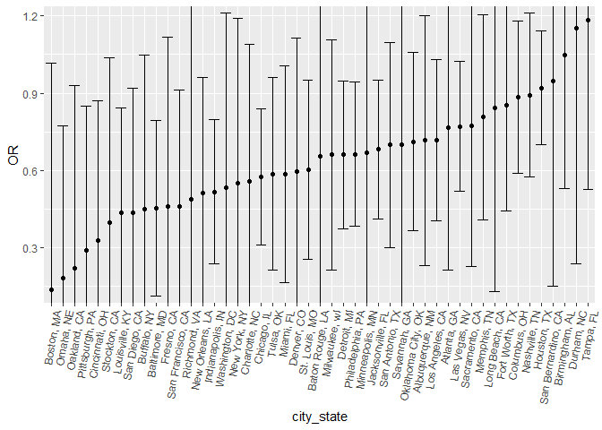

hw6\_Linear Models
================
Kee-Young Shin
November 23, 2018

``` r
library(tidyverse)
```

    ## -- Attaching packages ------------------------------------------------- tidyverse 1.2.1 --

    ## v ggplot2 3.0.0     v purrr   0.2.5
    ## v tibble  1.4.2     v dplyr   0.7.6
    ## v tidyr   0.8.1     v stringr 1.3.1
    ## v readr   1.1.1     v forcats 0.3.0

    ## -- Conflicts ---------------------------------------------------- tidyverse_conflicts() --
    ## x dplyr::filter() masks stats::filter()
    ## x dplyr::lag()    masks stats::lag()

``` r
library(RCurl)
```

    ## Loading required package: bitops

    ## 
    ## Attaching package: 'RCurl'

    ## The following object is masked from 'package:tidyr':
    ## 
    ##     complete

``` r
library(modelr)
```

Problem 1
---------

``` r
# import data
homicide_df = read.csv(text = 
    getURL("https://raw.githubusercontent.com/washingtonpost/data-homicides/master/homicide-data.csv"))
```

``` r
# clean and wrangle data 
homicide_df = homicide_df %>% 
  unite(city_state, city:state, sep = ", ") %>% 
  janitor::clean_names() %>% 
  mutate(binary_solved = ifelse(disposition == "Closed by arrest", 1, 0),
         victim_age = as.numeric(victim_age),
         victim_race = as.factor(ifelse(victim_race == "White", "white", "non-white")),
         victim_race = relevel(victim_race, ref = "white")) %>% 
  filter(!((city_state == "Phoenix, AZ"))) %>% 
  filter(!(city_state == "Dallas, TX")) %>% 
  filter(!(city_state == "Kansas City, MO")) %>% 
  filter(!(city_state == "Tulsa, AL")) %>% 
  filter(!(victim_sex == "Unknown"))
```

``` r
# fit regression for Baltimore, MD
baltimore_regression = homicide_df %>% 
  filter(city_state == "Baltimore, MD") %>% 
  glm(binary_solved ~ victim_age + victim_sex + victim_race, data = ., 
      family = binomial()) 
```

``` r
# show output with confidence intervals 
baltimore_regression %>% 
  broom::tidy() %>% 
  mutate(OR = exp(estimate),
         conf_low = OR - 1.96 * std.error,
         conf_high = OR + 1.96 * std.error) %>% 
  filter(term == "victim_racenon-white") %>% 
  select(term, OR, conf_low, conf_high)
```

    ## # A tibble: 1 x 4
    ##   term                    OR conf_low conf_high
    ##   <chr>                <dbl>    <dbl>     <dbl>
    ## 1 victim_racenon-white 0.453    0.111     0.794

``` r
# run regression on all cities 
glm_output = homicide_df %>% 
  group_by(city_state) %>% 
  nest() %>% 
  mutate(output = map(data, ~glm(binary_solved ~ victim_age + victim_sex + 
                                 victim_race, data = .x, family = binomial())), 
         output = map(output, broom::tidy)) %>% 
  select(-data) %>% 
  unnest() %>% 
  mutate(OR = exp(estimate),
         conf_low = OR - 1.96 * std.error,
         conf_high = OR + 1.96 * std.error) %>% 
  select(city_state, term, OR, conf_low, conf_high) %>% 
  filter(term == "victim_racenon-white")
  
  
glm_output
```

    ## # A tibble: 47 x 5
    ##    city_state      term                    OR conf_low conf_high
    ##    <chr>           <chr>                <dbl>    <dbl>     <dbl>
    ##  1 Albuquerque, NM victim_racenon-white 0.716   0.229      1.20 
    ##  2 Atlanta, GA     victim_racenon-white 0.767   0.212      1.32 
    ##  3 Baltimore, MD   victim_racenon-white 0.453   0.111      0.794
    ##  4 Baton Rouge, LA victim_racenon-white 0.656  -0.102      1.41 
    ##  5 Birmingham, AL  victim_racenon-white 1.05    0.527      1.57 
    ##  6 Boston, MA      victim_racenon-white 0.134  -0.750      1.02 
    ##  7 Buffalo, NY     victim_racenon-white 0.447  -0.153      1.05 
    ##  8 Charlotte, NC   victim_racenon-white 0.555   0.0200     1.09 
    ##  9 Chicago, IL     victim_racenon-white 0.575   0.310      0.840
    ## 10 Cincinnati, OH  victim_racenon-white 0.327  -0.217      0.871
    ## # ... with 37 more rows

``` r
# create plot 
glm_output %>% 
  mutate(city_state = as.factor(city_state),
         city_state = fct_reorder(city_state, OR)) %>% 
  ggplot(aes(x = city_state, y = OR)) + 
    geom_point() +
    geom_errorbar(ymin = glm_output$conf_low, 
                  ymax = glm_output$conf_high) +
    theme(axis.text.x = element_text(angle = 80, hjust = 1))
```



The odds ratio for Boston, MA is the lowest while highest for Tampa, FL. In other words, the odds of solving homicide for a non-white is much higher than for whites in Tampa, FL, keeping all other variables fixed. The confidence intervals are wide around the estimates due to high standard errors.

Problem 2
---------

``` r
# load and clean data 
birthweight_df = read.csv("./birthweight.csv") %>% 
  janitor::clean_names() 
```

``` r
library(leaps)

# propose regression model
full_model = lm(bwt ~ ., data = birthweight_df)
step_model = step(full_model, direction = "both")
```

    ## Start:  AIC=48810.15
    ## bwt ~ babysex + bhead + blength + delwt + fincome + frace + gaweeks + 
    ##     malform + menarche + mheight + momage + mrace + parity + 
    ##     pnumlbw + pnumsga + ppbmi + ppwt + smoken + wtgain
    ## 
    ## 
    ## Step:  AIC=48810.15
    ## bwt ~ babysex + bhead + blength + delwt + fincome + frace + gaweeks + 
    ##     malform + menarche + mheight + momage + mrace + parity + 
    ##     pnumlbw + pnumsga + ppbmi + ppwt + smoken
    ## 
    ## 
    ## Step:  AIC=48810.15
    ## bwt ~ babysex + bhead + blength + delwt + fincome + frace + gaweeks + 
    ##     malform + menarche + mheight + momage + mrace + parity + 
    ##     pnumlbw + ppbmi + ppwt + smoken
    ## 
    ## 
    ## Step:  AIC=48810.15
    ## bwt ~ babysex + bhead + blength + delwt + fincome + frace + gaweeks + 
    ##     malform + menarche + mheight + momage + mrace + parity + 
    ##     ppbmi + ppwt + smoken
    ## 
    ##            Df Sum of Sq       RSS   AIC
    ## - ppbmi     1       315 328372167 48808
    ## - malform   1      3018 328374870 48808
    ## - mheight   1     15827 328387679 48808
    ## - frace     1     33781 328405633 48809
    ## - ppwt      1     77194 328449045 48809
    ## <none>                  328371852 48810
    ## - menarche  1    161362 328533213 48810
    ## - parity    1    366128 328737979 48813
    ## - momage    1    632160 329004012 48816
    ## - fincome   1   1030574 329402426 48822
    ## - babysex   1   1086475 329458327 48822
    ## - mrace     1   1778556 330150407 48832
    ## - smoken    1   3106197 331478048 48849
    ## - gaweeks   1   5017414 333389265 48874
    ## - delwt     1   7473440 335845292 48906
    ## - blength   1 106590743 434962595 50029
    ## - bhead     1 113902511 442274363 50101
    ## 
    ## Step:  AIC=48808.15
    ## bwt ~ babysex + bhead + blength + delwt + fincome + frace + gaweeks + 
    ##     malform + menarche + mheight + momage + mrace + parity + 
    ##     ppwt + smoken
    ## 
    ##            Df Sum of Sq       RSS   AIC
    ## - malform   1      3033 328375200 48806
    ## - frace     1     33825 328405992 48807
    ## <none>                  328372167 48808
    ## - menarche  1    161091 328533258 48808
    ## + ppbmi     1       315 328371852 48810
    ## - parity    1    366498 328738665 48811
    ## - momage    1    632022 329004189 48815
    ## - mheight   1    675684 329047851 48815
    ## - fincome   1   1030291 329402457 48820
    ## - babysex   1   1086908 329459074 48820
    ## - mrace     1   1778610 330150776 48830
    ## - smoken    1   3105969 331478135 48847
    ## - ppwt      1   3179601 331551767 48848
    ## - gaweeks   1   5018627 333390793 48872
    ## - delwt     1   7474996 335847163 48904
    ## - blength   1 106590460 434962626 50027
    ## - bhead     1 113972011 442344178 50100
    ## 
    ## Step:  AIC=48806.19
    ## bwt ~ babysex + bhead + blength + delwt + fincome + frace + gaweeks + 
    ##     menarche + mheight + momage + mrace + parity + ppwt + smoken
    ## 
    ##            Df Sum of Sq       RSS   AIC
    ## - frace     1     33987 328409187 48805
    ## <none>                  328375200 48806
    ## - menarche  1    161625 328536825 48806
    ## + malform   1      3033 328372167 48808
    ## + ppbmi     1       330 328374870 48808
    ## - parity    1    366217 328741417 48809
    ## - momage    1    634318 329009517 48813
    ## - mheight   1    674643 329049842 48813
    ## - fincome   1   1028426 329403626 48818
    ## - babysex   1   1085480 329460680 48819
    ## - mrace     1   1780124 330155324 48828
    ## - smoken    1   3103025 331478225 48845
    ## - ppwt      1   3188216 331563416 48846
    ## - gaweeks   1   5016626 333391826 48870
    ## - delwt     1   7493191 335868391 48902
    ## - blength   1 106598488 434973688 50025
    ## - bhead     1 113989429 442364629 50098
    ## 
    ## Step:  AIC=48804.64
    ## bwt ~ babysex + bhead + blength + delwt + fincome + gaweeks + 
    ##     menarche + mheight + momage + mrace + parity + ppwt + smoken
    ## 
    ##            Df Sum of Sq       RSS   AIC
    ## <none>                  328409187 48805
    ## - menarche  1    165498 328574685 48805
    ## + frace     1     33987 328375200 48806
    ## + malform   1      3194 328405992 48807
    ## + ppbmi     1       376 328408811 48807
    ## - parity    1    366935 328776121 48807
    ## - momage    1    637125 329046311 48811
    ## - mheight   1    683740 329092927 48812
    ## - fincome   1   1050875 329460062 48817
    ## - babysex   1   1085276 329494463 48817
    ## - smoken    1   3092717 331501903 48843
    ## - ppwt      1   3192334 331601520 48845
    ## - gaweeks   1   5019197 333428383 48868
    ## - mrace     1   5999337 334408523 48881
    ## - delwt     1   7480901 335890088 48900
    ## - blength   1 106612808 435021995 50023
    ## - bhead     1 114005059 442414245 50096

``` r
step_model
```

    ## 
    ## Call:
    ## lm(formula = bwt ~ babysex + bhead + blength + delwt + fincome + 
    ##     gaweeks + menarche + mheight + momage + mrace + parity + 
    ##     ppwt + smoken, data = birthweight_df)
    ## 
    ## Coefficients:
    ## (Intercept)      babysex        bhead      blength        delwt  
    ##  -6246.3672      32.3171     134.4298      76.3760       3.9564  
    ##     fincome      gaweeks     menarche      mheight       momage  
    ##      0.6597      12.0396      -4.3140       5.4408       3.4549  
    ##       mrace       parity         ppwt       smoken  
    ##    -53.4990      89.9677      -2.8323      -3.7116

To select a model, a stepwise regression was performed. This stepwise selection process, which is a combination of forward and backward selections, returns a model that lowers the prediction error. The model reduced the full model containing 19 predictors, to a model containing 13 predictors.

``` r
# plot residuals for fitted values
birthweight_df %>% 
  add_predictions(step_model) %>% 
  add_residuals(step_model) %>% 
  ggplot(aes(x = pred, y = resid)) + geom_point()
```


``` r
# second model
second_linear_model = lm(bwt ~ blength + gaweeks, data = birthweight_df)

# third model 
third_linear_model = lm(bwt ~ bhead + blength + babysex + bhead * blength + 
                          bhead * babysex + blength * babysex + 
                          bhead * blength * babysex, data = birthweight_df)
```

``` r
# cross validation
cv_df = 
  crossv_mc(birthweight_df, 100) %>% 
  mutate(train = map(train, as_tibble),
         test = map(test, as_tibble)) %>% 
  mutate(step_model = map(train, ~lm(bwt ~ babysex + bhead + blength + delwt + fincome
                                     + gaweeks + menarche + mheight + momage + mrace +
                                     parity + ppwt + smoken, data = .x)),
         second_model = map(train, ~lm(bwt ~ blength + gaweeks, data = .x)),
         third_model = map(train, ~lm(bwt ~ bhead + blength + babysex + bhead * 
                                      blength + bhead * babysex + blength * babysex + 
                                      bhead * blength * babysex, data = .x))) %>% 
  mutate(rmse_first = map2_dbl(step_model, test, ~rmse(model = .x, data = .y)),
         rmse_second = map2_dbl(second_model, test, ~rmse(model = .x, data = .y)),
         rmse_third = map2_dbl(third_model, test, ~rmse(model = .x, data = .y)))
```

    ## Warning in predict.lm(model, data): prediction from a rank-deficient fit
    ## may be misleading

``` r
# compare models
cv_df %>% 
  select(starts_with("rmse")) %>% 
  gather(key = model, value = rmse) %>% 
  mutate(model = str_replace(model, "rmse_", ""),
         model = fct_inorder(model)) %>% 
  ggplot(aes(x = model, y = rmse)) + geom_violin()
```


Looking at the rmse plot, we can see that the second model is clearly the least effective in predicting the outcome. the step model and the third model (the one containing the interactions) are quite evenly matched. I would suggest picking the third model since since there are more ways to interpret its results.
